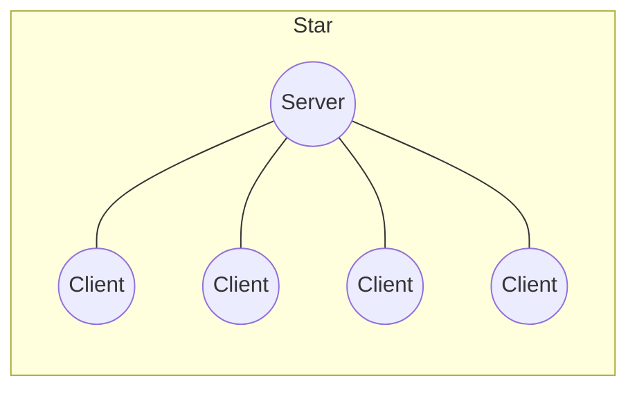
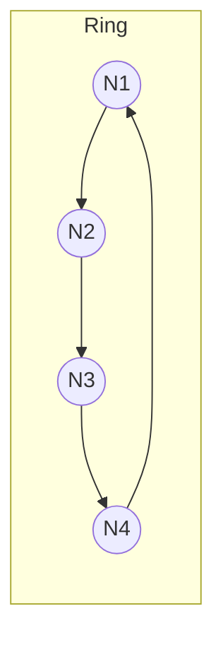
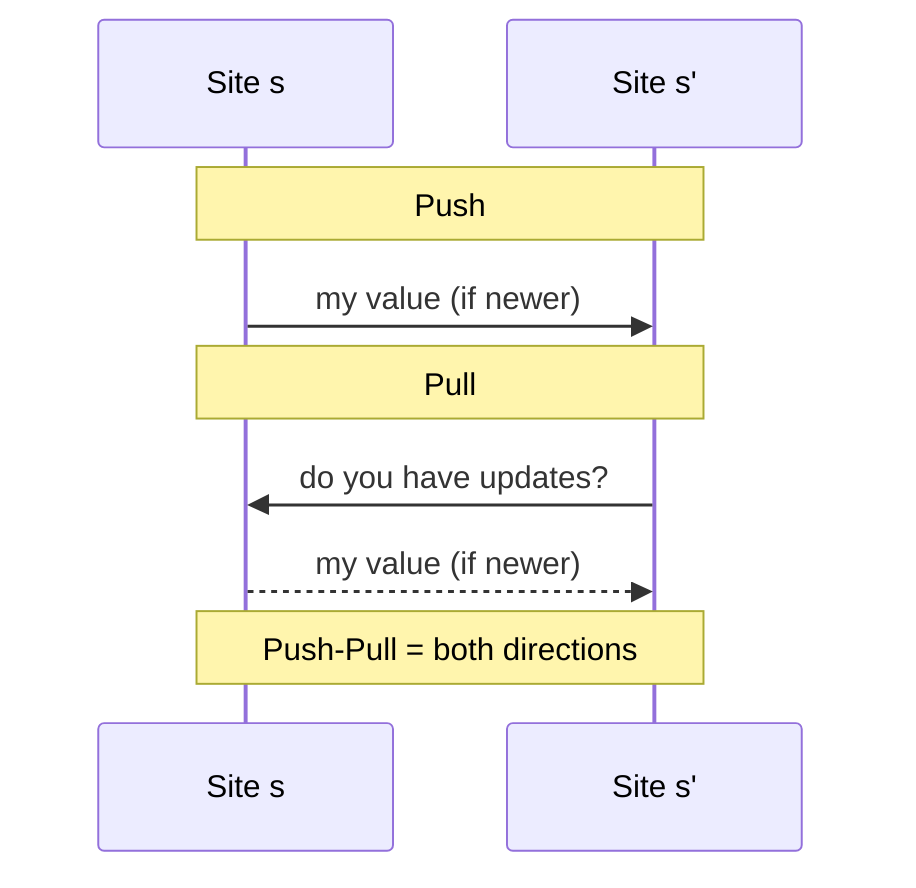
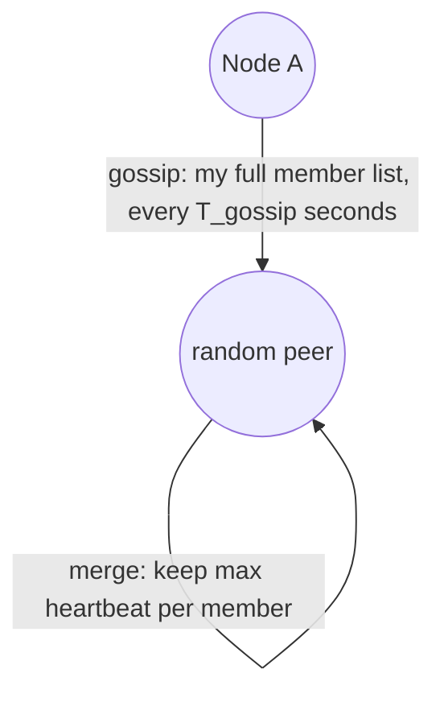

# Communication Between Nodes: Epidemic Protocols and Gossip-Based Protocols

> **How these notes are organized:** Each algorithm gets its own clean, intuitive explanation first — what it does, why it exists, how it behaves — with **no proofs**. All the rigorous mathematics (recurrences, differential equations, derivations) lives in a separate **Proofs** part further down, organized to mirror the concept sections above it. Read Part I to understand the system. Read Part II when you want to *derive* the numbers yourself.

## Table of Contents

**Part I — Concepts and Intuition**
- [1. Overlay Networks and the Problem of Unstructured Communication](#1-overlay-networks-and-the-problem-of-unstructured-communication)
- [2. Epidemic Protocols for Replicated Database Maintenance](#2-epidemic-protocols-for-replicated-database-maintenance)
  - [2.1 The Problem: Propagating Updates in Large Unstructured Networks](#21-the-problem-propagating-updates-in-large-unstructured-networks)
  - [2.2 Three Mechanisms: Direct Mail, Anti-Entropy, Rumor Mongering](#22-three-mechanisms-direct-mail-anti-entropy-rumor-mongering)
  - [2.3 Anti-Entropy: Push, Pull, and Push-Pull](#23-anti-entropy-push-pull-and-push-pull)
  - [2.4 Rumor Mongering: A Complex Epidemic with Termination](#24-rumor-mongering-a-complex-epidemic-with-termination)
  - [2.5 Residue and Traffic: The Fundamental Trade-off](#25-residue-and-traffic-the-fundamental-trade-off)
  - [2.6 Deleting Nodes and Death Certificates](#26-deleting-nodes-and-death-certificates)
  - [2.7 Spatial Distribution and Convergence Time](#27-spatial-distribution-and-convergence-time)
- [3. Gossip-Based Failure Detection](#3-gossip-based-failure-detection)
  - [3.1 The Problem: Scalable Failure Detection](#31-the-problem-scalable-failure-detection)
  - [3.2 The Basic Protocol](#32-the-basic-protocol)
  - [3.3 Performance and Scalability (Experimental Results)](#33-performance-and-scalability-experimental-results)
  - [3.4 Catastrophe Recovery: Network Partitions](#34-catastrophe-recovery-network-partitions)
- [4. Common Mistakes and Conceptual Traps](#4-common-mistakes-and-conceptual-traps)

**Part II — Proofs and Mathematical Derivations**
- [P1. Proof: Flooding Grows Exponentially, $O(d^h)$](#p1-proof-flooding-grows-exponentially-od%5Eh)
- [P2. Proof: Direct Mail Traffic is $O(n^2)$ in Aggregate](#p2-proof-direct-mail-traffic-is-on%5E2-in-aggregate)
- [P3. Proof: Anti-Entropy Converges in $O(\log n)$](#p3-proof-anti-entropy-converges-in-olog-n)
  - [P3.1 The Engine: A 3-Step Method for Probabilistic Proofs](#p31-the-engine-a-3-step-method-for-probabilistic-proofs)
  - [P3.2 Pull-Based Recurrence and Doubly-Exponential Decay](#p32-pull-based-recurrence-and-doubly-exponential-decay)
  - [P3.3 Push-Based Recurrence and the Role of $e$](#p33-push-based-recurrence-and-the-role-of-e)
  - [P3.4 Bernoulli/Binomial Foundations of Push and Pull](#p34-bernoullibinomial-foundations-of-push-and-pull)
  - [P3.5 The Two-Phase Proof: $O(\log n) + O(\log\log n) = O(\log n)$](#p35-the-two-phase-proof-ologn--ologlogn--ologn)
  - [P3.6 Pure Pull Is $O(n)$ at the Start; Pure Push Is $O(n\log n)$ at the End](#p36-pure-pull-is-on-at-the-start-pure-push-is-onlog-n-at-the-end)
- [P4. Proof: The Rumor Mongering Trajectory $i(s)$](#p4-proof-the-rumor-mongering-trajectory-is)
  - [P4.1 Setting Up the Differential Equations](#p41-setting-up-the-differential-equations)
  - [P4.2 Eliminating Time: The State-Space Trajectory](#p42-eliminating-time-the-state-space-trajectory)
  - [P4.3 The Residue Approximation $s \approx e^{-(k+1)}$](#p43-the-residue-approximation-s-approx-e%5E-k1)
- [P5. Proof: Residue–Traffic Relationship $s = e^{-m}$](#p5-proof-residuetraffic-relationship-s--e%5E-m)
- [P6. Proof: Gossip-Based Failure Detection is $O(n\log n)$](#p6-proof-gossip-based-failure-detection-is-onlog-n)
- [P7. Proof Sketch: Spatial Distribution and the $\alpha = 2$ Boundary](#p7-proof-sketch-spatial-distribution-and-the-alpha--2-boundary)

---

# Part I — Concepts and Intuition

## 1. Overlay Networks and the Problem of Unstructured Communication

### What Is an Overlay Network?

An **overlay network** is an application-level (virtual) network built on top of a physical network. The physical links underneath might be wireless, Ethernet, satellite — it doesn't matter. The overlay imposes its own topology regardless.

**What to look for:** a virtual network layer where each node knows only a *subset* of other nodes, not the entire network.

**Why you care:** this lack of global knowledge is exactly the structural condition that makes epidemic and gossip protocols necessary in the first place — there is no central directory to consult.

### Structured vs. Unstructured Overlays

**Structured overlays** have a fixed, predictable global topology:

- **Star topology** — one central server, many clients. This is classic client-server computing.
- **Ring topology** — each node knows only its clockwise and counter-clockwise neighbor. This is the foundation of **Distributed Hash Tables (DHTs)**, used heavily in third-generation P2P networks.

**Unstructured overlays** have no fixed global topology at all. A node typically knows only a small, sometimes random, list of other nodes. There's no guaranteed path structure connecting everyone.

### Why Unstructured Networks Make Communication Hard

If you want to send a message to a group of nodes in an unstructured overlay, you immediately hit two problems:

1. **You don't know all the nodes** — so you can't address everyone directly.
2. **Naive flooding explodes** — if every node forwards to all its neighbors, the message count grows out of control (proved formally in [P1](#p1-proof-flooding-grows-exponentially-od%5Eh)).

Flooding also gives you no completeness guarantee: the network could have disconnected components, or the flood could simply die out in a sparse region before reaching everyone.

**The key abstraction shift:** if every node knew every other node (a complete graph), you wouldn't need any of this — direct mail would just work, and epidemic protocols would be pointless. The overlay's *lack* of global knowledge is precisely what creates the need for probabilistic, gossip-style dissemination.

| Element | Purpose |
|---|---|
| Structural Signature | A large network where nodes have only local knowledge, no global directory |
| Core Invariant | The virtual topology is decoupled from the physical topology |
| Compression Handle | "Virtual network over physical network" |
| Boundary / Failure Mode | If the overlay becomes fully connected, epidemic protocols become overkill |

---

## 2. Epidemic Protocols for Replicated Database Maintenance

### 2.1 The Problem: Propagating Updates in Large Unstructured Networks

In the 1980s, Xerox operated a large unstructured corporate intranet (the *Xerox Corporate Internet*, or CIN) — hundreds of Ethernets stitched together by gateways and phone lines, sometimes spanning continents (a message from Japan to Europe might cross 14 gateways and 7 phone lines). Databases were replicated across many sites, and an update injected at any one site needed to eventually reach all the others.

**The challenge:**
- Network communication was slow and expensive.
- No node had a global membership list.
- Updates still had to reach every replica, eventually.

This is the setting of the seminal paper *Epidemic Algorithms for Replicated Database Maintenance* (Demers et al., PODC 1987) — the foundational paper behind everything in this lecture.

**The core analogy:** think of an update as a virus. One infected person tells random others; they tell random others; the update spreads like an epidemic. This isn't just a poetic comparison — it's structurally exact:

| Epidemiology | Database Systems |
|---|---|
| Infected individual | Node with new update |
| Susceptible individual | Node with stale data |
| Contact rate | Gossip frequency / peer selection rate |
| Recovery / removed state | Node that stops spreading the update |
| Herd immunity threshold | Quorum / consistency threshold |

**The intuitive takeaway (no math needed yet):** if each infected node manages to contact *enough* other nodes while it's still "contagious," and those contacts are *random enough* to avoid repeatedly hitting already-informed nodes, the update will spread to near-universal coverage through pure local interaction — no central coordinator required. The randomness isn't a flaw; it's the feature that makes the system resilient to node failures, churn, and scale. If one node or link fails, the epidemic simply routes around it through other random contacts.

### 2.2 Three Mechanisms: Direct Mail, Anti-Entropy, Rumor Mongering

| Mechanism | What it does | Termination | Guarantees |
|---|---|---|---|
| **Direct Mail** | Originating site sends the update directly to *every* other site | Immediate | All nodes reached *if it completes* |
| **Anti-Entropy** | Pick a random site; reconcile entire database contents with it | Never stops (runs forever) | Eventually every node gets every update |
| **Rumor Mongering** | Spread aggressively while "hot," lose interest once most neighbors already know | Self-terminating | Most nodes reached, but some may be missed (the *residue*) |

#### Direct Mail Is Not an Epidemic Protocol

This is a common point of confusion, so it's worth being explicit: **direct mail is the opposite of an epidemic protocol.**

| Property | Direct Mail | Epidemic / Gossip |
|---|---|---|
| Who spreads the update? | Only the originator | Every node that receives it |
| Contacts per spreader | $n-1$ (everyone) | A small constant $k$ (e.g., 2–4) |
| Work distribution | Centralized at one node | Spread across the network |
| Secondary transmission | None — receivers are passive | Every receiver becomes a new spreader |

An epidemic, by definition, requires every infected individual to become a new spreader. In direct mail, recipients just receive and stop — there's no secondary transmission. It's like a virus where only patient zero is contagious and everyone they infect is instantly quarantined. The "epidemic" dies after one hop.

**A useful physical analogy:** direct mail is a marketing campaign — one sender prints and stamps $n$ flyers. The *epidemic* equivalent is a **chain letter**: "copy this and send it to 5 friends." The original creator only pays for 5 stamps, because every recipient becomes a new sender — the message explodes through the network without the originator doing any extra work.

**Why direct mail fails at scale** (the formal traffic proof is in [P2](#p2-proof-direct-mail-traffic-is-on%5E2-in-aggregate)):

| Problem | Explanation |
|---|---|
| Membership problem | You need to know who "everyone" is — itself a hard distributed problem |
| Queue overflow | Many nodes pushing simultaneously overwhelms outbound and inbound buffers |
| $O(n)$ traffic per update, $O(n^2)$ in aggregate | Doesn't scale — see proof |
| Sequential sending is slow | The last recipient learns much later than the first |

> **One-line intuition:** direct mail is like patient zero personally visiting every person in a city of 10 million — they'd never finish, they'd collapse from exhaustion, and they wouldn't even know everyone's address. Gossip protocols fix this by letting *every infected person* become a new spreader — the epidemic does the work, not one overworked node.

### 2.3 Anti-Entropy: Push, Pull, and Push-Pull

**Mechanism:** pick a random site, exchange/reconcile database contents with it. This is a **simple epidemic** — it has no built-in termination; it just runs forever, continuously repairing divergence.

#### Why "Anti-Entropy"? (Doesn't This Algorithm *Create* Disorder?)

The name can feel backwards at first. Resolution: **entropy is the natural drift toward disorder that happens automatically and for free.** In a distributed database, replicas drift apart on their own — updates arrive at different sites at different times, nodes fail, partitions occur. That drift *is* the entropy. "Anti-entropy" is the algorithm that continuously fights it:

| Physical System | Distributed Database |
|---|---|
| A room gets messy on its own (entropy) | Replicas diverge on their own (entropy) |
| You clean the room (anti-entropy) | The algorithm repairs the divergence (anti-entropy) |

The name describes what the algorithm fights against, not what it produces.

#### Why It's a "Simple" Epidemic

| Property | Anti-Entropy | Rumor Mongering |
|---|---|---|
| Random contact | Yes | Yes |
| Transmission on contact | Yes | Yes |
| New spreaders activate | Yes | Yes |
| Built-in termination | **No** | Usually yes |

Anti-entropy never stops, because the system is always receiving new updates and nodes are always failing — entropy never sleeps.

#### The Data Model

Each site $s$ maintains a copy $K_s = \langle v, t \rangle$ — a value $v$ and a timestamp $t$. Newer updates carry higher timestamps; this matters because stale updates might still be circulating in the network, and timestamps are how a node decides which version wins.

#### Push, Pull, and Push-Pull — The Mechanics

- **Push**: *"I have news, let me tell you."* Site $s$ sends its update to $s'$; if $s$'s timestamp is newer, $s'$ adopts it.
- **Pull**: *"Do you have news for me?"* Site $s$ asks $s'$ for updates; if $s'$'s timestamp is newer, $s$ adopts it.
- **Push-Pull**: *"Let's compare notes and both get updated."* Both directions reconciled — most thorough, also most expensive.

#### The Key Engineering Insight: Push Early, Pull Late

This is the single most important practical takeaway about anti-entropy, and it's worth understanding intuitively *before* looking at the proof in [P3](#p3-proof-anti-entropy-converges-in-olog-n):

- **At the start** of an epidemic, almost nobody has the update. A *push*-based approach (the few informed nodes broadcasting outward) at least spreads what little exists. A *pull*-based approach is nearly useless here — most random contacts hit other uninformed nodes, since there's almost no one to "pull" from.
- **At the end**, almost everybody has the update. Now *pull* dominates: the few remaining uninformed nodes ask around, and since the world is full of informed nodes, they can't miss. *Push*, by contrast, keeps firing random messages that mostly collide with nodes that already know — wasted effort.

**The three mental models worth carrying forever:**

- **Push = the blind broadcaster.** Throwing darts blindfolded. Explosive when the board is full of targets; disastrous once only a few targets remain (most darts miss).
- **Pull = the sponge.** Shouting into a room asking "does anyone know?" Useless when almost no one knows; unstoppable once the room is full of answers.
- **Anti-Entropy = sledgehammer then scalpel.** Push breaks down the wall fast; pull cleans up the remaining edges with precision.

**Engineering takeaway:** real systems (Cassandra, DynamoDB, Riak) implement exactly this hybrid — push while information is rare to seed the network quickly, pull once information is common to mop up the stragglers instantly.

#### Optimizing Anti-Entropy in Practice

Comparing *entire* database contents on every contact is wasteful. The practical optimization:

1. Compare timestamps of recent entries (younger than some threshold $\tau$).
2. If timestamps match, nothing to do.
3. If they don't match, update recent entries and compare **checksums** of the rest (a 64-bit checksum acts as a compact fingerprint of the database, like an advanced parity bit).
4. Only if checksums mismatch do you pay for a full database sync.

**Intuition for timestamps — Last-Write-Wins:** imagine collaborating on a shared note with a friend, but messages between you sometimes arrive late or out of order. Every edit gets a timestamp. When you compare notes, you don't argue about content — whoever edited most recently simply wins. That single rule is the entire conflict-resolution strategy behind anti-entropy.

#### "Eventually Consistent"

This phrase means exactly what it says: if updates stop arriving and you wait long enough, all replicas converge to the same state. There's no guarantee about *when* — only that the random pairwise exchanges will, eventually, touch every node. This is precisely why systems like Amazon Dynamo, Cassandra, and Riak use anti-entropy as a background repair mechanism.

| Element | Purpose |
|---|---|
| Structural Signature | Replicated data + unstructured network + need for eventual consistency |
| Core Invariant | Random pairwise contact is sufficient for universal dissemination |
| Compression Handle | "Updates spread like a virus through random contact" |
| Boundary / Failure Mode | If the network is small and fully connected, direct mail is simpler and faster |

### 2.4 Rumor Mongering: A Complex Epidemic with Termination

**Mechanism:** a site spreads an update to others. Once a site notices that most of its neighbors already have the update, the "rumor" stops feeling hot, and it gradually reduces how often it bothers spreading it.

This is a **complex epidemic** — unlike anti-entropy, it has a *built-in termination mechanism*. The trade-off: it's faster initially, but there's a real chance some nodes never get the update at all (the **residue** — quantified rigorously in [P4](#p4-proof-the-rumor-mongering-trajectory-is) and [P5](#p5-proof-residuetraffic-relationship-s--e%5E-m)).

#### The Three States (Terminology Borrowed from Epidemiology)

| Term | Plain-English Meaning |
|---|---|
| **Susceptible** | "I haven't heard the news yet." |
| **Infective** | "I've heard the news and I'm actively telling people." |
| **Removed** | "I've heard the news, but I've stopped telling people — most people already know." |

Anti-entropy only ever has susceptible and infective nodes — there's no "removed" state, because nodes never stop asking. Rumor mongering introduces "removed" as the mechanism that lets the epidemic terminate on its own.

**The intuitive picture:** imagine a rumor spreading through a school. At first, everyone who hears it tells their friends. After a while, when most people already know, you stop bothering — you become "removed." The rumor dies out naturally. The risk: people at the social edges of the network — the ones least connected — might simply never hear it. They're the **residue**.

**The shape of the epidemic, told as a story (no equations):**

- **Growth phase**: early on, almost everyone is still susceptible, so the rumor spreads fast.
- **Peak**: the number of actively-spreading nodes hits its maximum — this is the moment of highest network load.
- **Decline phase**: as fewer susceptible nodes remain, more infective nodes get discouraged (everyone they meet already knows) and become removed. The rumor dies out — leaving behind the residue: nodes who simply never got contacted before the rumor went cold.

**Why does the rumor die out faster or slower?** This is governed by a parameter $k$, which controls how quickly nodes lose interest. Large $k$ = the rumor stays hot longer, spreads further, but costs more bandwidth. Small $k$ = the rumor dies fast, but leaves more nodes behind. This trade-off is made mathematically precise in [P4](#p4-proof-the-rumor-mongering-trajectory-is).

| Mechanism | Termination | Guarantees | Speed | Cost |
|---|---|---|---|---|
| Direct Mail | Immediate | All nodes (if it completes) | Fast if feasible | $O(n)$ messages |
| Anti-Entropy | None — runs forever | Eventually all nodes | Slow but steady | Simple epidemic |
| Rumor Mongering | Self-terminating | Most nodes, not all | Fast initial spread | Complex epidemic |

### 2.5 Residue and Traffic: The Fundamental Trade-off

Two key concepts tie rumor mongering's behavior together:

- **Residue**: the fraction of sites that remain susceptible (never received the update) once the epidemic burns out.
- **Traffic**: the average number of messages sent per site.

**The intuitive trade-off (formal derivation in [P5](#p5-proof-residuetraffic-relationship-s--e%5E-m)):** the more messages you're willing to send per site, the smaller the residue gets — and the relationship is *logarithmic*, meaning the cost of near-perfection is cheap. Going from "1 in a million nodes missed" to "1 in a billion nodes missed" costs only about 7 extra messages per site, not millions more. This is what makes epidemic protocols practically viable at huge scale: reliability is bought cheaply.

**The practical fix for residue — combine the mechanisms:**

1. Run rumor mongering first for fast initial spread.
2. After a timeout, run a slow background anti-entropy pass to clean up whatever rumor mongering missed (the residue).
3. If two sites discover a missing update during anti-entropy, they can kick off a fresh "hot rumor" locally — dynamically boosting gossip intensity exactly where it's needed.

Xerox's Clearinghouse system used exactly this hybrid, and the same core logic survives in essentially every modern distributed database — Cassandra, DynamoDB, and many blockchain P2P networks.

### 2.6 Deleting Nodes and Death Certificates

**The problem:** if a node deletes data, how do we make sure the deletion actually propagates — and how do we stop an old, stale update from "resurrecting" data that was already properly deleted? Picture a zombie update sitting dormant in a slow or partitioned node; if it re-enters the network, the gossip protocol will happily spread it back to life.

**The solution — treat deletion as just another kind of update:** issue a **death certificate** with a timestamp, and let it propagate exactly like any other update (via rumor mongering or anti-entropy). When a death certificate meets a later "real" update for the same item, timestamps decide the winner: if the certificate is newer, the data dies; if the update is newer, the deletion is correctly overridden (the data was legitimately re-created after the deletion).

**When can you discard a death certificate?** You can't keep them forever — that bloats the system with tombstones. Define a time threshold: once a certificate is older than the maximum time it would take an update to propagate everywhere, it's safe to drop. But a few designated **retention sites** keep certificates longer — think of them as the network's *immune memory*, catching late-arriving zombie updates that show up long after everyone else has forgotten the deletion.

**Dormant death certificates:** to save space, keep certificates active at only a handful of nodes, dormant elsewhere. If a dormant certificate ever collides with an attempted resurrection, it "wakes up" and propagates as a hot rumor.

**The subtlety:** what if a dormant certificate wakes up and collides with an *obsolete* (harmless, old) update rather than a malicious resurrection? The fix is **two separate timestamps**:
- **Original timestamp** — the true age of the deletion; used to decide who wins a collision.
- **Activation timestamp** — used purely for garbage collection, so even a reactivated certificate eventually gets pruned once it's truly ancient.

**Version numbers** for ordinary updates prevent the reverse mistake — a legitimate, newer update being wrongly cancelled by a stale death certificate.

**The conceptual punchline:** death certificates are just the residue problem, applied to deletions. A node that missed the death certificate will try to "resurrect" deleted data when it reconnects — and retention sites exist precisely because the residue, mathematically, is never exactly zero.

### 2.7 Spatial Distribution and Convergence Time

So far, we've assumed every node can contact *any* other node with equal probability. Real networks aren't like that — message latency depends on physical/topological distance. What happens if nodes can only contact nearby neighbors?

**The two extremes, intuitively:**
- **Local contact only** (e.g., a ring, contacting only neighbors): the update has to crawl hop-by-hop across the network. Convergence time is $O(n)$ — linear, slow.
- **Uniform random contact** (any node can reach any other): this is the anti-entropy result already derived — $O(\log n)$, dramatically faster.

**The general picture:** suppose the probability of contacting a node at distance $d$ falls off like $d^{-\alpha}$ for some exponent $\alpha$. There turns out to be a sharp boundary at $\alpha = 2$ (the **inverse-square law**):

- If $\alpha > 2$ (contact probability drops off *faster* than inverse-square): long-distance contacts become too rare to matter, and the network behaves almost like the purely local case — polynomial convergence time.
- If $\alpha < 2$ (contact probability drops off *slower*): occasional long-distance "jumps" are common enough to dramatically shrink the effective network, and convergence approaches the logarithmic behavior of uniform random contact.

**Intuition:** even rare long-distance contacts act like shortcuts — each one can bypass a huge number of hops at once, which is exactly why uniform random contact achieves $O(\log n)$ in the first place. This $\alpha=2$ threshold is the same critical exponent that shows up in small-world network theory and wireless network capacity results.

| Element | Purpose |
|---|---|
| Structural Signature | Contact probability as a power law of distance, critical exponent $\alpha = 2$ |
| Core Invariant | Long-distance contacts enable logarithmic convergence; their absence forces linear convergence |
| Compression Handle | "Inverse-square contact = logarithmic time; steeper falloff = linear time" |

---

## 3. Gossip-Based Failure Detection

### 3.1 The Problem: Scalable Failure Detection

Failure detection underpins system management, replication, load balancing, and group communication — but traditional approaches don't scale:

- **Centralized detectors** become bottlenecks.
- **All-to-all heartbeats** cost $O(n^2)$ messages.
- **Timeout-based detection** in asynchronous systems runs into a fundamental wall: you cannot reliably distinguish a slow node from a failed one (the Fischer-Lynch-Paterson impossibility result).

The paper *A Gossip-Style Failure Detection Service* (van Renesse, Minsky, and Hayden, Cornell, 1998) proposes applying the same gossip machinery used for database updates to the problem of detecting failures.

**What to look for:** a large distributed system where nodes need to detect each other's failures, but centralized or all-to-all approaches don't scale.

**Why you care:** this is the standard approach in modern systems (Cassandra, Dynamo, and similar) for membership and failure detection.

**The protocol's design goals:**
1. False positive probability **independent of $n$** — the chance of a wrong "failed" declaration doesn't grow with system size.
2. Resilient to message loss and network partitions.
3. Detection time scales as $O(n\log n)$ — proven in [P6](#p6-proof-gossip-based-failure-detection-is-onlog-n).
4. Bandwidth scales **linearly**, $O(n)$ — not $O(n^2)$.
5. Accurate detection with a known, tunable mistake probability.

### 3.2 The Basic Protocol

**What each node maintains** — a member list, where for each known member it stores:
- `member_id`: the node's address
- `heartbeat_counter`: an integer incremented periodically
- `timestamp`: the last time this counter was observed to increase

**The protocol, intuitively:** the system doesn't gossip *data* — it gossips *liveness*. Every node is constantly telling random peers "I'm alive, and here's everything I currently know about everyone else." The heartbeat counter is the proof of life; if it stops incrementing, the node is presumed dead.

**Step by step:**

1. **Gossip** (every $T_{\text{gossip}}$ seconds): increment your own heartbeat counter, pick one other member uniformly at random, and send your *entire* member list to them.
2. **Merge** (on receiving gossip): for each member, adopt the **maximum** heartbeat counter between your version and theirs; update the timestamp for any heartbeat that increased.
3. **Failure detection**: if a member's heartbeat hasn't increased in $T_{\text{fail}}$ seconds, declare it failed.
4. **Cleanup**: don't remove a failed member immediately — wait an additional $T_{\text{cleanup}} \geq T_{\text{fail}}$ seconds before purging it from the list.

**Why the cleanup delay matters — and why skipping it breaks things:** suppose node $A$ detects $B$ as failed and removes it right away. If $A$ then receives a gossip about $B$ from node $C$ — which hasn't detected the failure yet — $A$ would mistakenly reinstall $B$ as alive. The delay gives every node time to independently detect the failure before any of them are allowed to forget about it. In practice, $T_{\text{cleanup}} = 2 \times T_{\text{fail}}$ is the standard choice.

| Element | Purpose |
|---|---|
| Structural Signature | Random pairwise gossip of heartbeat counters, with timeout-based failure detection |
| Core Invariant | The maximum heartbeat counter is a monotonic proof of liveness |
| Compression Handle | "Gossip heartbeats, timeout = dead, wait before cleanup" |
| Boundary / Failure Mode | Without the cleanup delay, failed nodes resurrect via stale gossip |

### 3.3 Performance and Scalability (Experimental Results)

The original paper deployed this on the Cornell CS department network (up to 200 members, 250 bytes/sec bandwidth budget per member) and measured:

**Detection time vs. membership size** — near-linear growth, confirming the $O(n\log n)$ prediction:
- $\rho = 10^{-9}$ (very low mistake probability): detection time grows from ~0 to ~250s as $n$ goes from 1 to 200.
- $\rho = 10^{-6}$: ~0 to 210s.
- $\rho = 10^{-3}$: ~0 to 150s.

**Detection time vs. mistake probability** — detection time decreases roughly linearly with $\log(\rho)$, meaning better reliability (lower false-positive rate) costs only modestly more time. At 150 members, going from $\rho=10^{-10}$ to $\rho=10^{-1}$ drops detection time from ~200s to ~95s.

**Resilience:**
- With up to **50% of members failed**, detection time increases by less than 2x.
- With **10% message loss**, the slowdown is small.

**Why it's this robust:** randomization gives natural redundancy — a lost message today is statistically compensated for by a future gossip round. The system doesn't depend on any single message arriving.

### 3.4 Catastrophe Recovery: Network Partitions

**The problem:** plain gossip breaks down across a network partition. Nodes on one side simply can't gossip to nodes on the other side, so each side will eventually (and wrongly) declare the other side failed.

**The fix — a probabilistic broadcast:**

1. Each node probabilistically decides whether to broadcast its full member list.
2. The broadcast probability grows with the time $t$ since the last broadcast was received: $p(t) = t^2 / 20^2$.
3. If no broadcast has been heard for 20 seconds, that probability becomes very high.

**Why this works, intuitively:** in normal operation, recent broadcasts suppress new ones (low $p(t)$ — no need to shout if someone just did). After a partition forms, $t$ grows unchecked on both sides, $p(t)$ rises, and eventually someone broadcasts — re-establishing connectivity information once the partition heals or once a bridging path exists.

**The broadcast storm concern:** if many nodes are simultaneously unreachable, you might worry that they'll all broadcast at once, flooding the network. The paper shows that for $n=1000$, the probability of more than 20 simultaneous broadcasters is under $10^{-5}$ — smaller partitions simply have fewer potential broadcasters, which offsets the higher per-node probability.

| Element | Purpose |
|---|---|
| Structural Signature | A probabilistic broadcast triggered by silence, with quadratic growth in broadcast probability |
| Core Invariant | The broadcast probability self-tunes: quiet networks trigger broadcasts, active networks suppress them |
| Boundary / Failure Mode | If the partition is too large, broadcast storms become more likely |

---

## 4. Common Mistakes and Conceptual Traps

**Mistake 1 — Confusing push and pull.** Push and pull dominate in *different phases*, not universally. Push wins early (few infective nodes); pull wins late (many infective nodes). Using only one throughout leads to suboptimal convergence — pure pull stalls badly at the start; pure push wastes huge amounts of bandwidth at the end.

**Mistake 2 — Assuming rumor mongering guarantees delivery.** "Eventual consistency" via rumor mongering does *not* mean every node gets every update. There's a nonzero residue — for example, with $k=1$ (fast damping), roughly 20% of nodes can be left out. Only anti-entropy (run forever) actually guarantees zero residue.

**Mistake 3 — Skipping the cleanup delay in failure detection.** Removing a node immediately upon timeout (without $T_{\text{cleanup}}$) causes resurrection: a stale gossip from a node that hasn't yet detected the failure can reinstall the "dead" node as alive, causing it to oscillate between failed/alive for minutes.

**Mistake 4 — Treating gossip bandwidth as constant regardless of $n$.** Each gossip message contains the *entire* member list, which grows with $n$. To keep per-node bandwidth bounded, $T_{\text{gossip}}$ must itself grow as $O(n)$ — which is exactly why detection time ends up $O(n\log n)$, not $O(\log n)$. Fixing $T_{\text{gossip}}$ at a constant for a large $n$ causes total network bandwidth to blow up as $O(n^2)$.

**Mistake 5 — Confusing fail-stop with Byzantine failure models.** The gossip-based failure detector assumes nodes don't *lie* about their heartbeats (fail-stop model). A malicious (Byzantine) node could forge heartbeats for other nodes, producing false negatives (failed nodes look alive) or false positives (alive nodes look failed) — this protocol offers no protection against that.

---

# Part II — Proofs and Mathematical Derivations

> Read this part once you're comfortable with *what* each protocol does (Part I) and want to see precisely *why* the numbers come out the way they do.

## P1. Proof: Flooding Grows Exponentially, $O(d^h)$

**Setup:** $n$ nodes, each forwarding to $d$ neighbors, in a tree topology with no cycle detection. We want the total number of messages as a function of hop count $h$.

**Hop-by-hop derivation:**

| Hop | Senders at this hop | Messages sent at this hop |
|---|---|---|
| 1 | 1 (the source) | $d^1$ |
| 2 | $d$ nodes | $d^2$ |
| 3 | $d^2$ nodes | $d^3$ |
| $h$ | $d^{h-1}$ nodes | $d^h$ |

Summing across all hops gives a geometric series:

$$M = d^1 + d^2 + \cdots + d^h = d \cdot \frac{d^h-1}{d-1}$$

The dominant term is $d^h$, so $M = O(d^h)$ — exponential in hop count.

> **Critical conceptual trap:** $d$ is a *fixed* property of each node (its number of neighbors) — it does **not** grow as the tree expands. What grows exponentially is the *number of active senders* at each hop ($d^{h-1}$ at hop $h$), not the workload of any single node. Every individual node always sends exactly $d$ messages. Mixing these two up is the most common algebra error here (e.g., mistakenly computing $d^4$ at hop 3 instead of correctly tracking $d^{h-1}$ senders each sending $d$ messages).

**Why flooding fails even with this formula in hand:** the message count will rapidly exceed $n$ (a "broadcast storm") unless the protocol enforces strict state tracking — a Time-To-Live field or a cache of already-seen message IDs.

## P2. Proof: Direct Mail Traffic is $O(n^2)$ in Aggregate

**Single update, single source:** with $n$ nodes, one originator sending directly to every other node generates

$$\text{Messages per update} = n - 1 = O(n)$$

**When every node generates updates independently:** suppose each of the $n$ nodes generates 1 update/sec, and each triggers $O(n)$ direct messages:

$$\text{Total messages/sec} = n \times (n-1) = n^2 - n = O(n^2)$$

| Nodes ($n$) | Gossip ($k=3$) | Direct Mail |
|---|---|---|
| 10 | 30 msgs/sec | 90 msgs/sec |
| 1,000 | 3,000 msgs/sec | ~1 million msgs/sec |
| 10,000 | 30,000 msgs/sec | ~100 million msgs/sec |
| 100,000 | 300,000 msgs/sec | ~10 billion msgs/sec |

At scale, the gap reaches three orders of magnitude — not merely inefficient, but operationally impossible.

## P3. Proof: Anti-Entropy Converges in $O(\log n)$

### P3.1 The Engine: A 3-Step Method for Probabilistic Proofs

Every proof of this style follows the same three-step skeleton — internalize this once and every derivation below becomes mechanical:

- **Step 1 — The Micro-Step**: freeze time, look at one round. What are the odds for one individual node? (This is where you identify the underlying Bernoulli/Binomial structure.)
- **Step 2 — The Macro-Sequence**: press play. How does that single step compound over many rounds — are we *doubling* ($2^t$) or *squaring* ($p^2$)? Build the recurrence/sequence.
- **Step 3 — The Boundary Condition**: where does the phase end? Set the sequence equal to a finish line (e.g., $N/2$, or $\epsilon$) and solve via logarithms.

### P3.2 Pull-Based Recurrence and Doubly-Exponential Decay

**Setup:** let $n$ = total sites, $p_i$ = probability a given site remains *susceptible* after the $i$-th cycle.

**Step 1 (Micro-step):** in a pull-based round, a susceptible site stays susceptible only if it happens to contact *another* susceptible site. The probability of that is $p_i$ (the fraction currently susceptible).

**Step 2 (Macro-sequence):**

$$p_{i+1} = p_i \cdot p_i = p_i^2$$

**Intuition for the squaring:** if half the room is still ignorant ($p_i = 0.5$), the chance of staying ignorant is $0.5 \times 0.5 = 0.25$ — the ignorant fraction doesn't just shrink, it *squares itself* each round. This is doubly-exponential decay.

Starting from $p_0$ (with $p_0 < 1$, since at least the source already has the update):

$$p_1 = p_0^2,\quad p_2 = p_0^4,\quad p_3 = p_0^8,\quad \ldots,\quad p_i = p_0^{2^i}$$

| Round | Fraction still ignorant ($n=1024$ example) | Ignorant count |
|---|---|---|
| 0 | 1/2 | 512 |
| 1 | 1/4 | 256 |
| 2 | 1/16 | 64 |
| 3 | 1/256 | 4 |
| 4 | 1/65,536 | ~0 |

By round 4, the room is essentially done — each denominator is the square of the previous one ($2\to4\to16\to256\to65536$), the signature of doubly-exponential decay.

**Step 3 (Boundary condition):** solve $p_0^{2^i} \leq \epsilon$. Taking logs twice:

$$2^i \geq \frac{\ln(1/\epsilon)}{\ln(1/p_0)} \quad\Rightarrow\quad i \geq \log_2\!\left(\frac{\ln(1/\epsilon)}{\ln(1/p_0)}\right)$$

So the number of cycles is $O(\log\log(1/\epsilon))$ for fixed $p_0$; combined with the early-phase analysis (P3.5), the total number of cycles is $O(\log n)$.

### P3.3 Push-Based Recurrence and the Role of $e$

**Step 1 (Micro-step):** in push, a susceptible site stays susceptible only if **no** infective site happens to contact it. The expected number of infective nodes is $n(1-p_i)$, and each one independently misses our target with probability $1-1/n$.

**Step 2 (Macro-sequence):**

$$p_{i+1} = p_i \cdot \left(1-\frac{1}{n}\right)^{n(1-p_i)}$$

Using the limit $\left(1-\frac1n\right)^n \to e^{-1}$ as $n\to\infty$:

$$\left(1-\frac1n\right)^{n(1-p_i)} \approx e^{-(1-p_i)}$$

When $p_i$ is small (most nodes already informed), $1-p_i \approx 1$, giving:

$$p_{i+1} \approx p_i \cdot e^{-1} \approx 0.368\, p_i$$

— a constant-factor (singly exponential) decrease per round, not doubly exponential.

**Concrete late-game numbers** ($n=1024$, 100 ignorant, 924 informed; survival probability $e^{-0.924}\approx 0.397$ per round):

| Round | Ignorant people |
|---|---|
| 0 | 100 |
| 1 | ~37 |
| 2 | ~14 |
| 3 | ~5 |
| 4 | ~2 |
| 5 | ~1 |

Compare: pull would clear the same late-game scenario in ~2 rounds. Push needs ~5. The gap widens as $n$ grows.

**Why push is slower at the end — the collision problem:** when 924 informed nodes each call one random target without coordinating, calls collide — multiple informed people might call the same already-reachable ignorant person (wasted), while other ignorant people get zero calls and survive the round. This is structurally the **Coupon Collector's Problem** (formalized in P3.6).

### P3.4 Bernoulli/Binomial Foundations of Push and Pull

Every probability calculation above is built from two primitives.

**Bernoulli trial:** any single two-outcome event. One phone call is one trial. From a specific ignorant person "Alex"'s perspective: failure (caller picks Alex) has probability $1/N$; success (caller picks someone else) has probability $1-1/N$.

**Binomial distribution:** stacking $n$ independent Bernoulli trials (same $p$ each) and counting successes. Its expected value is the simple shortcut $E = n\cdot p$.

**Pull is a clean Binomial — full derivation:**
- $n = U_t$ trials (each uninformed person makes exactly one call).
- $p = I_t/N$ (probability of hitting an informed person).
- All trials independent, two outcomes each — Binomial conditions fully satisfied.

$$E[\text{New Knowers}] = U_t \cdot \frac{I_t}{N}$$

In the early phase $U_t \approx N$, so:

$$E[\text{New Knowers}] \approx N\cdot\frac{I_t}{N} = I_t \quad\Rightarrow\quad E[I_{t+1}] = I_t + I_t = 2I_t$$

The $N$ cancels exactly — the doubling is not a rough approximation, it's a direct consequence of the Binomial expectation formula.

**Why the same shortcut breaks for Push in the late game:** try $n=924$ calls, $p=100/1024\approx 0.1$: $E = 924\times 0.1 = 92.4$ "successful" calls. Naively subtracting suggests only ~8 people remain ignorant. **This is wrong** — the true answer is ~40. The shortcut $E=n\cdot p$ counts *successful calls*, not *distinct people hit* — some ignorant people get called multiple times (wasted calls), others get zero calls and survive. The shortcut only works cleanly when searchers can't overlap, i.e. in Pull, where each uninformed person makes exactly one attempt on their own behalf.

**The correct Push calculation (Poisson approximation):** for Alex to survive, all 924 informed callers must miss him independently:

$$P(\text{Alex survives}) = \left(1-\frac1N\right)^{924} \approx e^{-924/1024} \approx e^{-0.9} \approx 0.406$$

$$E[\text{Survivors}] = 100\times 0.406 \approx 40$$

**Why the exponent is the informed count, not the ignorant count:** the exponent counts the number of independent "bullets" Alex must dodge. In Push, the 924 informed nodes are the ones firing — Alex faces 924 independent risks. The 100 ignorant people enter only as a final multiplier (how many Alex-like people exist). In Pull, by contrast, each ignorant person faces exactly 1 bullet (their own single call), so no Poisson approximation is needed — the Binomial shortcut $n\cdot p$ applies directly.

| Scenario | Tool | Why |
|---|---|---|
| Pull — how many learn per round? | Binomial, $E=n\cdot p$ | Each uninformed person makes one independent call; no overlap. |
| Push — how many survive the round? | Poisson/survival, $(1-1/N)^{\text{informed}}$ | Need probability of *zero* hits across many independent callers; overlap breaks $n\cdot p$. |
| Single call | Bernoulli | The atomic building block. |

### P3.5 The Two-Phase Proof: $O(\log n) + O(\log\log n) = O(\log n)$

**Phase 1 — the slow climb, $O(\log n)$ rounds.** Using the Binomial result above, $I_t = 2^t$ while $I_t \ll N$. Phase 1 ends when half the network knows:

$$2^t = N/2 \quad\Rightarrow\quad t = \log_2(N) - 1 = O(\log N)$$

(This doubling argument is symmetric across push, pull, and push-pull during the early phase.)

| Round | Knowers ($N=1024$) |
|---|---|
| 0 | 1 |
| 5 | ~32 |
| 10 | ~1024 |

$2^{10}=1024$, confirming 10 rounds $=\log_2(1024)$.

**Phase 2 — the fast collapse, $O(\log\log n)$ rounds.** Once half the network knows, the pull squaring mechanism (P3.2) takes over. Starting from $p_0=1/2$: $p_k = (1/2)^{2^k}$. To reach below $1/N$ ignorant:

$$\left(\frac12\right)^{2^k} \leq \frac1N \;\Rightarrow\; 2^{2^k}\geq N \;\Rightarrow\; 2^k\geq\log_2N \;\Rightarrow\; k\geq\log_2(\log_2N)$$

So Phase 2 takes $O(\log\log N)$ rounds. For $N=10^6$: $\log_2(\log_2(10^6))\approx \log_2(20)\approx 4.3$ rounds.

**Why two logs?** Normally, a quantity halving each step needs $\log_2 N$ steps to reach 1 — one logarithm. Here, the *exponent itself* doubles each step ($2^1,2^2,2^4,2^8,\ldots$), so you need one logarithm to undo the outer exponent and a second to undo the inner one.

**Combining:**

$$T_{\text{total}} = O(\log N) + O(\log\log N) = O(\log N)$$

Big-O drops the smaller term — Phase 1 (the slow climb) dominates and sets the overall speed limit. For $N=10^6$: Phase 1 takes ~20 rounds, Phase 2 takes ~4 — Phase 1 is the bottleneck.

### P3.6 Pure Pull Is $O(n)$ at the Start; Pure Push Is $O(n\log n)$ at the End

**Pure Pull alone is $O(N)$ at the very start.** With $N=1024$ and only 1 knower, each of the 1023 ignorant people has only a $1/1024$ chance of hitting the knower per round. Worst case: the expected number of rounds before *any* new knower emerges is

$$E[\text{rounds to first spread}] = \frac{N}{I_0} = N$$

— linear time just to *get the epidemic started*, catastrophic at scale. **The fix:** seed with a few rounds of Push first, so $I_t$ grows quickly enough that Pull's hit probability $I_t/N$ becomes useful.

**Pure Push alone degrades to $O(N\log N)$ at the end — the Coupon Collector's Problem.** Map "ignorant people" to "coupons" and "one informed person's random call" to "one draw." We want every coupon collected (every ignorant person contacted at least once).

When $k$ coupons are already collected, the probability the next draw is new is $(N-k)/N$, so the expected draws needed for one new coupon is $N/(N-k)$. Summing over all $k$ from $0$ to $N-1$:

$$E[\text{total draws}] = \sum_{k=0}^{N-1}\frac{N}{N-k} = N\sum_{j=1}^{N}\frac1j = N\cdot H_N \approx N\ln N$$

using the Harmonic number approximation $H_N\approx \ln N$. So:

$$E[\text{total draws}] = O(N\log N)$$

**Concrete example ($N=1024$):** pure Push needs roughly $1024\times\ln(1024)\approx 1024\times 6.9\approx 7{,}000$ total messages to cover everyone, versus the hybrid Push-Pull's ~10 rounds — orders of magnitude fewer messages for the same coverage.

## P4. Proof: The Rumor Mongering Trajectory $i(s)$

### P4.1 Setting Up the Differential Equations

**Conservation:** at all times, $s + i + r = 1$ (susceptible + infective + removed fractions sum to 1).

**Inflow/outflow balance principle:** for any quantity changing over time, rate of change = rate in − rate out. This isn't a formula to memorize — it's just conservation of flow.

**Why the interaction term is $s\times i$ — Mass Action Kinetics:** borrowed from chemical kinetics, this principle says the rate of a reaction (here, infection) is proportional to the *product* of the concentrations of the reacting populations. Combinatorially: with $s$ susceptible and $i$ infective nodes, the number of possible pairings between them is $s\times i$ — every pairing is a chance for transmission. Setting the transmission rate $\beta=1$ (every contact succeeds) gives:

$$\text{Rate}(s\to i) = s\cdot i$$

**Rate of decrease of susceptible nodes:** every susceptible-infective meeting moves one node out of the susceptible pool:

$$\frac{ds}{dt} = -s\cdot i$$

**Rate of change of infective nodes:** gains from susceptibles (inflow), loses to removed (outflow):

$$\frac{di}{dt} = s\cdot i - \frac1k(1-s)\cdot i$$

The inflow term $s\cdot i$ is the same mass-action term. The outflow term $\frac1k(1-s)\cdot i$ represents nodes losing interest: $1-s$ is the fraction of nodes that already know the rumor, so the more people already know it, the more often spreaders hit "I already know that" and lose interest. The constant $1/k$ tunes how fast this discouragement kicks in — large $k$ means slow removal (rumor stays hot longer), small $k$ means fast removal.

### P4.2 Eliminating Time: The State-Space Trajectory

**The two-stage method:**
- **Stage 1 (the movie)** — already done above: $ds/dt$, $di/dt$ describe the system's velocity at every instant.
- **Stage 2 (the photograph)** — divide $di/dt$ by $ds/dt$ via the chain rule to eliminate time entirely, leaving the *path* the system traces through the $(s,i)$ plane — an invariant independent of how fast the system runs.

**Step 1 — form the ratio:**

$$\frac{di}{ds} = \frac{si - \frac1k(1-s)i}{-si}$$

**Step 2 — cancel $i$** (valid while the epidemic is active, $i\neq 0$):

$$\frac{di}{ds} = \frac{s-\frac1k(1-s)}{-s}$$

**Step 3 — split and simplify**, using $\frac{1-s}{ks} = \frac1{ks}-\frac1k$:

$$\frac{di}{ds} = -1-\frac1k+\frac1{ks}$$

**Step 4 — integrate term by term:**

$$i(s) = -s-\frac{s}{k}+\frac1k\ln(s)+C = -\frac{k+1}{k}s+\frac1k\ln(s)+C$$

**Step 5 — apply the initial condition** ($s=1, i=0$ at the start; $\ln(1)=0$):

$$0 = -\frac{k+1}{k}+C \quad\Rightarrow\quad C=\frac{k+1}{k}$$

**Step 6 — the final trajectory:**

$$\boxed{i(s) = \frac{k+1}{k}(1-s) + \frac1k\ln(s)}$$

This curve is the complete life story of a rumor: starting at $(s=1,i=0)$, rising through a growth phase, peaking, then declining back to $i=0$ as the rumor dies out — with the value of $s$ at that final point telling you the residue.

### P4.3 The Residue Approximation $s\approx e^{-(k+1)}$

Set $i(s)=0$ (the epidemic has ended):

$$\frac{k+1}{k}(1-s) + \frac1k\ln(s) = 0$$

This is **transcendental** ($s$ appears both linearly and inside a log) — no closed algebraic form exists, but a clean approximation does.

**Step 1 — clear denominators** (×$k$): $(k+1)(1-s) + \ln(s) = 0$

**Step 2 — rearrange:** $\ln(s) = (k+1)(s-1)$

**Step 3 — exponentiate:** $s = e^{(k+1)(s-1)}$

**Step 4 — approximate.** In a successful protocol the residue $s$ is small, so $s-1\approx -1$:

$$s \approx e^{-(k+1)}$$

**What this tells you:** the residue shrinks *exponentially* as $k$ grows — doubling $k$ doesn't just halve the residue, it squares the shrinkage factor. A small increase in $k$ (letting the rumor stay hot a little longer) yields a dramatic drop in missed nodes:

| $k$ | Residue $s\approx e^{-(k+1)}$ |
|---|---|
| 1 | $e^{-2}\approx 0.135$ (13.5% missed) |
| 2 | $e^{-3}\approx 0.050$ (5% missed) |
| 5 | $e^{-6}\approx 0.002$ (0.2% missed) |
| 10 | $e^{-11}\approx 0.00002$ (negligible) |

## P5. Proof: Residue–Traffic Relationship $s = e^{-m}$

**Setup:** each of $n$ sites sends $m$ updates, for $nm$ total messages. The probability that a particular site misses *every single one* of those $nm$ messages (i.e., remains susceptible) is:

$$s = \left(1-\frac1n\right)^{nm}$$

**Why:** each message independently has a $1/n$ chance of landing on our target site, so missing one specific message has probability $1-1/n$; missing all $nm$ of them (independent) multiplies that probability $nm$ times.

**Applying the limit definition of $e$** — for large $n$: $\left(1-\frac1n\right)^n\approx e^{-1}$, so:

$$s \approx \left(e^{-1}\right)^m = e^{-m}$$

$$\boxed{s = e^{-m}}$$

**Inverting:** to hit a target residue $s$, you need traffic $m=\ln(1/s)$.

| Desired residue $s$ | Messages per site $m=\ln(1/s)$ |
|---|---|
| $10^{-3}$ (1 in 1000 missed) | $\approx 6.9$ |
| $10^{-6}$ (1 in a million missed) | $\approx 13.8$ |
| $10^{-9}$ (1 in a billion missed) | $\approx 20.7$ |

This logarithmic relationship is why the cost of near-perfect reliability is cheap: going from "1 in a million missed" to "1 in a billion missed" costs only 7 more messages per site.

**Why $e$ keeps appearing:** $e$ is the constant of continuous compounding — it's what you get when an infinite number of tiny, independent trials compound together. Every gossip message here is one small independent trial; the limit $\left(1-\frac1n\right)^n\to e^{-1}$ is the bridge from discrete independent trials to the continuous exponential. That's why both the residue-traffic relationship and the push recurrence (P3.3) end up expressed in terms of $e$.

## P6. Proof: Gossip-Based Failure Detection is $O(n\log n)$

**The simplified round model:** in each round, exactly one randomly chosen member gossips to exactly one other randomly chosen member — so at most one new member is "infected" with the latest heartbeat per round.

**Notation:** $n$ = total members, $f$ = failed members, $k_i$ = infective members in round $i$, $P_{\text{arrival}}$ = probability a gossip arrives before the next round.

**Probability the infective count increases in a round, given $k$ infective members:**

$$P_{\text{inc}}(k) = \frac{k}{n} \times \frac{n-f-k}{n-1} \times P_{\text{arrival}}$$

This follows from three independent conditions: (1) the gossiper must be infective ($k/n$); (2) the recipient must be susceptible — not failed, not already infective ($\frac{n-f-k}{n-1}$); (3) the message must successfully arrive ($P_{\text{arrival}}$).

**The Markov chain recurrence:**

$$P(k_{i+1}=k) = P_{\text{inc}}(k-1)\cdot P(k_i=k-1) + (1-P_{\text{inc}}(k))\cdot P(k_i=k)$$

with boundary conditions $P(k_0=1)=1$ (one source of the new heartbeat at the start) and $P(k_i=0)=0$.

**Probability of a mistake (a process not yet infected after $r$ rounds):**

$$P_{\text{mistake}}(p,r) = 1-P(k_r=n-f)$$

and by a (conservative) union bound across all processes:

$$P_{\text{mistake}}(r) \leq (n-f)\cdot(1-P(k_r=n-f))$$

**Bandwidth constraint:** if each member sends $B$ bytes/sec, and each gossip message costs 8 bytes per member entry (6 for address, 2 for heartbeat counter), then to keep bandwidth bounded:

$$T_{\text{gossip}} = \frac{8n}{B}$$

— the gossip interval must grow *linearly* with $n$, since each message carries the full $O(n)$-sized member list.

**Putting it together:** detection time = (number of rounds) × $T_{\text{gossip}}$. From epidemic theory (P3.5), the number of rounds is $O(\log n)$; combined with $T_{\text{gossip}}=O(n)$:

$$\text{Detection time} = O(n)\times O(\log n) = O(n\log n)$$

**What breaks without this scaling:** if $T_{\text{gossip}}$ were held fixed instead of scaling with $n$, each node would send growing $O(n)$-sized messages at a fixed rate, and total network bandwidth would blow up to $O(n^2)$ — the system collapses under its own communication overhead.

## P7. Proof Sketch: Spatial Distribution and the $\alpha=2$ Boundary

This result is presented without a full derivation (see the original paper/references for the complete proof) — the goal here is to make the asymptotic claim precise.

**Local-contact baseline (a ring, neighbors only):** convergence requires $O(n)$ time — the update physically has to crawl hop by hop around the ring.

**Uniform random contact baseline:** $O(\log n)$, exactly the anti-entropy result of P3.5.

**General power-law contact model:** let the probability of contacting a node at hop-distance $d$ be $\propto d^{-\alpha}$.

- For $\alpha > 2$: convergence time is $O(n^k)$ for some constant $k$ — the network behaves close to the purely local case, because long-distance contacts are too rare to act as effective shortcuts.
- For $\alpha < 2$: convergence time is $O((\log n)^k)$ for some constant $k$ — the network behaves close to the uniform-random case, because long-distance contacts occur often enough to act as shortcuts that bypass many hops at once.

The exponent $\alpha=2$ — the **inverse-square law** — is the sharp critical boundary between these two regimes, mirroring analogous critical-exponent results in random graph theory and wireless network capacity analysis.
