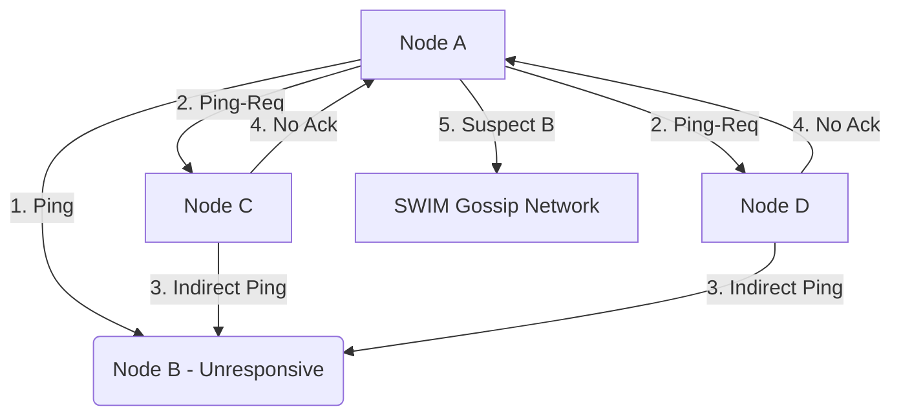

# Membership and Failure Detection (SWIM Protocol)

In large-scale distributed systems, maintaining a consistent membership list is challenging. The **SWIM (Structured Weakly-consistent Infection-style Process Group Membership) Protocol** provides an elegant, scalable solution for membership and failure detection.

---

## 1. SWIM Architecture

Traditional heartbeat-based membership protocols suffer from $O(N^2)$ message complexity, where every node sends heartbeats to all other nodes. SWIM decouples membership update dissemination from failure detection, reducing message load per node to $O(1)$.

---

## 2. Failure Detector Protocol

The SWIM failure detector operates in periods of duration $T$. In each period, Node $A$ performs the following:

1.  **Direct Ping**: $A$ randomly selects a node $B$ from its membership list and sends a `Ping`.
2.  **Ack Timeout**: If $A$ receives an `Ack` from $B$ within a timeout, the period ends.
3.  **Indirect Ping (Ping-Req)**: If no `Ack` is received, $A$ selects $k$ helper nodes (e.g., $C$ and $D$) and sends them a `Ping-Req(B)` message.
4.  **Indirect Probe**: The helper nodes attempt to ping $B$ directly. If they receive an `Ack`, they forward it to $A$.
5.  **Declare Unresponsive**: If $A$ receives no direct or indirect `Ack` before the end of period $T$, $B$ is marked as failed.

> **Rationale**: Using indirect pings avoids false positives caused by transient network congestion on the direct link between $A$ and $B$.

---

## 3. The SWIM Suspicion Mechanism

Directly declaring a node dead can cause churn if a node is merely slow. SWIM adds a **Suspicion Mechanism**:

*   Instead of immediately marking $B$ as dead, $A$ marks $B$ as **Suspect** and gossips a `{Suspect B, Incarnation i}` message.
*   If $B$ is alive, it will receive the suspect message. It refutes this claim by incrementing its incarnation number and gossiping `{Alive B, Incarnation i+1}`.
*   If the suspect timer expires without an `Alive` refutation, $B$ is officially declared dead and removed from membership lists.