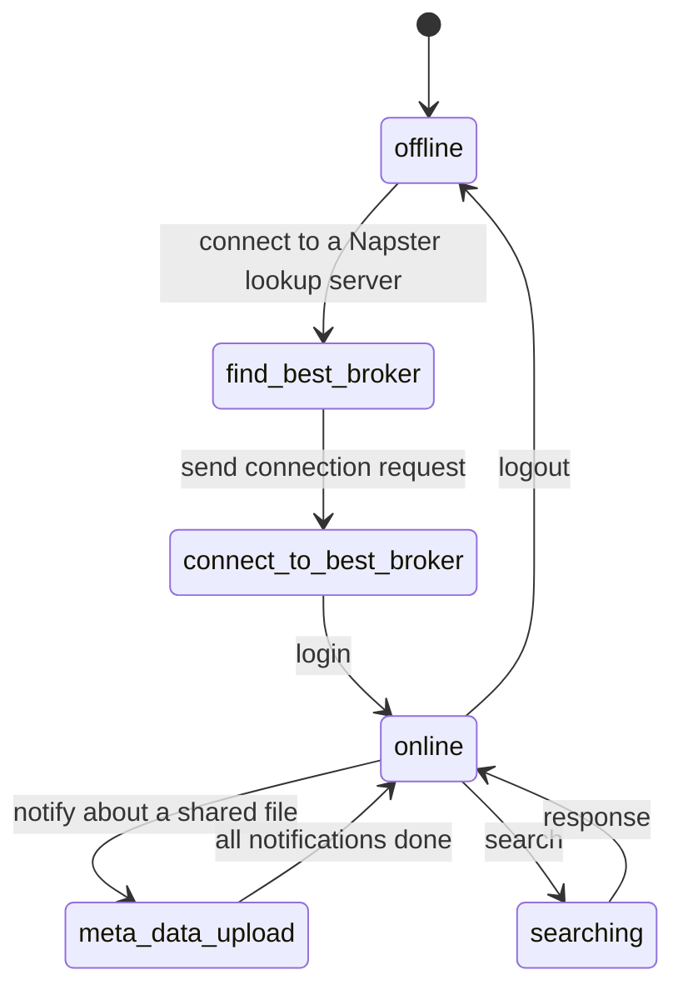
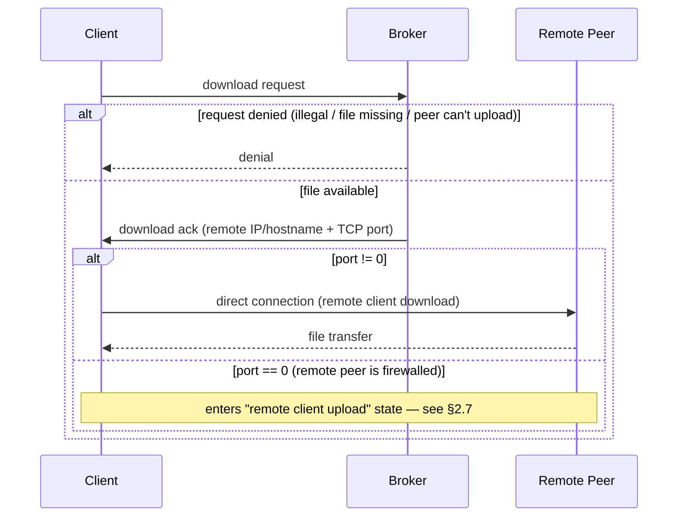
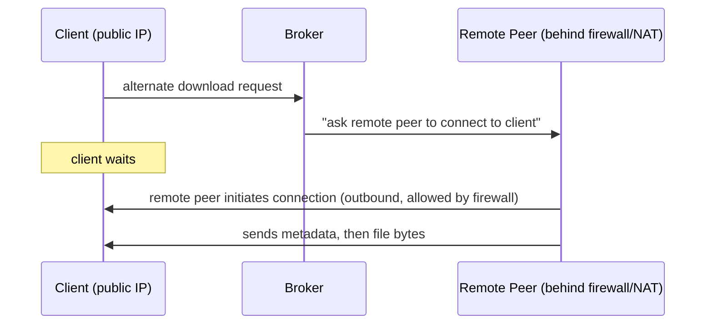
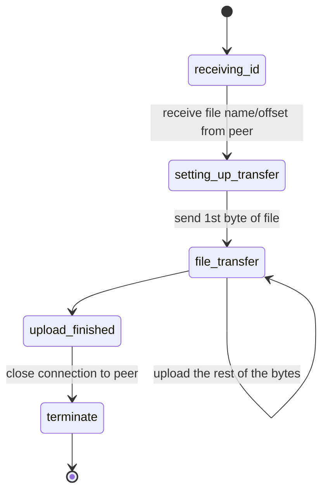
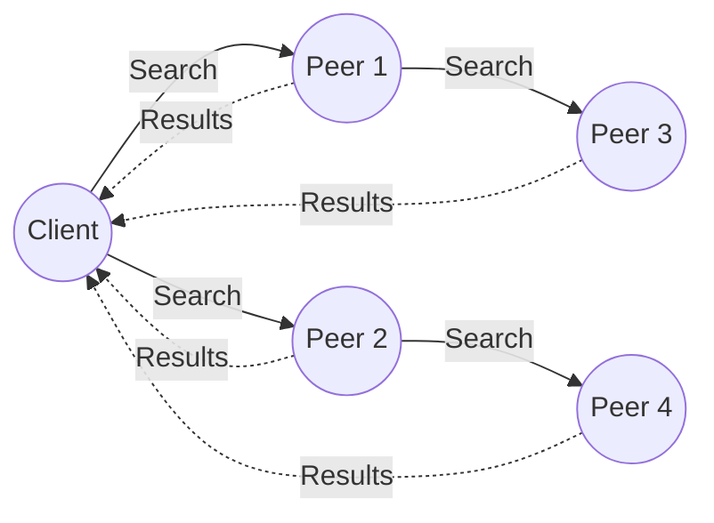
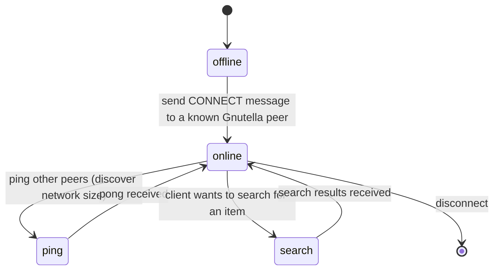
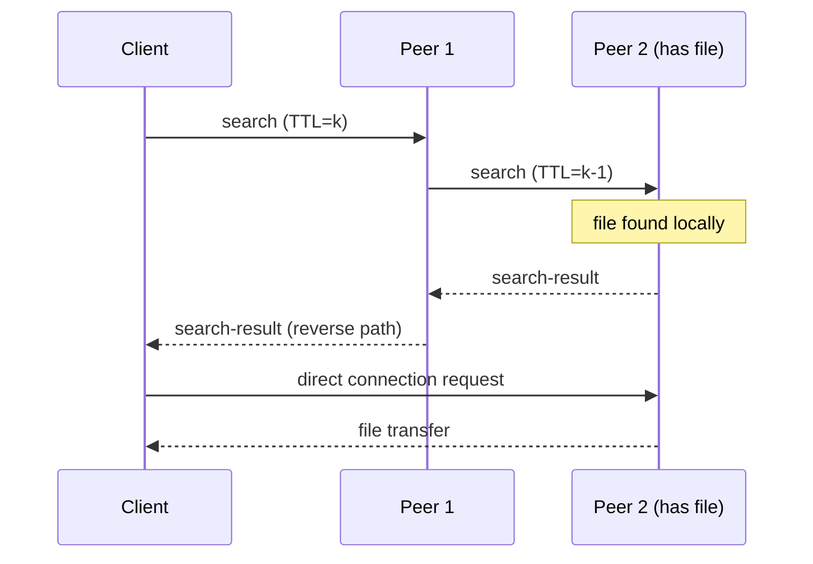
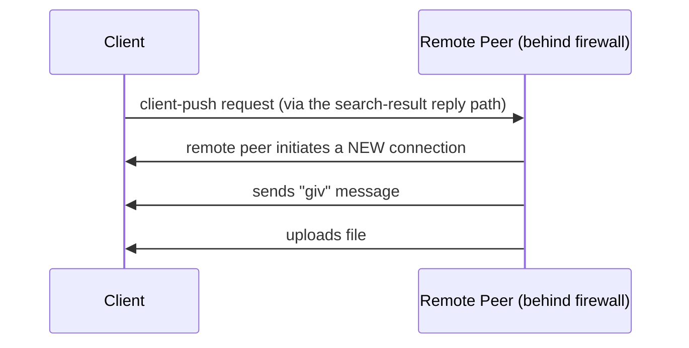

# First and Second Generation Peer-to-Peer Networks: Napster and Gnutella

*Lecture notes — Smruti R. Sarangi, IIT Delhi*

## Table of Contents

1. [Introduction: What is a P2P Network?](#1-introduction-what-is-a-p2p-network)
2. [Napster — The First Generation](#2-napster--the-first-generation)
   - 2.1 [History and Motivation](#21-history-and-motivation)
   - 2.2 [Architecture: Centralized P2P](#22-architecture-centralized-p2p)
   - 2.3 [The Napster Message Format](#23-the-napster-message-format)
   - 2.4 [Node Types and the Five Concurrent Entities](#24-node-types-and-the-five-concurrent-entities)
   - 2.5 [Login and Sharing Flow](#25-login-and-sharing-flow)
   - 2.6 [The Download Instance](#26-the-download-instance)
   - 2.7 [The NAT Problem and the "Remote Client Upload" Trick](#27-the-nat-problem-and-the-remote-client-upload-trick)
   - 2.8 [The Upload Instance](#28-the-upload-instance)
   - 2.9 [Security and Piracy](#29-security-and-piracy)
3. [Gnutella — The Second Generation](#3-gnutella--the-second-generation)
   - 3.1 [Why Gnutella? Removing the Central Server](#31-why-gnutella-removing-the-central-server)
   - 3.2 [Flooded Search: The Basic Idea](#32-flooded-search-the-basic-idea)
   - 3.3 [The Four Entities of a Gnutella Peer](#33-the-four-entities-of-a-gnutella-peer)
   - 3.4 [Connection Lifecycle](#34-connection-lifecycle)
   - 3.5 [The Five Message Types: Ping, Pong, Search, Search-Result, Push](#35-the-five-message-types-ping-pong-search-search-result-push)
   - 3.6 [Handling Firewalled Peers: The Push Mechanism](#36-handling-firewalled-peers-the-push-mechanism)
4. [Napster vs. Gnutella: A Direct Comparison](#4-napster-vs-gnutella-a-direct-comparison)
   - 4.1 [Resiliency](#41-resiliency)
   - 4.2 [Traffic and Scalability](#42-traffic-and-scalability)
   - 4.3 [Search Quality](#43-search-quality)
   - 4.4 [Legal Liability and Anonymity](#44-legal-liability-and-anonymity)
5. [Summary Table](#5-summary-table)
6. [Where This Leads: Looking Ahead](#6-where-this-leads-looking-ahead)

---

## 1. Introduction: What is a P2P Network?

A **peer-to-peer (P2P) network** is a set of machines ("peers") where, in principle, no single machine is more privileged than any other — they cooperate to make a large collection of resources (in this case, music files) available to a community of users, without relying purely on a traditional client-server model.

This lecture covers two historically important — and historically controversial — P2P systems:

- **Napster** (≈1999): the **first-generation** P2P network. Centralized indexing, decentralized transfer.
- **Gnutella** (≈post-2000): the **second-generation** P2P network. Fully decentralized — no central server at all.

The intuition to hold onto throughout: **both systems separate "finding" a file from "transferring" a file.** They differ entirely in *how* a peer finds out who has the file. That one design choice cascades into everything else — legal liability, scalability, resiliency, and search quality.

---

## 2. Napster — The First Generation

### 2.1 History and Motivation

By the late 1990s, the **mp3 format** had matured: a 5-minute song compressed down to roughly 5 MB — large, but just within reach of the internet connections of the era, and a massive improvement in compression over the older `.wav` format with little audible quality loss. This sparked a boom in informal mp3 sharing, largely through broken links on ad-hoc websites.

In 1999, **Shawn Fanning** identified three missing pieces:
- A dedicated search engine restricted to mp3 files.
- The ability to trade mp3 files directly with other users.
- A way to find and chat with other users sharing the same interest.

To participate, a user needed only **two things**: the Napster client installed, and a shared directory containing the files they were willing to make available to the community.

### 2.2 Architecture: Centralized P2P

Napster is best understood as **a client-server architecture wearing a peer-to-peer costume**. The actual file *transfer* happens directly between two peers, but *everything about discovery* — who has what — runs through a centralized broker.

```mermaid
flowchart TB
    subgraph Centralized_Index["Centralized Index (Napster Server / Broker)"]
        S[Napster Server]
    end
    C1[Client A] -->|1\. login + share file list| S
    C2[Client B] -->|2\. search query| S
    S -->|3\. IP of Client A| C2
    C2 -. 4\. direct TCP connection .-> C1
    C1 == 5\. file transfer ==> C2
```

**Intuition:** the server never touches the actual song data — it only acts as a *broker* (matchmaker). It knows *who has what* and *who is asking*, but the bytes of the mp3 flow peer-to-peer. This hybrid design is efficient (the server isn't a bandwidth bottleneck for file transfer) but, as we'll see, it is a **single point of legal failure**: the server has a complete, centralized record of who shared what with whom.

The Napster server ran on a small set of fixed ports: **7777, 8888, 8875** (and 948 by some accounts). This predictability is precisely what later let universities block Napster outright — they simply closed these ports at the firewall.

### 2.3 The Napster Message Format

Every message exchanged between client and server followed a simple three-field structure:

```
<length><type><data>
```

| Field | Description |
|---|---|
| `length` | Length of the message, encoded in 2 bytes (16 bits) |
| `type` | Message kind: `error`, `login`, `login ack`, `version`, `upgrade`, etc. |
| `data` | The actual payload |

This simplicity was deliberate — Napster needed to be lightweight enough to run comfortably on consumer hardware and dial-up/early broadband connections of 1999.

### 2.4 Node Types and the Five Concurrent Entities

Napster's protocol distinguishes **three kinds of nodes**:

| Node type | Role |
|---|---|
| **Client** | The end-user's machine, wanting to search/download/upload |
| **Lookup server** | A lightweight directory that simply points a client to the *least loaded* broker — it does no searching itself |
| **Broker** (a.k.a. "server") | Does the heavy lifting: maintains the file index, handles search queries, brokers connections |

A client first asks a lookup server "which broker should I use?", gets directed to the least-loaded one, and then establishes a regular TCP/IP connection to that broker for everything else.

Internally, each Napster peer runs **five concurrent software entities (threads)**:

1. **Main coordination** — talks to the broker (login, search, notifications)
2. **Listener** — accepts incoming connections from other peers
3. **Upload instance** — sends file bytes to a requesting peer
4. **Download instance** — receives file bytes from a remote peer
5. **Push instance** — handles the special case where a remote peer can't be reached directly (see §2.7)

### 2.5 Login and Sharing Flow

The high-level flow, as a user moves from offline to actively searching:



**Step by step:**
1. User opens the Napster client.
2. Client contacts a lookup server → gets pointed to the least-loaded broker.
3. Client logs in (sends credentials) to that broker.
4. Broker updates its database with the list of files in the client's shared directory (**metadata upload**).
5. Client is now "online" and ready to search or be searched.
6. When the user types a search term, the broker responds with the IP address of a peer holding the matching file.
7. The client connects directly to that peer and downloads.

### 2.6 The Download Instance

When a client wants a file, it doesn't talk to the remote peer first — it talks to the **broker**:



The key branch point is the **TCP port value returned in the download-ack message**:
- **Non-zero port** → straightforward: client connects directly to the remote peer ("remote client download" state).
- **Port = 0** → a special signal meaning *the remote peer cannot be reached directly*. This triggers the more interesting mechanism below.

### 2.7 The NAT Problem and the "Remote Client Upload" Trick

This is arguably the cleverest — and most controversial — part of Napster's design, and it's worth slowing down to build real intuition.

**The problem:** many Napster users were college students on university networks. Universities typically place internal machines behind a **firewall / NAT (Network Address Translation)**, meaning machines *outside* the university cannot initiate a connection *into* a machine *inside* it. (If you're unfamiliar with NAT: an internal machine gets a private address, often starting with `10.x.x.x`, that simply doesn't exist on the public internet — so nobody outside can dial in.) However, machines *inside* the firewall can freely initiate outbound connections.

**Napster's trick:** if the *requesting* client is publicly reachable, but the *remote peer* (who has the file) is firewalled, Napster simply **flips the direction of connection initiation**.



**Why this works:** outbound connections from inside a firewall are almost always permitted (that's how normal web browsing works); it's *inbound* connections that get blocked. So instead of the client trying (and failing) to reach the remote peer, the broker tells the remote peer "go reach out to the client instead." Since the client is publicly visible, this succeeds.

This is the origin of the two download sub-states:
- **`remote client download`** — normal case, client connects directly to remote peer.
- **`remote client upload`** — NAT workaround, remote peer connects out to the client and uploads to it.

> **Intuition check:** this single mechanism is what let countless university students behind locked-down campus networks still trade files freely — and it's a big part of why Napster usage exploded specifically on campuses, and consequently why universities became the focal point of the legal crackdown.

### 2.8 The Upload Instance

From the *uploading* peer's perspective, the process is much simpler — it's a passive responder:



There's "no great rocket science" here, as the lecture puts it — receive the requested filename/offset, start sending bytes, close the connection when done.

### 2.9 Security and Piracy

Napster's centralized design has a built-in security property and a built-in liability:

- **Hard to spoof**: because the broker mediates every connection, clients can't easily lie about details like IP addresses — there's nobody to transfer files to if you do.
- **Total visibility**: the flip side is that the *central broker sees every single transfer that happens*. This is great for accountability/control, but catastrophic for privacy — and, crucially, it created a single legally identifiable entity (the Napster company) that controlled and facilitated every file exchange.

This led directly to Napster's downfall:
- Millions of users were sharing copyrighted material with no licenses.
- Universities' free internet access was being heavily used (and abused) for this purpose.
- **Result:** most universities banned Napster outright by the early 2000s, and the music industry pursued significant legal action — but P2P file sharing itself did not stop.

The lesson the next generation of protocols took from this: **get rid of the central server**, and the corresponding "smoking gun" of centralized logs, entirely.

---

## 3. Gnutella — The Second Generation

### 3.1 Why Gnutella? Removing the Central Server

Gnutella is best understood as a direct response to Napster's central weakness: **no central server exists at all**. There is no broker, no centralized index, no single entity that "knows everything." Instead, discovery is achieved by **flooding queries across the network**.

A new Gnutella host joins simply by contacting *any* already-known Gnutella host (often via a lightweight, legally-safe bootstrap/lookup service that does nothing but introduce peers — it never participates in actual searches or transfers, and is therefore not legally implicated in any copyright infringement).

This is the core philosophical shift: connecting you to the network is not illegal; *transferring unlicensed content* is illegal. By keeping these cleanly separated, Gnutella significantly reduces (though does not eliminate) legal exposure compared to Napster.

### 3.2 Flooded Search: The Basic Idea

Once connected, a Gnutella host sends a **search message to its neighbors**, who forward it to *their* neighbors, and so on — a **flood**, bounded by a **Time-To-Live (TTL)** field that decrements at every hop until it reaches zero.



**Intuition:** if `TTL = k`, the search effectively reaches everyone within a *radius of k hops* from the originating client — and then dies out, so the entire internet isn't swamped by a single query. This bounded-radius design is the direct trade-off for not having a central index: you trade *completeness of search* for *no central liability*.

Once a peer that holds the file responds, the original client connects to it **directly** to download — just like in Napster, discovery and transfer are separate steps, but now discovery is distributed rather than centralized.

### 3.3 The Four Entities of a Gnutella Peer

Each Gnutella peer runs four concurrent components (one fewer than Napster's five, since there's no broker-specific coordination needed):

| Entity | Role |
|---|---|
| **Connection Handler** | Manages connections with other Gnutella peers |
| **Coordination Instance** | Coordinates message routing/state (ping, pong, search, etc.) |
| **Download Instance** | Handles downloading from a remote peer |
| **Upload Instance** | Handles uploading a file to a remote peer |

### 3.4 Connection Lifecycle



In the **online** state, a client can optionally **ping** its neighborhood just to get a sense of the live network around it (how many peers, roughly, are reachable). When it actually wants a file, it transitions to the **search** state and floods a search message as described above.

### 3.5 The Five Message Types: Ping, Pong, Search, Search-Result, Push

The coordination instance is built around exactly five message types:

| # | Message | Behavior |
|---|---|---|
| 1 | **ping** | TTL decremented; forwarded to remote peers. Used purely for network discovery (how big is the neighborhood?). |
| 2 | **pong** | The reply to a ping. Travels back along the *reverse path* the ping took; each hop updates its local database with info about the responding peer. |
| 3 | **search** | If the file exists locally, reply with a `search result`; otherwise decrement TTL and forward to peers — same flooding pattern as ping. |
| 4 | **search-result** | Travels back (reverse path, like pong); the original client updates its results and attempts a direct download. |
| 5 | **client push** | Used when the remote peer can't be reached directly — see §3.6. |



**Intuition:** ping/pong and search/search-result are structurally identical mechanisms — flood outward with a decrementing TTL, then route the reply back along the same path in reverse. The only difference is *what* triggers a reply (network presence vs. a file match) and *what data* comes back.

### 3.6 Handling Firewalled Peers: The Push Mechanism

Gnutella faces the exact same NAT/firewall problem Napster did, and solves it with essentially the same idea — **flip the direction of connection initiation** — just without a central broker mediating it:



If the responding peer is *not* behind a firewall, the client just connects to it directly. If it *is* firewalled, the client sends a **CLIENT-PUSH** request; the remote peer then creates a new outbound connection to the client, sends a `giv` message, and transmits the file via its upload instance. This mirrors Napster's "remote client upload" state from §2.7 — same underlying NAT logic, just initiated peer-to-peer rather than via a central broker.

---

## 4. Napster vs. Gnutella: A Direct Comparison

### 4.1 Resiliency

- **Napster**: has an explicit mechanism for finding the *least-loaded* broker, enabling centralized load balancing and the ability to switch servers if one goes down. But ultimately, it's still a centralized point of control.
- **Gnutella**: fully distributed — naturally **resilient to network partitions**. If the network splits into two halves, each half simply continues searching independently within itself; there's no single point of failure.

### 4.2 Traffic and Scalability

Both systems have scalability problems — but for **opposite structural reasons**:

- **Napster**: every client, upon connecting, uploads its *entire* file list to the broker. As the user base grows, the central broker becomes a traffic and processing bottleneck.
- **Gnutella**: scalability suffers from the **exponential growth of ping/pong/search/search-result messages** as TTL-bounded floods ripple outward through the network. A single query can generate a large multiplicative burst of traffic across many nodes — something that simply never happens in Napster, where a query is just one message to one server.

### 4.3 Search Quality

- **Napster**: in principle, can offer *complete* search results, because the broker has full knowledge of all files across all clients connected to it — but only if brokers can be linked together across the whole network, which is operationally (and legally) very hard.
- **Gnutella**: ping/pong/search messages have a **limited radius** (bounded by TTL), meaning a search may simply never reach a peer holding the desired file if that peer lies outside the TTL radius. Gnutella can — and does — **miss files** that genuinely exist on the network.

### 4.4 Legal Liability and Anonymity

- **Napster**: the central broker is fully aware of every transfer — a single, identifiable, centralized point of legal liability (and the reason the company itself could be sued and shut down).
- **Gnutella**: the lookup/bootstrap servers only ever introduce peers to each other — they never participate in search or transfer, so they carry essentially no legal liability. Responsibility for any illegal transfer rests solely with the two peers directly involved.
- **However — anonymity is not actually guaranteed in either system.** In Gnutella, the two peers exchanging a file are directly aware of each other's IP addresses, and every intermediate node along a flooded search path also learns who searched for what and who responded. This sets up the motivation for later, more anonymous systems (e.g., Freenet, precursor to the modern "dark web," and other anonymous P2P designs).

---

## 5. Summary Table

| Dimension | Napster (Gen 1) | Gnutella (Gen 2) |
|---|---|---|
| Architecture | Centralized index, P2P transfer | Fully distributed, no central server |
| Discovery | Broker maintains full file index | TTL-bounded flooding (ping/pong, search/search-result) |
| Content scope | Originally music (mp3) only | Any file type |
| Resiliency | Single broker = single point of failure (mitigated by load balancing across brokers) | Resilient to network partitions |
| Scalability bottleneck | Central broker traffic | Exponential flood message growth |
| Search completeness | Potentially complete (if brokers are linked) | Limited by TTL radius — can miss files |
| Legal liability | High — central server logs everything | Lower — lookup servers don't participate in transfers |
| Anonymity | None (broker sees all) | None (peers and routing nodes see IPs and queries) |
| NAT/firewall workaround | "Remote client upload" via broker-mediated reversal | "Client push" via peer-mediated reversal |

---

## 6. Where This Leads: Looking Ahead

The flooding-based scalability problem in Gnutella, and the lack of true anonymity in both systems, set up the motivations for the next wave of P2P technology:

- **Freenet** — a precursor to the modern dark web, designed around strong anonymity guarantees (neither searcher nor provider is easily identifiable).
- **BitTorrent** — widely used today, and conceptually influential on many modern distributed systems (Amazon, Facebook, Google-style infrastructure draws on similar ideas), built around the **Distributed Hash Table (DHT)** — a structured way to locate data without flooding the entire network.

> **Core takeaway for this lecture:** the entire evolution from Napster → Gnutella → BitTorrent can be read as a single recurring tension: **how much central coordination do you need for good search quality, versus how much decentralization do you need for resilience, scalability, and reduced legal liability?** Every design choice in these protocols is a different point on that trade-off curve.
