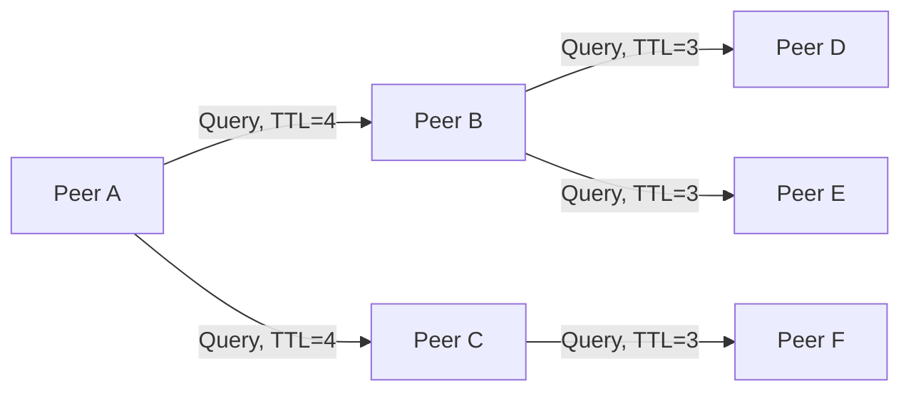

# Gnutella: Decentralized Flooding P2P

Gnutella represents the second generation of Peer-to-Peer (P2P) systems. It was designed to be a fully decentralized, unstructured file-sharing network to overcome the single-point-of-failure and legal vulnerabilities of Napster.

---

## 1. Gnutella Protocol & Query Flooding

Since Gnutella lacks a central index, search queries must be broadcasted through the network. Peers establish random TCP connections to form an unstructured overlay.

### 1.1 Messaging Protocols
Gnutella uses five core message types:

*   **Ping**: Probe the network to discover active peers.
*   **Pong**: Response to a Ping, containing peer IP, port, and shared files summary.
*   **Query**: Search request containing search keywords and a **TTL (Time To Live)** field.
*   **QueryHit**: Response to a Query, sent along the reverse path, containing file details.
*   **Push**: Request for firewalled peers to initiate the connection.

### 1.2 The Flooding Mechanism
1.  **Query Generation**: Peer $A$ broadcasts a `Query` with a transaction ID, search terms, and a `TTL` (typically 7) to all its connected neighbors.
2.  **Forwarding**: When a peer receives a `Query`, it checks if it has already processed it (via transaction ID cache).
    *   If yes, it drops the query to prevent loops.
    *   If no, it searches its local files. If a match is found, it sends a `QueryHit` back along the path the query arrived.
    *   It decrements the `TTL` by 1. If `TTL > 0`, it forwards the query to all its other neighbors.

---

## 2. Limits and Performance Issues

Gnutella's unstructured, flooding-based approach suffers from severe scaling constraints:

*   **Network Congestion**: Flooding causes exponential message growth:
    $$\text{Total Messages} \approx d \cdot (d-1)^{\text{TTL}-1}$$
    where $d$ is average node degree. This "broadcast storm" consumes massive bandwidth.
*   **Free Riding**: Up to 70% of peers do not share files, acting only as consumers.
*   **Incompleteness**: Rare files may exist but not be found if they lie beyond the TTL horizon.