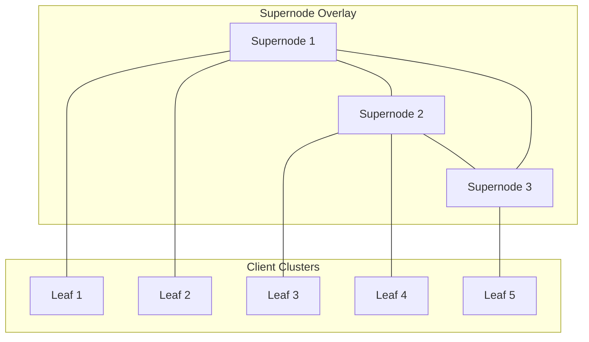

# Hierarchical Peer-to-Peer (Supernodes)

To balance the efficiency of Napster's centralized model with Gnutella's decentralized robustness, third-generation P2P networks (like FastTrack/KaZaA and Gnutella 0.6) introduced a **hierarchical architecture** utilizing **Supernodes** (or Ultrapeers).

---

## 1. Supernode System Architecture

Hierarchical networks classify peers based on resources (bandwidth, CPU, and uptime):

*   **Leaf Nodes**: Low-resource, transient client peers. Each leaf node connects to a single Supernode.
*   **Supernodes (Ultrapeers)**: High-performance, stable peers. Supernodes form an unstructured Gnutella-like network among themselves.

---

## 2. Query Routing and Execution

1.  **Registration**: A Leaf node uploads its list of shared files to its assigned Supernode. The Supernode indexes the contents of all its connected leaves.
2.  **Query Submission**: A Leaf node sends a search query directly to its Supernode.
3.  **Supernode Flood**: The Supernode processes the search against its client database. If not resolved, it floods the query only to other **Supernodes** in the overlay.
4.  **Reverse Path**: Results are returned back through the Supernode path to the requesting Leaf node.

---

## 3. Comparison of P2P Architectures

| Metric | Centralized (Napster) | Decentralized (Gnutella) | Hierarchical (KaZaA) |
| :--- | :--- | :--- | :--- |
| **Search Time** | $O(1)$ | $O(N)$ worst case | $O(S)$ where $S \ll N$ |
| **Message Overhead** | $O(1)$ | $O(d^k)$ (exponential) | Limited to Supernode network |
| **Failure Vulnerability** | Critical (Server loss) | None (Very robust) | Minimal (Leaf reassignment) |
| **State Consistency** | Highly Consistent | N/A (Dynamic query) | Local consistency at Supernodes |