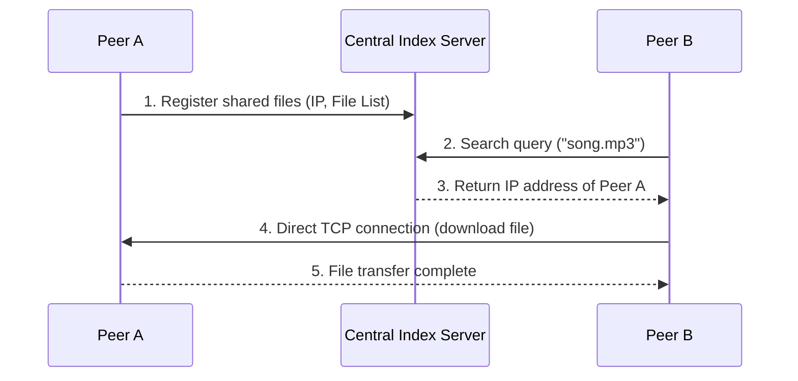

# Napster: Centralized Index P2P

Napster represents the first generation of Peer-to-Peer (P2P) file-sharing networks. It introduced the hybrid model of using a centralized index server alongside direct peer-to-peer data transfers.

---

## 1. Napster System Architecture

Napster is not a pure peer-to-peer system because it relies on a central coordinate server to locate resources.

---

## 2. Operational Workflow

1.  **Registration**: When a peer joins, it establishes a persistent connection to the Napster central server and uploads a list of files it is sharing.
2.  **Search**: To find a file, a peer sends a keyword query to the central server. The server searches its database and returns a list of matching peers (with IP addresses, ports, and connection speeds).
3.  **Download**: The requesting peer selects a target peer and opens a direct socket connection to download the file.

---

## 3. Architecture Trade-offs

| Advantage | Disadvantage |
| :--- | :--- |
| **High Search Efficiency**: Search is $O(1)$ and supports arbitrary complex regular expressions. | **Single Point of Failure**: If the central server crashes, no searches can be performed. |
| **Simple Directory Management**: Index state is held centrally, eliminating consistency overhead. | **Scalability Bottleneck**: Central server resources (RAM, bandwidth) limit network size. |
| **No Routing Overhead**: Peers do not forward queries. | **Vulnerable to Legal Action**: Easy targets for copyright enforcement (Napster was shut down in 2001). |