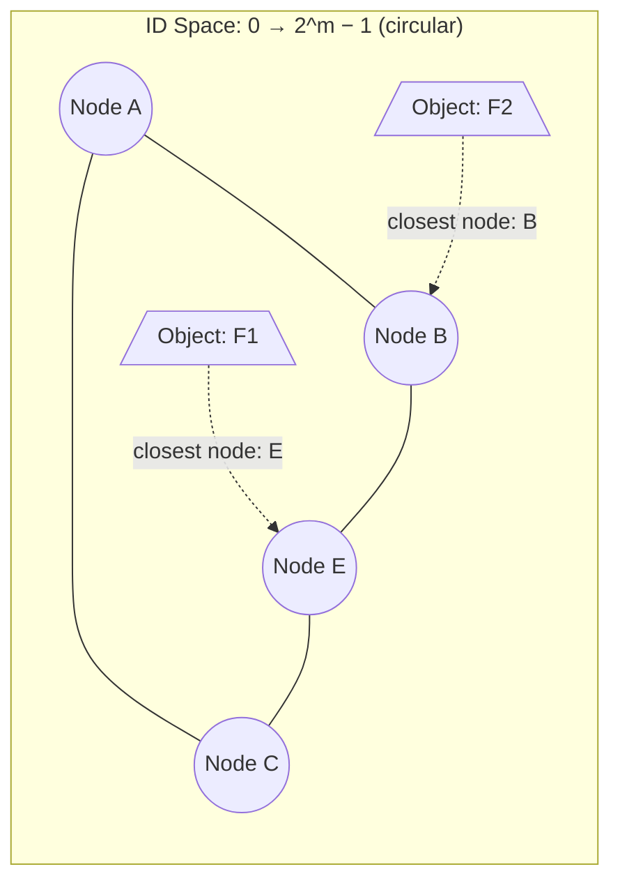
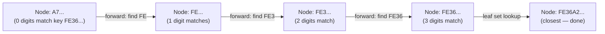
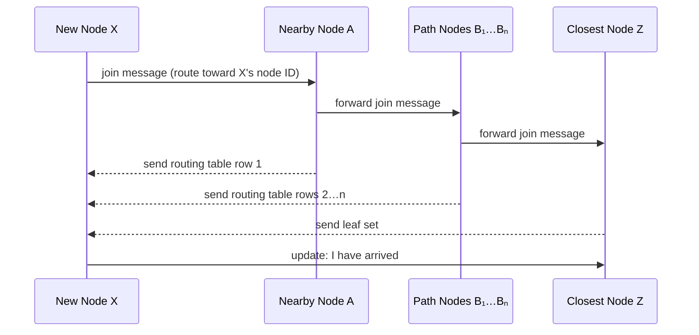

# Distributed Hash Tables and Pastry

*Lecture notes — Smruti R. Sarangi, IIT Delhi*
*Source paper: Rowstron & Druschel, "Pastry: Scalable, Decentralized Object Location and Routing for Large-Scale Peer-to-Peer Systems," Middleware 2001*

> **Structure:** Part I covers every concept and algorithm cleanly, with intuition and no proofs. Part II contains all the mathematics. Read Part I to understand the system; go to Part II when you want to derive the numbers.

---

## Table of Contents

**Part I — Concepts and Intuition**

- [1. From Napster to DHTs: The Motivation](#1-from-napster-to-dhts-the-motivation)
- [2. What Is a Hash Table? What Is a Distributed Hash Table?](#2-what-is-a-hash-table-what-is-a-distributed-hash-table)
  - [2.1 Normal Hash Tables](#21-normal-hash-tables)
  - [2.2 Why DHTs? The Scale Problem](#22-why-dhts-the-scale-problem)
  - [2.3 Advantages of DHTs](#23-advantages-of-dhts)
- [3. The Core Idea: Mapping Files and Nodes to the Same Space](#3-the-core-idea-mapping-files-and-nodes-to-the-same-space)
  - [3.1 The Problem of Finding Who Owns What](#31-the-problem-of-finding-who-owns-what)
  - [3.2 The Ring: Organizing the ID Space](#32-the-ring-organizing-the-id-space)
  - [3.3 The Fundamental Rule of DHT Storage](#33-the-fundamental-rule-of-dht-storage)
- [4. Pastry: Design and Overview](#4-pastry-design-and-overview)
  - [4.1 Node IDs and the Ring](#41-node-ids-and-the-ring)
  - [4.2 The Three Data Structures of a Pastry Node](#42-the-three-data-structures-of-a-pastry-node)
- [5. Prefix-Based Routing: The Core Algorithm](#5-prefix-based-routing-the-core-algorithm)
  - [5.1 The Intuition: Narrowing Down Digit by Digit](#51-the-intuition-narrowing-down-digit-by-digit)
  - [5.2 The Routing Table in Detail](#52-the-routing-table-in-detail)
  - [5.3 The Leaf Set: The Endgame](#53-the-leaf-set-the-endgame)
  - [5.4 The Neighborhood Set: Locality](#54-the-neighborhood-set-locality)
  - [5.5 The Full Routing Algorithm](#55-the-full-routing-algorithm)
  - [5.6 Performance and Reliability](#56-performance-and-reliability)
- [6. Node Arrival: Joining the Ring](#6-node-arrival-joining-the-ring)
  - [6.1 The Join Procedure](#61-the-join-procedure)
  - [6.2 Initializing the Three Tables](#62-initializing-the-three-tables)
  - [6.3 Maintaining Locality on Join](#63-maintaining-locality-on-join)
- [7. Node Departure and Failure: Keeping the Ring Alive](#7-node-departure-and-failure-keeping-the-ring-alive)
  - [7.1 Graceful vs Non-Graceful Departure](#71-graceful-vs-non-graceful-departure)
  - [7.2 Redundancy: Why Store at Neighbors?](#72-redundancy-why-store-at-neighbors)
  - [7.3 Repairing the Leaf Set](#73-repairing-the-leaf-set)
  - [7.4 Repairing the Routing Table](#74-repairing-the-routing-table)
  - [7.5 Repairing the Neighborhood Set](#75-repairing-the-neighborhood-set)
- [8. Tolerating Byzantine Failures](#8-tolerating-byzantine-failures)
- [9. Experimental Results](#9-experimental-results)

**Part II — Proofs and Mathematical Derivations**

- [P1. Why $O(\log_{2^b} N)$ Steps Suffice: The Prefix-Match Convergence Proof](#p1-why-olog_2b-n-steps-suffice-the-prefix-match-convergence-proof)
- [P2. Maintaining Locality on Join: The Induction Argument](#p2-maintaining-locality-on-join-the-induction-argument)

---

# Part I — Concepts and Intuition

## 1. From Napster to DHTs: The Motivation

Before DHTs, the P2P generations looked like this:

| Generation | System | Search Mechanism | Weakness |
|---|---|---|---|
| 1st | Napster | Central server index | Single point of failure — legal and technical |
| 2nd | Gnutella | Broadcast query to graph neighbors (TTL-bounded) | Floods the network; $O(N)$ messages in the worst case |
| 3rd | DHTs (Pastry, Chord, Tapestry…) | Structured routing via a hash ring | $O(\log N)$ messages, fully decentralized |

The core question motivating the 3rd generation: *can we find where a file is stored in $O(\log N)$ messages, without any central server and without flooding?*

The answer is yes — by storing information cleverly, so that the location of any piece of data can be *computed*, not searched for.

---

## 2. What Is a Hash Table? What Is a Distributed Hash Table?

### 2.1 Normal Hash Tables

A hash table is a dictionary storing **key–value pairs**. Supply the key, get the value back.

| Operation | What it does | Time complexity |
|---|---|---|
| `insert(key, value)` | Store the pair | $\approx \Theta(1)$ |
| `lookup(key)` | Return value, or null | $\approx \Theta(1)$ |
| `delete(key)` | Remove the pair | $\approx \Theta(1)$ |

A good hash function maps keys to unique locations to minimize collisions. Collisions are resolved via **chaining** (each slot is a linked list) or **rehashing** (probe alternative slots).

### 2.2 Why DHTs? The Scale Problem

A single machine's hash table cannot hold web-scale data. Consider two concrete examples:

**Banking (fits on one machine):**
- 0.1 billion customers × 8 KB per customer = **0.8 TB** — a modern laptop handles this.

**Music sharing (does not fit):**
- 0.1 billion users × 100 songs × 5 MB per song = **50 petabytes** — orders of magnitude larger, geographically distributed, and the system must survive regional outages.

The key transition: for web-scale data, a single machine is not just impractical — it's architecturally wrong. Facebook, LinkedIn, Google, Netflix, and Amazon are all built on DHT-like technology.

### 2.3 Advantages of DHTs

DHTs solve four problems simultaneously:

**Scale** — key-value pairs are distributed across thousands of machines; the system grows by simply adding nodes.

**Fault tolerance** — data is replicated; a regional outage (e.g., a power cut in one data center) does not take down the system.

**Elastic load balancing** — different keys hash to different nodes, spreading user requests naturally. Adding nodes during peak load (Diwali, Thanksgiving, Christmas) and removing them afterward is straightforward.

**Reduced legal liability** — in P2P contexts, with no central server knowing about all transfers, legal exposure is diffuse (though transferring unlicensed content remains illegal regardless).

Major DHT proposals: **Pastry**, **Chord**, **Tapestry**, **CAN**, **Fawn**.

---

## 3. The Core Idea: Mapping Files and Nodes to the Same Space

### 3.1 The Problem of Finding Who Owns What

Imagine node $Q$ has file $F_1$. It wants to tell the rest of the network "I have $F_1$" — not by broadcasting (expensive), but by storing that information at some node $E$ that anyone can find just by computing.

The question is: **where should $Q$ store the information "I have $F_1$"?** And how can any other node $A$ find $E$ without knowing the network topology?

The answer: use a **hash function** to map both file names and node identities into the same numerical space, then define a rule for who is responsible for what.

### 3.2 The Ring: Organizing the ID Space

Take an $m$-bit hash space: integers from $0$ to $2^m - 1$, arranged conceptually as a circle (ring). Both nodes and objects (files/keys) get mapped into this space:

- Each node gets a **node ID**: computed as the cryptographic hash of its IP address or public key.
- Each object/file gets an **object ID**: computed as the cryptographic hash of its name/content.



Nodes are arranged in **ascending order of node ID** around the ring. This is a virtual/conceptual arrangement — not a physical network topology.

### 3.3 The Fundamental Rule of DHT Storage

> **The rule:** information about an object is stored at the node whose node ID is **numerically closest** to the object's hash value.

So:
- To **store** information about $F_1$: hash $F_1$, find the closest node on the ring, send "I have $F_1$" to that node.
- To **look up** $F_1$: hash $F_1$, route a query to the closest node on the ring, receive back "node $Q$ has it."

This is beautiful because the mapping is entirely deterministic — anyone can compute where to send a query without consulting any central directory. The hash function is public and agreed upon by all participants.

**Why use the same hash space for both?** If IP addresses were mapped directly to file IDs, IP address clusters (entire universities, ISPs) might map to the same region of the file ID space, overloading some nodes. Hashing both independently achieves a much more uniform distribution.

---

## 4. Pastry: Design and Overview

Pastry is a concrete DHT design by Rowstron and Druschel (Middleware 2001). It is a **scalable distributed object location service** using a ring-based overlay that accounts for network locality and automatically adapts to node arrivals, departures, and failures.

Applications built on top of Pastry: **PAST** (large-scale distributed file storage) and **SCRIBE** (scalable publish/subscribe system).

### 4.1 Node IDs and the Ring

Every node gets a unique **128-bit node ID**, generated by:
- Computing `SHA(IP address)` or using the node's public key, then taking the lower 128 bits.

With $b = 4$ (the standard choice), each 128-bit ID is represented as **32 hexadecimal digits** (since 1 hex digit = 4 bits, 128 / 4 = 32). All node IDs and keys are treated as base-$2^b = 16$ numbers.

**Key parameters:**
- $b = 4$: bits per digit (so base = $2^b = 16$, i.e. hexadecimal).
- $L$: leaf set size (typically 16 or 32).
- $M$: neighborhood set size (typically $2^{b+1} = 32$).

**Pastry's headline guarantee:** routing completes in $\lceil \log_{2^b}(N) \rceil$ steps. With $b=4$ and $N=1{,}000{,}000$ nodes: $\log_{16}(10^6) = \log_{16}(16^5) = 5$ steps. Five hops to find anything among a million nodes.

**Fault tolerance guarantee:** delivery is guaranteed unless $L/2$ nodes with adjacent node IDs fail simultaneously.

### 4.2 The Three Data Structures of a Pastry Node

Every Pastry node maintains three tables:

| Table | What it contains | Purpose |
|---|---|---|
| **Routing table** $\mathcal{R}$ | 32 rows × 15 columns; each cell = IP of a node with a specific prefix match | Prefix-based long-distance routing |
| **Leaf set** $\mathcal{L}$ | $L/2$ closest larger node IDs + $L/2$ closest smaller node IDs | Guaranteed final delivery to the numerically closest node |
| **Neighborhood set** $\mathcal{M}$ | $M$ nodes geographically/topologically close | Maintains network locality |

These three serve completely different roles: the routing table does the fast long-distance travel; the leaf set does the precise final delivery; the neighborhood set maintains physical proximity for efficiency. Understanding all three is essential.

---

## 5. Prefix-Based Routing: The Core Algorithm

### 5.1 The Intuition: Narrowing Down Digit by Digit

Here is the central insight of Pastry's routing, explained from first principles.

Suppose you want to find the node closest to hash value `F E 3 6 ...` (in hex). You are currently at some node and need to get progressively closer on the ring. The trick Pastry uses: **match one more hex digit of the key at each hop**.

Imagine the 32-digit hex key `F E 3 6 A 2 ...`. At the first node:
- If your node ID starts with `F`, great — you already share 1 digit.
- Look for a neighbor whose ID starts with `F E` (matching 2 digits).
- Forward the query there.

At the next node (starting with `F E`):
- Look for a neighbor starting with `F E 3`.
- Forward there.

Each hop increases the shared prefix by one digit. After $k$ hops, the query is at a node matching $k$ hex digits of the key — which means it is exponentially closer in the ID space. This is exactly like binary search, but in base 16: each step eliminates $15/16$ of the remaining search space.



**The key abstraction:** routing in Pastry is not happening at Layer 3 (the IP network layer). It's happening at the **application layer**, over the P2P overlay network. Each "hop" is one message forwarded between Pastry peers over an existing TCP connection.

### 5.2 The Routing Table in Detail

The routing table $\mathcal{R}$ is a $32 \times 15$ matrix (with $b=4$, base 16).

**Why 32 rows?** A node ID is 128 bits = 32 hex digits. At most, you need to match all 32 digits, one per hop.

**Why 15 columns?** At row $i$, you already share $(i-1)$ digits with the key. The $i$-th digit of the key is some hex value $d \in \{0, 1, \ldots, F\}$. Since your own $i$-th digit already accounts for one value, there are $2^b - 1 = 15$ other possible values to cover.

**What each cell contains:** $\mathcal{R}[i][d]$ holds the IP address of a node that shares the first $(i-1)$ digits of *your* node ID, but whose $i$-th digit is $d$. If you find a cell where $d$ matches the $i$-th digit of the key, that node shares one more digit of the key than you do — forward there.

**Mnemonic:** Row $i$ answers "given that I match $(i-1)$ digits, where can I find a node matching $i$ digits for each possible next digit?"

### 5.3 The Leaf Set: The Endgame

The leaf set $\mathcal{L}$ contains:
- $L/2$ nodes with numerically closest **larger** node IDs (clockwise neighbors on the ring).
- $L/2$ nodes with numerically closest **smaller** node IDs (counter-clockwise neighbors).

**Why the leaf set matters:** prefix routing gets you *close* to the target, but not necessarily to the single numerically closest node. The leaf set is what guarantees precision at the end. Once the key's hash falls within the range of the current node's leaf set, the node has a perfect local view of that region of the ring and can identify the single closest node with certainty.

**Intuition:** think of the leaf set as your "known neighborhood" on the ring. The routing table takes you to the right neighborhood; the leaf set finds the exact address within it.

**Fault tolerance via the leaf set:** if $L/2$ nodes in the leaf set are still alive, the message can always be passed to *some* neighbor — even if some have failed. This is the basis of Pastry's failure tolerance guarantee.

**Why $L > 2$?** If $L = 2$ (only one neighbor on each side), a single node failure on one side leaves you with no fallback. Having $L = 16$ or $L = 32$ gives you $L/2 - 1$ redundant fallbacks per side — much more robust.

**The critical question: how does a node know who its $L/2$ immediate ring neighbors are?**

This seems circular — to know your ring neighbors, you'd need to know the whole ring. Pastry solves it via the join procedure (Section 6): when node $X$ joins, it routes toward its own node ID. Every node $B_i$ along that path shares $i$ digits of prefix with $X$ and is therefore progressively closer on the ring. $X$ adds all of these path nodes to its leaf set. Because the routing path takes $O(\log N)$ hops, the leaf set ends up with $O(\log N)$ nodes that are **well-distributed** around the ring — not just the immediate neighbors, but also a spread of nodes at varying distances. This distribution is what makes the fast $O(\log N)$ routing work in practice.

**The $O(N)$ baseline — why distributed connections matter:**

To see why you need well-distributed leaf set entries, consider the degenerate case: each node knows *only* its immediate left and right ring neighbors (leaf set size 2, nothing else). Routing works — you'll always find the closest node eventually — but how many hops does it take?

With only immediate neighbors, routing from node $A$ to a target near node $E$ means hopping one step at a time around the ring: $A \to$ next $\to$ next $\to \cdots \to E$. This is $O(N)$ hops — linear in the number of nodes, catastrophically slow for large networks.

Pastry's routing table and well-distributed leaf set act like long-range "shortcuts": instead of stepping one node at a time, you can jump to a node that is already halfway across the ring (in ID space), then a quarter of the way, then an eighth — a classic halving-the-distance strategy that gives $O(\log N)$.

| Connectivity | Routing time | Why |
|---|---|---|
| Only immediate neighbors | $O(N)$ | Must step one node at a time |
| Well-distributed (Pastry) | $O(\log_{2^b} N)$ | Long-range jumps halve the search space each hop |

### 5.4 The Neighborhood Set: Locality

The neighborhood set $\mathcal{M}$ contains $M \approx 2^{b+1}$ nodes that are **geographically or topologically close** to the current node — e.g., nodes in the same data center, same ISP, or nearby in latency.

**What it's for:** locality. When initializing a new node, the neighborhood set seeds the routing table with nearby nodes, so that early routing hops don't unnecessarily cross the globe. It is *not* about closeness in the ID space — it's about closeness in the physical network.

**Key distinction:** the leaf set tracks proximity in the *ID space* (who is numerically close on the ring); the neighborhood set tracks proximity in the *physical network* (who is geographically/latency-close). A node might be your physical neighbor but have a node ID far from yours — that's normal.

### 5.5 The Full Routing Algorithm

```
Input:  key K, routing table R, hash of key D
Output: value V

if L_{-L/2} ≤ D ≤ L_{L/2}  then
    // Key is within the leaf set range — we know exactly who's closest
    forward K to leaf L_i minimizing |L_i − K|

else
    l ← length of common prefix between D and my node ID
    if R(l+1, D_{l+1}) ≠ null  then
        // Normal case: forward to a node matching one more digit
        forward to R(l+1, D_{l+1})
    else
        // Rare case: no routing table entry for the next digit
        // Fall back: find any known node that is at least as close
        // in prefix length but numerically closer to D
        forward to T ∈ (L ∪ R ∪ M) such that:
            prefix(T, K) ≥ l   AND   |T − K| < |nodeId − K|
```

**Three cases, in plain English:**

1. **Leaf set hit** (most precise): the key is in your immediate neighborhood on the ring. You have a complete picture — send directly to the closest node.

2. **Routing table hit** (normal case): look at the $(l+1)$-th row, the column corresponding to the next digit of the key. If that cell is populated, forward there — the next node shares one more digit.

3. **Routing table miss** (rare): your routing table has a gap. Scan all three data structures ($\mathcal{L}$, $\mathcal{R}$, $\mathcal{M}$) for any node that both (a) matches at least as many prefix digits as you do and (b) is numerically closer to the target. Forward there. Progress is still guaranteed — each hop strictly decreases the distance.

### 5.6 Performance and Reliability

**Routing complexity:** $O(\log_{2^b} N)$ hops. With $b=4$ and $N=100{,}000$: $\log_{16}(100{,}000) \approx 4$ hops. Experimentally confirmed:

| Hop count | Fraction of lookups |
|---|---|
| 2 hops | 1.5% |
| 3 hops | 16.4% |
| 4 hops | 64% |
| 5 hops | 17% |

Average: ~4 hops for 100,000 nodes (2.5 hops for 1,000 nodes). With a complete routing table, hop count would be 30% lower.

**Why so fast?** Each hop increases the prefix match by one base-$2^b$ digit. That means each hop reduces the search space by a factor of $2^b = 16$. The number of hops needed to reduce a space of $N$ to 1 is $\log_{16}(N)$ — logarithmic search by construction.

---

## 6. Node Arrival: Joining the Ring

### 6.1 The Join Procedure

When node $X$ wants to join:

1. $X$ locates a **nearby** node $A$ (bootstrapping). $A$ can be found via **expanding ring multicast**: $X$ broadcasts a "who is near me?" message with TTL=1, then TTL=2, expanding the search radius until it finds at least one responsive Pastry node. This avoids flooding the whole network while still guaranteeing discovery of a nearby peer.
2. $X$ routes a **join message** through the network toward the node $Z$ whose node ID is numerically closest to $X$'s own node ID.
3. Every node on the path from $A$ to $Z$ sends its routing table to $X$.
4. $X$ uses all this information to initialize its three tables.
5. $X$ transmits its state to all nodes in $\mathcal{L} \cup \mathcal{R} \cup \mathcal{M}$ so they can update their own tables.



### 6.2 Initializing the Three Tables

**Neighborhood set:** $A$ is physically close to $X$ (that's how $X$ found it). So $X$ simply copies $A$'s neighborhood set. Geographic proximity is inherited.

**Leaf set:** $Z$ is the closest node to $X$ in the ID space. $X$ copies $Z$'s leaf set and adjusts it around its own position — these are the nodes immediately adjacent to $X$ on the ring.

**Routing table:** this is the clever part. Each node $B_i$ on the path from $A$ to $Z$ has exactly $i$ digits of its prefix matching $X$'s ID (because each step of routing increases the prefix match by one). So $B_i$'s $(i+1)$-th routing table row already covers nodes sharing $i$ digits with $X$ — exactly what $X$ needs for its $(i+1)$-th row. $X$ copies row $i+1$ from $B_i$'s table. The first row (no prefix match needed) comes from $A$.

**Why this is efficient:** $X$ does not need to contact the entire network. It only contacts the $O(\log N)$ nodes along the routing path, and each contributes exactly the right row of the routing table.

### 6.3 Maintaining Locality on Join

**The induction argument (intuition, not proof):** assume every existing node already has a well-localized routing table — i.e., all its routing table entries point to nearby nodes. When $X$ joins:

- $X$ starts from $A$, which is geographically close.
- The routing path $A \to B_1 \to \cdots \to Z$ stays "fairly close" to $X$ throughout, because each $B_i$ was close to $A$ (by the induction assumption applied to $B_i$'s own routing table).
- Since $X$ copies row $i+1$ from $B_i$, and $B_i$ is fairly close, $X$'s row $i+1$ also points to nearby nodes.
- Therefore $X$ inherits locality.

The induction base case holds trivially: when the network has one node, the property is vacuously true. New joins preserve it. **Induction hypothesis proved.**

---

## 7. Node Departure and Failure: Keeping the Ring Alive

### 7.1 Graceful vs Non-Graceful Departure

A node can leave the network in two fundamentally different ways:

- **Graceful departure**: the node knows it is leaving. It can notify its neighbors, transfer its stored records to the next-closest node, and update routing tables. This is clean but rare in practice — machines crash, connections drop, users close applications without warning.
- **Non-graceful departure (failure)**: the node simply disappears. No notification, no data transfer. This is the common case and the one the protocol must be designed for.

Pastry's design is specifically built around the assumption that departures are usually non-graceful. The redundancy mechanism below is the answer.

### 7.2 Redundancy: Why Store at Neighbors?

Suppose node $X$ holds the record "node $Q$ has file $F_1$." If $X$ fails without warning — which is the common case — that record is lost. The next query for $F_1$ will route to $Y$ (the next closest node), which knows nothing.

**The fix: each node stores a copy of what its neighbors would normally store.** Specifically, every node stores the key-value records that would belong to the $L/2$ nodes to its immediate left and right on the ring.

**Careful: this is not a full replication of everyone's data.** Node $Y$ only stores *what would be stored at $X$ by the DHT rule*, not what $X$ itself happens to hold for other reasons. This keeps the storage overhead bounded.

**Why $L/2$ copies?** The failure guarantee says delivery is possible unless $L/2$ adjacent nodes fail simultaneously. With $L/2$ redundant copies distributed around the neighborhood, you need to lose all of them at once before data becomes unavailable.

### 7.3 Repairing the Leaf Set

Nodes might fail or leave without notice. When node $\mathcal{L}_{-k}$ (a leaf at position $-k$, where $-L/2 < k < 0$) is detected as failed:

1. Contact the furthest-away leaf on the same side: $\mathcal{L}_{-L/2}$.
2. Get its leaf set.
3. Merge the received leaf set with your own.
4. For any new nodes discovered, **ping them** to verify they are actually alive before adding them.

**Why ping?** The received leaf set might itself be stale. A node that appears in $\mathcal{L}_{-L/2}$'s leaf set might also have failed. Always verify before trusting.

**Keep-alive messages:** every Pastry node periodically sends heartbeat messages to all nodes it is connected to. This gives early warning of failures, so repair can happen proactively rather than reactively.

### 7.4 Repairing the Routing Table

When routing table entry $\mathcal{R}(l, d)$ fails:

1. **Try a lateral replacement:** contact $\mathcal{R}(l, d')$ for some $d' \neq d$ (a different node in the same row, i.e., one that shares the same prefix length). Ask it for a node at the same position.
2. **If no lateral replacement works, look further:** ask $\mathcal{R}(l+1, d')$ — a node with an even longer prefix match. It likely has richer knowledge of that region of the ring.

**Intuition:** nodes with longer shared prefixes tend to know more about the detailed structure of that ID region — they're "deeper" into the same neighborhood of the ring.

### 7.5 Repairing the Neighborhood Set

The neighborhood set requires a different repair strategy because it tracks physical proximity, not ID proximity:

1. Each node **periodically pings** all nodes in its neighborhood set.
2. If a neighbor is found dead, contact the *remaining* neighbors and ask for *their* neighborhood sets.
3. Merge, verify, and repair.

**Why go to neighbors?** If your geographic neighbor is dead, your other geographic neighbors are likely to know about nearby nodes — they share the same physical region.

---

## 8. Tolerating Byzantine Failures

Byzantine failures — where nodes lie, corrupt messages, or behave maliciously — require additional mechanisms beyond fail-stop handling:

- **Multiple entries per routing table cell**: store several alternative nodes per cell so a single malicious/incorrect entry can be detected and bypassed.
- **Randomize the routing strategy**: don't always take the same route; randomization makes it harder for an adversary to reliably intercept queries.
- **Periodic IP broadcasts and expanding-ring multicasts**: reconnect network components that may have become disconnected due to failures or attacks.

---

## 9. Experimental Results

**Simulation setup:** 100,000 nodes, each running a Java-based VM, each assigned coordinates in a Euclidean plane (to model geographic distances).

**Key findings:**

- Hop count grows **linearly with $\log N$** — confirming the $O(\log_{2^b} N)$ prediction.
- At 1,000 nodes: ~2.5 hops average.
- At 100,000 nodes: ~4 hops average.
- With a complete routing table (no missing entries): hop count would be **30% lower**.
- Hop count distribution for 100,000 nodes and 200,000 lookups: 64% of queries complete in exactly 4 hops.

---

# Part II — Proofs and Mathematical Derivations

> Read this after Part I. All notation defined here is consistent with Part I.

## P1. Why $O(\log_{2^b} N)$ Steps Suffice: The Prefix-Match Convergence Proof

**What we want to show:** after $m = c + \log_{16}(N)$ hops (with $c$ a small constant), it is virtually certain that no other node exists that shares more than $m$ hex digits of prefix with the key. This means routing *must* have converged — there's no one further to forward to.

**Setup (with $b=4$, base $= 2^b = 16$):**

The probability that two randomly hashed IDs share the same first hex digit is $1/16$ (each digit is uniformly distributed). The probability they share the first $m$ digits is $16^{-m}$.

Therefore, the probability that a specific node does **not** share a prefix of length $m$ with the key is $1 - 16^{-m}$.

With $N$ nodes (all independent):

$$P(\text{no node shares a prefix of length } m \text{ with the key}) = (1 - 16^{-m})^N$$

**Setting $m = c + \log_{16}(N)$:**

$$P = (1 - 16^{-m})^N = (1 - 16^{-c} \cdot 16^{-\log_{16}(N)})^N = \left(1 - \frac{16^{-c}}{N}\right)^N$$

Let $\lambda = 16^{-c}$. Rewrite:

$$P = \left(1 - \frac{\lambda}{N}\right)^N = \left[\left(1 - \frac{\lambda}{N}\right)^{N/\lambda}\right]^\lambda$$

Applying the standard limit $\lim_{N \to \infty}(1 - \lambda/N)^{N/\lambda} = e^{-1}$:

$$\boxed{P = e^{-\lambda} = e^{-16^{-c}}}$$

**Reading the result:**

| $c$ | $\lambda = 16^{-c}$ | $P = e^{-\lambda}$ |
|---|---|---|
| 0 | 1 | $e^{-1} \approx 0.37$ |
| 1 | $1/16 \approx 0.063$ | $\approx 0.94$ |
| 2 | $1/256 \approx 0.004$ | $\approx 0.996$ |
| 3 | $\approx 2.4\times10^{-4}$ | $\approx 0.9998$ |

By $c = 2$: the probability that *any* node in the entire network shares more than $m = 2 + \log_{16}(N)$ digits of prefix with the key is essentially zero. So after $2 + \log_{16}(N)$ hops, prefix routing has converged with near certainty.

**The $O(\log N)$ conclusion:**

$$\text{routing hops} \leq m = c + \log_{16}(N) = O(\log_{16}(N)) = O(\log_{2^b}(N))$$

**Worked example** with $N = 1{,}000{,}000$:

$$\log_{16}(10^6) = \log_{16}(16^5) = 5$$

So $m = c + 5 \approx 7$ hops at most — even for a million-node network.

**Why does the search space shrink exponentially per hop?** Each hex digit of the key occupies 4 bits. Matching one more digit means you have narrowed the target region of the ring by a factor of $16 = 2^4$. After $k$ matched digits, you are looking at a region of size $N / 16^k$. Setting $N / 16^k = 1$ gives $k = \log_{16}(N)$ — exactly the number of routing hops needed.

---

## P2. Maintaining Locality on Join: The Induction Argument

**Claim:** if all existing nodes have well-localized routing tables (all entries point to nearby nodes), then when a new node $X$ joins using the Pastry join procedure, $X$'s routing table is also well-localized.

**Proof by induction on the join order:**

**Base case:** a network with one node trivially satisfies the property (no routing table entries to worry about).

**Inductive step:** assume all existing nodes have well-localized routing tables. Node $X$ joins via nearby node $A$.

The join message routes from $A$ toward $Z$ (the node closest to $X$'s node ID). Let $B_i$ be the $i$-th node along this path. By the routing protocol, $B_i$ shares $i$ digits of prefix with $X$.

The induction assumption says $B_i$'s routing table is well-localized — all its entries point to nearby nodes.

$X$ copies row $i+1$ of its routing table from $B_i$'s row $i+1$. We need to show those entries are near to $X$:

- $B_i$ shares $i$ prefix digits with $X$.
- $B_i$ was reached from $A$, which is geographically close to $X$.
- Each routing step stays "in the neighborhood" because the induction assumption guarantees $B_i$'s entries point to nearby nodes.
- Since $B_i$ is close to $X$ (transitively via $A$), $B_i$'s row $i+1$ entries are also close to $X$.

Therefore $X$'s row $i+1$ is populated with nearby nodes — locality is preserved.

Since this holds for all rows $i = 1, \ldots, 32$, $X$'s entire routing table is well-localized.

**Induction hypothesis proved.** $\square$

**The practical consequence:** locality is not an accident. The join procedure is explicitly designed so that routing-table rows are obtained from nodes that are simultaneously (a) ID-space-close (sharing prefix digits) and (b) network-space-close (reachable via short physical hops). The two notions of closeness are coupled by the join path, which ensures each $B_i$ is both.
