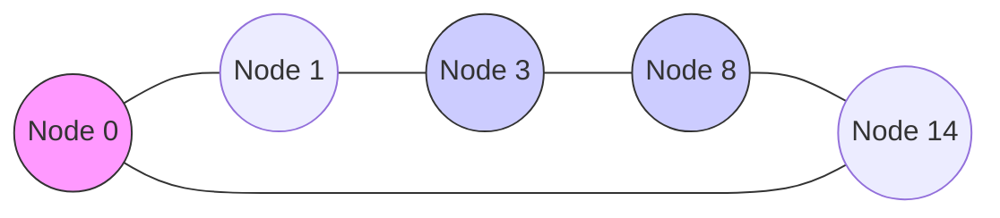

# The Chord DHT Protocol

Chord is a classic **Structured Peer-to-Peer** protocol implementing a Distributed Hash Table (DHT). It guarantees that finding a key in a network of $N$ nodes requires at most $O(\log N)$ messages.

---

## 1. Consistent Hashing and Identifier Ring

Chord maps both nodes and keys into an $m$-bit identifier space using a cryptographic hash function (like SHA-1). The space is organized as a modulo-$2^m$ circle known as the **Chord Ring**.

*   **Node ID**: Hash of node's IP address.
*   **Key ID**: Hash of the data key.
*   **Successor Node**: Key $k$ is assigned to the first node whose ID is equal to or greater than $k$ in the ring. This node is called $\text{successor}(k)$.

For example, on an $m=4$ ring (sizes $0-15$), key $k=5$ would be stored at node $N=8$ if the active nodes are $0, 1, 3, 8, 14$.

---

## 2. Chord Finger Table Routing

To avoid routing hops of $O(N)$ around the ring, each node $n$ maintains a routing table called the **Finger Table** with at most $m$ entries. The $i$-th entry of node $n$'s finger table points to:

$$\text{Finger}[i] = \text{successor}((n + 2^{i-1}) \pmod{2^m})$$

### 2.1 Finger Table Example (Node 0, $m=4$)
For node $n=0$ on a ring with active nodes $\{0, 1, 3, 8, 14\}$:

| Index $i$ | Formula $n + 2^{i-1}$ | Target successor | Finger Node |
| :---: | :---: | :---: | :---: |
| 1 | $0 + 1 = 1$ | $\text{successor}(1)$ | **1** |
| 2 | $0 + 2 = 2$ | $\text{successor}(2)$ | **3** |
| 3 | $0 + 4 = 4$ | $\text{successor}(4)$ | **8** |
| 4 | $0 + 8 = 8$ | $\text{successor}(8)$ | **8** |

### 2.2 Routing Algorithm
When node $n$ queries for key $k$:
1.  Check if $k$ lies between $n$ and $\text{successor}(n)$. If so, return $\text{successor}(n)$.
2.  Otherwise, search the finger table for the closest predecessor node $n'$ to $k$.
3.  Forward the query to $n'$. The distance to the key is halved in each hop, yielding $O(\log N)$ lookup time.

---

## 3. Node Joins and Stabilization

To maintain correct pointers under network churn, Chord nodes run a periodic **Stabilization** protocol:

1.  **stabilize()**: Node $n$ queries its successor for its predecessor $p$. If $p$ lies between $n$ and successor, $n$ updates its successor to $p$.
2.  **notify()**: Node $n$ tells its successor about its existence. If successor's predecessor is empty or $n$ is closer, successor updates predecessor to $n$.