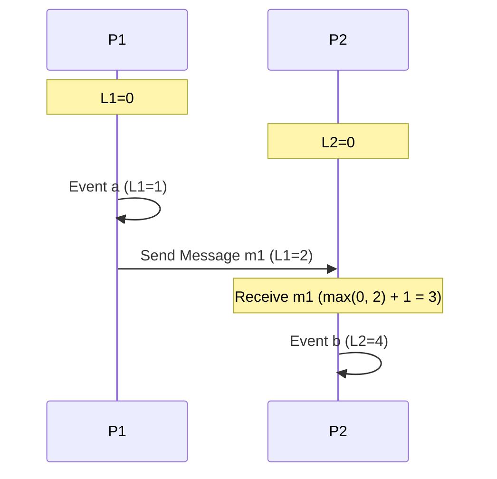

# Lamport Logical Clocks

In distributed systems, physical clocks can drift due to hardware variance, making it impossible to rely on physical wall-clock timestamps to order events. Leslie Lamport introduced **Logical Clocks** to define a consistent chronological order of events based on causality.

---

## 1. The Happens-Before Relation ($a \to b$)

The happens-before relation (denoted $\to$) defines a strict causal ordering of events:

1.  **Local Ordering**: If event $a$ and event $b$ occur within the same process, and $a$ occurs before $b$ locally, then $a \to b$.
2.  **Message Passing**: If event $a$ is the sending of a message by one process, and event $b$ is the receipt of that same message by another process, then $a \to b$.
3.  **Transitivity**: If $a \to b$ and $b \to c$, then $a \to c$.

> **Concurrence ($a \parallel b$)**: If neither $a \to b$ nor $b \to a$, the events are said to be concurrent.

---

## 2. Lamport Clock Update Rules

Each process $P_i$ maintains a local integer counter $L_i$ (initialized to 0). The clock is updated using two rules:

*   **Rule 1 (Local Event)**: Before executing a local event, process $P_i$ increments its local clock:
    $$L_i \gets L_i + 1$$
*   **Rule 2 (Message Passing)**:
    *   When process $P_i$ sends a message $m$, it attaches its current clock value: $(m, L_i)$.
    *   Upon receiving message $(m, L_{msg})$, the receiving process $P_j$ updates its clock and increments it:
        $$L_j \gets \max(L_j, L_{msg}) + 1$$

---

## 3. Total Ordering of Events

Lamport clocks only provide a partial order: if $a \to b$, then $L(a) < L(b)$. However, $L(a) < L(b)$ does **not** imply $a \to b$ (events could be concurrent).

To resolve ties and create a **Total Order** (denoted $\implies$), we use process identifiers as tie-breakers. Event $a$ at process $P_i$ occurs before event $b$ at process $P_j$ if:

$$a \implies b \iff (L(a) < L(b)) \quad \text{or} \quad (L(a) = L(b) \ \text{and} \ i < j)$$