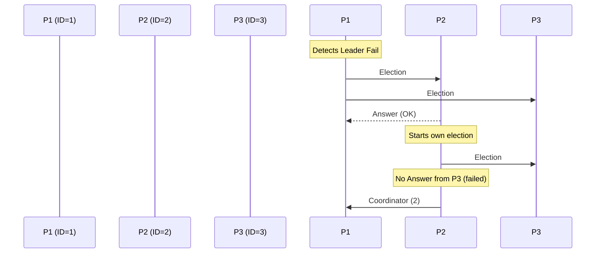

# The Bully Election Algorithm

The Bully Algorithm (proposed by Hector Garcia-Molina) is a classic leader election protocol for synchronous distributed systems. It assumes that processes have unique IDs and that any process can communicate directly with any other process via point-to-point links.

---

## 1. Core Messaging Protocol

The algorithm uses three message types:

1.  **Election**: Initiates an election process.
2.  **Answer (OK)**: Sent by a higher-ID node to cancel a lower-ID node's bid.
3.  **Coordinator**: Sent by the winning node to announce its leadership.

---

## 2. Operational Phases

When a process $P_i$ detects that the coordinator has failed:

1.  **Challenge Higher Nodes**: $P_i$ sends an `Election` message to all processes with larger IDs: $P_{i+1}, P_{i+2}, \ldots, P_N$.
2.  **Wait for Answer**: $P_i$ waits for an `Answer` message for a timeout period $T$.
    *   **Case A (No Answer)**: If no higher node answers, $P_i$ "bullies" its way into leadership. It sends a `Coordinator(i)` message to all processes with lower IDs and becomes the leader.
    *   **Case B (Answer Received)**: If any higher node answers with `Answer`, $P_i$ stands down and waits for a `Coordinator` message from the new leader.
3.  **Higher Node Action**: When a higher process $P_h$ ($h > i$) receives `Election` from $P_i$, it replies with `Answer` and immediately starts its own election by sending `Election` messages to nodes with IDs greater than $h$.

---

## 3. Complexity & Evaluation

*   **Message Complexity**:
    *   Worst case: Lower-ID node starts the election when all nodes are alive. The complexity is $O(N^2)$ messages.
    *   Best case: The second-highest node detects failure and immediately becomes leader. Requires $N-2$ messages.
*   **Limitation**: Relies on strict synchronization. If network delays exceed timeout $T$, a slow process might incorrectly think higher nodes are dead, causing election churn.