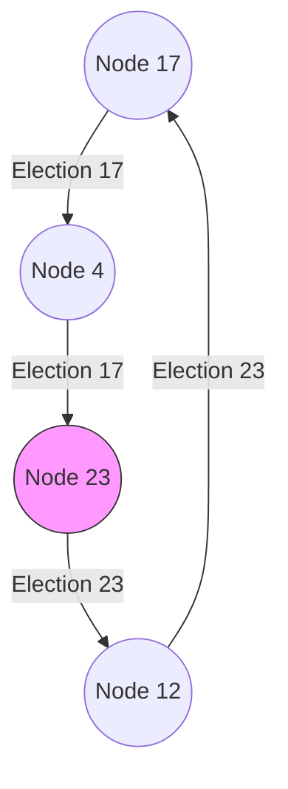

# Ring-Based Election Algorithms

Leader election is a fundamental coordination problem where a group of processes must agree on a single coordinator node. In **Ring-based Election**, nodes are logically organized in a unidirectional circle, and messages can only be forwarded to a node's immediate successor.

---

## 1. The Chang-Roberts Algorithm

The Chang-Roberts algorithm is designed for a ring of size $N$ where nodes have unique numeric identifiers. All nodes are initially in a `Non-Participant` state.

### 1.1 Execution Rules
1.  **Initiation**: Any node that detects the leader has failed starts an election. It marks itself as a `Participant`, creates an `Election(ID)` message containing its own ID, and sends it to its successor.
2.  **Receiving Election(incoming_ID)**: When node $i$ receives an `Election(incoming_ID)`:
    *   If $\text{incoming_ID} > i$: Forward `Election(incoming_ID)` and set state to `Participant`.
    *   If $\text{incoming_ID} < i$:
        *   If not a `Participant`, change ID in the message to $i$, forward it, and set state to `Participant`.
        *   If already a `Participant`, drop the message.
    *   If $\text{incoming_ID} = i$: Node $i$ has received its own message back. It is the coordinator! It changes state to `Non-Participant` and sends a `Coordinator(i)` message around the ring.
3.  **Receiving Coordinator(leader_ID)**: Nodes update their record of the leader, set state to `Non-Participant`, and forward the message.

---

## 2. Complexity Analysis

*   **Best Case**: Nodes are ordered such that the election initiator is immediately followed by nodes with decreasing IDs. The election message circles the ring once:
    $$\text{Messages} = 2N - 1$$
*   **Worst Case**: Initiator is immediately preceded by the largest ID. The message must circle multiple times:
    $$\text{Messages} = O(N^2)$$
*   **Average Case**: If IDs are distributed randomly:
    $$\text{Messages} = O(N \log N)$$