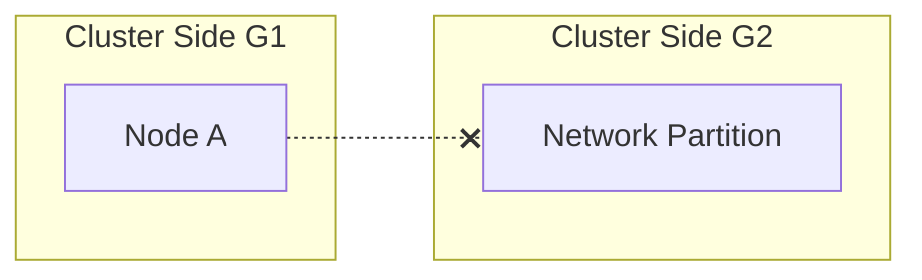

# The CAP Theorem and Proof

The **CAP Theorem** (Brewer's Conjecture, formalized by Seth Gilbert and Nancy Lynch in 2002) states that a distributed read-write register can guarantee at most two of three properties simultaneously.

---

## 1. CAP Definitions

*   **Consistency (C)**: Equivalent to **Linearizability**. Every read returns the most recent write or an error.
*   **Availability (A)**: Every non-failing node returns a non-error response to every request (without guaranteeing it contains the most recent write).
*   **Partition Tolerance (P)**: The system continues to operate despite arbitrary message loss or network partitions.

---

## 2. Formal Proof (Gilbert & Lynch)

The proof constructs a network partition scenario:

1.  Assume a system of two nodes, $A$ and $B$, separated by a network partition (Property $P$).
2.  Client 1 writes a new value $v_1$ to Node $A$.
    *   To be **Available (A)**, Node $A$ must accept the write and return `Ok`.
3.  Because of the partition, Node $A$ cannot send the update to Node $B$.
4.  Client 2 reads from Node $B$.
    *   To be **Available (A)**, Node $B$ must respond without waiting.
    *   Node $B$ only knows the old value $v_0$.
5.  Node $B$ returns $v_0$, violating **Consistency (C)**.

> **Conclusion**: In the presence of a partition (P), a distributed system must choose either Consistency (CP) or Availability (AP).

---

## 3. Architectural Choices

*   **CP Systems**: Deny reads/writes during partitions to guarantee consistency (e.g., Google Spanner, HBase, ZooKeeper).
*   **AP Systems**: Accept writes locally and resolve conflicts later, sacrificing consistency (e.g., DynamoDB, Cassandra).