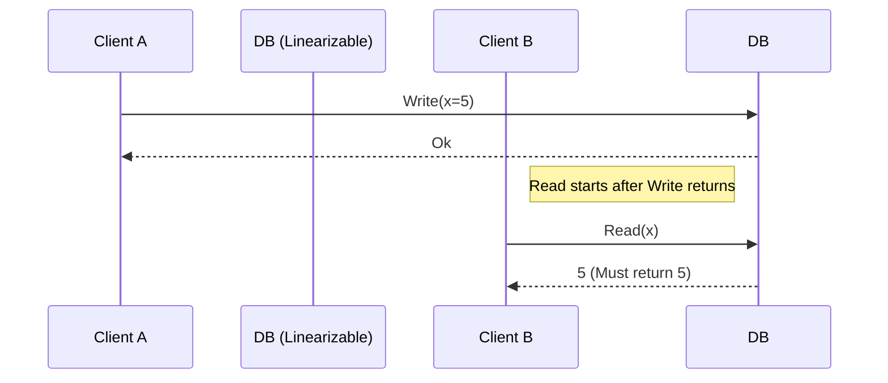

# Data Consistency Models

In replicated storage systems, the consistency model defines the rules governing the ordering and visibility of read and write operations.

---

## 1. Strong Consistency (Linearizability)

**Linearizability** is the strongest consistency model for single-object operations.

*   **Rule**: Every operation must appear to take effect instantaneously at some point in time between its invocation and its response.
*   **Implication**: Once a write completes, all subsequent reads (in real time) must return the new value or a newer one.

---

## 2. Sequential Consistency

Proposed by Lamport, **Sequential Consistency** relaxes the real-time constraint of linearizability:

*   **Rule**: The result of any execution is the same as if the operations of all processors were executed in some sequential order, and the operations of each individual processor appear in this sequence in the order specified by its program.
*   **Difference**: Operations do not need to take effect instantly in real-time, but all clients must agree on the *exact same order* of updates.

---

## 3. Causal Consistency

A weaker, highly scalable model that only orders causally related events:

*   **Rule**: Operations that are causally related must be seen by every node in the same order. Operations that are concurrent may be seen in different orders by different nodes.
*   **Detection**: Uses vector clocks to track causal relationships.