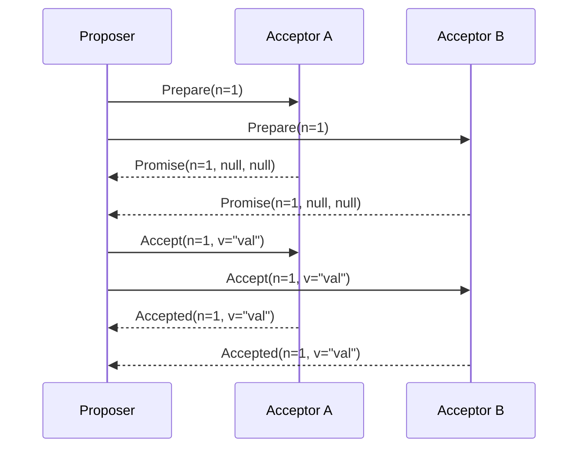

# Paxos Consensus Protocol

Paxos is the foundational consensus protocol for fault-tolerant distributed systems. It allows a set of nodes to agree on a single value despite node crashes and network delays.

---

## 1. Roles in Paxos

*   **Proposers**: Advocate for client values by initiating proposals.
*   **Acceptors**: Vote on proposals and form the quorum memory.
*   **Learners**: Read the agreed-upon consensus value.

---

## 2. Single-Decree Paxos Protocol

Paxos operates in two distinct phases:

### Phase 1 (Prepare)
1.  **Phase 1a (Prepare)**: A Proposer selects a unique proposal number $n$ and broadcasts `Prepare(n)` to a majority of Acceptors.
2.  **Phase 1b (Promise)**: If $n$ is greater than any proposal number the Acceptor has seen, it promises not to accept any proposals numbered less than $n$, and returns the highest-numbered proposal it has already accepted (if any): `Promise(n, accepted_num, accepted_val)`.

### Phase 2 (Accept)
1.  **Phase 2a (Accept)**: If the Proposer receives promises from a majority of Acceptors, it selects a value $v$ (the value of the highest-numbered proposal among the promises, or its own value if no proposals were returned). It sends `Accept(n, v)` to the Acceptors.
2.  **Phase 2b (Accepted)**: If an Acceptor receives `Accept(n, v)`, it accepts the proposal unless it has already made a promise to a higher proposal number. It sends `Accepted(n, v)` to the Proposer and Learners.

