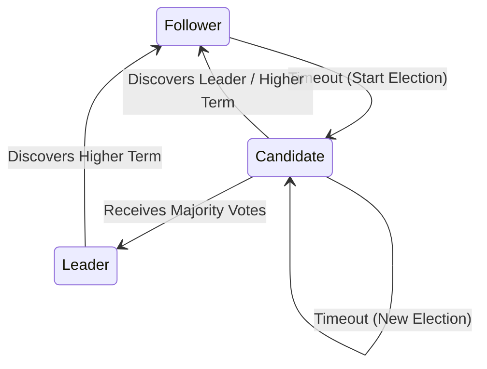

# The Raft Consensus Protocol

Raft is a consensus algorithm designed to be easy to understand compared to Paxos. It decomposes consensus into three subproblems: Leader Election, Log Replication, and Safety.

---

## 1. Raft Roles and Terms

A Raft node is in one of three states: **Leader**, **Follower**, or **Candidate**. Time is divided into **Terms** of arbitrary length, acting as logical clocks.

---

## 2. Core Mechanisms

### 2.1 Leader Election
1.  Followers increment their term and transition to Candidates if they receive no heartbeat within an election timeout.
2.  Candidates vote for themselves and send `RequestVote` RPCs to peers.
3.  If a candidate receives votes from a majority of nodes, it becomes the Leader.

### 2.2 Log Replication
The leader coordinates client writes:
1.  Leader appends command to local log.
2.  Leader sends `AppendEntries` RPCs to followers.
3.  Once a majority of followers acknowledge the entry, the leader commits it and applies it to its local state machine.

---

## 3. Raft Safety Invariants

Raft guarantees five safety properties:

*   **Election Safety**: At most one leader can be elected per term.
*   **Leader Append-Only**: A leader never overwrites or truncates its log; it only appends.
*   **Log Matching**: If two logs contain an entry with the same index and term, then they are identical up to that index.
*   **Leader Completeness**: If a log entry is committed in a given term, that entry will be present in the logs of the leaders for all higher-numbered terms.
*   **State Machine Safety**: If a server has applied a log entry at a given index to its state machine, no other server will ever apply a different log entry for the same index.