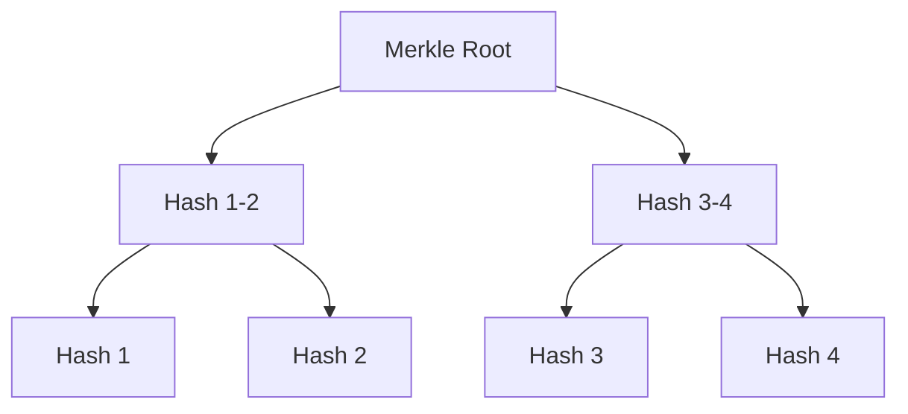

# Blockchain Data Structures

A blockchain organizes transactions into a tamper-evident linked list using cryptographic hashes.

---

## 1. Merkle Trees

Transactions inside a block are organized into a **Merkle Tree** (a binary hash tree).

*   **Benefit**: Allows lightweight clients to verify if a transaction is included in a block using only $O(\log N)$ hash proofs (the Merkle Path).

---

## 2. UTXO Model

Bitcoin uses the **Unspent Transaction Output (UTXO)** model:
*   Transactions do not update account balances. Instead, they consume existing UTXOs (inputs) and create new UTXOs (outputs).
*   **Verification**: A transaction is valid if the inputs are currently unspent and are signed by the rightful owner.