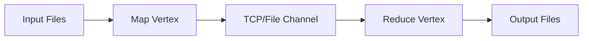

# Microsoft DryadLINQ

Microsoft DryadLINQ is a compiler-integrated system for executing data-parallel programs over distributed clusters. It translates sequential .NET queries into distributed execution graphs.

---

## 1. Programming Model (LINQ)

Developers write standard sequential queries using LINQ (Language Integrated Query) operators (such as `Select`, `Where`, `GroupBy`). The DryadLINQ compiler translates these operators into a distributed execution plan.

---

## 2. Dryad Execution Engine

The underlying **Dryad** execution engine manages dataflow:

*   **Execution Graph**: Programs are modeled as a Directed Acyclic Graph (DAG), where vertices represent processing code and edges represent data transmission channels (shared memory, files, or TCP pipes).
*   **Fault Tolerance**: If a vertex fails, Dryad schedules a replacement vertex and reruns only the failed partition of the graph.