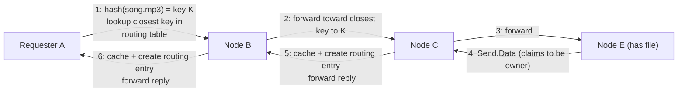
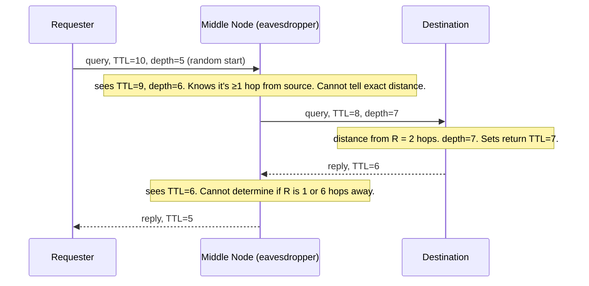
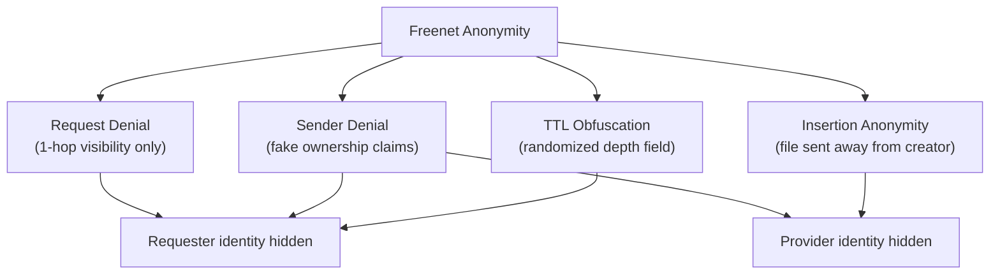

# Freenet: 3rd Generation Peer-to-Peer Networks

*Lecture notes — Smruti R. Sarangi, IIT Delhi*
*Source paper: Clarke et al., "Freenet: A Distributed Anonymous Information Storage and Retrieval System," Designing Privacy Enhancing Technologies, Springer, 2001*
*Course page: [COL 819 — Advanced Computer Networks, IIT Delhi (2021)](https://www.cse.iitd.ac.in/~srsarangi/courses/2021/col_819_2021/index.html)*

> **Academic purpose only.** Freenet is studied here purely as a computer science system. Understanding how anonymization networks work is necessary for anyone who wants to study, regulate, or investigate them. The discussion neither endorses nor promotes any misuse.

> **Structure:** Part I covers every concept and mechanism cleanly with intuition. No math, no proofs. Part II is a summary of the evaluation results. There is no heavy mathematics in this topic — the "proof" here is the protocol design itself and the anonymity argument.

---

## Table of Contents

- [1. Where Freenet Fits: The P2P Progression](#1-where-freenet-fits-the-p2p-progression)
- [2. Design Goals](#2-design-goals)
- [3. Freenet = Gnutella + Pastry + Anonymity](#3-freenet--gnutella--pastry--anonymity)
- [4. The Freenet Node](#4-the-freenet-node)
- [5. Querying: How You Find a File](#5-querying-how-you-find-a-file)
  - [5.1 Steps in a Query](#51-steps-in-a-query)
  - [5.2 Failure Handling During a Query](#52-failure-handling-during-a-query)
  - [5.3 Search Quality: How the Network Improves Over Time](#53-search-quality-how-the-network-improves-over-time)
- [6. Data Storage: How You Insert a File](#6-data-storage-how-you-insert-a-file)
  - [6.1 The Insert Procedure](#61-the-insert-procedure)
  - [6.2 Two Termination Strategies](#62-two-termination-strategies)
  - [6.3 Beating Security on Insert: Lying About Ownership](#63-beating-security-on-insert-lying-about-ownership)
  - [6.4 Advantages of This Storage Mechanism](#64-advantages-of-this-storage-mechanism)
- [7. Data Management: Finite Storage and LRU](#7-data-management-finite-storage-and-lru)
- [8. Encryption for Deniability](#8-encryption-for-deniability)
- [9. Message Format and Protocol Details](#9-message-format-and-protocol-details)
  - [9.1 Message Fields](#91-message-fields)
  - [9.2 The TTL Vulnerability and the Depth Field Fix](#92-the-ttl-vulnerability-and-the-depth-field-fix)
  - [9.3 Timers and Reliability](#93-timers-and-reliability)
  - [9.4 Message Types](#94-message-types)
- [10. Naming, Searching, and Security](#10-naming-searching-and-security)
  - [10.1 Organizing Files Without a Central Directory](#101-organizing-files-without-a-central-directory)
  - [10.2 Sender Anonymity](#102-sender-anonymity)
  - [10.3 Pre-routing and Layered Encryption](#103-pre-routing-and-layered-encryption)
- [11. Summary: The Four Pillars of Freenet Anonymity](#11-summary-the-four-pillars-of-freenet-anonymity)
- [12. Evaluation](#12-evaluation)
  - [12.1 Setup](#121-setup)
  - [12.2 Results: Successful Requests vs. Number of Queries](#122-results-successful-requests-vs-number-of-queries)
  - [12.3 Results: Hops vs. Number of Queries](#123-results-hops-vs-number-of-queries)

---

## 1. Where Freenet Fits: The P2P Progression

| Generation | System | Key Property | Main Weakness |
|---|---|---|---|
| 1st | Napster | Centralized index, P2P transfer | One legal and technical point of failure — the server |
| 2nd | Gnutella | Decentralized, broadcast search | No anonymity; IP addresses visible along the path |
| 3rd | DHTs (Pastry, Chord…) | Structured $O(\log N)$ routing | Nodes along the path know who is searching for what |
| 3rd+ | **Freenet** | DHT-like routing + anonymization | Still partial (not total) anonymity; no guaranteed delivery time |

Freenet's unique contribution is not speed or efficiency — it's **anonymity**. Both the requester and the original provider of a file are hidden from the rest of the network, to a degree not achieved by any of the earlier systems.

Freenet is a direct precursor to the modern **dark web** and influenced the design of networks like Tor.

---

## 2. Design Goals

Freenet was explicitly designed around four goals, in this priority order:

**Anonymity** — it must not be possible to determine the true origin of a file (who inserted it) or the identity of who is requesting it.

**Deniability of storers** — a node that is caching and forwarding data must be able to credibly deny that it knows what it is storing or who originally created the content. This is the legal protection layer.

**Efficient storage** — the system should organize data intelligently (similar keys cluster together) so lookups can succeed quickly.

**Reliability** — the system should deliver data consistently, even in a network where nodes join and leave unpredictably.

**A critical design consequence:** all storage in Freenet is explicitly **temporary**, not permanent. Data that is not frequently accessed eventually gets evicted (via LRU policy). This is partly a technical choice and partly a legal one — a node can claim it did not deliberately retain any specific content.

---

## 3. Freenet = Gnutella + Pastry + Anonymity

The cleanest way to understand Freenet is as a combination of two things you already know, plus a layer of deliberate obfuscation:

```
Freenet ≈ Gnutella (flooding-style neighbor queries)
        + Pastry (key-based routing toward numerically closer nodes)
        + Anonymity mechanisms (fake ownership, no origin tracing)
```

**From Gnutella:** queries are sent to neighbor nodes, which forward them onward. There's a TTL field to prevent infinite flooding. There's a pseudo-random query ID to prevent cycles.

**From Pastry:** each node maintains a routing table of key→address mappings. When forwarding a query, you don't just flood randomly — you forward to the neighbor whose known keys are *numerically closest* to the key you're looking for. This gives directional, informed routing rather than pure broadcast.

**What Freenet adds:** a deliberate system of fake ownership claims, origin hiding, and message obfuscation that makes it very difficult to identify who published or requested any particular file.

---

## 4. The Freenet Node

Each Freenet node maintains two local structures:

**Local data store** — actual cached copies of files (or file chunks) that this node holds. Storage is finite and managed via LRU eviction.

**Routing table** — a dynamic table with entries of the form:

| Key | Address | Content (?) |
|---|---|---|
| hash of some file | IP of a node that *might* have it | Optional cached content |

The `(?)` on content is important — the routing table records *where* data might be, but a node is not required to store the content itself. It may just know a pointer.

**Critical constraint: 1-hop visibility only.** A node knows only its *immediate* neighbors — it has no view of the wider network. This is a deliberate design choice for anonymity: you cannot reveal information about nodes you don't know. The routing table grows organically over time as queries traverse the network and new entries are created along successful paths.

There is also a **degree of trust** between a node and its direct neighbors — they know each other is *participating* in the protocol, but cannot verify whether the other is the original requester of any given query or just forwarding on someone else's behalf.

---

## 5. Querying: How You Find a File

### 5.1 Steps in a Query

Suppose you want to find a file named `song.mp3`.



Step by step:

1. The requesting node hashes the file name to get key $K$.
2. In its routing table, it finds the entry whose key is *numerically closest* to $K$ and forwards the request to that node's address.
3. Each intermediate node repeats: find the routing table entry with the key closest to $K$, forward there.
4. When a node that has the file is found, it returns the file contents **and claims to be the owner** — even if it is not the original creator, just a caching intermediary.
5. The reply travels back hop by hop along the same path.
6. Every node on the return path **caches a copy of the file** and **creates a new routing table entry** pointing to whoever supplied it (which may be a fake owner — see §6.3).

**Why do intermediate nodes cache?** This is the mechanism by which popular data gets widely replicated. Every successful query spreads the file to all intermediate nodes. Future queries for the same file have a shorter path to travel — and more fake owners to confuse trackers.

**Why does every node claim to be the owner?** This is the core anonymity mechanism. If every node that has ever touched a file claims ownership, a legal investigator facing dozens of "owners" in a large network cannot determine which one actually created it.

### 5.2 Failure Handling During a Query

A query can fail for two reasons: the path creates a **cycle** (the pseudo-random query ID detects this — a node refuses to forward a query it has already seen), or a node simply has no further routing table entries to try.

When a node cannot forward:
- It first tries the **second-closest key** in its routing table instead of the closest.
- It can keep trying progressively further keys.
- The TTL field decrements at every hop regardless, so the query eventually dies if nothing is found.

**Dynamic TTL reduction:** if the network is congested (too many messages), nodes can reduce the TTL faster than one-per-hop to shed load. Nodes can also use the TTL value to prioritize which queued request to process next — higher remaining TTL = more urgent.

### 5.3 Search Quality: How the Network Improves Over Time

Freenet starts cold — routing tables are sparse and searches fail often. Over time:

**Information disseminates.** Every successful query plants routing table entries and cached files along its path. The more queries the network processes, the richer every node's routing table becomes.

**Nodes aggregate files with similar keys.** Because routing always moves toward numerically closer keys, a node tends to accumulate cached copies of files whose keys are numerically near its own routing table entries. Over time, a node becomes a de-facto specialist for a neighborhood of the key space.

**Popular data replicates widely.** A heavily-requested file gets cached by every node that ever handled a query for it. This makes popular data easy to find and extremely hard to eradicate.

**Routing tables grow without revealing identities.** New entries get created whenever a query path passes through a node, but the node only learns the next hop — not the full path. The network map is discovered incrementally and anonymously.

---

## 6. Data Storage: How You Insert a File

### 6.1 The Insert Procedure

To insert a file into the Freenet network:

1. The user creates a key: `key = hash(filename)`.
2. The user sends an `insert` message to their own local node, containing: `(file, key, TTL)`.
3. The local node checks its routing table:
   - If `key` is already there → it returns the existing contents (collision — see below).
   - If not → it finds the closest key in its routing table and **forwards the insert message** in that direction.
4. This forwarding continues, hop by hop, toward the node whose routing table entry is closest to `key`.
5. The file eventually lands at a node that cannot find anyone closer — and that node stores it.

**The crucial anonymity property of insertion:** the original owner does **not** keep a copy. The file is sent away into the network, routed toward a node with numerically similar keys, and stored there. The inserter's connection to the content is immediately severed — the file is now geographically and topologically far from whoever created it.

### 6.2 Two Termination Strategies

There are two ways an insert can legitimately end:

**Strategy 1 — Closest key:** the insert propagates until it reaches a node where no neighbor has a closer key. That node stores the file. This is the more intelligent approach — the file lands as close as possible to its "correct" position in the key space, which makes future lookups efficient.

**Strategy 2 — TTL exhaustion:** the insert is forwarded $k$ hops in the direction of the closest key, and when the TTL reaches 0, whatever node currently holds it stores it. This is simpler but less precise about placement.

In both cases, on success:
- The terminal node (and possibly the inserter's own node) add the file and key to their stores.
- Every node on the path adds the key and a routing entry to its table.
- Every node caches a copy of the file.
- The original inserter is notified via back-propagation.

### 6.3 Beating Security on Insert: Lying About Ownership

When a node on the insertion path caches the file and creates a routing table entry, what address does it record as the "source"?

It has two options, both of which add anonymity:

- **Claim itself as the owner**: record its own IP address in the routing entry. Anyone querying this node in the future will be told "I am the owner."
- **Point to a neighbor**: record the address of whichever neighbor it forwarded to (or received from). This creates a further layer of indirection.

Both strategies create **fake owners**. In a large network, dozens or hundreds of nodes along the paths of all queries that have ever touched this file will all claim ownership. An investigator faces an impossible signal-to-noise problem: who among all these claimants actually created the file?

**The hash collision case:** if during insertion the target node already has a file with the same key (hash collision), it passes the data *back upstream* to the node that sent it, which then caches it locally. This also means the file gets stored, just at a different node.

### 6.4 Advantages of This Storage Mechanism

**Files land near nodes with similar keys.** This is not accidental — the routing always moves toward numerically closer keys, so the file naturally lands in a neighborhood of the key space where future lookups will also naturally arrive. Insertion and retrieval use the same routing logic, so they converge to the same location.

**Information about new files disseminates quickly.** Every node on the insert path gets a routing entry. From the moment of insertion, $O(\text{TTL})$ nodes already know where the file is.

**Deliberate hash collision attacks are difficult.** An attacker trying to spam the network with fake inserts to displace legitimate files would need to predict hash outputs — cryptographically hard. Legitimate collisions are handled gracefully by bouncing the file to the upstream node.

---

## 7. Data Management: Finite Storage and LRU

Both the routing table and the data store are **finite structures**. They cannot grow indefinitely. The management policy is **LRU (Least Recently Used)**:

- When a new file or routing entry must be stored and there's no space, the oldest, least-recently-accessed entry is evicted.
- This ensures old, unpopular data gradually disappears from the network.

**Legal implication of LRU:** a node can claim it did not deliberately retain any specific content — files it once held may have been silently evicted to make room for newer traffic. The node had no editorial control over what it stored. This is the **deniability of storers** design goal in action.

This also means Freenet provides **no guarantee of permanence**. Files that are not actively requested will eventually fall out of the network. Popular files self-replicate (via caching on query paths) and effectively become permanent. Rare files gradually disappear.

---

## 8. Encryption for Deniability

Deniability can be strengthened further using encryption. The mechanism:

- When inserting a file, the original owner **encrypts the file content using the file key** (or a derived key).
- The encrypted content circulates through the network — nodes store and forward it without being able to read it.
- Any node that knows the key can **decrypt** the content; nodes that don't know the key cannot.

**The deniability argument:** a node storing an encrypted file can honestly say it had no idea what content it held — it could not distinguish an illegal file from a legal one because everything was encrypted ciphertext. The "I didn't know what I was storing" defense has real legal weight in some jurisdictions.

**The catch:** the final consumer must know the decryption key, and that key cannot be distributed via Freenet itself (that would defeat the encryption). Key sharing must happen through some other out-of-band channel. This is a significant practical limitation of the encryption approach.

**Participation alone may be illegal:** in many jurisdictions, merely running a Freenet node that routes and caches content — even without knowing what that content is — may be sufficient for legal liability depending on local law. The encryption argument provides a defense but not a guarantee.

---

## 9. Message Format and Protocol Details

### 9.1 Message Fields

Freenet messages are self-contained packets, sent over either TCP (reliable) or UDP (unreliable). Every message — whether a query or an insert — contains three mandatory fields:

| Field | Size | Purpose |
|---|---|---|
| Transaction ID | 64 bits | Uniquely identifies this transaction; prevents cycles (a node won't forward a transaction ID it has already seen) |
| TTL counter | Variable | Decremented at every hop; kills the message when it reaches 0 |
| Depth field | Variable | Starts at a random value, **incremented** at every hop; used to defeat TTL-based tracing attacks |

### 9.2 The TTL Vulnerability and the Depth Field Fix

**The attack:** an eavesdropper (e.g., a law enforcement node) inside the network can observe the TTL value on a passing message. If TTL was initialized to 10 and the eavesdropper sees TTL=5, it deduces the requester is exactly 5 hops away — and can use triangulation to narrow down the source.

There are two defenses:

**Defense 1 — Random TTL propagation:** when the TTL field reaches 1 (about to die), instead of stopping, the node probabilistically continues forwarding the message to other nodes. This adds random noise to the apparent "distance" of the source.

**Defense 2 — The depth field (the main fix):**

The depth field starts at a **random positive value** (not zero) and is incremented at every hop. When the destination node (the one that has the file) is about to send the reply back, it sets:

$$\text{TTL}_{\text{return}} = \text{depth}_{\text{current}}$$

**Why this works:**

Say the true distance from requester to destination is $k$ hops. The depth field started at some random value $r > 0$ and was incremented $k$ times, so at the destination it equals $r + k$.

The return TTL is set to $r + k$, which is guaranteed to be $\geq k$ (the message won't die in transit) but is not *equal* to $k$ (an eavesdropper can't measure the exact distance). How much greater than $k$ it is depends on $r$, which is unknown to any eavesdropper.

**The three constraints satisfied:**
- TTL must be $\geq k$: otherwise the reply dies before reaching the requester.
- TTL must not be exactly $k$: otherwise an eavesdropper learns the exact distance.
- The excess above $k$ must be random: otherwise the eavesdropper could infer $k$ from the TTL anyway.

The depth field with a random initialization satisfies all three.



### 9.3 Timers and Reliability

For every request, the requester starts an **absolute timer**. If the timer expires with no reply:
- It infers failure.
- It may try again with a different routing path.

Downstream nodes that are still processing (congestion, slow search) can send a **`Reply.Restart`** message to the requester. On receiving this, the requester **extends its timer** — it knows the request is still in flight, just delayed. This prevents premature failure declarations in a slow but functioning network.

### 9.4 Message Types

| Message | When sent | Meaning |
|---|---|---|
| `Send.Data` | File found | Success; includes file content and (possibly fake) source ID |
| `Reply.NotFound` | TTL reached 0 with no result | No file found within the TTL radius |
| `Request.Continue` | No more paths, TTL > 0 | Stuck — requester should try other routing table entries |
| `Reply.Restart` | Downstream node congested | "Still working, extend your timer" |

---

## 10. Naming, Searching, and Security

### 10.1 Organizing Files Without a Central Directory

**The problem:** in a large anonymous network, how does a user find files without a central search engine?

A central directory or Google-like search engine is incompatible with anonymity — whoever maintains the index becomes a legal target, and the index itself reveals what content exists in the network.

**The solution — distributed metadata files:**

Indirect files containing metadata are scattered throughout the network. A directory is itself a file in Freenet, with a key. It contains a mapping from keywords to the keys of actual files.

For complex searches, multiple keyword-index files can exist independently. Searching for a file by multiple terms means:
1. Query the network for the keyword-A index file → get a set of keys.
2. Query for the keyword-B index file → get another set of keys.
3. Take the intersection → keys of files matching both terms.

This is a fully distributed search with no central coordinator.

**Content integrity:** to ensure a file has not been tampered with in transit, a **content hash** can accompany the file. Any node receiving the file can verify the hash; if it doesn't match, the file was corrupted or deliberately altered.

**Bookmark lists:** in jurisdictions where operating a Freenet directory is legally safe, node operators can publish bookmark lists — collections of keys to notable files, shared via the same Freenet mechanisms.

### 10.2 Sender Anonymity

Sender anonymity means a neighbor cannot tell whether the node it is talking to is the original requester or merely a forwarding relay.

**Why this holds:** since every node participates in forwarding queries on behalf of others, any given query arriving at node $B$ from node $A$ could have originated at $A$, or it could have originated at some unknown node further back in the chain that asked $A$ to forward it. There is no way for $B$ to distinguish these cases.

**The 1-hop visibility rule is the key:** a node only knows its immediate neighbors. It cannot see two hops back. This structural constraint — not any cryptographic trick — is what provides sender anonymity at the routing level.

**Message-level eavesdroppers:** a passive attacker who can read messages between specific pairs of nodes can potentially correlate timing and content to infer who is requesting what. Defense: encrypt all messages between node pairs. This prevents eavesdroppers from learning which key is being requested even if they can observe traffic volume.

### 10.3 Pre-routing and Layered Encryption

If a requester has a detailed enough routing table (knows the full path to the destination), it can use **pre-routing**: it decides the entire routing path in advance and encrypts the message in successive layers, one per hop.

```
Message for destination D, path: A → B → C → D

Encrypted as: Encrypt_A( Encrypt_B( Encrypt_C( Encrypt_D( payload ) ) ) )
```

At each hop, the node peels one layer of encryption (using its private key), revealing only the address of the next hop. No node can see further than one hop ahead, and no node can determine who the original sender is.

**Limitation:** this only works if the requester knows the full path, which requires a detailed routing table. In practice, routing tables are incomplete and pre-routing is used selectively.

---

## 11. Summary: The Four Pillars of Freenet Anonymity

Everything in Freenet's design reduces to four mechanisms working together:

**Pillar 1 — Request denial (1-hop visibility):** a node can never verify whether its neighbor is the original requester or just a relay. Every node plausibly deniable as "just forwarding."

**Pillar 2 — Sender denial (fake ownership):** every node that touches a file during a successful query claims to be the owner. Multiple fake owners across the network make it impossible to identify the true original creator.

**Pillar 3 — Insertion anonymity:** the original inserter does not keep the file. It is routed away to a remote node. The inserter's causal link to the content is severed as soon as the insert is complete.

**Pillar 4 — TTL obfuscation via the depth field:** the depth field with a random initial value prevents an eavesdropper from inferring the number of hops to the source from the TTL value.



No single pillar is sufficient alone. Together, they make Freenet substantially more anonymous than any previous P2P system — though not perfectly so. Timing attacks, traffic analysis, and infiltration by adversarial nodes can still yield partial information.

---

## 12. Evaluation

### 12.1 Setup

| Parameter | Value |
|---|---|
| Network size | 500 to 900 nodes |
| Items per node | 40 |
| Routing table size | 50 addresses max |
| Network topology | Linear chain (worst case — not a realistic best-case topology) |
| Query load tested | 50 to 1200 queries |

The chain topology is deliberately conservative — it forces messages to travel long paths and gives fewer routing shortcuts than a realistic random-graph topology. Results should be interpreted as lower bounds.

### 12.2 Results: Successful Requests vs. Number of Queries

**The key finding: success rate rises rapidly with query volume due to information dissemination.**

| Node count | Success at low query rate | Success at high query rate |
|---|---|---|
| 500 nodes | ~20% (at 50 queries) | ~100% (at 300 queries) |
| 600–900 nodes | ~10% (at start) | ~100% (at 400–500 queries) |

**Interpretation:** the "warm-up" period reflects the cold-start problem — a fresh network has sparse routing tables and low replication. As queries run, information spreads, routing tables fill in, and popular files get replicated widely. After warm-up, essentially all queries succeed.

**The trade-off with node count:** larger networks have lower initial success rates (more nodes = harder to find any one file before information disseminates) and a longer warm-up. But they reach the same ~100% ceiling eventually.

The important practical takeaway: **Freenet is not a fast-start system.** It is designed for steady-state operation in a mature network, not immediate responsiveness in a fresh one.

### 12.3 Results: Hops vs. Number of Queries

**The key finding: hop count drops quadratically as query volume increases.**

- At 20 queries: ~50 hops average.
- At 600+ queries: ~10 hops average.
- More nodes = more hops (larger network = more distance to cover).

**Why hops decrease with more queries:** as more queries run, routing tables fill in with entries closer to the keys being requested. The informed routing (forward toward the closest key) becomes more effective as the routing tables become richer. What was a 50-hop grope through an unfamiliar network becomes a 10-hop directed walk through a well-mapped one.

The quadratic decrease is faster than linear — each additional query improves routing quality not just for itself but for all future queries that travel similar paths. The benefit of each query compounds.

**The limitation of the chain topology:** in a real network with richer connectivity, both the initial hop counts and the warm-up time would be substantially lower. The chain is a stress test, not a representative deployment scenario.
