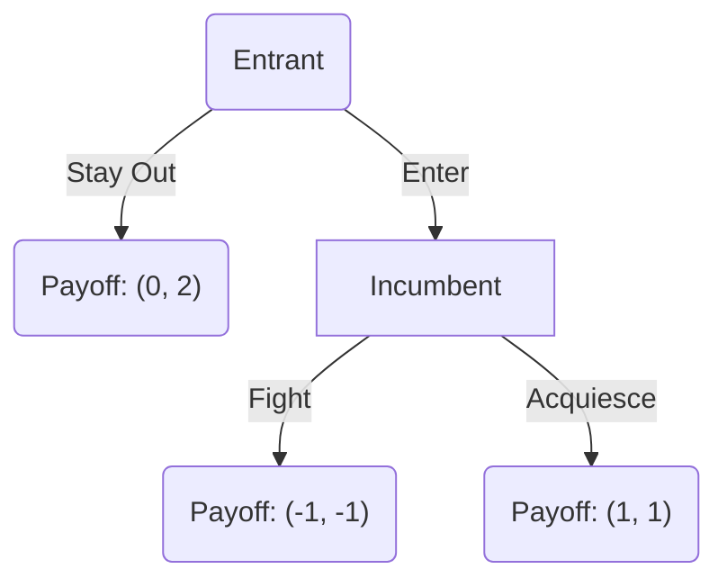

# Game Theory

Game theory is the study of **strategic interaction** where the outcome for each participant (player) depends not only on their own actions but also on the actions of others. While single-agent decision-making (optimization) deals with an agent maximizing utility against a static or random environment, game theory focuses on scenarios where agents interact with other rational, optimizing agents.

---

## 1. Core Components of a Game

Every game consists of three fundamental components, historically denoted as the **$\{N, S, U\}$ tuple**:

1.  **Players ($N$)**: The set of decision-makers. We assume there are $n$ players, indexed by $i \in \{1, 2, \ldots, n\}$.
2.  **Strategies ($S$)**: The set of actions or plans available to the players. Player $i$'s strategy set is denoted by $S_i$. A specific strategy profile is a combination of strategies chosen by all players:
    $$s = (s_1, s_2, \ldots, s_n) \in S$$
    where $S = S_1 \times S_2 \times \cdots \times S_n$.
3.  **Payoffs ($U$)**: The utility or reward received by each player given the chosen strategy profile. For player $i$, this is represented by a utility function:
    $$u_i: S \to \mathbb{R}$$

> **Notation Convention:** We use the subscript $-i$ to denote all players *other than* player $i$. Thus, a strategy profile $s$ can be written as $(s_i, s_{-i})$, separating player $i$'s action from everyone else's.

---

## 2. Normal Form Games (Strategic Form)

In a **Normal Form Game**, players make their decisions simultaneously and independently at the start of the game, without knowing the decisions of the other players.

### 2.1 The Payoff Matrix
For two-player finite games, the normal form is represented using a **payoff matrix** where rows represent Player 1's strategies, columns represent Player 2's strategies, and each cell contains the payoff pair $(u_1, u_2)$.

| Player 1 \ Player 2 | Left ($L$) | Right ($R$) |
| :--- | :---: | :---: |
| **Up ($U$)** | $(u_1(U,L), u_2(U,L))$ | $(u_1(U,R), u_2(U,R))$ |
| **Down ($D$)** | $(u_1(D,L), u_2(D,L))$ | $(u_1(D,R), u_2(D,R))$ |

---

### 2.2 Dominated Strategies

A strategy is **strictly dominated** if there exists another strategy that yields a strictly higher payoff for the player, regardless of what the other players do.

*   **Strict Dominance:** Strategy $s_i'$ strictly dominates $s_i$ for player $i$ if:
    $$\forall s_{-i} \in S_{-i}, \quad u_i(s_i', s_{-i}) > u_i(s_i, s_{-i})$$
*   **Weak Dominance:** Strategy $s_i'$ weakly dominates $s_i$ for player $i$ if:
    $$\forall s_{-i} \in S_{-i}, \quad u_i(s_i', s_{-i}) \ge u_i(s_i, s_{-i}) \quad \text{and} \quad \exists s_{-i} \in S_{-i} \ \text{s.t.} \ u_i(s_i', s_{-i}) > u_i(s_i, s_{-i})$$

> **Rationality Principle:** Rational players will never play strictly dominated strategies. Thus, we can simplify games by iteratively eliminating strictly dominated strategies (Iterated Elimination of Strictly Dominated Strategies, or IESDS).

---

### 2.3 Nash Equilibrium (Pure Strategies)

A **Nash Equilibrium** is a strategy profile $s^* = (s_1^*, \ldots, s_n^*)$ such that no player has a unilateral incentive to deviate. That is, each player's strategy is a **best response** to the other players' strategies.

$$\forall i \in N, \quad u_i(s_i^*, s_{-i}^*) \ge u_i(s_i, s_{-i}^*) \quad \forall s_i \in S_i$$

In simple terms: *Given what everyone else is doing, I am doing the best I can.*

---

## 3. Classical Normal Form Examples

### 3.1 The Prisoner's Dilemma
Two suspects are arrested and placed in separate cells. They can either **Cooperate** (remain silent) or **Defect** (confess and testify against the other).

| Prisoner 1 \ Prisoner 2 | Cooperate ($C$) | Defect ($D$) |
| :--- | :---: | :---: |
| **Cooperate ($C$)** | $(-1, -1)$ | $(-3, 0)$ |
| **Defect ($D$)** | $(0, -3)$ | $(-2, -2)$ |

*   **Dominant Strategy:** For both players, Defect ($D$) strictly dominates Cooperate ($C$).
*   **Unique Nash Equilibrium:** $(D, D)$ yielding payoffs of $(-2, -2)$.
*   **Pareto Inefficiency:** The equilibrium $(D, D)$ is Pareto-dominated by $(C, C)$, which yields $(-1, -1)$. This highlights the tension between individual rationality and collective welfare.

---

### 3.2 Battle of the Sexes (Coordination Game)
A couple wants to go out. Player 1 prefers Opera ($O$), and Player 2 prefers Football ($F$). However, they both prefer going to the same event together over going to different events alone.

| Player 1 \ Player 2 | Opera ($O$) | Football ($F$) |
| :--- | :---: | :---: |
| **Opera ($O$)** | $(2, 1)$ | $(0, 0)$ |
| **Football ($F$)** | $(0, 0)$ | $(1, 2)$ |

*   **Nash Equilibria:** Two pure-strategy Nash equilibria exist: $(O, O)$ and $(F, F)$. This is a coordination game where players must coordinate to avoid $(0,0)$.

---

### 3.3 Matching Pennies (Zero-Sum Game)
Two players simultaneously show a penny, either Heads ($H$) or Tails ($T$). Player 1 wins if the pennies match; Player 2 wins if they differ.

| Player 1 \ Player 2 | Heads ($H$) | Tails ($T$) |
| :--- | :---: | :---: |
| **Heads ($H$)** | $(1, -1)$ | $(-1, 1)$ |
| **Tails ($T$)** | $(-1, 1)$ | $(1, -1)$ |

*   **Pure Strategy Nash Equilibrium:** **None**. If Player 1 plays $H$, Player 2 wants to switch to $T$. If Player 2 plays $T$, Player 1 wants to switch to $T$, and so on.

---

## 4. Mixed Strategy Nash Equilibrium (MSNE)

When no pure-strategy equilibrium exists, or when we wish to find all equilibria, we allow players to randomize over their actions. A **mixed strategy** $p_i$ is a probability distribution over $S_i$.

Let Player 1 choose Up ($U$) with probability $p$ and Down ($D$) with probability $1-p$.
Let Player 2 choose Left ($L$) with probability $q$ and Right ($R$) with probability $1-q$.

### 4.1 Solving Matching Pennies for MSNE
Using the Matching Pennies matrix above:
*   Player 1's expected payoff from playing Heads ($H$) is:
    $$E[u_1(H, q)] = q(1) + (1-q)(-1) = 2q - 1$$
*   Player 1's expected payoff from playing Tails ($T$) is:
    $$E[u_1(T, q)] = q(-1) + (1-q)(1) = 1 - 2q$$

According to the **Indifference Principle**, a player will only randomize between strategies if the expected payoffs of those strategies are equal:
$$E[u_1(H, q)] = E[u_1(T, q)] \implies 2q - 1 = 1 - 2q \implies 4q = 2 \implies q^* = \frac{1}{2}$$

By symmetry, Player 2 is indifferent between $L$ and $R$ when Player 1 plays Heads with probability $p^* = \frac{1}{2}$.
Thus, the unique Nash Equilibrium of Matching Pennies is the mixed strategy profile:
$$(p^*, q^*) = \left(\frac{1}{2}, \frac{1}{2}\right)$$

> **Nash's Theorem:** Every finite game (finite number of players and finite strategy sets) has at least one Nash Equilibrium in pure or mixed strategies.

---

## 5. Extensive Form Games (Sequential Form)

In an **Extensive Form Game**, players move sequentially rather than simultaneously. These games are represented using a **game tree**.

### 5.1 Game Tree Structure
*   **Nodes** represent points of decision-making.
*   **Edges** represent actions.
*   **Terminals** show the final payoffs.

Consider a market entry game: An **Entrant** decides to enter the market or stay out. If they enter, the **Incumbent** decides to fight a price war or acquiesce.

---

### 5.2 Backward Induction & Subgame Perfection

While normal form games use Nash Equilibrium, extensive form games with perfect information use a refinement called **Subgame Perfect Nash Equilibrium (SPNE)**, solved using **backward induction**:

1.  Start at the final decision node (Incumbent).
2.  If the Entrant has entered, the Incumbent compares their payoffs:
    *   Fight: $-1$
    *   Acquiesce: $1$
    *   Since $1 > -1$, the rational Incumbent will choose **Acquiesce**.
3.  Move backward to the Entrant's node, substituting the Incumbent's optimal choice. The Entrant compares:
    *   Stay Out: $0$
    *   Enter (knowing Incumbent will acquiesce): $1$
    *   Since $1 > 0$, the Entrant chooses **Enter**.
4.  The unique SPNE is **(Enter, Acquiesce)** with payoff $(1, 1)$.

> **Threats Credibility:** Backward induction eliminates "non-credible threats." For example, the Incumbent threatening *"If you enter, I will fight a price war"* is not credible because once entry occurs, fighting hurts the Incumbent.

---

## 6. Connections to Other Domains

*   **Economics:** Used to model oligopoly competition (e.g., Cournot quantity-setting, Bertrand price-setting), bargaining, auction design, and contract theory.
*   **Computer Science & AI:** Algorithmic game theory deals with designing algorithms in strategic environments (e.g., ad auctions, congestion routing) and multi-agent reinforcement learning (where agents play Markov Games).
*   **Probability:** Game theory utilizes probability theory extensively to analyze mixed strategies, beliefs (Bayesian games), and stochastic processes in dynamic games.
