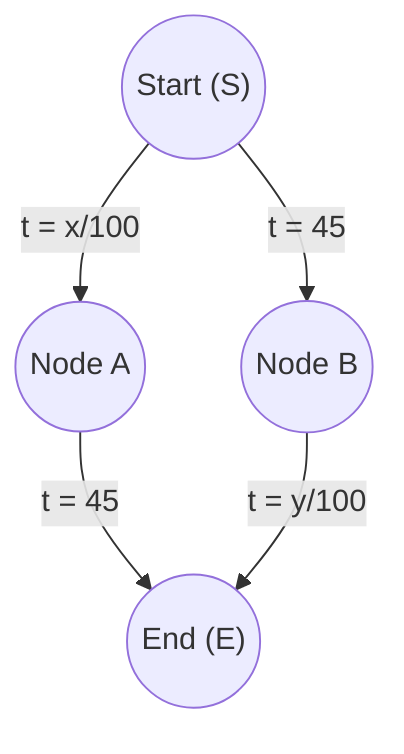
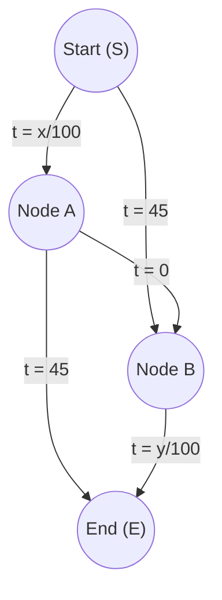

# Module 06: Auctions and Network Paradoxes (Lectures 19–22)

This module explores game-theoretic modeling applied to market auctions, network traffic paradoxes (Braess's Paradox), and spatial competition (Hotelling's Linear Market).

---

## 1. Auctions: Introduction and Formats (Lectures 19–20)

An **auction** is a market mechanism for allocating resources based on bids. There are four primary classic formats:

1.  **Ascending-Bid (English):** Price starts low and rises. Bidders drop out sequentially until only one remains. The winner pays the final price.
2.  **Descending-Bid (Dutch):** Price starts high and drops continuously. The first bidder to stop the clock wins and pays that price.
3.  **First-Price Sealed-Bid (FPSB):** Bidders submit private bids simultaneously. The highest bidder wins and pays their own bid.
4.  **Second-Price Sealed-Bid (SPSB / Vickrey):** Bidders submit private bids simultaneously. The highest bidder wins and pays the *second-highest* bid.

### Vickrey Auction Strategy
> **Theorem:** In a Second-Price Sealed-Bid auction with private values, bidding one's **true valuation** ($b_i = v_i$) is a weakly dominant strategy.

*   If you bid higher than your valuation ($b_i > v_i$), you only change the outcome if the second-highest bid was above your valuation, meaning you win but pay more than the item is worth to you (negative utility).
*   If you bid lower than your valuation ($b_i < v_i$), you reduce your probability of winning without changing the price you pay if you do win (since you pay the second-highest bid, not your own).

---

## 2. Braess's Paradox (Lecture 21)

**Braess's Paradox** is the counterintuitive finding that adding a road to a transportation network can actually **increase** total travel time for everyone.

### Mathematical Example
Suppose 4000 drivers want to travel from Start ($S$) to End ($E$). There are two paths: $S \to A \to E$ and $S \to B \to E$.

*   $x$ is the number of drivers on path $S \to A$.
*   $y$ is the number of drivers on path $B \to E$.
*   Travel times:
    *   $S \to A$: $\frac{x}{100}$ mins, $A \to E$: 45 mins.
    *   $S \to B$: 45 mins, $B \to E$: $\frac{y}{100}$ mins.

#### Scenario 1: No connecting road between A and B
By symmetry, drivers split equally: $x = 2000$ and $y = 2000$.
*   Travel time on $S \to A \to E$: $\frac{2000}{100} + 45 = 20 + 45 = 65$ minutes.
*   Travel time on $S \to B \to E$: $45 + \frac{2000}{100} = 45 + 20 = 65$ minutes.
*   This is a Nash equilibrium; no driver can switch and save time.

#### Scenario 2: A zero-time highway is added from A to B ($t = 0$)
Now a superfast bridge connects $A \to B$ with travel time $0$.

Let's evaluate a driver's incentives:
*   Even if everyone else takes $S \to B \to E$, a driver prefers $S \to A \to B \to E$ because the $S \to A$ leg takes $\le 40$ minutes and $A \to B \to E$ takes $\le 40$ minutes.
*   In fact, $S \to A \to B \to E$ is a dominant path. In the new Nash equilibrium, **all 4000 drivers** choose $S \to A \to B \to E$.
*   Total travel time for every driver becomes:
    $$t = \frac{4000}{100} + 0 + \frac{4000}{100} = 40 + 40 = 80 \text{ minutes}$$

> **Conclusion:** Adding the road increased the travel time from **65 minutes to 80 minutes** for everyone because the self-interested routing behavior of individuals (Nash equilibrium) does not align with the system optimum.

---

## 3. Hotelling's Linear Market (Lecture 22)

Hotelling's model explains spatial competition. Suppose consumers are uniformly distributed along a linear beach of length 1.
Two ice cream vendors, Firm 1 and Firm 2, choose where to position themselves along the beach ($x_1, x_2 \in [0, 1]$). Consumers walk to the nearest vendor.

*   If they position at different locations, say $x_1 = 0.25$ and $x_2 = 0.75$, they split the market.
*   However, Firm 1 has an incentive to move slightly closer to Firm 2 (e.g., $x_1 = 0.49$) to capture more of the left and center market.
*   Firm 2 responds by moving closer to the center as well.
*   **Unique Nash Equilibrium:** Both firms locate exactly at the center:
    $$x_1^* = x_2^* = 0.5$$
*   This is the **Principle of Minimum Differentiation**. It explains why competitors (gas stations, fast food chains, political candidates) position themselves so close to each other.
