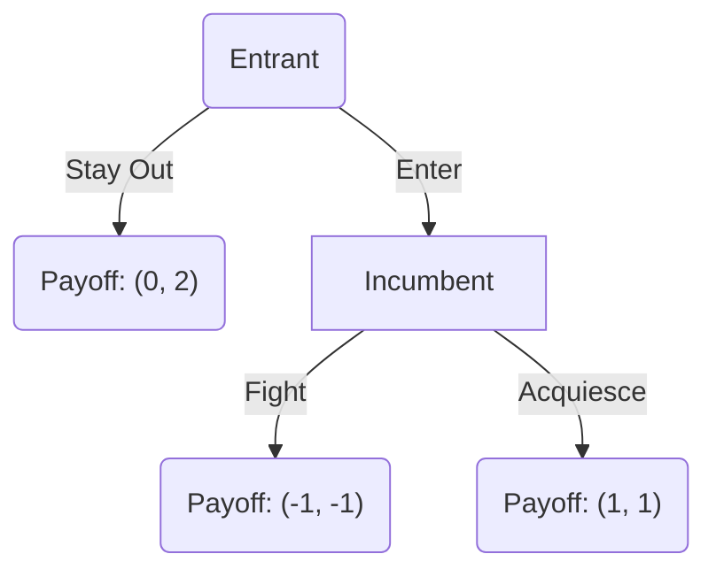
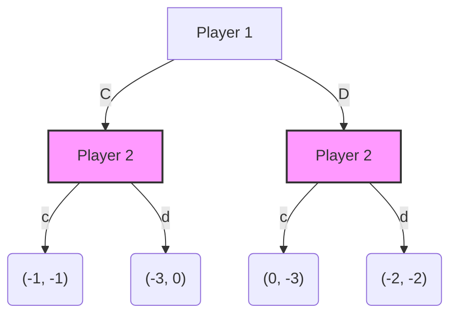

# Module 07: Extensive Form Games (Lectures 23–26)

This module introduces **Extensive Form Games**, which model strategic interactions that occur sequentially over time.

---

## 1. Game Trees (Lectures 23–24)

While normal form games are represented by matrices, extensive form games are represented by **game trees** (directed trees). A game tree consists of:

*   **Decision Nodes:** Points where a specific player must choose an action.
*   **Branches:** The actions available at a node.
*   **Terminal Nodes:** The end points of the game, labeled with the payoff vector.
*   **Initial Node (Root):** The start of the game.

### Example: Market Entry Game

---

## 2. Information Sets (Lecture 24)

An **Information Set** represents the state of a player's knowledge when making a move. It is a collection of decision nodes such that:

1.  The same player moves at every node in the set.
2.  The player cannot distinguish which node within the information set they are currently at (i.e. they do not know the history of previous moves).

*   **Perfect Information:** Every information set contains exactly one node. The player knows every previous move in the game.
*   **Imperfect Information:** At least one information set contains multiple nodes. The player is uncertain about some past moves.

### Representing Simultaneous Games in Extensive Form
We can represent a simultaneous game (like the Prisoner's Dilemma) sequentially by placing the second player's decision nodes in a single information set (connected by a dashed line).

---

## 3. Strategies in Extensive Form (Lecture 25)

A **strategy** for player $i$ in an extensive form game is a **complete plan of action**. It must specify exactly one action for *every* information set belonging to player $i$, even for information sets that might never be reached in equilibrium.

### Example
Suppose Player 1 moves first choosing $A$ or $B$.
Player 2 moves second. Player 2 has two information sets:
*   Info Set 1 (if Player 1 played $A$): options $\{L, R\}$
*   Info Set 2 (if Player 1 played $B$): options $\{U, D\}$

A strategy for Player 2 is not just a single choice, but a pair specifying what to do in both scenarios:
$$S_2 = \{ (L, U), (L, D), (R, U), (R, D) \}$$

---

## 4. Normal Form Representation of Extensive Games (Lecture 26)

Every extensive form game can be converted into an equivalent **normal form game** by listing all possible strategy profiles and computing the payoffs for each.

Consider the sequential Entry Game:
*   Entrant strategies: $\{\text{Enter}, \text{Stay Out}\}$
*   Incumbent strategies: $\{\text{Fight}, \text{Acquiesce}\}$

We construct the payoff matrix:

| Entrant \ Incumbent | Fight | Acquiesce |
| :--- | :---: | :---: |
| **Enter** | $(-1, -1)$ | $(1, 1)$ |
| **Stay Out** | $(0, 2)$ | $(0, 2)$ |

*   **Nash Equilibria:** Two pure Nash equilibria exist in this matrix: **(Enter, Acquiesce)** and **(Stay Out, Fight)**.
*   However, as we will see in the next module, one of these equilibria contains an uncredible threat.
