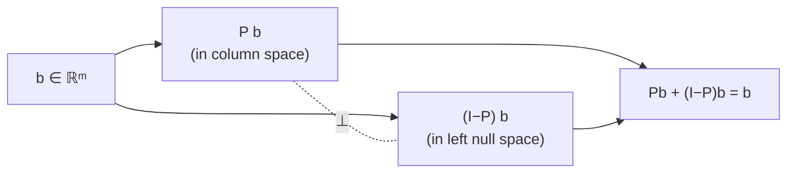

# 07 — Projection Matrices and Least Squares

**MIT Lecture:** 16 — Projection Matrices and Least Squares
**Maps to:** IIT Indore Week 1, Topic 5 — Projections and the linear least-squares problem (completes this topic)
**Builds on:** Note 06 (derives the projection matrix formula and sets up the line-fitting problem this note finishes)
**Sets up:** Week 2 — orthonormal bases and Gram-Schmidt (previewed at the end)

---

## Big picture first

Note 06 ended with a formula, $P = A(A^TA)^{-1}A^T$, derived symbolically. This lecture does three things with it: sanity-checks that the formula actually behaves like a projection should, finishes the numeric line-fitting example note 06 only set up, and proves the one fact every previous note has *used* but never *proved* — that $A^TA$ is invertible whenever $A$ has independent columns.

---

## 1. Sanity-checking the projection formula

A projection has to behave correctly at two extremes. Checking both confirms the formula isn't just algebra that happens to work — it's forced to match the geometry everywhere.

**Extreme 1 — $b$ is perpendicular to the column space.** Geometrically, the closest point in the column space to a vector sticking straight out of it should be $0$ — there's no "shadow" to speak of. A vector perpendicular to the entire column space is, by definition, in the left null space of $A$ (note 04), meaning $A^Tb=0$. Plug into the formula:

$$
Pb = A(A^TA)^{-1}\underbrace{A^Tb}_{=0} = 0
$$

It vanishes immediately, with no cancellation tricks needed — the formula respects this case automatically.

**Extreme 2 — $b$ is already in the column space.** Then $b$ has the form $Ax$ for some $x$ — every vector in the column space is, by definition, some combination of $A$'s columns. The projection of something already reachable should just be itself:

$$
Pb = A(A^TA)^{-1}A^T(Ax) = A(A^TA)^{-1}(A^TA)x = Ax = b
$$

The $(A^TA)^{-1}$ cancels cleanly against the $A^TA$ sitting next to it, leaving exactly $Ax=b$.

A general vector $b$ is some mix of both extremes — part of it in the column space, part perpendicular to it — and the formula handles that general case by linearity, since it handled both pure cases correctly.

### $P$ and $I-P$ are a matched pair

If $P$ projects onto the column space, then $I-P$ projects onto its orthogonal complement — the left null space. Every vector splits as $b = Pb + (I-P)b$, with the two pieces living in perpendicular subspaces.

$I-P$ inherits both projection properties from $P$:

- **Symmetric:** $(I-P)^T = I^T - P^T = I - P$.
- **Idempotent:** $(I-P)^2 = I - 2P + P^2 = I - 2P + P = I-P$ (using $P^2=P$ from note 06).

---

## 2. Finishing the line-fitting example

Note 06 set up — but didn't solve — fitting a line $y = C + Dt$ through three points: $(1,2)$, $(2,3)$, $(3,5)$. The unsolvable system was $Ax=b$ with

$$
A = \begin{pmatrix}1&1\\1&2\\1&3\end{pmatrix}, \quad x = \begin{pmatrix}C\\D\end{pmatrix}, \quad b=\begin{pmatrix}2\\3\\5\end{pmatrix}
$$

### What "best" means here

The error vector is $e = b - Ax$, with one entry per data point — the vertical gap between the actual point and wherever the line lands at that $t$. "Best line" means minimizing $\|e\|^2 = e_1^2+e_2^2+e_3^2$, the sum of squared vertical errors — hence **least squares**, and the same idea behind statistical *regression*. Squaring is convenient (it's what turns the problem into a clean linear system instead of something involving absolute values), but it's worth knowing the trade-off: squaring punishes large errors disproportionately, so a single wildly off data point (an outlier) can drag the "best" line further than its single vote should really earn. Least squares is the default tool, not the only one, for exactly this reason.

### Solving

The normal equations from note 06 are $A^TA\hat{x} = A^Tb$. Compute both sides:

$$
A^TA = \begin{pmatrix}3&6\\6&14\end{pmatrix}, \qquad A^Tb = \begin{pmatrix}10\\23\end{pmatrix}
$$

($A^TA$'s entries: 3 points, $\sum t = 1+2+3=6$, $\sum t^2 = 1+4+9=14$. $A^Tb$'s entries: $\sum b = 2+3+5=10$, $\sum tb = 1(2)+2(3)+3(5)=23$.)

Solve $3C+6D=10$ and $6C+14D=23$: doubling the first equation gives $6C+12D=20$; subtracting from the second leaves $2D=3$, so $D=\tfrac{3}{2}$. Back-substitute: $3C+9=10 \Rightarrow C=\tfrac{1}{3}$.

**Best line:** $y = \tfrac{1}{3} + \tfrac{3}{2}t$.

### The two pictures, both checked

**Picture 1 — points and the line.** Evaluate the fitted line at each $t$:

$$
p_1 = \tfrac13+\tfrac32 = \tfrac{11}{6}, \qquad p_2 = \tfrac13+3 = \tfrac{10}{3}, \qquad p_3 = \tfrac13+\tfrac92 = \tfrac{29}{6}
$$

Errors (actual minus fitted):

$$
e_1 = 2-\tfrac{11}{6}=\tfrac16, \qquad e_2 = 3-\tfrac{10}{3}=-\tfrac13, \qquad e_3 = 5-\tfrac{29}{6}=\tfrac16
$$

**Picture 2 — vectors in $\mathbb{R}^3$.** $p=(\tfrac{11}{6},\tfrac{10}{3},\tfrac{29}{6})$ is the projection of $b$ onto the column space; $e=(\tfrac16,-\tfrac13,\tfrac16)$ is the perpendicular leftover. Two checks confirm everything's consistent:

- $p+e = (\tfrac{11}{6}+\tfrac16,\; \tfrac{10}{3}-\tfrac13,\; \tfrac{29}{6}+\tfrac16) = (2,3,5) = b$ ✓
- $e$ is orthogonal to *both* columns of $A$ (not just to $p$): $e\cdot(1,1,1) = \tfrac16-\tfrac13+\tfrac16=0$, and $e\cdot(1,2,3) = \tfrac16-\tfrac23+\tfrac12=0$ ✓.

These are the same problem, described two ways — the "points and best-fit line" picture never mentions $C$ or $D$ explicitly, and the "vectors in $\mathbb{R}^3$" picture never draws a line at all, but they're describing the identical projection.

---

## 3. Why is $A^TA$ invertible? (The proof, finally)

Every note since 05 has used this fact: *if $A$ has independent columns, $A^TA$ is invertible.* Time to actually prove it.

**Goal:** show that $A^TAx=0$ forces $x=0$ — a square matrix with a trivial null space is invertible (note 04), so this is exactly what's needed.

**Proof.** Suppose $A^TAx=0$. Multiply both sides on the left by $x^T$:

$$
x^TA^TAx = 0
$$

Regroup the parentheses: $x^TA^T$ is $(Ax)^T$, so this reads

$$
(Ax)^T(Ax) = 0
$$

But $(Ax)^T(Ax) = \|Ax\|^2$ — the squared length of the vector $Ax$. A squared length is zero only when the vector itself is the zero vector (note 05, the same fact behind the dot-product test for orthogonality). So:

$$
\|Ax\|^2 = 0 \;\;\Longrightarrow\;\; Ax = 0
$$

This is the one place the hypothesis actually gets used: since $A$ has independent columns, the *only* solution to $Ax=0$ is $x=0$ (note 04's full-column-rank fact). So $x=0$ — exactly what needed proving.

**Why this matters beyond just "it's invertible":** the proof shows precisely *where* independence is doing the work — everything up to $Ax=0$ holds for *any* matrix $A$; independence is only needed for the very last step. This is also the proof behind the "key fact" used without derivation in note 05 — $\text{null space}(A^TA) = \text{null space}(A)$ — since the argument shows any $x$ solving $A^TAx=0$ must also solve $Ax=0$, and the reverse direction (anything in null space of $A$ trivially solves $A^TAx=0$ too) is immediate.

---

## 4. Preview: orthonormal vectors

One case makes everything in this note close to effortless: columns of $A$ that are mutually perpendicular *and* unit length — **orthonormal**. If $a_1, a_2, \dots$ are orthonormal, then $A^TA$ collapses straight to the identity matrix (every $a_i^Ta_i=1$, every $a_i^Ta_j=0$ for $i\ne j$), and the normal equation simplifies to:

$$
\hat{x} = A^Tb
$$

— no matrix inversion at all. Every formula built across notes 05–07 still applies; it just stops requiring any real computation. That's the entire motivation for the next lecture: given any independent basis (not necessarily orthonormal), how do you systematically convert it into one that is? That's Gram-Schmidt, and it's where Week 2 picks up.

---

## Where this shows up later

- **Week 2, Gram-Schmidt/QR:** directly motivated by Section 4 — converts any basis into the orthonormal one that makes every formula here trivial.
- **Week 2, symmetric & positive definite matrices:** $A^TA$ being symmetric (note 05) and, as flagged in the lecture, eventually shown to be positive definite, is the bridge into that topic.
- **Week 2, SVD:** handles exactly the case this note's proof excludes — when $A$'s columns *aren't* independent, so this proof's conclusion fails and a different tool (pseudoinverse) is needed (note 05, §6.2).

## Questions / things to revisit

- Reproduce the $A^TA$ invertibility proof from memory — it's short, but it chains together independence, length-squared-equals-zero, and the null-space definition of invertibility, so it's a good test of whether those pieces actually connect in your head.
- Re-derive why $I-P$ is a projection matrix without looking — it's two lines of algebra, but the geometric reason ("the leftover part") should come first, not the algebra.
- Practice moving between the "points and line" picture and the "vectors in $\mathbb{R}^3$" picture for the worked example — translating fluently between them is the real skill, not the arithmetic.

---

## Conclusion: what Week 1 has actually built

It's worth stepping back here, because this lecture closes Topic 5 — the last topic of Week 1 — and the five topics weren't five unrelated facts. Each one was *forced* by the one before it.

**The throughline:**

1. **Topic 1** started with the simplest possible idea — $Ax$ is just a combination of $A$'s columns — and that one reframing is what made everything afterward a *geometry* problem instead of a bookkeeping problem.
2. **Topics 2–3** (note 04) asked "how big are the spaces hiding inside a matrix?" and answered it completely: row space and null space split $\mathbb{R}^n$, column space and left null space split $\mathbb{R}^m$, every dimension accounted for by rank-nullity.
3. **Topic 4** (note 05) asked the question Topic 3 left open — these subspaces are correctly *sized*, but how are they *arranged*? — and proved they're not just side by side, they're at exact right angles. That single fact (row space ⊥ null space, column space ⊥ left null space) is what every later computation quietly leans on.
4. **Topic 5** (notes 06–07) took that one geometric fact and asked the practical question it makes answerable: when $Ax=b$ has no solution — the everyday case with noisy, overdetermined data — what's the *best* answer? The orthogonality from Topic 4 is exactly what pins down what "best" has to mean (closest point, perpendicular error) and exactly what makes the resulting system, $A^TA\hat{x}=A^Tb$, solvable in the first place.

**What you can now actually do, from first principles, not from a memorized formula:** given any matrix, find its rank and describe all four fundamental subspaces and their dimensions; test whether two vectors or subspaces are orthogonal and explain why "doesn't intersect" isn't enough; derive the normal equations two independent ways (left-null-space reasoning in note 05, perpendicular-projection reasoning in note 06) and watch them land on the same equation; and fit a least-squares line to real data by hand, while being able to explain — not just compute — why $A^TA$ is guaranteed invertible when the columns are independent.

**What's deliberately left undone, on purpose:** everything this week assumed you already *have* a basis for the column space — the columns of $A$, whatever they happen to be. Nothing here says those columns are a *good* basis to compute with. $A^TA$ is invertible whenever columns are independent, but if those columns are nearly parallel, $A^TA$ is still a nightmare to invert by hand or numerically stable on a computer. That gap — and the rank-deficient case flagged back in note 05's left/right-inverse table, where columns *aren't* independent at all — is exactly where Week 2 starts: Gram-Schmidt builds the orthonormal basis that makes every formula here collapse to its simplest form, eigenvalues and diagonalization describe what a matrix does to space more deeply than rank alone can, and SVD generalizes everything built this week to matrices that are rank-deficient from the start.

Compressed to one sentence: **Week 1 turned "this system has no solution" into a fully derived, fully justified, by-hand-computable best answer — using nothing but the sizes of four subspaces and one right angle.**
