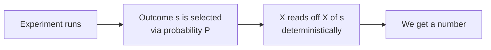
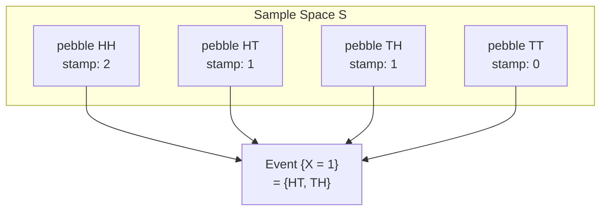
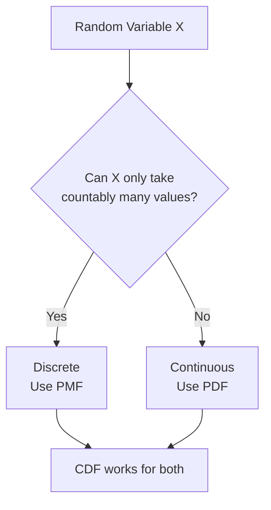
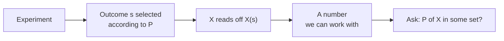

# Random Variables
*Introduction to Probability — Blitzstein & Hwang, Ch. 3*

---

## Why Random Variables?

Working directly with sample spaces becomes painful fast. Suppose you're tracking how much wealth gambler A has after $k$ rounds — you'd need to describe an entire sequence of wins and losses just to express a single quantity.

**Random variables give us a way out.** Instead of describing outcomes in words ("HH", "got $5 after 3 rounds"), we describe them as numbers. This unlocks all of algebra and calculus to work on probability problems. It's one of the most powerful notational moves in all of mathematics.

> **The big idea:** A random variable is a number that summarises an experiment. It compresses a complicated outcome into a single value we can compute with.

---

## Definition

**A random variable is a function from the sample space to the real line:**

$$X : S \rightarrow \mathbb{R}, \quad s \mapsto X(s)$$

This is the most important thing to absorb: **$X$ is a function, not a number, and not random by itself.**

- $X$ is **deterministic** — given outcome $s$, $X(s)$ is always the same fixed value.
- The **randomness** comes from which outcome $s$ gets selected — that's where the probability function $P$ lives.
- Once an outcome is selected, $X$ just reads off the number.

**Analogy:** Think of $X$ as a weighing scale. The scale is always honest — it gives the same reading for the same object. The randomness is in *which object you place on the scale*, not in the scale itself.

---

## The Pebble World Picture

Imagine the sample space as a collection of pebbles. $P$ assigns weights (probabilities) to each pebble. $X$ stamps a number on each pebble.

The event $\{X = 1\}$ is not an equation — it is the **set of all pebbles stamped with 1**. This is a legitimate event, so it has a probability:

$$P(X = 1) = P(\{HT, TH\}) = \frac{1}{2}$$

Any expression like $P(X = k)$, $P(X \leq x)$, $P(a < X \leq b)$ is just the probability of some set of pebbles.

---

## Two Random Variables on the Same Experiment

Consider two coin tosses. Sample space: $S = \{HH, HT, TH, TT\}$, each equally likely with probability $\frac{1}{4}$.

| Outcome | $X$ = # Heads | $Y$ = # Tails | $I$ = 1st flip |
|---------|--------------|--------------|----------------|
| $HH$    | 2            | 0            | 1              |
| $HT$    | 1            | 1            | 1              |
| $TH$    | 1            | 1            | 0              |
| $TT$    | 0            | 2            | 0              |

Notice $Y = 2 - X$. These are different random variables — different functions — even though one is just a transformation of the other.

$I$ is an **indicator random variable**: it equals 1 if some event occurs (first flip is Heads), and 0 otherwise. Indicators are surprisingly useful — they let you count things using expected values.

---

## Random Variable vs Distribution — A Critical Distinction

These two concepts are often confused, but they are not the same thing.

| Concept | What it is |
|---------|-----------|
| **Random variable** $X$ | A specific function on a specific sample space — tied to a particular trial or experiment |
| **Distribution** | The blueprint: what are $P(X = k)$ for all $k$? |

You can have many different random variables — $X_1, X_2, \ldots, X_n$ from $n$ separate coin tosses — that are **different functions** (each depending on a different trial) yet all **share the same distribution** (each is equally likely to be 0 or 1).

> $X_j$ is what *actually happened* on trial $j$. The distribution is the *law governing* what could happen. One is a specific instance; the other is the general rule.

---

## Discrete vs Continuous

Before reaching for any tool (PMF, CDF, expectation), always ask: **is this random variable discrete or continuous?**

| | **Discrete** | **Continuous** |
|---|---|---|
| Values | Countable list (often integers) | Any value in an interval |
| Primary tool | PMF | PDF |
| Universal tool | CDF | CDF |
| $P(X = x)$ | Can be positive | Always exactly 0 |
| Intuition | You can **count** the possibilities | You can **measure** the possibilities |
| Example | Number of bags a student carries | Height of a student |

A key subtlety: for a continuous r.v., $P(X = x) = 0$ for any single point $x$. This doesn't mean $X$ can't equal $x$ — it means the probability of landing on *exactly* one point in a continuum is infinitesimally small. Probability for continuous r.v.'s lives in **intervals**, not points.

Hybrid r.v.'s (partly discrete, partly continuous) also exist — understanding both types cleanly is enough to handle them.

---

## The Support

**The support of a discrete r.v. $X$ is the set of values it can actually take with positive probability:**

$$\text{Support} = \{x : P(X = x) > 0\}$$

Values outside the support have probability exactly 0. $X$ will never land there.

**Analogy:** The support is the set of chairs in a room. The r.v. always sits on one of the chairs. The probability of it sitting on the ceiling is 0 — the ceiling is not in the support.

A discrete r.v. is one whose support is a countable list $\{a_1, a_2, \ldots\}$ that captures all the probability: $P(X = a_j \text{ for some } j) = 1$.

---

## The Source of Randomness

One subtle but important point from the book: **the source of randomness is the experiment itself** — specifically, the selection of outcome $s \in S$.

Once we condition on knowing $s$ (i.e., the experiment is done and we see the result), the random variable $X(s)$ is just a fixed number. The uncertainty collapses.

This is why random variables are useful for **summarising experiments**: we don't need to track every detail of $s$. We just care about the numerical summary $X(s)$ provides — whether that's the number of Heads, the total wealth, or the duration of a game.

