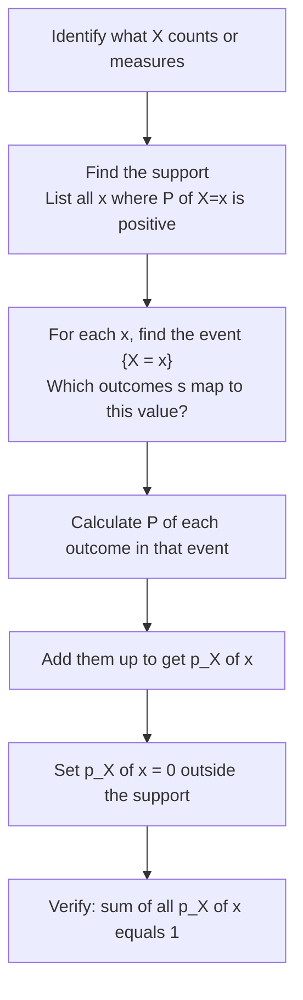
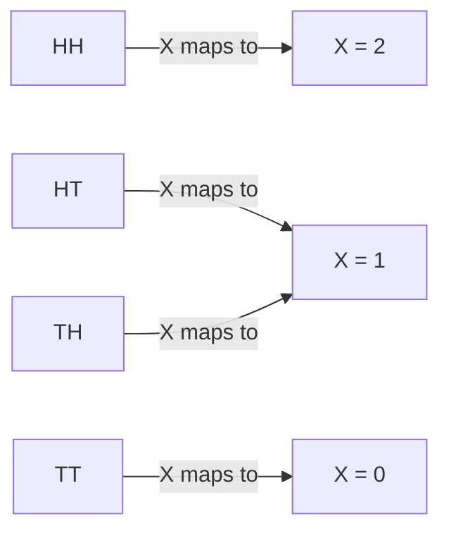

# Distributions and Probability Mass Functions
*Introduction to Probability — Blitzstein & Hwang, Ch. 3.2*

---

## What Is a Distribution?

The distribution of a random variable answers one question completely: **what are the probabilities of all possible values?**

Think of it as the full personality of a random variable — not just one number, but the entire pattern of how likely each outcome is. Once you know the distribution, you know everything there is to know about the randomness of $X$.

There are two equivalent ways to describe a distribution. For discrete r.v.'s, the PMF is almost always the most convenient.

---

## The Probability Mass Function (PMF)

$$p_X(x) = P(X = x)$$

*"The PMF evaluated at $x$ is the probability that $X$ equals $x$."*

That's it. The PMF is just a function that takes in a value and spits out its probability. It's the complete blueprint — given the PMF, you can answer any probability question about $X$.

**To find the probability that $X$ lands in some set $B$, just add up the PMF over that set:**

$$P(X \in B) = \sum_{x \in B} p_X(x)$$

*"The probability that $X$ is somewhere in $B$ equals the sum of $p_X(x)$ over all $x$ in $B$."*

This works because the outcomes in $\{X = x\}$ for different values of $x$ are disjoint — $X$ can't be two things at once — so their probabilities add cleanly.

---

## What $\{X = x\}$ Actually Is

This notation is easy to misread. $\{X = x\}$ is not an equation to solve — it is an **event**, meaning a set of outcomes from the sample space:

$$\{X = x\} = \{s \in S : X(s) = x\}$$

*"The set of all outcomes $s$ in the sample space such that $X$ maps $s$ to $x$."*

Many different outcomes can map to the same value of $x$ — and that's fine. The event $\{X = x\}$ just collects all of them together, and since it's a legitimate subset of $S$, it has a well-defined probability.

> **One thing that never makes sense:** $P(X)$. You can only take the probability of an *event* — a set of outcomes. $X$ is a function, not an event. Always make sure there's a condition inside the $P(\cdot)$.

---

## Two Conditions Every PMF Must Satisfy

$$p_X(x) \geq 0 \text{ for all } x, \qquad \sum_{\text{all } x} p_X(x) = 1$$

**Nonnegativity** — *"probabilities can't be negative."* Every entry in the PMF is at least 0. Values outside the support get exactly 0.

**Sums to 1** — *"$X$ has to land somewhere."* If you add up the probability of every possible value, you must get 1. Certainty that $X$ takes some value in its support.

These aren't arbitrary rules — they fall directly out of what probability means. If a proposed PMF violates either one, it's not a valid PMF.

> **Practical habit:** whenever you derive a PMF, always verify the sum equals 1 before moving on. It's the fastest way to catch a mistake.

---

## What "Find the Distribution" Means

When a problem says *find the distribution of $X$*, it's asking for a **complete description of the randomness of $X$**. There are two valid answers:

| Method | What you provide | When to use |
|--------|-----------------|-------------|
| **PMF** $p_X(k) = P(X = k)$ for all $k$ | A formula or table of probabilities | Discrete r.v.'s — almost always easier |
| **CDF** $F(x) = P(X \leq x)$ | A cumulative probability function | Any r.v., discrete or continuous |

Both carry exactly the same information. In discrete settings, go with the PMF unless told otherwise — it's more direct.

---

## How to Find a PMF — The Pipeline

Finding a PMF from scratch always follows the same steps. Don't skip them.

**Step 0** — Is $X$ discrete or continuous? If discrete, continue.

**Step 1** — Find the support. What values can $X$ actually take?

**Step 2** — For each value $x$, write out the event $\{X = x\} = \{s \in S : X(s) = x\}$. Which outcomes produce this value?

**Step 3** — Calculate $P(s)$ for each outcome $s$ in that event.

**Step 4** — Add them up: $p_X(x) = \sum_{s:\, X(s)=x} P(s)$. *"Sum the probabilities of all outcomes that map to $x$."*

**Step 5** — Set $p_X(x) = 0$ for all $x$ outside the support.

**Step 6** — Check: $\sum_x p_X(x) = 1$.

---

## Two Coin Tosses — PMF of Number of Heads

$X$ = number of Heads. Sample space $S = \{HH, HT, TH, TT\}$, each with probability $\frac{1}{4}$.

| Value $x$ | Event $\{X = x\}$ | Outcomes | $p_X(x)$ |
|-----------|-------------------|----------|----------|
| 0 | $\{X = 0\}$ | $\{TT\}$ | $\frac{1}{4}$ |
| 1 | $\{X = 1\}$ | $\{HT, TH\}$ | $\frac{1}{4} + \frac{1}{4} = \frac{1}{2}$ |
| 2 | $\{X = 2\}$ | $\{HH\}$ | $\frac{1}{4}$ |

Check: $\frac{1}{4} + \frac{1}{2} + \frac{1}{4} = 1$ ✓

Notice how two outcomes ($HT$ and $TH$) collapse into the same value $x = 1$ — their probabilities get pooled. This is the PMF doing its job: compressing outcome-level detail into value-level probabilities.

---

## Same Distribution, Different Random Variables

Here's something easy to mix up. Say you flip a coin $n$ times and let $X_j$ be the result of flip $j$. Each $X_j$ is a **different random variable** — it depends on a different trial. But every $X_j$ has the **same distribution** — each is 0 or 1 with equal probability.

The random variable is the specific instance. The distribution is the shared law they all follow.

> Think of it like dice. Die 1 and Die 2 are different physical objects (different r.v.'s), but they follow the same rule (same distribution). Rolling Die 1 and rolling Die 2 are different events — but both follow the same probability pattern.

This distinction matters a lot once we start talking about independence and joint distributions.
