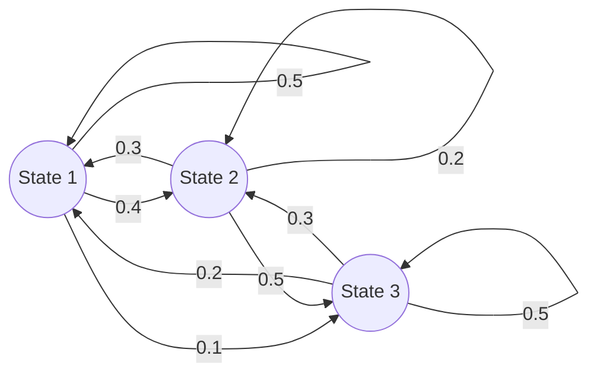
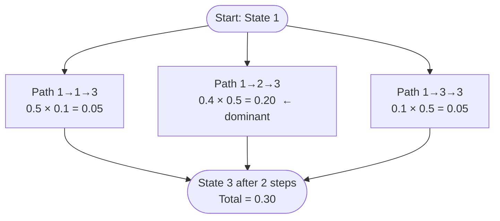
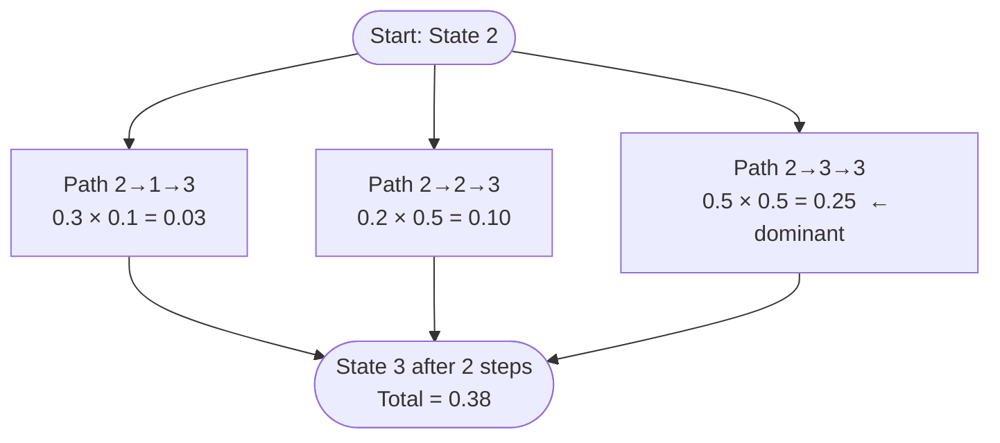

# Markov Chains — Foundations
> *Introduction to Probability* — Blitzstein & Hwang | Chapter 11

---

## Table of Contents

- [What Is a Markov Chain?](#what-is-a-markov-chain)
- [Why Markov Chains Matter — The Memory Problem](#why-markov-chains-matter--the-memory-problem)
- [State Space](#state-space)
  - [Why the State Space Must Be Defined](#why-the-state-space-must-be-defined)
  - [What Changes for Infinite State Spaces](#what-changes-for-infinite-state-spaces)
- [Time-Homogeneous Markov Chains](#time-homogeneous-markov-chains)
  - [Why This Assumption Exists](#why-this-assumption-exists)
  - [What Breaks Without It — Concrete Example](#what-breaks-without-it--concrete-example)
- [The Markov Property — Formal Definition](#the-markov-property--formal-definition)
  - [Reading Every Symbol in Plain English](#reading-every-symbol-in-plain-english)
  - [Why This Definition and Not Another](#why-this-definition-and-not-another)
  - [What Breaks Without the Markov Property](#what-breaks-without-the-markov-property)
  - [How to Recover the Markov Property When It Fails](#how-to-recover-the-markov-property-when-it-fails)
  - [The Dependency Chain — How Everything Flows from the Markov Property](#the-dependency-chain--how-everything-flows-from-the-markov-property)
- [The Transition Matrix Q](#the-transition-matrix-q)
  - [Why Every Row Must Sum to 1](#why-every-row-must-sum-to-1)
  - [What Breaks If Rows Do Not Sum to 1](#what-breaks-if-rows-do-not-sum-to-1)
  - [How to Read Q in Plain English](#how-to-read-q-in-plain-english)
  - [Notation Warning — Q Versus P](#notation-warning--q-versus-p)
- [The n-Step Transition Matrix Q^n](#the-n-step-transition-matrix-qn)
  - [Notation Warning — Superscripts](#notation-warning--superscripts)
  - [Theorem — Entries of Q^n Are n-Step Transition Probabilities](#theorem--entries-of-qn-are-n-step-transition-probabilities)
  - [What Breaks Without the Markov Property in This Proof](#what-breaks-without-the-markov-property-in-this-proof)
  - [What Breaks Without Time-Homogeneity in This Proof](#what-breaks-without-time-homogeneity-in-this-proof)
- [The Chapman-Kolmogorov Equation](#the-chapman-kolmogorov-equation)
  - [Statement and Both Forms](#statement-and-both-forms)
  - [Why It Is True — The AND and OR Rules](#why-it-is-true--the-and-and-or-rules)
  - [Full Proof with Every Step Justified](#full-proof-with-every-step-justified)
  - [Why Time-Homogeneity Appears in the Proof](#why-time-homogeneity-appears-in-the-proof)
  - [The Linear Algebra Connection](#the-linear-algebra-connection)
- [Worked Example — Computing Q² and All 2-Step Probabilities](#worked-example--computing-q-and-all-2-step-probabilities)
  - [Full Entry-by-Entry Calculation](#full-entry-by-entry-calculation)
  - [Path Analysis — Scenario A: Start from State 1, Reach State 3](#path-analysis--scenario-a-start-from-state-1-reach-state-3)
  - [Path Analysis — Scenario B: Start from State 2, Reach State 3](#path-analysis--scenario-b-start-from-state-2-reach-state-3)
- [Common Mistakes and Conceptual Traps](#common-mistakes-and-conceptual-traps)
- [Looking Ahead](#looking-ahead)

---

# What Is a Markov Chain?

A **Markov chain** is a sequence of random variables

$$X_0, X_1, X_2, X_3, \ldots$$

taking values in a state space $S$, whose future evolution depends only on the present state — never on the history of how the present state was reached. Successive random variables are generally **dependent**, but the defining feature is not the dependence itself. It is the precise structure of that dependence: only the current state matters for predicting the next.

This is the **Markov property**, stated informally as:

> **The future is conditionally independent of the past, given the present.**

Think of a Markov chain as a system with **absolute amnesia**. No matter what journey the chain took to reach its current state, only the current state determines what happens next. The path is erased the moment you arrive.

**A concrete analogy — the amnesiac chess player:**
Imagine a chess player who can see the current board position perfectly but cannot remember any previous moves. Their strategy depends only on the board as it currently stands — not on the sequence of moves that produced it. If this player's strategy is a deterministic function of the current board, their game evolves as a Markov chain. The history of moves is irrelevant; the present position is everything.

**Physical example — the Coupon Collector:**
You are collecting toys from a fast-food restaurant. Your state is the count of distinct toys you currently own. If you are in State 4 (owning 4 unique toys), your probability of getting a new toy on the next meal is exactly $\frac{6}{10}$, regardless of whether you reached State 4 in 4 meals (perfect luck) or 500 meals (terrible luck). The count right now is all that matters.

**The memory structure of a general process versus a Markov chain:**

A general dependent process remembers everything:

```
X_0 --> X_1 --> X_2 --> ... --> X_n --> X_{n+1}
 |       |       |               |
 |       |       |               |
 +-------+-------+---... --------+---> (X_{n+1} depends on ALL prior states)
```

A Markov chain severs every connection except the most recent:

```
X_0   X_1   X_2  ...  X_{n-1}    X_n ----> X_{n+1}
                                   |
                          (Only this arrow survives.
                           Everything before X_n is cut.)
```

The double cut represents the Markov property: conditioned on $X_n$, the variable $X_{n+1}$ is independent of $X_0, X_1, \ldots, X_{n-1}$.

> **Warning:** If a system requires you to look at its history to predict its next move, it is **not** a Markov chain. A weather model where tomorrow's rain probability depends on both today's and yesterday's weather is not Markov in the single-day state space. We will see below how to recover the Markov property by expanding the state space.

---

# Why Markov Chains Matter — The Memory Problem

Many real systems evolve through time: weather, search engines, communication networks, population models, queueing systems, reinforcement learning environments. A central challenge in modeling these systems is that historical information accumulates without bound.

After:
- 10 steps, there are 10 previous states to remember
- 100 steps, there are 100 previous states
- $n$ steps, there are $n$ previous states

**The computational explosion without the Markov property:**

Suppose you want to compute $P(X_{n+1} = j \mid X_0 = i_0, X_1 = i_1, \ldots, X_n = i_n)$ without the Markov property. This conditional probability is a function of the entire vector $(i_0, i_1, \ldots, i_n)$. If the state space has $M$ states, there are $M^{n+1}$ possible histories. To store a complete probability table for every possible history and every possible next state requires $M^{n+1} \times M$ entries — a table of size $M^{n+2}$, which grows exponentially with time.

**The compression the Markov property provides:**

With the Markov property, the probability of the next state depends only on $X_n = i_n$, not on the full history. The complete description of transition behavior fits in a single $M \times M$ matrix $Q$, regardless of how many steps have passed.

| Without Markov property | With Markov property |
|---|---|
| Store all $n$ past states | Store current state only |
| Memory grows: $O(n)$ states | Memory constant: $O(1)$ state |
| Prediction table: $M^{n+2}$ entries | Prediction table: $M^2$ entries (fixed) |
| No matrix power shortcut | $n$-step probabilities: compute $Q^n$ |

**A numerical illustration:**
For $M = 10$ states over $n = 1{,}000{,}000$ steps: a non-Markov model might require distinguishing among $10^{1{,}000{,}000}$ possible histories, a number incomprehensibly larger than the number of atoms in the observable universe. A Markov model tracks only 10 possible current states.

> **PageRank** — the algorithm that powered the original Google search engine — is literally a Markov chain. The internet is modeled as a Markov chain where states are web pages and transitions represent the probability of clicking a link. The stationary distribution of this chain gives the "importance" of each page. Without the Markov structure, this computation would be impossible.

---

# State Space

The **state space** $S$ is the set of all possible values the chain can take at any time step. Every $X_n$ must belong to $S$.

**Examples:**

- $S = \{1, 2, 3\}$: a chain with three numerical states
- $S = \{\text{Sunny}, \text{Cloudy}, \text{Rainy}\}$: a weather model
- $S = \{0, 1, 2, \ldots, 10\}$: the Coupon Collector with $C = 10$ toys
- $S = \{0, 1, 2, \ldots\}$: an M/M/1 queue where state = number of customers

## Why the State Space Must Be Defined

Without explicitly specifying $S$, the transition matrix $Q$ would have undefined dimensions. If you try to write $q_{ij} = P(X_{n+1} = j \mid X_n = i)$, you have no way to enumerate the valid indices $i$ and $j$. You could not construct the matrix because you would not know its size. If $|S| = M$, then $Q$ is an $M \times M$ matrix — the state space determines the size of everything downstream.

The state space is to a Markov chain what the alphabet is to a language: it defines the universe of symbols from which the process can draw. Without specifying that universe, no transition probability, no $Q^n$, no stationary distribution can be written down.

## What Changes for Infinite State Spaces

**Countably infinite chains** ($S = \{0, 1, 2, \ldots\}$ or $S = \mathbb{Z}$) exist and are widely used in queueing theory and random walks. However:

- The transition "matrix" becomes an infinite-dimensional operator, not a finite matrix
- Matrix multiplication requires convergence of infinite series rather than finite sums
- Some finite-state theorems fail: an irreducible finite chain always has all states recurrent, but an irreducible infinite chain can have all states transient (the simple random walk on $\mathbb{Z}^d$ for $d \geq 3$ is transient — it drifts away and never returns)

**Uncountable state spaces** (e.g., $S = \mathbb{R}$) require measure-theoretic machinery: transition kernels replace transition matrices, integrals replace sums. The matrix-power theory collapses entirely.

> **The finite state space is what makes $Q$ an actual matrix we can raise to powers.** This is the computational engine of everything in this chapter.

---

# Time-Homogeneous Markov Chains

Throughout these notes, the chain is assumed to be **time-homogeneous**. This means the transition probabilities do not depend on time:

$$q_{ij} = P(X_{n+1} = j \mid X_n = i) \quad \text{does not depend on } n$$

The rules of movement are frozen. Today, tomorrow, and next year, the probability of moving from state $i$ to state $j$ in one step is always the same $q_{ij}$.

## Why This Assumption Exists

Without time-homogeneity, each step would have its own transition matrix:

$$Q_0, Q_1, Q_2, \ldots, Q_{n-1}$$

The $n$-step probability of going from $i$ to $j$ would require the **product of $n$ distinct matrices**:

$$P(X_n = j \mid X_0 = i) = (Q_0 Q_1 Q_2 \cdots Q_{n-1})_{ij}$$

This product cannot be simplified. You must multiply all $n$ matrices sequentially, storing each one, with no shortcut. Compare this to the time-homogeneous case: you only store one matrix $Q$ and compute $Q^n$ by repeated squaring, which takes $O(\log n)$ matrix multiplications instead of $O(n)$.

**Concrete computational comparison:**
To compute the 1{,}000-step probability from $Q$:
- Time-homogeneous: compute $Q^{1000}$ by squaring $\approx 10$ times
- Time-inhomogeneous: multiply $Q_0 \cdot Q_1 \cdots Q_{999}$ — 999 sequential multiplications, no shortcut

The time-homogeneous assumption is not just a mathematical convenience — it is what makes the theory computationally viable.

## What Breaks Without It — Concrete Example

Let $Q_n = \begin{pmatrix} 0.9 & 0.1 \\ 0.1 & 0.9 \end{pmatrix}$ for even $n$ and $Q_n = \begin{pmatrix} 0.1 & 0.9 \\ 0.9 & 0.1 \end{pmatrix}$ for odd $n$.

The 2-step matrix starting at step 0 is:

$$Q_0 Q_1 = \begin{pmatrix} 0.9 & 0.1 \\ 0.1 & 0.9 \end{pmatrix}\begin{pmatrix} 0.1 & 0.9 \\ 0.9 & 0.1 \end{pmatrix} = \begin{pmatrix} 0.18 & 0.82 \\ 0.82 & 0.18 \end{pmatrix}$$

The 2-step matrix starting at step 1 is:

$$Q_1 Q_2 = \begin{pmatrix} 0.1 & 0.9 \\ 0.9 & 0.1 \end{pmatrix}\begin{pmatrix} 0.9 & 0.1 \\ 0.1 & 0.9 \end{pmatrix} = \begin{pmatrix} 0.18 & 0.82 \\ 0.82 & 0.18 \end{pmatrix}$$

In this particular case the two-step matrices happen to be the same — but this is a coincidence of the symmetric alternation, not a general rule. The key point is that no single "$Q^2$" exists that represents all 2-step transitions regardless of when you start. The notion of "$Q^n$ encodes $n$-step probabilities" depends entirely on having one fixed matrix $Q$.

---

# The Markov Property — Formal Definition

For all states $i_0, i_1, \ldots, i_{n-1}, i, j$ and all $n \geq 0$:

$$\boxed{P(X_{n+1} = j \mid X_n = i,\; X_{n-1} = i_{n-1},\; \ldots,\; X_0 = i_0) = P(X_{n+1} = j \mid X_n = i)}$$

## Reading Every Symbol in Plain English

| Symbol | Read as | Plain meaning |
|---|---|---|
| $P(\ldots)$ | "The probability that..." | We are computing a probability |
| $X_{n+1} = j$ | "$X$ sub $n$ plus one equals $j$" | The chain is in state $j$ one step from now |
| $\mid$ | "given that" | Everything to the right is treated as known fact |
| $X_n = i, X_{n-1} = i_{n-1}, \ldots, X_0 = i_0$ | "the entire history" | Every state the chain has visited, from start to right now |
| $X_n = i$ (right side only) | "only the current state" | The complete past is discarded; only the present survives |

**Full sentence reading:**

> "The probability of the chain being in state $j$ at the next step, given the entire history of states it has ever visited, equals the probability of being in state $j$ at the next step given only the current state."

**The equation says these are equal.** The left side has the maximum possible information — the entire past. The right side has the minimum necessary information — just the present. Their equality means the extra information on the left contributes nothing.

## Why This Definition and Not Another

Without the Markov property, predicting the future requires knowing and storing an ever-growing history. With it, the current state is a **sufficient statistic** for the future — it compresses all relevant past information into a single value.

This compression is precisely why we can build a transition matrix $Q$. If histories mattered, $Q$ would need a row for every possible history, not for every possible current state. The number of histories grows as $M^n$ after $n$ steps, making the matrix infinite-dimensional in the limit. With the Markov property, we need exactly $M$ rows — one per current state — forever.

## What Breaks Without the Markov Property

Consider a weather model where:

- If it rained **both** today and yesterday → tomorrow rains with probability 0.9
- If it rained **only** today → tomorrow rains with probability 0.5

Then knowing today's weather alone is insufficient. We need:

$$P(X_{n+1} \mid X_n, X_{n-1}) \neq P(X_{n+1} \mid X_n)$$

**Mathematically:**

- The transition matrix $Q$ is insufficient — it records only $q_{ij} = P(\text{next} = j \mid \text{current} = i)$, but the true probability also depends on the previous state
- Matrix powers $Q^n$ no longer encode multi-step probabilities because the factorization used in the proof fails:

$$P(X_{n+1} = j \mid X_n = k, X_0 = i) \neq P(X_{n+1} = j \mid X_n = k)$$

  The probability of the last jump depends on how the chain reached $k$, but $Q$ has no way to record this path-dependence

- Chapman-Kolmogorov collapses: the intermediate state $k$ is no longer a sufficient summary of everything before it

**Concrete counterexample:**

A 2-state chain where $P(X_{n+1} = 2 \mid X_n = 1, X_{n-1} = 1) = 0.1$ but $P(X_{n+1} = 2 \mid X_n = 1, X_{n-1} = 2) = 0.9$.

The one-step matrix $Q$ records a single value $q_{12}$, but the true transition probability from State 1 takes two different values depending on the previous state. Any computation using $Q^2$ would use the same $q_{12}$ in both paths through State 1, giving the wrong answer. The matrix power method breaks.

## How to Recover the Markov Property When It Fails

If the true dynamics require remembering the last $k$ states, **expand the state space** to include tuples of $k$ consecutive states.

**Example — the weather model above ($k = 2$):**

Instead of $S = \{\text{Sunny}, \text{Rainy}\}$ with $|S| = 2$, use:

$$S' = \{(\text{S,S}),\; (\text{S,R}),\; (\text{R,S}),\; (\text{R,R})\}$$

where the pair $(\text{yesterday}, \text{today})$ is the new state. Now:

$$P(\text{tomorrow} = \text{R} \mid \text{today} = (\text{R,R})) = 0.9$$
$$P(\text{tomorrow} = \text{R} \mid \text{today} = (\text{S,R})) = 0.5$$

The Markov property holds for the new expanded chain, but the transition matrix is now $4 \times 4$ instead of $2 \times 2$. The trade-off is a larger state space in exchange for recovering tractability.

## The Dependency Chain — How Everything Flows from the Markov Property

```
Markov Property
       |
       v (justifies one-step dependence only — past is irrelevant given present)
       |
Transition Matrix Q (one row per current state, not per history)
       |
       v (matrix multiplication = summing over intermediate states)
       |
Matrix Powers Q^n (encode all n-step transition probabilities)
       |
       v (partition at intermediate time m)
       |
Chapman-Kolmogorov (Q^{m+n} = Q^m · Q^n — algebraic = probabilistic)
       |
       v (let n → ∞)
       |
Long-Run Analysis (stationary distributions, convergence theorems)
```

**Every result downstream depends on the Markov property at the top.** Remove it, and the entire chain of reasoning collapses at the first step.

---

# The Transition Matrix Q

The **transition matrix** $Q = (q_{ij})$ collects all one-step transition probabilities into a single $M \times M$ array:

$$q_{ij} = P(X_{n+1} = j \mid X_n = i)$$

**Rows** correspond to the current state. **Columns** correspond to the next state. The $(i,j)$ entry is the probability of moving from state $i$ to state $j$ in one step.

**Example — 3-state system:**

$$Q = \begin{pmatrix} 0.5 & 0.4 & 0.1 \\ 0.3 & 0.2 & 0.5 \\ 0.2 & 0.3 & 0.5 \end{pmatrix}$$



Row 1 describes all possible moves from State 1. Row 2 from State 2. Row 3 from State 3. Each row is a complete conditional probability distribution — it covers all possible destinations from that state.

## Why Every Row Must Sum to 1

Fix any state $i$. After exactly one step, the chain must occupy *some* state. The events $\{X_{n+1} = 1\}, \{X_{n+1} = 2\}, \ldots, \{X_{n+1} = M\}$ are:

- **Mutually exclusive:** the chain cannot occupy two states simultaneously
- **Collectively exhaustive:** the chain must occupy some state — it cannot disappear

Because they form a partition of the sample space, their conditional probabilities must sum to 1:

$$\sum_{j=1}^{M} q_{ij} = \sum_{j=1}^{M} P(X_{n+1} = j \mid X_n = i) = 1$$

This is simply the axiom that a probability distribution sums to 1, applied to the conditional distribution $P(X_{n+1} = \cdot \mid X_n = i)$.

A matrix with non-negative entries whose rows each sum to 1 is called a **stochastic matrix** (or row-stochastic matrix). This property is preserved under matrix multiplication: if $Q$ is stochastic, then $Q^n$ is stochastic for all $n \geq 1$.

## What Breaks If Rows Do Not Sum to 1

**Case 1 — Row sums to 0.8:**

Twenty percent of probability mass has vanished. The chain has a 20% chance of entering an undefined "void." When we compute $Q^n$, this missing mass compounds: row sums become $(0.8)^n \to 0$ as $n \to \infty$. The entries of $Q^n$ no longer sum to 1, violating the probability axioms.

**Case 2 — Row sums to 1.3:**

We have assigned 130% probability to the next state. This is impossible under standard probability axioms — no event can have probability greater than 1. If we naively compute $Q^n$, entries in that row explode: $(1.3)^n \to \infty$. The matrix no longer represents any stochastic process.

**Case 3 — Different rows sum to different values:**

The semigroup property $Q^{m+n} = Q^m Q^n$ still holds algebraically, but the probabilistic interpretation is destroyed. Some states gain probability mass from nothing; others lose it. We can no longer read rows as probability distributions.

The stochastic condition is what makes $Q$ a **probability operator** rather than an arbitrary matrix.

## How to Read Q in Plain English

The $i$-th row of $Q$ is the conditional PMF of $X_1$ given $X_0 = i$. More generally, the $i$-th row of $Q^n$ is the conditional PMF of $X_n$ given $X_0 = i$.

**Example:** If the chain is in State 3, only Row 3 is relevant: $[0.2, 0.3, 0.5]$.

- 20% chance of moving to State 1
- 30% chance of moving to State 2
- 50% chance of remaining in State 3

Rows 1 and 2 describe alternate timelines where the chain started elsewhere — they are completely irrelevant for a prediction conditioned on being in State 3.

> You compute the entire matrix $Q^n$ to build the engine. You extract only the one row corresponding to your starting state to run a specific prediction.

## Notation Warning — Q Versus P

The symbol $Q$ is standard in this text for the transition matrix. Some other texts use $P$, but here $P$ is reserved for probability, so $Q$ avoids ambiguity. When you encounter $P_{ij}$ in another text, it means exactly $q_{ij}$ here — the probability of moving from state $i$ to state $j$ in one step. The letter differs; the definition is identical.

**Row-vector versus column-vector convention:** We write distributions as row vectors and multiply on the right: $p^{(n+1)} = p^{(n)} Q$. Some linear algebra texts use column vectors and multiply on the left: $p_{\text{col}}^{(n+1)} = Q^T p_{\text{col}}^{(n)}$. Both conventions give identical numerical results. Do not mix them in the same calculation.

---

# The n-Step Transition Matrix Q^n

The matrix $Q^n$ contains all $n$-step transition probabilities. Its $(i,j)$ entry is:

$$q_{ij}^{(n)} = P(X_n = j \mid X_0 = i)$$

The $i$-th row gives the complete conditional probability distribution after exactly $n$ steps, starting from state $i$.

Think of $Q^1$ as one step into the future, $Q^2$ as two steps, $Q^n$ as $n$ steps. But this interpretation is not just a definition — it requires proof. We cannot simply assert that matrix powers encode multi-step probabilities. The theorem below establishes this rigorously.

## Notation Warning — Superscripts

The notation $q_{ij}^{(n)}$ denotes the $(i,j)$ entry of the matrix $Q^n$ — the $n$-step transition probability from state $i$ to state $j$. The parentheses around $(n)$ are essential: they distinguish this from $(q_{ij})^n$, which would mean the scalar $q_{ij}$ raised to the $n$-th power.

These are completely different objects. For example, in our 3-state chain above, $q_{12} = 0.4$, so:

- $(q_{12})^2 = (0.4)^2 = 0.16$ — squaring the scalar
- $q_{12}^{(2)} = (Q^2)_{12}$ — computed by a dot product, equals 0.31 (calculated in the worked example below)

$0.16 \neq 0.31$. Never conflate these.

## Theorem — Entries of Q^n Are n-Step Transition Probabilities

**Statement:** For every $n \geq 1$ and all states $i, j$:

$$(Q^n)_{ij} = P(X_n = j \mid X_0 = i)$$

**Why this theorem matters:** It is the bridge between linear algebra (matrix powers) and probability (multi-step transition probabilities). Without it, $Q^n$ is just a matrix computation with no probabilistic content. With it, every tool of linear algebra — eigenvalues, diagonalization, spectral decomposition — becomes a tool for computing probabilities.

**Proof by induction on $n$:**

**Base case ($n = 1$):**

$(Q^1)_{ij} = Q_{ij} = q_{ij} = P(X_1 = j \mid X_0 = i)$.

This holds by definition of the transition matrix. Nothing needs to be proved; it is simply what $Q$ means.

**Inductive step:**

**Inductive hypothesis:** Assume $(Q^n)_{ij} = P(X_n = j \mid X_0 = i)$ holds for all states $i, j$.

**Goal:** Prove $(Q^{n+1})_{ij} = P(X_{n+1} = j \mid X_0 = i)$.

**Step 1 — Matrix multiplication definition:**

$$(Q^{n+1})_{ij} = (Q^n \cdot Q)_{ij} = \sum_{k=1}^{M} (Q^n)_{ik} \cdot Q_{kj}$$

This is simply the definition of matrix multiplication. Nothing probabilistic yet.

**Step 2 — Apply the Law of Total Probability, conditioning on $X_n$:**

At time $n$, the chain occupies exactly one state. The events $\{X_n = 1\}, \{X_n = 2\}, \ldots, \{X_n = M\}$ are mutually exclusive and collectively exhaustive (they partition the sample space). By the Law of Total Probability:

$$P(X_{n+1} = j \mid X_0 = i) = \sum_{k=1}^{M} P(X_{n+1} = j,\; X_n = k \mid X_0 = i)$$

*Why the Law of Total Probability applies here:* The events $\{X_n = k\}$ for $k = 1, \ldots, M$ form a partition of the sample space conditioned on $X_0 = i$. They are disjoint (the chain is in exactly one state at time $n$) and their union has probability 1 (the chain must be somewhere). Therefore $P(A \mid X_0 = i) = \sum_k P(A \cap \{X_n = k\} \mid X_0 = i)$ for any event $A$.

**Step 3 — Apply the multiplication rule for conditional probability:**

$$P(X_{n+1} = j,\; X_n = k \mid X_0 = i) = P(X_{n+1} = j \mid X_n = k,\; X_0 = i) \cdot P(X_n = k \mid X_0 = i)$$

*Why this is valid:* The chain rule for conditional probability states $P(A \cap B \mid C) = P(A \mid B \cap C) \cdot P(B \mid C)$ whenever $P(B \cap C) > 0$. Apply with $A = \{X_{n+1} = j\}$, $B = \{X_n = k\}$, $C = \{X_0 = i\}$.

**Step 4 — Apply the Markov property:**

$$P(X_{n+1} = j \mid X_n = k,\; X_0 = i) = P(X_{n+1} = j \mid X_n = k)$$

*Why the Markov property applies here:* The Markov property says that conditioned on the present state $X_n = k$, the future $X_{n+1}$ is independent of everything before $X_n$, including $X_0 = i$. Knowing the starting state $i$ adds no information beyond knowing the current state $k$.

*This is the crucial step.* Without the Markov property, the left side could depend on $i$ — meaning the probability of the last jump depends on where we started $n$ steps ago. The Markov property says: no, the current state $k$ is all that matters.

**Step 5 — Apply time-homogeneity:**

$$P(X_{n+1} = j \mid X_n = k) = q_{kj}$$

The one-step transition probability from $k$ to $j$ is the same regardless of which time step we are at. This is the time-homogeneity assumption.

**Step 6 — Apply the inductive hypothesis:**

$$P(X_n = k \mid X_0 = i) = (Q^n)_{ik}$$

This is exactly the inductive hypothesis.

**Step 7 — Assemble the pieces:**

$$P(X_{n+1} = j \mid X_0 = i) = \sum_{k=1}^{M} (Q^n)_{ik} \cdot q_{kj} = \sum_{k=1}^{M} (Q^n)_{ik} \cdot Q_{kj} = (Q^{n+1})_{ij}$$

The left side equals the right side. The induction is complete. $\blacksquare$

## What Breaks Without the Markov Property in This Proof

Step 4 is where the Markov property is invoked. Without it:

$$P(X_{n+1} = j \mid X_n = k, X_0 = i) \neq P(X_{n+1} = j \mid X_n = k)$$

The one-step probability from state $k$ would depend on $i$ — on where the chain started $n$ steps ago. This means $Q_{kj}$ is the wrong quantity to use: the actual transition probability from $k$ to $j$ is not a fixed number but varies based on the starting state. The sum $\sum_k (Q^n)_{ik} Q_{kj}$ would give the wrong answer because it uses a single $Q_{kj}$ where the truth requires a different value for each starting state $i$.

Matrix powers would not encode multi-step probabilities. The entire computational shortcut of raising $Q$ to a power would produce incorrect results.

## What Breaks Without Time-Homogeneity in This Proof

Step 5 is where time-homogeneity is used. Without it, the one-step transition probability at step $n$ would depend on $n$:

$$P(X_{n+1} = j \mid X_n = k) = (Q_n)_{kj}$$

The inductive formula would become:

$$(Q_0 Q_1 \cdots Q_n)_{ij} = \sum_k (Q_0 \cdots Q_{n-1})_{ik} \cdot (Q_n)_{kj}$$

which is correct — but it is a product of $n$ distinct matrices, not a power of one matrix. The elegant formula $(Q^n)_{ij}$ would not exist.

---

# The Chapman-Kolmogorov Equation

## Statement and Both Forms

For any nonnegative integers $m$ and $n$:

$$q_{ij}^{(m+n)} = \sum_{k=1}^{M} q_{ik}^{(m)} q_{kj}^{(n)}$$

**Read as:** "The probability of going from state $i$ to state $j$ in exactly $m+n$ steps equals the sum over all intermediate states $k$ of the probability of going from $i$ to $k$ in $m$ steps times the probability of going from $k$ to $j$ in $n$ steps."

In matrix form, this is:

$$Q^{m+n} = Q^m \cdot Q^n$$

This is an algebraic identity for matrices — the semigroup property of matrix multiplication. The remarkable fact is that this purely algebraic identity has a precise probabilistic interpretation: the $(i,j)$ entry of $Q^{m+n}$ is the probability of traveling from state $i$ to state $j$ in exactly $m+n$ steps.

**An analogy:** Think of planning a trip from New York to Los Angeles with exactly one layover. To find the total probability of reaching LA, you sum over all possible layover cities $k$ the product of (probability of reaching city $k$) $\times$ (probability of reaching LA from city $k$). No single path is guaranteed; you must account for all of them.

## Why It Is True — The AND and OR Rules

**Why we multiply — the AND rule:**

To travel from $i$ to $j$ in $m + n$ steps via a specific intermediate state $k$:

1. Reach $k$ from $i$ in $m$ steps — Probability: $q_{ik}^{(m)}$
2. **AND** reach $j$ from $k$ in $n$ steps — Probability: $q_{kj}^{(n)}$

These two events must happen in sequence. The Markov property ensures they are conditionally independent given $X_m = k$: once we know the chain is at $k$ after $m$ steps, the next $n$ steps depend only on $k$ and not on how the chain got to $k$. Two conditionally independent events multiply:

$$\text{Probability of path } i \to k \to j = q_{ik}^{(m)} \times q_{kj}^{(n)}$$

**Why we sum — the OR rule:**

The intermediate state $k$ could be any element of the state space. In an $M$-state system, there are $M$ parallel paths from $i$ to $j$ in $m+n$ steps, one for each choice of $k$:

- Via State 1: $i \xrightarrow{m \text{ steps}} 1 \xrightarrow{n \text{ steps}} j$
- **OR** Via State 2: $i \xrightarrow{m \text{ steps}} 2 \xrightarrow{n \text{ steps}} j$
- **OR** $\ldots$
- **OR** Via State $M$: $i \xrightarrow{m \text{ steps}} M \xrightarrow{n \text{ steps}} j$

These paths are mutually exclusive — at time $m$, the chain is in exactly one state, so it travels through exactly one intermediate. Mutually exclusive alternatives add:

$$q_{ij}^{(m+n)} = \sum_{k=1}^{M} q_{ik}^{(m)} \cdot q_{kj}^{(n)}$$

> **Core insight:** You are summing the probabilities of every possible parallel universe that successfully carries you from start to end. Multiply for each individual path (AND); add across all paths (OR).

## Full Proof with Every Step Justified

**Step 1 — Apply the Law of Total Probability, partitioning on $X_m$:**

At time $m$, the chain is in exactly one state. The events $\{X_m = 1\}, \ldots, \{X_m = M\}$ partition the sample space. By LOTP:

$$P(X_{m+n} = j \mid X_0 = i) = \sum_{k=1}^{M} P(X_{m+n} = j,\; X_m = k \mid X_0 = i)$$

*Why applicable:* The events $\{X_m = k\}$ are disjoint (the chain occupies one state) and exhaustive (it must be somewhere). The union has probability 1.

**Step 2 — Apply the multiplication rule for conditional probability:**

$$P(X_{m+n} = j,\; X_m = k \mid X_0 = i) = P(X_{m+n} = j \mid X_m = k,\; X_0 = i) \cdot P(X_m = k \mid X_0 = i)$$

*Why applicable:* $P(A \cap B \mid C) = P(A \mid B \cap C) \cdot P(B \mid C)$, a direct consequence of the definition of conditional probability. Apply with $A = \{X_{m+n} = j\}$, $B = \{X_m = k\}$, $C = \{X_0 = i\}$.

**Step 3 — Apply the Markov property:**

$$P(X_{m+n} = j \mid X_m = k,\; X_0 = i) = P(X_{m+n} = j \mid X_m = k)$$

*Why applicable:* The Markov property states that conditioned on the present state $X_m = k$, the future is independent of the past $X_0, \ldots, X_{m-1}$. Knowing the starting state $X_0 = i$ is part of the past — it can be dropped from the conditioning.

**Step 4 — Apply time-homogeneity:**

$$P(X_{m+n} = j \mid X_m = k) = q_{kj}^{(n)}$$

The probability of traveling from $k$ to $j$ in $n$ steps does not depend on when we start — it is $q_{kj}^{(n)}$ whether we start at time $m = 0$ or time $m = 100$.

$$P(X_m = k \mid X_0 = i) = q_{ik}^{(m)}$$

by definition of the $m$-step transition probability.

**Step 5 — Substitute and conclude:**

$$q_{ij}^{(m+n)} = P(X_{m+n} = j \mid X_0 = i) = \sum_{k=1}^{M} q_{ik}^{(m)} \cdot q_{kj}^{(n)} \qquad \blacksquare$$

## Why Time-Homogeneity Appears in the Proof

Step 4 requires that the $n$-step probability starting from $k$ at time $m$ is the same as starting from $k$ at time 0. This is exactly time-homogeneity. Without it, Step 4 would read:

$$P(X_{m+n} = j \mid X_m = k) = (Q_m^{(n)})_{kj}$$

— a different set of $n$-step probabilities for each starting time $m$. The clean formula $q_{kj}^{(n)}$ assumes there is only one set of $n$-step probabilities regardless of starting time.

## The Linear Algebra Connection

The summation $\sum_k q_{ik}^{(m)} \cdot q_{kj}^{(n)}$ is **literally the formula for a matrix product**:

- Take the $i$-th row of $Q^m$: $(q_{i1}^{(m)}, q_{i2}^{(m)}, \ldots, q_{iM}^{(m)})$
- Take the $j$-th column of $Q^n$: $(q_{1j}^{(n)}, q_{2j}^{(n)}, \ldots, q_{Mj}^{(n)})^\top$
- Their dot product is $\sum_k q_{ik}^{(m)} q_{kj}^{(n)} = (Q^m \cdot Q^n)_{ij} = (Q^{m+n})_{ij}$

This is why the algebraic identity $Q^m \cdot Q^n = Q^{m+n}$ has a probabilistic interpretation. The algebraic structure of matrix multiplication is **perfectly matched** to the probabilistic structure of conditional independence in Markov chains. The computation "row times column" is the same computation as "sum over intermediate states," and this is not a coincidence — the Markov property creates exactly this structure.

---

# Worked Example — Computing Q² and All 2-Step Probabilities

Let:

$$Q = \begin{pmatrix} 0.5 & 0.4 & 0.1 \\ 0.3 & 0.2 & 0.5 \\ 0.2 & 0.3 & 0.5 \end{pmatrix}$$

We compute $Q^2$ entry by entry. Each entry $(Q^2)_{ij}$ is the dot product of Row $i$ of $Q$ with Column $j$ of $Q$.

## Full Entry-by-Entry Calculation

**Entry $(1,1)$:** Row 1 $\cdot$ Column 1

$$(Q^2)_{11} = (0.5)(0.5) + (0.4)(0.3) + (0.1)(0.2) = 0.25 + 0.12 + 0.02 = 0.39$$

**Entry $(1,2)$:** Row 1 $\cdot$ Column 2

$$(Q^2)_{12} = (0.5)(0.4) + (0.4)(0.2) + (0.1)(0.3) = 0.20 + 0.08 + 0.03 = 0.31$$

**Entry $(1,3)$:** Row 1 $\cdot$ Column 3

$$(Q^2)_{13} = (0.5)(0.1) + (0.4)(0.5) + (0.1)(0.5) = 0.05 + 0.20 + 0.05 = 0.30$$

**Entry $(2,1)$:** Row 2 $\cdot$ Column 1

$$(Q^2)_{21} = (0.3)(0.5) + (0.2)(0.3) + (0.5)(0.2) = 0.15 + 0.06 + 0.10 = 0.31$$

**Entry $(2,2)$:** Row 2 $\cdot$ Column 2

$$(Q^2)_{22} = (0.3)(0.4) + (0.2)(0.2) + (0.5)(0.3) = 0.12 + 0.04 + 0.15 = 0.31$$

**Entry $(2,3)$:** Row 2 $\cdot$ Column 3

$$(Q^2)_{23} = (0.3)(0.1) + (0.2)(0.5) + (0.5)(0.5) = 0.03 + 0.10 + 0.25 = 0.38$$

**Entry $(3,1)$:** Row 3 $\cdot$ Column 1

$$(Q^2)_{31} = (0.2)(0.5) + (0.3)(0.3) + (0.5)(0.2) = 0.10 + 0.09 + 0.10 = 0.29$$

**Entry $(3,2)$:** Row 3 $\cdot$ Column 2

$$(Q^2)_{32} = (0.2)(0.4) + (0.3)(0.2) + (0.5)(0.3) = 0.08 + 0.06 + 0.15 = 0.29$$

**Entry $(3,3)$:** Row 3 $\cdot$ Column 3

$$(Q^2)_{33} = (0.2)(0.1) + (0.3)(0.5) + (0.5)(0.5) = 0.02 + 0.15 + 0.25 = 0.42$$

**Final result:**

$$Q^2 = \begin{pmatrix} 0.39 & 0.31 & 0.30 \\ 0.31 & 0.31 & 0.38 \\ 0.29 & 0.29 & 0.42 \end{pmatrix}$$

**Verification — stochastic property preserved:**

| Row | Sum |
|---|---|
| Row 1 | $0.39 + 0.31 + 0.30 = 1.00$ ✓ |
| Row 2 | $0.31 + 0.31 + 0.38 = 1.00$ ✓ |
| Row 3 | $0.29 + 0.29 + 0.42 = 1.00$ ✓ |

Each row of $Q^2$ sums to 1, confirming it is a valid stochastic matrix encoding a complete probability distribution for the 2-step future.

## Path Analysis — Scenario A: Start from State 1, Reach State 3

We want $P(X_2 = 3 \mid X_0 = 1) = (Q^2)_{13} = 0.30$.

By Chapman-Kolmogorov with $m = n = 1$, this probability is the sum over all intermediate states at time 1:

$$q_{13}^{(2)} = q_{11} \cdot q_{13} + q_{12} \cdot q_{23} + q_{13} \cdot q_{33}$$

$$= (0.5)(0.1) + (0.4)(0.5) + (0.1)(0.5)$$

$$= 0.05 + 0.20 + 0.05 = 0.30$$



**Path-by-path interpretation:**

| Path | Intermediate | Probability | Why |
|---|---|---|---|
| $1 \to 1 \to 3$ | State 1 | $0.5 \times 0.1 = 0.05$ | Self-loop likely; direct link to 3 weak |
| $1 \to 2 \to 3$ | State 2 | $0.4 \times 0.5 = 0.20$ | Both $q_{12}$ and $q_{23}$ are strong |
| $1 \to 3 \to 3$ | State 3 | $0.1 \times 0.5 = 0.05$ | Direct link to 3 is weak |

The path through State 2 dominates, contributing $0.20$ out of $0.30$ (two-thirds of the total). This is because both $q_{12} = 0.4$ (State 1 has a strong outgoing link to State 2) and $q_{23} = 0.5$ (State 2 has a strong link to State 3) are relatively large simultaneously.

## Path Analysis — Scenario B: Start from State 2, Reach State 3

We want $P(X_2 = 3 \mid X_0 = 2) = (Q^2)_{23} = 0.38$.

$$q_{23}^{(2)} = q_{21} \cdot q_{13} + q_{22} \cdot q_{23} + q_{23} \cdot q_{33}$$

$$= (0.3)(0.1) + (0.2)(0.5) + (0.5)(0.5)$$

$$= 0.03 + 0.10 + 0.25 = 0.38$$



**Path-by-path interpretation:**

| Path | Intermediate | Probability | Why |
|---|---|---|---|
| $2 \to 1 \to 3$ | State 1 | $0.3 \times 0.1 = 0.03$ | Weak on both legs |
| $2 \to 2 \to 3$ | State 2 | $0.2 \times 0.5 = 0.10$ | Self-loop low; then strong to 3 |
| $2 \to 3 \to 3$ | State 3 | $0.5 \times 0.5 = 0.25$ | Strong direct link; strong self-loop |

Starting from State 2 gives a higher 2-step probability (38%) than starting from State 1 (30%). The dominant path is $2 \to 3 \to 3$: State 2 has a strong direct link to State 3 ($q_{23} = 0.5$), and once there, State 3 has a strong self-loop ($q_{33} = 0.5$), giving $0.5 \times 0.5 = 0.25$ from this single path alone. Starting from State 1 requires more effort to reach State 3 in the first step ($q_{13} = 0.1$ only), so this dominant path is weaker.

---

# Common Mistakes and Conceptual Traps

## Mistake 1 — Markov Does Not Mean Independent

**False belief:** "Markov means the future is independent of everything."

**Truth:** Most Markov chains are highly dependent. The future usually depends strongly on the present. The Markov property only removes dependence on states *before* the present. It does not remove dependence on the present.

**Counterexample:** For $Q = \begin{pmatrix} 0 & 1 \\ 1 & 0 \end{pmatrix}$, knowing $X_n = 1$ tells you $X_{n+1} = 2$ with certainty. This is perfect deterministic dependence — maximum possible dependence on the current state — yet the chain is perfectly Markov. The past is irrelevant; the present determines everything.

**Precise statement:** $P(X_{n+1} \mid X_n, X_{n-1}, \ldots, X_0) = P(X_{n+1} \mid X_n)$. The future is conditionally independent of the past *given the present* — not unconditionally independent of everything. Never drop the "given the present" part.

---

## Mistake 2 — Rows and Columns Are Not Interchangeable

**False belief:** "Switching rows and columns gives an equivalent interpretation."

**Truth:** Rows represent the current state; columns represent the next state. Transposing $Q$ gives the backward transition probability $P(X_n = i \mid X_{n+1} = j)$ — completely different from the forward probability $q_{ij}$.

**Concrete error:** Looking at Column 1 instead of Row 1 of $Q$ gives $[0.5, 0.3, 0.2]^\top$ — the distribution of *previous* states given that you are now in State 1, not the distribution of *next* states given that you are currently in State 1. This is a backward-in-time quantity.

---

## Mistake 3 — Q^n Is Not nQ

**False belief:** "$Q^n$ means multiplying each entry by $n$."

**Truth:** $Q^n$ means the matrix $Q$ multiplied by itself $n$ times: $Q \cdot Q \cdot \ldots \cdot Q$.

**Counterexample:** For $Q = \begin{pmatrix} 0.5 & 0.5 \\ 0.5 & 0.5 \end{pmatrix}$, we have $Q^2 = Q$ (since every row of $Q$ is the same distribution, multiplying by $Q$ leaves it unchanged). But $2Q = \begin{pmatrix} 1 & 1 \\ 1 & 1 \end{pmatrix}$, which has rows summing to 2 — not even a valid stochastic matrix. These are entirely different objects.

---

## Mistake 4 — $q_{ij}^{(n)}$ Is Not $(q_{ij})^n$

This is so important it was flagged in the notation section, but it deserves explicit repetition as a common mistake.

$q_{ij}^{(n)} = (Q^n)_{ij}$ — the $(i,j)$ entry of the matrix $Q^n$, the $n$-step transition probability.

$(q_{ij})^n$ — the scalar $q_{ij}$ raised to the $n$-th power.

In our example: $q_{12} = 0.4$, but $q_{12}^{(2)} = 0.31 \neq (0.4)^2 = 0.16$.

The parentheses around the superscript $(n)$ in $q_{ij}^{(n)}$ exist precisely to prevent this confusion. When you see $q_{ij}^{(n)}$, always think "entry of matrix power," never "scalar power."

---

# Looking Ahead

We have built the foundation of Markov chain theory: the Markov property, the transition matrix $Q$, and the theorem that $Q^n$ encodes $n$-step probabilities via Chapman-Kolmogorov.

A natural question now arises: **what happens as $n \to \infty$?** Does the chain's distribution stabilize? Does it converge? Does the chain forget where it started?

For an irreducible, aperiodic, finite chain, the answer to all three is yes. The marginal distribution converges to a unique **stationary distribution** $s$ satisfying:

$$sQ = s, \quad s_i \geq 0, \quad \sum_i s_i = 1$$

No matter where the chain started, the long-run behavior is the same — the chain "forgets" its initial conditions completely. This equation $sQ = s$ is an **eigenvalue equation**: $s$ is a left eigenvector of $Q$ with eigenvalue 1. The entire machinery of linear algebra — eigenvalues, spectral decomposition, the Perron-Frobenius theorem — becomes available.

But convergence is not automatic. Two conditions are needed:

- **Irreducibility:** every state is accessible from every other state (no isolated islands)
- **Aperiodicity:** the chain does not oscillate on a rigid schedule (no forced alternation)

A periodic chain oscillates forever and never settles. A reducible chain converges to different limits depending on where it started. Understanding why these conditions are necessary — and exactly what breaks when each is removed — is the subject of the classification of states.

**Topics ahead:**

| Topic | Key question |
|---|---|
| Classification of states | Which states are recurrent (visited infinitely often) and which are transient (eventually escaped forever)? |
| Period | Is the chain locked to a rigid return schedule, or can it return at any time? |
| Stationary distribution | What is the long-run fraction of time spent in each state? |
| Convergence theorem | When and how fast does $Q^n$ converge to a limiting matrix? |
| Expected return times | For recurrent states, how long on average between visits? |
| Hitting times | How long until the chain first reaches a target state? |
