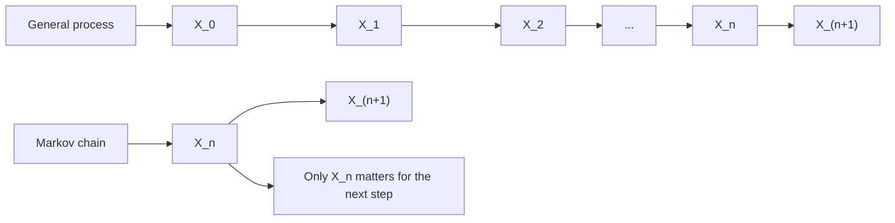
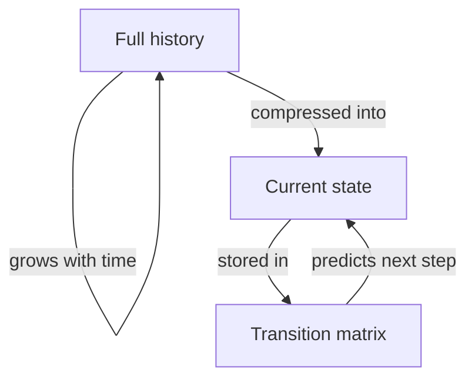
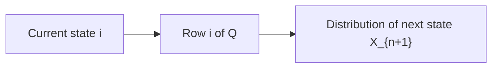
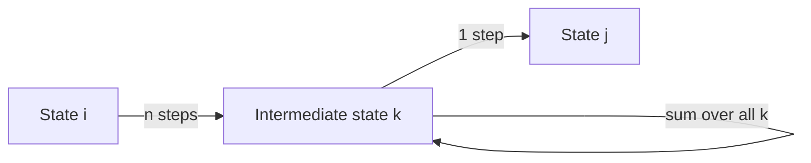
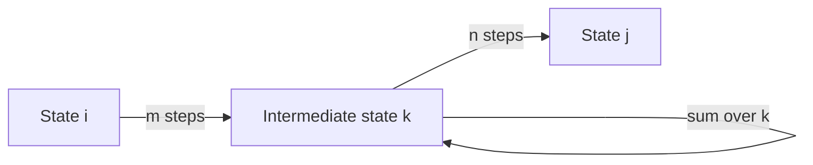

# Markov Property and Transition Matrix

## Table of Contents

- [What Is a Markov Chain](#what-is-a-markov-chain)
- [Why Markov Chains Matter](#why-markov-chains-matter)
- [State Space](#state-space)
- [Time-Homogeneous Markov Chains](#time-homogeneous-markov-chains)
- [The Markov Property](#the-markov-property)
- [The Transition Matrix Q](#the-transition-matrix-q)
- [How to Read Q in Plain English](#how-to-read-q-in-plain-english)
- [The n-Step Transition Matrix Qn](#the-n-step-transition-matrix-qn)
- [Chapman-Kolmogorov Equation](#chapman-kolmogorov-equation)
- [Why We Multiply the AND Rule](#why-we-multiply-the-and-rule)
- [Why We Sum the OR Rule](#why-we-sum-the-or-rule)
- [The Linear Algebra Connection](#the-linear-algebra-connection)
- [Worked Example Computing Q Squared and Two-Step Probabilities](#worked-example-computing-q-squared-and-two-step-probabilities)
- [Common Mistakes](#common-mistakes)
- [Looking Ahead](#looking-ahead)

---

## What Is a Markov Chain?

A Markov chain is a sequence of random variables

$$
X_0, X_1, X_2, X_3, \ldots
$$

### What exactly is $X_n$?

People often say "a chain of random variables $X_n$" without being explicit about what that random variable actually is. Here is the precise answer.

$X_n$ is a random variable mapping from the underlying sample space $\Omega$ to the state space $S$:

$$
X_n : \Omega \to S
$$

For each realization $\omega \in \Omega$ of the underlying random experiment, $X_n(\omega) = i \in S$ tells you which state the system occupies at time $n$. The "chain" is the stochastic process $(X_n)_{n \geq 0}$, a sequence of $S$-valued random variables on a common probability space $(\Omega, \mathcal{F}, P)$.

### The Defining Feature: Conditional Independence

The defining feature is that the next step depends only on the present state. But "depends only on" is informal shorthand. The rigorous statement is about **conditional independence**:

$$
(X_{n+1}, X_{n+2}, \ldots) \perp (X_0, X_1, \ldots, X_{n-1}) \mid X_n
$$

Once you condition on the current state $X_n$, the entire future sequence becomes statistically independent of the entire history. The present state **screens off** the past from the future.

This is stronger than just saying transition probabilities do not depend on history — it explicitly captures the probabilistic structure that makes Markov chains analytically tractable.

This does not mean there is no dependence. It means the dependence is organized so that once the current state is known, older history adds no extra predictive power for the next move. Think of the chain as having memory only of where it is right now. It does not remember how it got there.

**What this diagram shows.** The top row is a general stochastic process where each variable could depend on everything before it. The bottom row is the Markov simplification: the arrow from the past to the future passes through only the current state $X_n$. The node labeled "Only $X_n$ matters" captures the entire content of the Markov property.

### Why This Is Defined This Way

The definition is designed so that the state contains exactly the information needed to predict the next move. If the present state were not enough, then the next-step rule would have to depend on a longer history, and the process would no longer be captured by one-step transition probabilities alone. This is the compression principle behind Markov chains: a full path is reduced to a single current state.

### What Would Break Without This Property?

If the next-step probability depends on older states too, then the process is not Markov in the current state space. For example, if tomorrow's weather depends on today and yesterday, then today alone is not enough information. The state would have to be enlarged, perhaps to pairs like $(X_{n-1}, X_n)$. Without the Markov property, there is no clean one-step matrix that captures the dynamics.

### Phenomenon Metadata

| Element | Purpose |
|---|---|
| Structural Signature | The next move depends only on the current state |
| Core Invariant | The current state is sufficient for one-step prediction |
| Compression Handle | The past is folded into the present |
| Boundary / Failure Mode | If older history changes the next-step law, the state is too small |
| Phenomenon Web | See [The Transition Matrix Q](#the-transition-matrix-q), [The n-Step Transition Matrix Qn](#the-n-step-transition-matrix-qn), and [Chapman-Kolmogorov Equation](#chapman-kolmogorov-equation) |

---

## Why Markov Chains Matter

Many systems evolve over time: weather, routing, queues, populations, and reinforcement learning environments. The challenge is that history grows forever. If we had to condition on the entire past, then the number of possible histories would expand rapidly with time, making prediction and computation unwieldy.

The Markov property solves this by saying that the current state already contains everything relevant about the past. **Intuition:** instead of storing a whole trajectory, we store one state.

### Why This Matters for Computation

If the state space has $M$ states, then a history of length $n+1$ has $M^{n+1}$ possible sequences — enormous for large $n$. With the Markov property, we only need to track the $M$ current states. That is the difference between a growing history table and a fixed-size transition matrix.

**What this diagram shows.** The cycle on the left represents the explosion of possible histories. The Markov property breaks this cycle by compressing history into a single state, stored compactly in a transition matrix.

### Phenomenon Metadata

| Element | Purpose |
|---|---|
| Structural Signature | History grows but prediction still depends only on the present |
| Core Invariant | The current state is a sufficient statistic for the future |
| Compression Handle | One state replaces a whole trajectory |
| Boundary / Failure Mode | If memory of the past improves prediction, Markov fails |
| Phenomenon Web | Explains why matrices replace history tables |

---

## State Space

The state space is the set of all possible states of the chain, usually denoted $S$.

Examples:

$$
S = \{1, 2, 3\}, \quad S = \{\text{Sunny}, \text{Cloudy}, \text{Rainy}\}, \quad S = \{0, 1, 2, \ldots, 10\}
$$

Every random variable $X_n$ takes values in $S$.

### Why the State Space Must Be Specified

Without $S$, the matrix dimensions are undefined. The basic one-step transition probability is:

$$
q_{ij} = P(X_{n+1} = j \mid X_n = i)
$$

and $S$ supplies the row and column labels. A concrete example:

$$
Q = \begin{pmatrix} 0.5 & 0.3 & 0.2 \\ 0.1 & 0.6 & 0.3 \\ 0.0 & 0.2 & 0.8 \end{pmatrix}
$$

with $S = \{1, 2, 3\}$. Here $q_{12} = 0.3$ means if $X_n = 1$, then $P(X_{n+1} = 2) = 0.3$, and $q_{31} = 0.0$ means from state 3 you cannot reach state 1 in one step. Each row sums to 1.

### Finite vs. Infinite State Spaces

The distinction between finite and infinite state spaces matters substantially:

| State space | Object | Evolution equation | Key tools |
|---|---|---|---|
| Finite $\{1,\ldots,N\}$ | Matrix $Q$ | $Q^n$ | Linear algebra, eigenvalues |
| Countably infinite $\{0,1,2,\ldots\}$ | Infinite matrix | Careful matrix powers | Operator theory, generating functions |
| Uncountable $\mathbb{R}$ or $[0,1]$ | Kernel $K(x, dy)$ | Integral equations | Measure theory, functional analysis |

For a **countably infinite** state space, $Q$ is an infinite matrix. Matrix multiplication still makes sense as long as $\sum_j q_{ij} = 1$ for each $i$, but computing $Q^n$ requires care, and stationary distributions may not exist or be unique.

For an **uncountable** state space like $\mathbb{R}$, matrices break entirely. $P(X_{n+1} = y \mid X_n = x)$ is typically zero for any specific $y$ under a continuous distribution. Instead one uses a **transition kernel** $K(x, A) = P(X_{n+1} \in A \mid X_n = x)$, and the Chapman-Kolmogorov equation becomes an integral:

$$
K^{(m+n)}(x, A) = \int_S K^{(n)}(y, A)\, K^{(m)}(x, dy)
$$

The same Markov property holds conceptually at all levels, but the mathematical machinery changes completely. Introductory courses focus on the finite case.

### Phenomenon Metadata

| Element | Purpose |
|---|---|
| Structural Signature | A well-defined set of possible states |
| Core Invariant | Every $X_n$ must take values in the state space |
| Compression Handle | The alphabet of the chain |
| Boundary / Failure Mode | If the state space is unspecified, the matrix is undefined |
| Phenomenon Web | Supplies the row and column labels for $Q$ |

---

## Time-Homogeneous Markov Chains

A Markov chain is time-homogeneous if the one-step transition probabilities do not depend on time:

$$
q_{ij} = P(X_{n+1} = j \mid X_n = i) \quad \text{for every } n
$$

The same transition rule applies at every step.

### Natural Example: Weather

**Time-homogeneous:** Suppose each day's weather depends only on today's weather, with the same rules year-round. State space $S = \{\text{Sunny}, \text{Cloudy}, \text{Rainy}\}$, same matrix $Q$ every day:

$$
Q = \begin{pmatrix} 0.7 & 0.2 & 0.1 \\ 0.3 & 0.4 & 0.3 \\ 0.2 & 0.3 & 0.5 \end{pmatrix}
$$

If it is Sunny on Monday, $P(\text{Tuesday is Rainy}) = 0.1$. If it is Sunny on December 17th, $P(\text{December 18th is Rainy}) = 0.1$ also. The transition rule never changes.

**Time-inhomogeneous contrast:** Suppose rainy transitions are more likely in winter. Then you would need a time-dependent matrix $Q_n$:

$$
Q_{\text{summer}} = \begin{pmatrix} 0.8 & 0.15 & 0.05 \\ \cdots \end{pmatrix}, \quad Q_{\text{winter}} = \begin{pmatrix} 0.5 & 0.2 & 0.3 \\ \cdots \end{pmatrix}
$$

The chain is still Markov (future depends only on present), but it is not time-homogeneous. The $n$-step evolution becomes a product of different matrices $Q_0 Q_1 Q_2 \cdots Q_{n-1}$, destroying the neat matrix-power structure.

Time-homogeneity is the default assumption in most textbook theory because it lets you compute $Q^n$, find stationary distributions, and apply spectral methods.

### Phenomenon Metadata

| Element | Purpose |
|---|---|
| Structural Signature | The transition law is constant across time |
| Core Invariant | The same one-step matrix applies at each step |
| Compression Handle | Same physics at every time |
| Boundary / Failure Mode | If the rule changes with time, powers of one matrix fail |
| Phenomenon Web | Enables $Q^n$, Chapman-Kolmogorov, and stationary distributions |

---

## The Markov Property

For all states $i_0, i_1, \ldots, i_{n-1}, i, j$:

$$
P(X_{n+1} = j \mid X_n = i, X_{n-1} = i_{n-1}, \ldots, X_0 = i_0) = P(X_{n+1} = j \mid X_n = i)
$$

Equivalently, the future is **conditionally independent** of the past given the present:

$$
(X_{n+1}, X_{n+2}, \ldots) \perp (X_0, X_1, \ldots, X_{n-1}) \mid X_n
$$

### Intuition

Once the current state is known, the old path that led there becomes irrelevant for the next move. The current state is the whole summary of the past that matters.

Note also the state in the Markov property:

$$
P(X_{n+1} = i \mid X_n = j, X_{n-1}, \ldots, X_0) = P(X_{n+1} = i \mid X_n = j)
$$

Here $X_n$ is a random variable that transitions to state $i$. The transition probability depends only on the realized value of $X_n$, with all prior history screened off.

### What Would Break Without It?

If the next-step probability still depended on earlier states, then the factorization used in multi-step proofs would not collapse to a single matrix product. The chain would need a larger state space or a more complicated model.

### Phenomenon Metadata

| Element | Purpose |
|---|---|
| Structural Signature | Conditioning on the full past equals conditioning on the present alone |
| Core Invariant | Older history adds no predictive power once the present is fixed |
| Compression Handle | History collapses to the current state |
| Boundary / Failure Mode | If the past changes the next-step law, the process is not Markov |
| Phenomenon Web | The engine behind $Q^n$ and Chapman-Kolmogorov |

---

## The Transition Matrix Q

The transition matrix is

$$
Q = (q_{ij}), \quad q_{ij} = P(X_{n+1} = j \mid X_n = i)
$$

Rows correspond to the current state. Columns correspond to the next state.

### What Each Row Means — Precisely

Row $i$ of $Q$ is the **probability distribution of the random variable $X_{n+1}$** conditioned on $\{X_n = i\}$.

More precisely, a probability distribution on $S$ is a function $p: S \to [0,1]$ such that $\sum_{j \in S} p(j) = 1$. The $i$-th row of $Q$ is exactly such a function:

$$
p_i(j) = P(X_{n+1} = j \mid X_n = i) = q_{ij}
$$

It is non-negative, sums to 1, and lives on $S$. The matrix is a stack of these conditional distributions, one per current state. In plain English: **the row tells you the probability of the next state variable $X_{n+1}$ taking each possible value $k \in S$, given you are currently in state $i$.**

A concrete illustration (frog on 3 lily pads):

$$
Q = \begin{pmatrix} 0.4 & 0.5 & 0.1 \\ 0.2 & 0.6 & 0.2 \\ 0.0 & 0.3 & 0.7 \end{pmatrix}
$$

Row 1 ($i=1$): the frog stays on pad 1 with probability 0.4, jumps to pad 2 with probability 0.5, jumps to pad 3 with probability 0.1. Sum: $0.4 + 0.5 + 0.1 = 1.0$. The frog must go somewhere.

Column 1 collects the probabilities $0.4, 0.2, 0.0$ of *arriving at* state 1 from each starting state. Columns have no probabilistic constraint and do not sum to 1 in general.

### Why Rows Sum to 1

Fix current state $i$. The events $\{X_{n+1} = 1\}, \{X_{n+1} = 2\}, \ldots, \{X_{n+1} = M\}$ partition the sample space conditioned on $X_n = i$. They are mutually exclusive and exhaustive, so:

$$
\sum_{j=1}^{M} q_{ij} = 1
$$

If rows did not sum to 1, probability mass would disappear or exceed 1, and the matrix would not represent a valid stochastic law.

### Phenomenon Metadata

| Element | Purpose |
|---|---|
| Structural Signature | Nonnegative matrix with row sums equal to 1 |
| Core Invariant | Each row is the conditional distribution of $X_{n+1}$ given the current state |
| Compression Handle | Row = current, column = next |
| Boundary / Failure Mode | If rows do not sum to 1, the matrix is not stochastic |
| Phenomenon Web | Supplies the one-step probabilities used in $Q^n$ |

---

## How to Read Q in Plain English

To read $Q$: fix the current state, look across that row. The row tells you the probabilities of the possible next states.

**Notation warning:** some books write the transition matrix as $P$ instead of $Q$. Here $Q$ is used to avoid confusion with probability itself.

### Two Equivalent Conventions for Evolving Distributions

There are two ways to represent and evolve the distribution of the chain. Both are equivalent if used consistently.

**The two objects in play:**
1. The transition matrix $Q$ — fixed, the rulebook of the chain, the same at every step.
2. The distribution $p^{(n)}$ — changes with time, tells you the probability of being in each state at step $n$.

#### Row-Vector Convention (preferred)

Write $p^{(n)}$ as a row vector where the $i$-th entry is $P(X_n = i)$. Then:

$$
p^{(n+1)} = p^{(n)} Q
$$

**Why this works in plain English:** you don't know for sure which state you are in right now. Instead, you have a probability distribution — say 30% chance of state 1, 50% state 2, 20% state 3. To find the probability of being in state 2 next step, you consider every way you could end up there:

- You were in state 1 (30% chance) and transitioned to state 2: contributes $0.30 \times q_{12}$
- You were in state 2 (50% chance) and stayed in state 2: contributes $0.50 \times q_{22}$
- You were in state 3 (20% chance) and transitioned to state 2: contributes $0.20 \times q_{32}$

Total: $P(X_{n+1} = 2) = \sum_i P(X_n = i) \cdot q_{i2}$. That is the law of total probability, and the matrix multiplication $p^{(n)}Q$ does this for every destination state $j$ all at once. The output is another row vector $p^{(n+1)}$ — the distribution of $X_{n+1}$.

**Formal check:**

$$
(p^{(n)} Q)_j = \sum_{i=1}^{M} p_i^{(n)} \cdot q_{ij} = \sum_{i=1}^{M} P(X_n = i) \cdot P(X_{n+1} = j \mid X_n = i) = P(X_{n+1} = j)
$$

So $p^{(n+1)} = p^{(n)} Q$ gives exactly $P(X_{n+1} = j)$ in the $j$-th entry. The output is a valid distribution: its entries sum to 1, because $p^{(n)}$ sums to 1 and each row of $Q$ sums to 1.

This convention is preferred because rows of $Q$ are distributions "from state $i$" — multiplying $p^{(n)}$ (a weighted mix of states) on the right by $Q$ means weight each row of $Q$ by $p_i^{(n)}$ and sum. Intuitive and direct.

#### Column-Vector Convention

Write $p_\text{col}^{(n)}$ as a column vector and multiply on the left by $Q^\top$:

$$
p_\text{col}^{(n+1)} = Q^\top p_\text{col}^{(n)}
$$

**Why the transpose is necessary.** Without it:

$$
(Q\, p_\text{col}^{(n)})_j = \sum_i q_{ji} \cdot P(X_n = i)
$$

This uses $q_{ji}$ — the probability of going *from $j$ to $i$* — which is backwards. We need $q_{ij}$ (from $i$ to $j$). The transpose fixes this because $(Q^\top)_{ji} = q_{ij}$, so:

$$
(Q^\top p_\text{col}^{(n)})_j = \sum_i q_{ij} \cdot P(X_n = i) = P(X_{n+1} = j)
$$

Concretely with $S = \{1,2\}$ and $Q = \begin{pmatrix} 0.7 & 0.3 \\ 0.4 & 0.6 \end{pmatrix}$, $p^{(n)} = [0.2, 0.8]$:

| Convention | Formula | First entry | Result | Correct? |
|---|---|---|---|---|
| Row vector | $p^{(n)} Q$ | $0.2 \cdot q_{11} + 0.8 \cdot q_{21} = 0.2(0.7)+0.8(0.4)$ | 0.46 | Yes |
| Column (no transpose) | $Q\, p_\text{col}^{(n)}$ | $q_{11}(0.2)+q_{12}(0.8) = 0.7(0.2)+0.3(0.8)$ | 0.38 | No — backwards |
| Column (with transpose) | $Q^\top p_\text{col}^{(n)}$ | $q_{11}(0.2)+q_{21}(0.8) = 0.7(0.2)+0.4(0.8)$ | 0.46 | Yes |

**What this diagram shows.** Reading $Q$ is a two-step inference: identify your current state $i$, read row $i$ to get the complete probability distribution over where $X_{n+1}$ goes next.

---

## The n-Step Transition Matrix $Q^n$

The matrix $Q^n$ contains the probabilities of moving in exactly $n$ steps. Its $(i,j)$ entry is:

$$
q_{ij}^{(n)} = P(X_n = j \mid X_0 = i)
$$

**Notation warning:** the parentheses in $q_{ij}^{(n)}$ indicate the $(i,j)$ entry of $Q^n$, not the scalar $(q_{ij})^n$.

### Theorem: Entries of $Q^n$ Are $n$-Step Transition Probabilities

**Statement.** For every $n \geq 1$ and all states $i, j$:

$$
(Q^n)_{ij} = P(X_n = j \mid X_0 = i)
$$

### Full Proof (by induction)

#### Base Case: $n = 1$

$$
(Q^1)_{ij} = Q_{ij} = P(X_1 = j \mid X_0 = i) \checkmark
$$

#### Inductive Hypothesis

Assume for some $n \geq 1$: $(Q^n)_{ik} = P(X_n = k \mid X_0 = i)$ for every pair $i, k$.

**Dummy-index warning:** $i$ and $j$ are fixed throughout; $k$ is the summation index.

We must show $(Q^{n+1})_{ij} = P(X_{n+1} = j \mid X_0 = i)$.

#### Step 1: Expand the Matrix Product

$$
(Q^{n+1})_{ij} = (Q^n Q)_{ij} = \sum_{k=1}^{M} (Q^n)_{ik}\, Q_{kj}
$$

Every $(n+1)$-step path from $i$ to $j$ must pass through some intermediate state $k$ at time $n$.

#### Step 2: Law of Total Probability

$$
P(X_{n+1} = j \mid X_0 = i) = \sum_{k=1}^{M} P(X_{n+1} = j,\, X_n = k \mid X_0 = i)
$$

#### Step 3: Multiplication Rule

$$
P(X_{n+1} = j,\, X_n = k \mid X_0 = i) = P(X_{n+1} = j \mid X_n = k, X_0 = i)\, P(X_n = k \mid X_0 = i)
$$

#### Step 4: Markov Property + Time-Homogeneity

$$
P(X_{n+1} = j \mid X_n = k, X_0 = i) = P(X_{n+1} = j \mid X_n = k) = Q_{kj}
$$

#### Step 5: Inductive Hypothesis

$$
P(X_n = k \mid X_0 = i) = (Q^n)_{ik}
$$

Substituting:

$$
P(X_{n+1} = j \mid X_0 = i) = \sum_{k=1}^{M} (Q^n)_{ik}\, Q_{kj} = (Q^{n+1})_{ij} \quad \square
$$

### Intuition After the Proof

Every $(n+1)$-step path from $i$ to $j$ must pass through one intermediate state $k$. The probability of one route is the probability to reach $k$ times the probability to leave $k$ for $j$. Then we add over all possible $k$.

### Phenomenon Metadata

| Element | Purpose |
|---|---|
| Structural Signature | An $(n+1)$-step move splits at an intermediate state $k$ |
| Core Invariant | The intermediate state fully summarizes the past at the split point |
| Compression Handle | Reach $k$, then leave $k$ |
| Boundary / Failure Mode | If the next move depends on older history or on time, the product formula fails |
| Phenomenon Web | Direct precursor to the [Chapman-Kolmogorov Equation](#chapman-kolmogorov-equation) |

---

## Chapman-Kolmogorov Equation

For nonnegative integers $m$ and $n$:

$$
q_{ij}^{(m+n)} = \sum_{k=1}^{M} q_{ik}^{(m)}\, q_{kj}^{(n)}
$$

In matrix form:

$$
Q^{m+n} = Q^m Q^n
$$

**In plain English:** the probability of going from state $i$ to state $j$ in $m+n$ steps equals the sum, over all possible intermediate states $k$, of: (probability of going from $i$ to $k$ in $m$ steps) times (probability of going from $k$ to $j$ in $n$ steps).

You break the journey into two legs. You don't know where you'll be after the first leg, so you sum over every possible intermediate stopping point. The matrix form $Q^{m+n} = Q^m Q^n$ is just this idea in linear algebra: matrix multiplication does the summing-over-intermediate-states for you.

### Full Proof

#### Step 1: Partition by Intermediate State

$$
P(X_{m+n} = j \mid X_0 = i) = \sum_{k=1}^{M} P(X_{m+n} = j,\, X_m = k \mid X_0 = i)
$$

#### Step 2: Multiplication Rule

$$
P(X_{m+n} = j,\, X_m = k \mid X_0 = i) = P(X_{m+n} = j \mid X_m = k, X_0 = i)\, P(X_m = k \mid X_0 = i)
$$

#### Step 3: Markov Property

$$
P(X_{m+n} = j \mid X_m = k, X_0 = i) = P(X_{m+n} = j \mid X_m = k)
$$

#### Step 4: Time-Homogeneity

$$
P(X_{m+n} = j \mid X_m = k) = q_{kj}^{(n)}, \quad P(X_m = k \mid X_0 = i) = q_{ik}^{(m)}
$$

#### Step 5: Substitute

$$
q_{ij}^{(m+n)} = \sum_{k=1}^{M} q_{ik}^{(m)}\, q_{kj}^{(n)} \quad \square
$$

### Phenomenon Metadata

| Element | Purpose |
|---|---|
| Structural Signature | A multi-step transition broken at an intermediate time |
| Core Invariant | The intermediate state fully summarizes the past at the split point |
| Compression Handle | Break the trip into two legs |
| Boundary / Failure Mode | If the chain is time-inhomogeneous, the factorization uses different matrices |
| Phenomenon Web | Generalizes $Q^n$ to arbitrary split points; foundation for all matrix-power calculations |

---

## Why We Multiply — the AND Rule

To travel from $i$ to $j$ through a specific intermediate state $k$, both legs must happen: the chain goes from $i$ to $k$ in $m$ steps **and** then from $k$ to $j$ in $n$ steps. Both events must occur, so we multiply:

$$
q_{ik}^{(m)} \cdot q_{kj}^{(n)}
$$

---

## Why We Sum — the OR Rule

The intermediate state $k$ could be any state in $S$. These possibilities are mutually exclusive, so we add over all possible $k$:

$$
\sum_{k=1}^{M} q_{ik}^{(m)}\, q_{kj}^{(n)}
$$

---

## The Linear Algebra Connection

The quantity $\sum_{k=1}^{M} q_{ik}^{(m)}\, q_{kj}^{(n)}$ is exactly the $(i,j)$ entry of the matrix product $Q^m Q^n$.

That is why matrix multiplication matches the probabilistic structure of Markov chains so perfectly. The Chapman-Kolmogorov equation is not a coincidence — it is the statement that matrix multiplication correctly tracks the accumulation of probabilities over all possible intermediate paths.

---

## Worked Example: Computing $Q^2$ and Two-Step Probabilities

$$
Q = \begin{pmatrix} 0.5 & 0.4 & 0.1 \\ 0.3 & 0.2 & 0.5 \\ 0.2 & 0.3 & 0.5 \end{pmatrix}
$$

### Computing $Q^2$ Explicitly

$$
(Q^2)_{11} = (0.5)(0.5)+(0.4)(0.3)+(0.1)(0.2) = 0.25+0.12+0.02 = 0.39
$$
$$
(Q^2)_{12} = (0.5)(0.4)+(0.4)(0.2)+(0.1)(0.3) = 0.20+0.08+0.03 = 0.31
$$
$$
(Q^2)_{13} = (0.5)(0.1)+(0.4)(0.5)+(0.1)(0.5) = 0.05+0.20+0.05 = 0.30
$$
$$
(Q^2)_{21} = (0.3)(0.5)+(0.2)(0.3)+(0.5)(0.2) = 0.15+0.06+0.10 = 0.31
$$
$$
(Q^2)_{22} = (0.3)(0.4)+(0.2)(0.2)+(0.5)(0.3) = 0.12+0.04+0.15 = 0.31
$$
$$
(Q^2)_{23} = (0.3)(0.1)+(0.2)(0.5)+(0.5)(0.5) = 0.03+0.10+0.25 = 0.38
$$
$$
(Q^2)_{31} = (0.2)(0.5)+(0.3)(0.3)+(0.5)(0.2) = 0.10+0.09+0.10 = 0.29
$$
$$
(Q^2)_{32} = (0.2)(0.4)+(0.3)(0.2)+(0.5)(0.3) = 0.08+0.06+0.15 = 0.29
$$
$$
(Q^2)_{33} = (0.2)(0.1)+(0.3)(0.5)+(0.5)(0.5) = 0.02+0.15+0.25 = 0.42
$$

$$
Q^2 = \begin{pmatrix} 0.39 & 0.31 & 0.30 \\ 0.31 & 0.31 & 0.38 \\ 0.29 & 0.29 & 0.42 \end{pmatrix}
$$

Each row sums to 1, as expected.

### Scenario A: From State 1, Reach State 3 in 2 Steps

$$
P(X_2 = 3 \mid X_0 = 1) = (Q^2)_{13} = 0.30
$$

Path decomposition:

| Path | Probability |
|---|---|
| $1 \to 1 \to 3$ | $(0.5)(0.1) = 0.05$ |
| $1 \to 2 \to 3$ | $(0.4)(0.5) = 0.20$ |
| $1 \to 3 \to 3$ | $(0.1)(0.5) = 0.05$ |
| **Total** | **0.30** |

The most likely route is through state 2.

### Scenario B: From State 2, Reach State 3 in 2 Steps

$$
P(X_2 = 3 \mid X_0 = 2) = (Q^2)_{23} = 0.38
$$

| Path | Probability |
|---|---|
| $2 \to 1 \to 3$ | $(0.3)(0.1) = 0.03$ |
| $2 \to 2 \to 3$ | $(0.2)(0.5) = 0.10$ |
| $2 \to 3 \to 3$ | $(0.5)(0.5) = 0.25$ |
| **Total** | **0.38** |

The most likely route is through state 3.

### Intuition After the Example

Each entry of $Q^2$ is a sum over all possible hidden middle states. The two-step probability is not the square of a single entry — it is a sum of route probabilities. The matrix captures all hidden paths at once.

### Phenomenon Metadata

| Element | Purpose |
|---|---|
| Structural Signature | A concrete stochastic matrix with explicit numerical entries |
| Core Invariant | Each entry of $Q^2$ is a sum over all 2-step paths through intermediate states |
| Compression Handle | Multiply rows by columns to count hidden routes |
| Boundary / Failure Mode | Confusing entries of $Q^2$ with squares of entries of $Q$ gives wrong probabilities |
| Phenomenon Web | Instantiates $Q^n$ theorem and Chapman-Kolmogorov |

---

## Common Mistakes

### Mistake 1: Markov Does Not Mean Independent

A Markov chain is not generally independent across time. The future often depends strongly on the present. For example:

$$
Q = \begin{pmatrix} 0 & 1 \\ 1 & 0 \end{pmatrix}
$$

is perfectly Markov but maximally dependent. The chain alternates deterministically.

### Mistake 2: Rows and Columns Are Not Interchangeable

Rows represent the current state. Columns represent the next state. Transposing the matrix changes the meaning completely — it gives backward-looking probabilities rather than forward transition probabilities.

### Mistake 3: $Q^n$ Does Not Mean $n$ Times $Q$

$Q^n$ means repeated matrix multiplication, not scalar multiplication. For example if $Q = \begin{pmatrix} 0.5 & 0.5 \\ 0.5 & 0.5 \end{pmatrix}$, then $Q^2 = Q$, but $2Q = \begin{pmatrix} 1 & 1 \\ 1 & 1 \end{pmatrix}$ which is not stochastic.

### Mistake 4: Future Independent of Past $\neq$ Future Independent of Present

The Markov property says the future is independent of the past **given** the present. It does not say the future is independent of the present. That distinction matters whenever you compute a conditional probability versus a marginal one.

### Notation Trap

When you see $q_{ij}^{(n)}$, the superscript $(n)$ indicates an entry of $Q^n$, not the scalar power $(q_{ij})^n$.

In sums like $\sum_{k=1}^{M} q_{ik}^{(m)}\, q_{kj}^{(n)}$, the index $k$ is a dummy summation index, not a fixed state.

---

## Looking Ahead

If the initial distribution is $t$, then the distribution after $n$ steps is:

$$
t\, Q^n
$$

A natural question is whether the chain stabilizes as $n$ grows large. For finite irreducible aperiodic chains, the answer is yes: the distribution converges to a **stationary distribution** $s$ satisfying

$$
s Q = s
$$

This is a left eigenvector equation with eigenvalue 1. Not every chain converges — periodic chains can oscillate forever, and reducible chains can behave differently depending on where they start.

Later topics include hitting times, absorption, expected return times, and reversibility.

### Phenomenon Metadata

| Element | Purpose |
|---|---|
| Structural Signature | Repeated application of the same transition matrix to an initial distribution |
| Core Invariant | Long-run behavior is encoded by fixed points of the update rule |
| Compression Handle | Stationary means $sQ = s$ |
| Boundary / Failure Mode | Periodicity or reducibility can prevent convergence |
| Phenomenon Web | See [The Transition Matrix Q](#the-transition-matrix-q) and [The n-Step Transition Matrix Qn](#the-n-step-transition-matrix-qn) |
