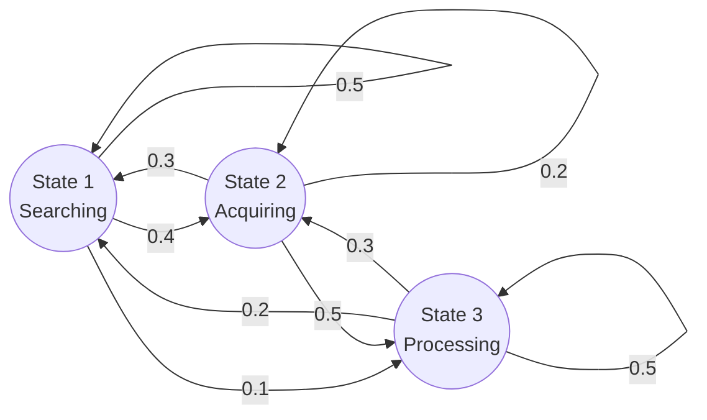

# 11.1 Markov Property and Transition Matrix

## What is a Markov Chain?

A **Markov Chain** is a sequence of random variables $X_0, X_1, X_2, \ldots$ where the conditions for something to be a Markov chain are:

1. It must be a **sequence of conditionally dependent random variables** (each step is connected to the past).
2. Each variable is conditioned **only on the present** — not on the full history.

> **Core Rule:** The future is conditionally independent of the past, given the present.

Think of it as a system with **absolute amnesia**. No matter how you arrived at a state, only where you are *right now* determines where you go next.

---

## The Markov Property — Formal Definition

$$P(X_{n+1} = j \mid X_n = i, X_{n-1} = i_{n-1}, \ldots, X_0 = i_0) = P(X_{n+1} = j \mid X_n = i)$$

**Read in English:** "The probability of the next state, given the entire history, equals the probability of the next state given only the current state."

**Physical meaning:** If you are in State 4 of the Coupon Collector game (you have 4 unique toys), your odds of getting a new toy are exactly $\frac{6}{10}$ — regardless of whether you bought 4 meals to get there, or 500 meals and were horribly unlucky. The history is completely irrelevant.

> If a system requires you to look at its **history** to predict its next move, it is **not** a Markov Chain.

---

## The Transition Matrix Q

The **transition matrix** $Q$ (or $P$) is an $M \times M$ matrix where:

- **Rows** = the state you are currently in ($X_n = i$)
- **Columns** = the state you will move to ($X_{n+1} = j$)
- **Entry $q_{ij}$** = the probability of jumping from state $i$ to state $j$ in one step ($P(X_{n+1} = j \mid X_n = i)$)

**Critical rule:** Every single row must sum to **exactly 1.0** — because the agent must go somewhere (even if it stays in the same state).

**Example — 3-state system:**

$$Q = \begin{pmatrix} 0.5 & 0.4 & 0.1 \\ 0.3 & 0.2 & 0.5 \\ 0.2 & 0.3 & 0.5 \end{pmatrix}$$

---

## How to Read Q in Plain English

Using the language of Chapter 7, the transition matrix $Q$ **encodes the conditional distribution of $X_1$ given the initial state of the chain**.

- The **$i$-th row** of $Q$ is the conditional PMF of $X_1$ given $X_0 = i$, displayed as a row vector.
- The **$i$-th row** of $Q^n$ is the conditional PMF of $X_n$ given $X_0 = i$.

**Example:** If the agent starts in State 3 ($X_0 = 3$), only the **3rd row** matters: $[0.2, 0.3, 0.5]$. This tells us there is a 20% chance of jumping to State 1, 30% to State 2, and 50% of staying in State 3. Rows 1 and 2 belong to **alternate timelines** where the agent spawned elsewhere — they are irrelevant.

> The vertical bar $\mid$ in $P(X_n = j \mid X_0 = i)$ is universally read as **"given that"** or **"conditioned on."** It acts as a mathematical filter.

---

## The n-Step Transition Matrix Q^n

You do not need to simulate $n$ steps manually. You **raise the matrix to the power $n$**:

$$Q^1 = \text{PMFs for exactly 1 step into the future}$$
$$Q^2 = \text{PMFs for exactly 2 steps into the future}$$
$$Q^n = \text{PMFs for exactly } n \text{ steps into the future}$$

If you compute $Q^{10}$ and look at Row 1, that row gives the exact probability distribution of finding the agent in each state, **assuming it started in State 1 exactly ten clock cycles ago**.

> You calculate the whole matrix to build the engine, but you only ever extract the **specific row you are conditioned on** to run the prediction.

---

## The Chapman-Kolmogorov Summation

### Why We Multiply (The AND Rule)

You are at starting state $i$. You want to reach destination state $j$ in **exactly two steps**. After step 1, you must land in some intermediate state $k$.

To complete one specific route through $k$, **two things must happen in sequence**:

1. Jump from $i \to k$ — Probability: $q_{ik}$
2. **AND** then jump from $k \to j$ — Probability: $q_{kj}$

In probability, **AND** means **multiply**:

$$\text{Path probability through } k = q_{ik} \times q_{kj}$$

---

### Why We Sum (The OR Rule)

$k$ is just a placeholder — it could be **any** state in the entire state space. In a 3-state system, you have three parallel paths to reach $j$ in 2 steps:

- Path via State 1: $i \to 1 \to j$
- **OR** Path via State 2: $i \to 2 \to j$
- **OR** Path via State 3: $i \to 3 \to j$

In probability, mutually exclusive alternatives (**OR**) are **added**:

$$q_{ij}^{(2)} = (q_{i1} \times q_{1j}) + (q_{i2} \times q_{2j}) + (q_{i3} \times q_{3j}) = \sum_k q_{ik} \cdot q_{kj}$$

> **The core insight:** We are summing the probabilities of every possible **parallel universe** that successfully gets us from start state to end state.

---

### The Linear Algebra Connection

That summation $\sum_k q_{ik} \cdot q_{kj}$ is **literally the formula for a dot product**:

- Take the **$i$-th row** of matrix $Q$ (outgoing probabilities from $i$).
- Dot product with the **$j$-th column** of matrix $Q$ (incoming probabilities to $j$).

This is exactly why $Q \times Q = Q^2$ instantly gives all 2-step probabilities for the **entire system** at once. Matrix multiplication runs this summation for every possible $(i, j)$ combination simultaneously.

For a concrete, step-by-step example of computing 2-step transitions, see **[Worked Example — Reaching State C in 2 Steps](Examples.md#1-reaching-state-c-in-2-steps)**.
