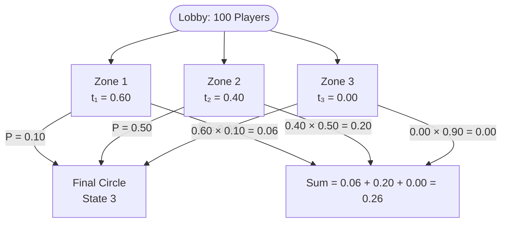

# 11.1.6 Marginal Distribution of X_n

## The Initial Vector t

Up until now every equation had a $\mid$ bar — we always *knew* the starting state. But in real systems, you rarely have perfect information about where things began.

The **initial vector** $t = (t_1, t_2, \ldots, t_M)$ is the **spawn distribution**, where:

$$t_i = P(X_0 = i)$$

This is a $1 \times M$ row vector. Instead of saying "the agent starts in State 1," you say "the agent starts with a 50% chance of being in State 1 and a 50% chance of being in State 2":

$$t = [0.5,\ 0.5,\ 0.0]$$

---

## LOTP — The Law of Total Probability

To find the **marginal** (absolute, unconditioned) probability of being in state $j$ at time $n$:

$$P(X_n = j) = \sum_{i=1}^{M} P(X_0 = i) \cdot P(X_n = j \mid X_0 = i) = \sum_{i=1}^{M} t_i \cdot q_{ij}^{(n)}$$

**Read out loud in English:**
> "The probability that $X$ sub $n$ equals $j$... equals the sum from $i$ equals one to $M$... of the probability that $X$ sub zero equals $i$... times the probability that $X$ sub $n$ equals $j$, **given that** $X$ sub zero equals $i$."

This summation is the **weighted average** over all possible starting timelines.

---

## The Battle Royale Intuition

Imagine 100 players dropping into a map with 3 spawn zones. We want the absolute probability of a random player reaching the **Final Circle (State 3)**.

**The two pieces:**

| Symbol | Name | Meaning |
|---|---|---|
| $P(X_n = j \mid X_0 = i)$ | Transition Probability | If you spawn at Zone $i$, what are your odds of reaching Final Circle $j$? |
| $P(X_0 = i) = t_i$ | Spawn Probability | What fraction of the lobby actually dropped at Zone $i$? |

**Concrete numbers:**

| Zone | Spawn % | Survival Rate | Contribution |
|---|---|---|---|
| Zone 1 | 60% | 10% | $0.60 \times 0.10 = 0.06$ |
| Zone 2 | 40% | 50% | $0.40 \times 0.50 = 0.20$ |
| Zone 3 | 0% | 90% | $0.00 \times 0.90 = 0.00$ |
| **Total** | | | **0.26 (26%)** |

> **Core intuition:** You take the probability of moving from $i$ to $j$, then **multiply** by the probability of starting there in the first place. You cannot just look at survival rates in a vacuum — Zone 3 has a 90% rate but nobody spawned there, so it contributes nothing.

---

## Proposition 11.1.6 — Full Proof Decomposed

**Proposition:** Define $t = (t_1, t_2, \ldots, t_M)$ by $t_i = P(X_0 = i)$, viewed as a row vector. Then the marginal distribution of $X_n$ is given by the vector $tQ^n$. That is, the $j$-th component of $tQ^n$ is $P(X_n = j)$.

**Proof:**

$$P(X_n = j) = \sum_{i=1}^{M} P(X_0 = i) \cdot P(X_n = j \mid X_0 = i) = \sum_{i=1}^{M} t_i \cdot q_{ij}^{(n)}$$

which is the $j$-th component of $tQ^n$ by definition of matrix multiplication. $\blacksquare$

**Symbol-by-symbol breakdown:**

| Symbol | Professor Speak | Plain English |
|---|---|---|
| $P(X_n = j)$ | "The probability that $X$ sub $n$ equals $j$" | The absolute probability that the agent ends up in State $j$ exactly $n$ steps from now. |
| $\sum_{i=1}^{M}$ | "The sum, from $i$ equals one to $M$, of..." | Run a loop through every possible starting state and add the results together. |
| $P(X_0 = i)$ or $t_i$ | "The probability that $X$ sub zero equals $i$" | The chance the agent originally spawned in State $i$. |
| $P(X_n = j \mid X_0 = i)$ | "The probability that $X_n$ equals $j$, **given that** $X_0$ equals $i$" | Assuming the agent started in State $i$, what are its odds of reaching State $j$? |
| $q_{ij}^{(n)}$ | "q sub $i$-$j$, superscript $n$" | Go to our $n$-step matrix $Q^n$, find the number in row $i$, column $j$. |
| $tQ^n$ | "The vector $t$ times the matrix $Q$ to the $n$-th power" | Take the starting reality vector and crash it through our fast-forwarded probability matrix via a dot product. |

---

## Reading the Proof Out Loud in English

> "To find the total probability of ending up in state $j$ at time step $n$ ($P(X_n = j)$) — we sum up ($\Sigma$) the parallel timelines for every possible starting state $i$ — by multiplying the probability that we actually spawned in state $i$ ($P(X_0 = i)$) — by the conditional probability of reaching state $j$ given that we started in $i$ ($P(X_n = j \mid X_0 = i)$). This is mathematically identical to taking the $i$-th element of our starting vector ($t_i$) and multiplying it by the $i,j$ entry of our $n$-step transition matrix ($q_{ij}^{(n)}$) — which, by definition, is exactly how you calculate the $j$-th component of a vector-matrix dot product ($tQ^n$)."
