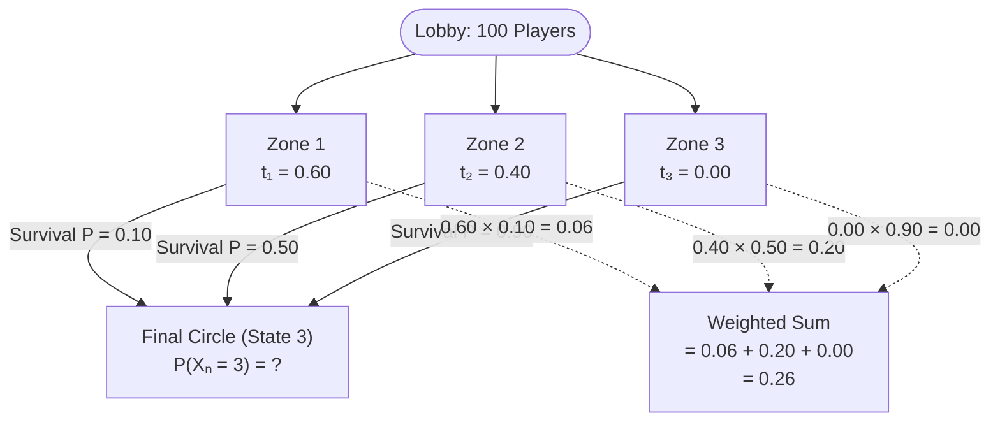
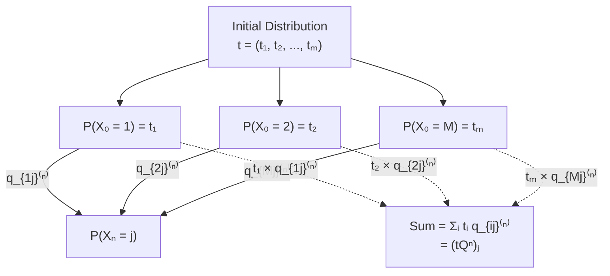

# Table of Contents

- [The Initial Vector](#the-initial-vector)
- [Law of Total Probability for Markov Chains](#law-of-total-probability-for-markov-chains)
- [Concrete Intuition — The Battle Royale](#concrete-intuition--the-battle-royale)
- [Marginal Distribution as Vector-Matrix Multiplication](#marginal-distribution-as-vector-matrix-multiplication)
- [Worked Example — Explicit Matrix Computation](#worked-example--explicit-matrix-computation)
- [Interpreting the Formula Symbol by Symbol](#interpreting-the-formula-symbol-by-symbol)
- [Conceptual Traps and Common Mistakes](#conceptual-traps-and-common-mistakes)

# The Initial Vector

Up until this point in the theory, every probability we have written contained a conditioning bar. We always knew exactly which state the chain started in — every calculation began with a phrase like "given that the chain started in state $i$." This certainty about the starting state let us read probabilities directly from the rows of the transition matrix and its powers. But real systems rarely hand you perfect information about where things began. A customer visits your website, and you may only know aggregate statistics about which landing page they arrived on, not the exact page. A machine begins a production shift, and you may only know the probability distribution over its possible initial configurations, not the actual configuration. To progress from conditional predictions (answering "given we started in state $i$...") to absolute predictions (answering "what is the probability we are in state $j$ at time $n$?"), we need a mathematical object that captures uncertainty about the starting state.

**Definition.** The **initial distribution** (also called the **initial vector**) of a Markov chain with state space $S = \{1, 2, \ldots, M\}$ is a $1 \times M$ row vector $t = (t_1, t_2, \ldots, t_M)$ whose $i$-th component is defined as:

$$t_i = P(X_0 = i)$$

Each component $t_i$ represents the probability that the chain begins in state $i$. The components are non-negative ($t_i \geq 0$ for every state $i$), and they sum to one:

$$\sum_{i=1}^{M} t_i = 1$$

The subscript $i$ in the sum above is a **dummy index of summation** — it ranges over all $M$ states and does not refer to any particular fixed state. It exists solely to perform the addition and disappears once the sum is evaluated.

**Scouting Report — What to look for:** Whenever a problem provides a probability distribution over the starting state rather than a single definite starting state, you are looking at an initial vector. The surface features are a list of non-negative numbers summing to $1$, paired with language like "the chain starts in state $i$ with probability $t_i$" or "the initial distribution is $\ldots$" If instead the problem says "the chain starts in state $1$," that is the special case where the initial vector has a $1$ in position $1$ and $0$ everywhere else.

**Why you care:** Without an initial vector, your only output is the conditional probability function — a complete map from every possible starting state to every possible ending state. This is powerful, but it is not what you need when you lack certainty about the start. The initial vector is the upgrade that converts your conditional machinery into unconditional answers. It tells you *which starting timelines matter and how much*, so you can collapse the entire tree of parallel universes into a single number: the absolute probability of being in state $j$ at time $n$.

## Why a Row Vector and Not a Column Vector

You might wonder why the initial distribution is defined as a row vector rather than a column vector. The convention is not arbitrary — it is dictated by the mechanics of matrix multiplication. When we write $tQ^n$, the row vector $t$ sits on the left of the matrix, and the product yields another row vector (the marginal distribution at time $n$). This is the standard convention in probability theory: probability distributions over states are represented as row vectors, so that multiplying by the transition matrix on the right propagates the distribution forward in time.

If we used column vectors instead, we would need to write $(Q^n)^\top t$ or reverse the multiplication order entirely, creating unnecessary notational friction throughout every subsequent derivation. The row-vector convention ensures that the algebra flows naturally left-to-right: start with the distribution, apply the transition, get the new distribution.

## Why Time Zero and Not Another Time

The definition anchors to $X_0$ rather than $X_1$ or any later time because time $0$ is the natural origin of the stochastic process. If someone hands you a distribution over $X_k$ for some $k > 0$, that is not an initial distribution — it is a marginal distribution at a later time, and you would need to propagate it forward from time $k$ using $Q^{n-k}$ rather than from time $0$ using $Q^n$. Conflating these two situations is a common source of error, and we will examine it in detail in the conceptual traps section.

## What Goes Wrong Without the Initial Vector

Suppose you try to compute the absolute probability $P(X_n = j)$ without an initial vector. You have the $n$-step transition matrix $Q^n$, and every entry $q_{ij}^{(n)}$ tells you the probability of reaching state $j$ from state $i$ in exactly $n$ steps. But which row do you read? Without knowing where the chain started, every row is equally plausible and you have no basis for choosing one over another.

You are stuck with $M$ conditional answers (one per starting state) and no way to combine them into the single number you actually need. The initial vector provides the weights: $t_i$ tells you how much to trust the answer from row $i$, and the weighted sum gives you the marginal probability.

**Phenomenon Metadata — Initial Vector**

| Element | Purpose |
|---|---|
| Structural Signature | A list of $M$ non-negative numbers summing to $1$, paired with the state space $S = \{1, \ldots, M\}$. Appears with language like "starts with probability $t_i$ in state $i$." |
| Core Invariant | The initial vector is a probability distribution over the state space at time $0$. Its defining property is that its entries are non-negative and sum to $1$. |
| Compression Handle | "The starting reality vector — how likely each spawn point is." |
| Boundary / Failure Mode | Describes the distribution of $X_0$ only. If you have a distribution over $X_k$ for $k > 0$, using the $X_0$-distribution together with $Q^n$ would undercount the steps by $k$. You must use the $X_k$-distribution with $Q^{n-k}$ instead. |
| Phenomenon Web | Prerequisite for [Law of Total Probability for Markov Chains](#law-of-total-probability-for-markov-chains). When the chain starts in a known state $i_0$, the initial vector collapses to have a $1$ in position $i_0$ and $0$ everywhere else, and $tQ^n$ simply reads out row $i_0$ of $Q^n$. |

---

# Law of Total Probability for Markov Chains

The tool that bridges the gap between conditional probabilities (which we already know how to compute from $Q^n$) and marginal probabilities (which we actually want) is the **Law of Total Probability** (LOTP). LOTP is a general-purpose theorem from probability theory, but it takes a particularly clean and useful form when applied to Markov chains because the chain's state space provides a natural partition of the sample space.

## The Partition Principle

The Law of Total Probability applies whenever you can partition the sample space into mutually exclusive, exhaustive events. For a Markov chain, the events "the chain started in state $1$," "the chain started in state $2$," and so on through "the chain started in state $M$" form exactly such a partition. These events are **mutually exclusive** (the chain cannot have started in two different states simultaneously) and **exhaustive** (the chain must have started in *some* state). This means the collection $\{X_0 = 1\}, \{X_0 = 2\}, \ldots, \{X_0 = M\}$ satisfies the prerequisites for LOTP.

## The Marginal Probability Formula

Applying LOTP to the event $\{X_n = j\}$, using the partition $\{X_0 = i\}_{i=1}^{M}$, we obtain:

$$P(X_n = j) = \sum_{i=1}^{M} P(X_0 = i) \cdot P(X_n = j \mid X_0 = i)$$

**Dummy-index warning:** In this summation, $i$ is a **dummy (varying) index** that runs over all $M$ states in the state space. It is not a fixed state — it is the variable that performs the loop. The only **free (fixed) variable** in this expression is $j$, which is the target state whose marginal probability we are computing. The summation index $i$ will disappear once the sum is evaluated, while $j$ remains as the output label.

Now, $P(X_0 = i)$ is precisely the definition of $t_i$, the $i$-th component of the initial vector. And the conditional probability of reaching state $j$ at time $n$ given a start in state $i$ at time $0$ is precisely the definition of $q_{ij}^{(n)}$, the $(i, j)$-entry of the $n$-step transition matrix. Making both substitutions:

$$P(X_n = j) = \sum_{i=1}^{M} t_i \cdot q_{ij}^{(n)}$$

This is the fundamental formula for the marginal distribution of $X_n$.

## Why This Is a Weighted Average Over Timelines

Each term $t_i \cdot q_{ij}^{(n)}$ in the sum represents the probability contribution from one "timeline": the timeline where the chain starts in state $i$. The factor $t_i$ is the probability that this timeline is the actual one (the probability the chain started in state $i$), and the factor $q_{ij}^{(n)}$ is the probability of reaching state $j$ at time $n$ along that timeline.

The sum, therefore, is a **weighted average** of the transition probabilities from all possible starting states, where the weights are the probabilities of actually starting in each state. A timeline with a high spawn probability ($t_i$ close to $1$) contributes heavily to the final answer, regardless of how good or bad its transition probability is. A timeline with a low spawn probability ($t_i$ close to $0$) contributes almost nothing, even if its transition probability is excellent.

This is why you cannot ignore the initial distribution. The transition probabilities alone tell you *what would happen* from each starting state, but they do not tell you *which starting states actually matter*.

**Phenomenon Metadata — LOTP for Markov Chains**

| Element | Purpose |
|---|---|
| Structural Signature | You have a target state $j$ and a time horizon $n$, and you need the absolute (unconditioned) probability of being in $j$ at time $n$. You also have an initial distribution $t$ and an $n$-step transition matrix $Q^n$. |
| Core Invariant | The events $\{X_0 = i\}$ for $i = 1, \ldots, M$ partition the sample space, which is the structural prerequisite for LOTP. The sum then collapses the partition-weighted conditional probabilities into a single marginal. |
| Compression Handle | "Fan out to all possible starting states, compute each conditional probability, then weight by spawn probability and sum." |
| Boundary / Failure Mode | LOTP requires that the conditioning events form a partition. If the initial distribution does not sum to $1$ (e.g., you have incomplete information about the starting state), the formula will produce a value that is not a valid probability. |
| Phenomenon Web | Directly uses the [Initial Vector](#the-initial-vector). Algebraic structure is identical to [Marginal Distribution as Vector-Matrix Multiplication](#marginal-distribution-as-vector-matrix-multiplication) — LOTP is the *reason* the matrix multiplication works. |

---

# Concrete Intuition — The Battle Royale

Formulas are compact, and compactness hides structure. To see what the LOTP formula is actually doing, let us work through a concrete analogy.

## Setting Up the Scenario

Imagine $100$ players dropping into a battle royale map with $3$ spawn zones. We want the absolute probability that a randomly chosen player reaches the Final Circle, which we model as State $3$.

The two pieces of information we need are:

| Piece | Symbol | Meaning |
|---|---|---|
| Spawn Probability | $t_i$ | What fraction of the lobby actually dropped at Zone $i$? |
| Transition Probability | The $n$-step survival rate from $i$ to $3$ | If you spawned at Zone $i$, what are your odds of reaching the Final Circle? |

Suppose the numbers are as follows:

| Zone | Spawn Probability ($t_i$) | Survival Rate to Final Circle | Contribution to Marginal |
|---|---|---|---|
| Zone 1 | $t_1 = 0.60$ | $10\%$ | $0.60 \times 0.10 = 0.06$ |
| Zone 2 | $t_2 = 0.40$ | $50\%$ | $0.40 \times 0.50 = 0.20$ |
| Zone 3 | $t_3 = 0.00$ | $90\%$ | $0.00 \times 0.90 = 0.00$ |
| **Total** | $1.00$ | | **$0.26$ ($26\%$)** |

The initial vector is $t = (0.60,\ 0.40,\ 0.00)$.

## The Core Insight

Zone $3$ has the highest survival rate ($90\%$), but it contributes **nothing** to the marginal probability because nobody spawned there ($t_3 = 0.00$). Zone $1$ has a terrible survival rate ($10\%$), but because $60\%$ of players spawned there, it still contributes $0.06$ to the total. Zone $2$ is the biggest contributor ($0.20$) because it combines a decent spawn fraction ($40\%$) with a strong survival rate ($50\%$).

This is exactly what the LOTP formula does. It takes each spawn zone's survival probability, multiplies by how many players actually spawned there, and adds up the results. You cannot evaluate spawn zones in isolation — you must weight by how much of the population they represent. The initial vector $t$ provides those weights.

Applying the formula explicitly with $j = 3$:

$$P(X_n = 3) = \sum_{i=1}^{3} t_i \cdot q_{i3}^{(n)} = (0.60)(0.10) + (0.40)(0.50) + (0.00)(0.90) = 0.06 + 0.20 + 0.00 = 0.26$$

**Dummy-index warning:** Here, $i$ is the dummy index running over the three spawn zones ($i = 1, 2, 3$). The only free variable is $j = 3$, the target state. The index $i$ is not a particular zone — it is the loop variable that visits each zone in turn.

---

# Marginal Distribution as Vector-Matrix Multiplication

## Proposition

Let $t = (t_1, t_2, \ldots, t_M)$ be the initial distribution of a Markov chain, viewed as a $1 \times M$ row vector. Then the marginal distribution of $X_n$ is given by the vector $tQ^n$. That is, the $j$-th component of $tQ^n$ equals $P(X_n = j)$.

**Scouting Report — What to look for:** You have an initial distribution $t$ (a row vector of spawn probabilities), an $n$-step transition matrix $Q^n$, and you need the absolute (unconditioned) probability that the chain is in state $j$ at time $n$. The structural signature is the co-occurrence of an initial distribution, a transition matrix raised to some power, and a request for a marginal probability.

**Why you care:** This proposition packages the entire LOTP calculation into a single matrix-vector product. Instead of writing out a sum with $M$ terms every time, you compute $tQ^n$ once and read off every component. The computational savings become significant for large $M$ and large $n$.

## Why This Should Be True — Pre-Proof Intuition

Before we prove the proposition, let us build the intuition for why it must be true. Recall how matrix-vector multiplication works: when you multiply a $1 \times M$ row vector by an $M \times M$ matrix, the $j$-th component of the result is the dot product of the row vector with the $j$-th column of the matrix. In symbols, the $j$-th component of $tQ^n$ is:

$$(tQ^n)_j = \sum_{i=1}^{M} t_i \cdot (Q^n)_{ij}$$

**Dummy-index warning:** The index $i$ is a dummy (varying) index of summation that runs over all states. The index $j$ is free (fixed) — it specifies which component of the output vector we are computing. The notation $(Q^n)_{ij}$ denotes the entry in row $i$, column $j$ of the matrix $Q^n$, which is $q_{ij}^{(n)}$.

But $t_i$ is $P(X_0 = i)$ by definition, and $(Q^n)_{ij} = q_{ij}^{(n)} = P(X_n = j \mid X_0 = i)$ by definition of the $n$-step transition probability. So the dot product becomes:

$$(tQ^n)_j = \sum_{i=1}^{M} P(X_0 = i) \cdot P(X_n = j \mid X_0 = i)$$

This is exactly the LOTP formula. The matrix multiplication is not doing anything mysterious — it is computing, component by component, the weighted sum of conditional probabilities that LOTP tells you to compute. The proposition is essentially the observation that LOTP and matrix multiplication are the same algebraic operation wearing different notation.

## Full Proof

We want to show that the $j$-th component of $tQ^n$ equals $P(X_n = j)$ for every state $j$.

**Step 1 — Set up the target.** We need to compute the absolute probability that the chain is in state $j$ at time $n$, without any conditioning on the starting state. This is $P(X_n = j)$.

**Step 2 — Identify the partition.** The events $\{X_0 = 1\}, \{X_0 = 2\}, \ldots, \{X_0 = M\}$ form a partition of the sample space. They are mutually exclusive (the chain starts in exactly one state) and exhaustive (the chain starts in some state).

**Step 3 — Apply the Law of Total Probability.** Because the events $\{X_0 = i\}$ partition the sample space, LOTP gives us:

$$P(X_n = j) = \sum_{i=1}^{M} P(X_0 = i) \cdot P(X_n = j \mid X_0 = i)$$

**Dummy-index warning:** The index $i$ is a dummy index of summation ranging over all $M$ states. It is not a particular starting state. The index $j$ is the free variable — it is the specific target state whose marginal probability we are computing.

**Step 4 — Substitute the initial distribution.** By definition of the initial vector, $P(X_0 = i) = t_i$. Substituting:

$$P(X_n = j) = \sum_{i=1}^{M} t_i \cdot P(X_n = j \mid X_0 = i)$$

**Step 5 — Substitute the $n$-step transition probability.** By definition of the $n$-step transition matrix, $P(X_n = j \mid X_0 = i) = q_{ij}^{(n)} = (Q^n)_{ij}$. Substituting:

$$P(X_n = j) = \sum_{i=1}^{M} t_i \cdot (Q^n)_{ij}$$

**Step 6 — Recognize the matrix multiplication.** The right-hand side is precisely the definition of the $j$-th component of the matrix-vector product $tQ^n$. By the definition of matrix multiplication, the $j$-th component of a row vector times a matrix is the dot product of the row vector with the $j$-th column of the matrix:

$$(tQ^n)_j = \sum_{i=1}^{M} t_i \cdot (Q^n)_{ij}$$

**Step 7 — Conclude.** Since both sides equal the same sum, we have:

$$P(X_n = j) = (tQ^n)_j$$

This holds for every state $j = 1, 2, \ldots, M$, so the entire marginal distribution of $X_n$ is the vector $tQ^n$. $\blacksquare$

## What Just Happened Mechanically — Post-Proof Intuition

The proof reveals that matrix multiplication is not some arbitrary algebraic operation imposed on probability theory from outside. When you multiply a probability distribution (row vector) by a transition matrix, each entry of the result is a weighted sum of transition probabilities, weighted by the probability of being in each starting state. This is exactly what LOTP tells you to do. The "magic" of $tQ^n$ is just LOTP packaged into linear algebra notation.

The practical consequence is enormous. Instead of writing out an $M$-term sum every time you need a marginal probability, you compute $tQ^n$ once (a single matrix-vector multiplication) and read off all $M$ components simultaneously. The linear algebra notation is not just convenient — it reveals that the marginal distribution at time $n$ is obtained by repeatedly multiplying the initial distribution by $Q$ (once for each time step). This is the computational engine that powers every subsequent result about long-run behavior.

## What Would Break Without the Conditions

The proposition requires three conditions, and removing any one of them breaks the result.

**Condition 1: $t$ must be a valid probability distribution.** The entries of $t$ must be non-negative and must sum to $1$. If the entries summed to, say, $2$, then $tQ^n$ would have entries summing to $2$ as well (since each row of $Q^n$ sums to $1$), and the result would not be a probability distribution. The formula would produce numbers larger than $1$, which are not valid probabilities.

**Condition 2: $Q$ must be a valid transition matrix.** Each row of $Q$ must sum to $1$ and have non-negative entries. If a row summed to something other than $1$, the "transition probabilities" would not actually be probabilities, and the conditional probabilities $q_{ij}^{(n)}$ would not represent what we think they represent.

**Condition 3: The chain must be a Markov chain.** The entire derivation depends on the equality $P(X_n = j \mid X_0 = i) = q_{ij}^{(n)}$. For a general stochastic process (without the Markov property), the $n$-step probability from $i$ to $j$ would depend on the intermediate states visited, not just on the endpoints. The matrix $Q^n$ would not correctly represent these conditional probabilities, and the formula $tQ^n$ would give the wrong answer.

The diagram above shows the two-stage structure: the initial distribution fans out to all possible starting states, each starting state has its own conditional probability of reaching state $j$, and the weighted sum collapses all of these parallel pathways into a single marginal probability.

**Phenomenon Metadata — Marginal Distribution as $tQ^n$**

| Element | Purpose |
|---|---|
| Structural Signature | An initial distribution $t$, a transition matrix $Q$, a time horizon $n$, and a request for the unconditional probability of being in some state at time $n$. |
| Core Invariant | The $j$-th component of the output is the dot product of $t$ with the $j$-th column of $Q^n$. This dot product is algebraically identical to the LOTP sum. |
| Compression Handle | "Multiply the starting reality vector by the fast-forwarded transition matrix." |
| Boundary / Failure Mode | Uses the distribution of $X_0$. If you instead have the distribution of $X_k$ (for $k > 0$), you must use $Q^{n-k}$, not $Q^n$. Also requires the Markov property — for non-Markov processes, $Q^n$ does not correctly represent the $n$-step conditional probabilities. |
| Phenomenon Web | Algebraic implementation of [Law of Total Probability for Markov Chains](#law-of-total-probability-for-markov-chains). Requires the [Initial Vector](#the-initial-vector) as input. The output $tQ^n$ is itself a probability distribution (a row vector), so the same formula applies recursively: $tQ^{n+m} = (tQ^n)Q^m$. This is the basis for the Chapman-Kolmogorov equations. |

---

# Worked Example — Explicit Matrix Computation

To make the connection between the LOTP formula and the matrix product $tQ^n$ completely concrete, let us work through a numerical example with explicit matrix arithmetic.

## Setting Up the Problem

Consider a Markov chain with $2$ states and the following one-step transition matrix:

$$Q = \begin{bmatrix} 0.7 & 0.3 \\ 0.4 & 0.6 \end{bmatrix}$$

The initial distribution is $t = (0.6,\ 0.4)$. This means the chain starts in state $1$ with probability $0.6$ and in state $2$ with probability $0.4$.

We want to find the marginal distribution of $X_2$, i.e., $P(X_2 = 1)$ and $P(X_2 = 2)$.

## Computing the Two-Step Transition Matrix

First, we compute $Q^2 = Q \cdot Q$. By the definition of matrix multiplication, the $(i, j)$ entry of $Q^2$ is:

$$(Q^2)_{ij} = \sum_{k=1}^{2} q_{ik} \cdot q_{kj}$$

**Dummy-index warning:** Here, $k$ is the dummy index of summation that ranges over the intermediate states ($k = 1, 2$). The indices $i$ and $j$ are fixed — they specify which entry of $Q^2$ we are computing. The index $k$ is not a particular state; it is the loop variable that visits each intermediate state.

Computing each entry explicitly:

$$(Q^2)_{11} = q_{11} \cdot q_{11} + q_{12} \cdot q_{21} = (0.7)(0.7) + (0.3)(0.4) = 0.49 + 0.12 = 0.61$$

$$(Q^2)_{12} = q_{11} \cdot q_{12} + q_{12} \cdot q_{22} = (0.7)(0.3) + (0.3)(0.6) = 0.21 + 0.18 = 0.39$$

$$(Q^2)_{21} = q_{21} \cdot q_{11} + q_{22} \cdot q_{21} = (0.4)(0.7) + (0.6)(0.4) = 0.28 + 0.24 = 0.52$$

$$(Q^2)_{22} = q_{21} \cdot q_{12} + q_{22} \cdot q_{22} = (0.4)(0.3) + (0.6)(0.6) = 0.12 + 0.36 = 0.48$$

Therefore:

$$Q^2 = \begin{bmatrix} 0.61 & 0.39 \\ 0.52 & 0.48 \end{bmatrix}$$

## Computing the Marginal Distribution via $tQ^2$

Now we multiply the initial distribution by $Q^2$:

$$(tQ^2)_1 = t_1 \cdot (Q^2)_{11} + t_2 \cdot (Q^2)_{21} = (0.6)(0.61) + (0.4)(0.52) = 0.366 + 0.208 = 0.574$$

$$(tQ^2)_2 = t_1 \cdot (Q^2)_{12} + t_2 \cdot (Q^2)_{22} = (0.6)(0.39) + (0.4)(0.48) = 0.234 + 0.192 = 0.426$$

**Dummy-index warning:** In each dot product above, the implicit summation index is the row index of $Q^2$ (which we called $i$ in the general formula). Here it ranges over $i = 1, 2$. The column index $j$ is fixed ($j = 1$ for the first component, $j = 2$ for the second). This index $i$ is dummy — it visits each starting state, multiplies $t_i$ by the corresponding entry in column $j$ of $Q^2$, and adds the results.

So the marginal distribution at time $2$ is:

$$tQ^2 = (0.574,\ 0.426)$$

This means $P(X_2 = 1) = 0.574$ and $P(X_2 = 2) = 0.426$. Notice that the two components sum to $1.000$, confirming that the result is a valid probability distribution.

## Verifying via LOTP

We can verify the first component directly using LOTP. The marginal probability of being in state $1$ at time $2$ is the sum over both possible starting states:

$$P(X_2 = 1) = P(X_0 = 1) \cdot P(X_2 = 1 \mid X_0 = 1) + P(X_0 = 2) \cdot P(X_2 = 1 \mid X_0 = 2)$$

**Dummy-index warning:** The summation index (here written explicitly as two terms rather than with a $\sum$ symbol) runs over the two possible starting states. The target state $j = 1$ is the only free variable.

Substituting the numerical values:

$$P(X_2 = 1) = (0.6)(0.61) + (0.4)(0.52) = 0.366 + 0.208 = 0.574$$

This matches the matrix computation exactly, confirming that $tQ^2$ and LOTP give the same answer. The matrix notation is just a compact way of writing the LOTP calculation for all target states simultaneously.

---

# Interpreting the Formula Symbol by Symbol

When you encounter the formula $P(X_n = j) = (tQ^n)_j$ for the first time, every symbol carries specific meaning. The table below provides a symbol-by-symbol translation.

| Symbol | How to Read It | What It Means |
|---|---|---|
| $P(X_n = j)$ | "The probability that $X$ sub $n$ equals $j$" | The absolute probability that the agent is in State $j$ at time step $n$. This is the quantity we are trying to compute — it is unconditional, meaning it does not assume any particular starting state. |
| $(tQ^n)_j$ | "The $j$-th component of $t$ times $Q$ to the $n$-th power" | Take the initial distribution $t$ (a row vector) and multiply it by the $n$-step transition matrix $Q^n$. The result is a row vector whose $j$-th entry gives the marginal probability of state $j$. |
| $t_i$ | "The $i$-th component of $t$" | The probability that the chain began in state $i$, i.e., $P(X_0 = i)$. This is a specific number from the initial vector, not a conditional probability. |
| $q_{ij}^{(n)}$ | "q sub $i$-$j$, superscript $n$" | The $(i, j)$-entry of the matrix $Q^n$. This is the probability of reaching state $j$ in exactly $n$ steps starting from state $i$. It is a conditional probability — it assumes a specific starting state. |
| $\sum_{i=1}^{M}$ | "The sum from $i$ equals $1$ to $M$" | Run a loop through every possible starting state and add the results. The index $i$ is a dummy variable of summation. |

## Reading the Full Formula in Plain English

To find the total probability of ending up in state $j$ at time step $n$ — we sum the contributions from every possible starting timeline. For each starting state $i$, we multiply the probability that the chain actually started there ($t_i$) by the conditional probability of reaching state $j$ from that starting state ($q_{ij}^{(n)}$). Adding up all of these weighted contributions gives the marginal probability.

This is mathematically identical to taking the $i$-th element of the initial vector and multiplying it by the entry in row $i$, column $j$ of the $n$-step transition matrix, then summing over all $i$. By definition of matrix multiplication, this dot product is exactly the $j$-th component of the vector-matrix product $tQ^n$.

---

# Conceptual Traps and Common Mistakes

## Trap 1 — Confusing the Marginal Probability with the Conditional Probability

The conditional probability answers "given the chain started in state $i$, what is the probability of being in state $j$ at time $n$?" The marginal probability answers "what is the probability of being in state $j$ at time $n$?" without any assumption about the starting state. These are fundamentally different questions that produce different answers.

**The misrecognized signature:** You see a transition matrix $Q^n$ and a target state $j$, and you reflexively read off the $(i, j)$-entry for some state $i$. But the problem asked for the *marginal* probability, not the conditional. Reading off a single entry of $Q^n$ ignores the initial distribution entirely.

**Concrete counterexample.** Consider a two-state chain with:

$$Q = \begin{bmatrix} 0.9 & 0.1 \\ 0.2 & 0.8 \end{bmatrix}$$

The conditional probabilities for reaching state $1$ at time $1$ are:

$$P(X_1 = 1 \mid X_0 = 1) = 0.9$$

$$P(X_1 = 1 \mid X_0 = 2) = 0.2$$

Neither of these is the marginal. The marginal depends on $t$:

- If $t = (1.0,\ 0.0)$ (chain definitely starts in state $1$): the marginal equals $0.9$.
- If $t = (0.0,\ 1.0)$ (chain definitely starts in state $2$): the marginal equals $0.2$.
- If $t = (0.5,\ 0.5)$ (equal chance of starting in either state): the marginal equals $(0.5)(0.9) + (0.5)(0.2) = 0.55$.

All three marginals are different, and only two of them match any conditional probability. When someone asks "what is the probability of being in state $1$?" without specifying a starting state, they mean the marginal, and you must use $tQ^n$.

## Trap 2 — Forgetting to Include the Initial Distribution

This trap is a close cousin of Trap $1$. You compute $Q^n$ correctly, but then you read off a row without weighting by $t$. The result is a conditional probability, not a marginal.

**The misrecognized signature:** You have $Q^n$ and you need a probability, so you scan the rows looking for the "right" one. But without $t$, there is no right row — every row gives a conditional answer for a different starting state, and none of them is the marginal.

**When this trap is harmless:** If the chain starts in a known state $i_0$ with certainty, then $t = (0, \ldots, 1, \ldots, 0)$ with the $1$ in position $i_0$. In this case, $tQ^n$ simply extracts row $i_0$ of $Q^n$, so reading off a row does give the correct marginal. The trap is dangerous precisely when the initial state is uncertain — which is exactly the situation where the initial vector exists to help.

## Trap 3 — Confusing the Dummy Index with a Fixed State

In the formula, the summation index $i$ ranges over all states. It is a dummy variable that exists only to perform the addition. Yet it is extremely easy to confuse this varying $i$ with a fixed state label $i$ that appears elsewhere in a problem.

**The misrecognized signature:** You are working through a problem that mentions "state $i$" as a specific, fixed state (e.g., "the chain starts in state $i$"). Then you encounter the formula with $\sum_{i=1}^{M}$, and you treat the $i$ in the sum as referring to that same fixed state. You either plug in a specific value for $i$ (collapsing the sum to a single term) or you fail to sum over all states.

**Concrete illustration.** Suppose a problem says "the chain starts in state $2$ with probability $0.7$." Here, the "$2$" is a specific, fixed value. Now if you see the formula $\sum_{i=1}^{M} t_i \cdot q_{ij}^{(n)}$, the index $i$ is *not* referring to state $2$. It is a loop variable. You must still sum over $i = 1, 2, \ldots, M$, using $t_2 = 0.7$ and whatever values $t_1, t_3, \ldots, t_M$ take. Collapsing the sum to the single term $t_2 \cdot q_{2j}^{(n)}$ would be correct only if $t_1 = t_3 = \cdots = t_M = 0$, which is a much stronger assumption than "the chain starts in state $2$ with probability $0.7$."

The rule of thumb: whenever you see a summation symbol, explicitly identify which index is the dummy (varying) one and which quantities are free (fixed). Write this identification down before substituting any numbers.
