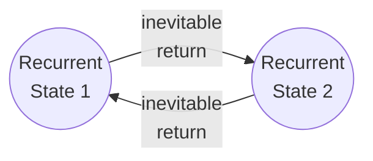
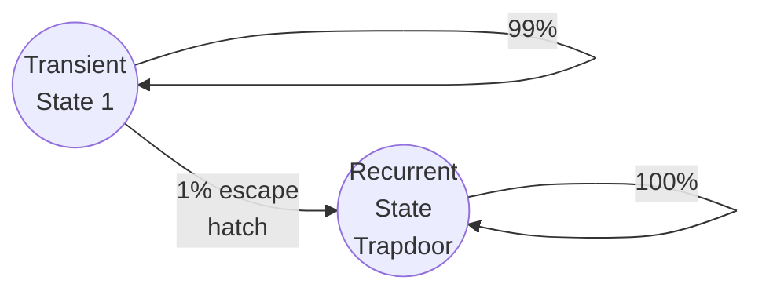
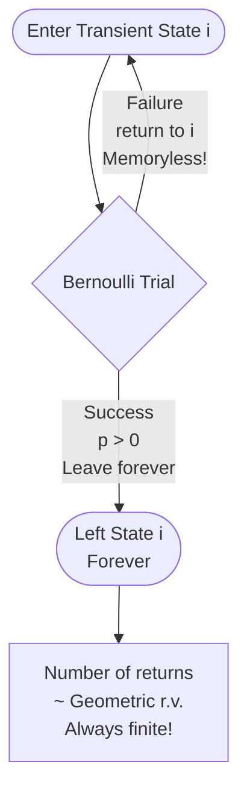
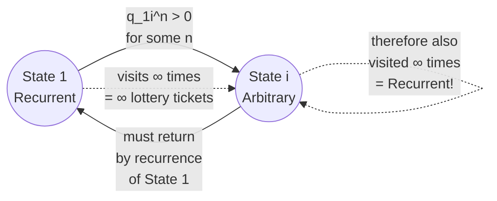
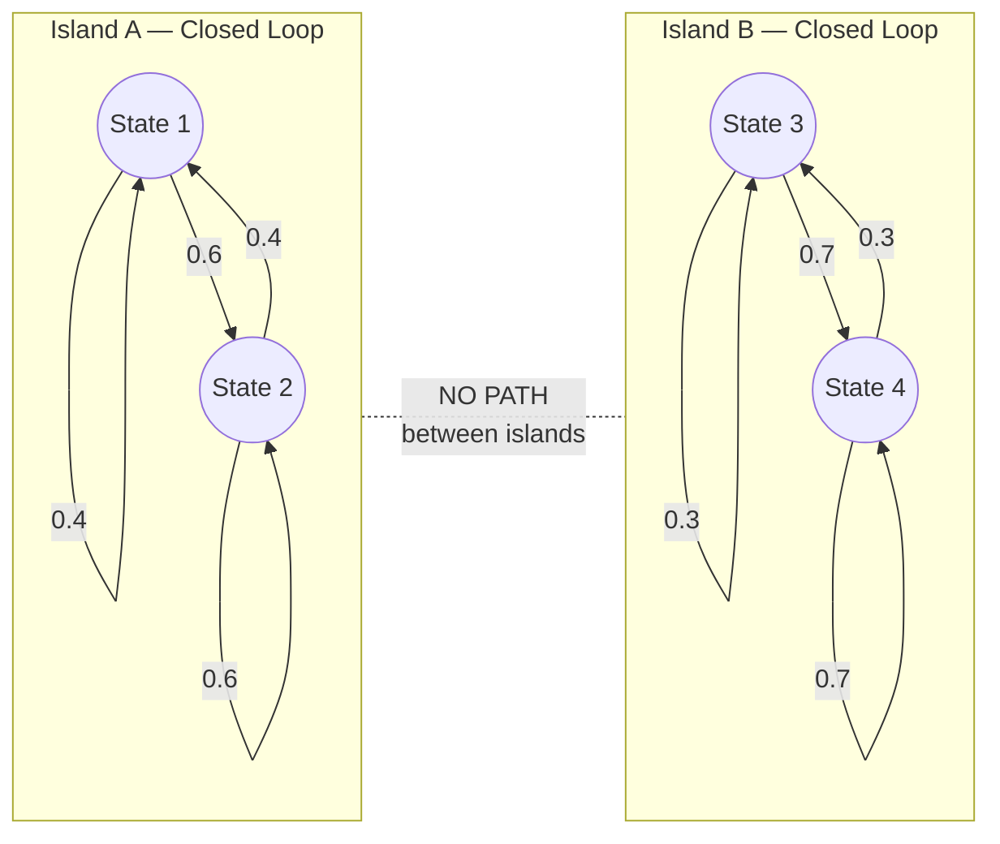

# 11.2 Classification of States

## Recurrent States

**Definition:** State $i$ is **recurrent** if, starting from $i$, the probability is **1** that the chain will eventually return to $i$.

**Physical meaning:** A recurrent state is a location with **no permanent escape**. No matter which doors you take, every path through the map eventually loops back to this room. Given infinite time, you will return to a recurrent state **infinitely many times**.

---

## Transient States

**Definition:** State $i$ is **transient** if there is a **positive probability of never returning** to $i$ after leaving it.

**Physical meaning:** A transient state has an **escape hatch**. There is at least one timeline where you walk out a door that locks behind you — you can never get back.

**The stronger statement:** As long as there is a *positive* probability of leaving $i$ forever, the chain **eventually will** leave $i$ forever.

**Why?** Because you are playing the game infinitely many times. If there is a 1% chance of escaping per visit:

| Steps | Probability of NOT having escaped |
|---|---|
| 10 | $0.99^{10} \approx 90\%$ |
| 100 | $0.99^{100} \approx 36\%$ |
| 1,000 | $0.99^{1000} \approx 0.004\%$ |
| $\infty$ | $0.99^\infty = 0$ |

> The **relentless grinding of infinite time** guarantees that the 1% escape hatch is eventually found. You cannot dodge a positive probability forever.

---

## The Geometric Distribution Proof

The textbook proves the finite-visit guarantee using the **story of the Geometric distribution**:

**The setup:**
- Each time the chain is at transient state $i$, run a **Bernoulli trial**:
  - **"Failure"** (Tails): The chain eventually returns to $i$ — you missed the trapdoor.
  - **"Success"** (Heads): The chain leaves $i$ **forever** — you fell through the trapdoor.

**The Markov property** ensures these trials are **independent** — the room has no memory of how many times you've looped through it. Your odds of finding the trapdoor are the same on attempt 1 and attempt 1,000,000.

**The count of returns** = the number of Failures before the first Success = a **Geometric random variable**.

Since a Geometric random variable **always takes a finite value**, this guarantees:

> After some **finite** number of visits, the chain will leave transient state $i$ **forever**. The counter freezes. You never return.

---

## Proposition 11.2.4 — Irreducible Chains

**Proposition:** In an **irreducible** Markov chain with a **finite state space**, all states are recurrent.

**Two conditions:**
1. **Finite State Space** — the map has a fixed number of rooms.
2. **Irreducible** — the map is fully connected; you can eventually navigate from any room to any other room.

**Proof (slow breakdown):**

**Trap 1 — The "Nowhere to Go" Rule:**

If all states were transient, the chain would eventually leave *every* state forever and have nowhere to go — but the map is finite, so it cannot delete itself from existence. Therefore, **at least one state must be recurrent**. Call it State 1.

**Trap 2 — The "Infection" via Irreducibility:**

Pick any other state $i$. Because the map is **irreducible**, there is a path from State 1 to State $i$. The $n$-step probability $q_{1i}^{(n)} > 0$ for some $n$.

**Trap 3 — The Infinite Lottery Tickets:**

State 1 is recurrent, so the agent visits it **infinitely many times**. Each visit is a "lottery ticket" with a positive probability of winning (navigating to State $i$ in $n$ more steps). With infinite tickets, you are **mathematically guaranteed** to eventually reach State $i$.

**Trap 4 — The Rubber Band Effect:**

From State $i$, the chain must eventually return to State 1 (because State 1 is recurrent and the map is irreducible). Then it reaches State $i$ again. The cycle repeats infinitely. Visiting State $i$ infinitely often means **State $i$ is recurrent**.

Since $i$ was arbitrary, **all states are recurrent**. $\blacksquare$

---

## The Converse is False — Two Islands

**The Converse (FALSE):** IF all states are Recurrent $\to$ THEN the map is Irreducible.

**Why it's false:** You can have a map divided into **two completely disconnected islands**:

- **Island A:** States 1 and 2 loop forever between themselves.
- **Island B:** States 3 and 4 loop forever between themselves.

Every state is **recurrent** (once you are on an island you never leave — infinite visits). But the map is **reducible** because you cannot travel from Island A to Island B.

> **Recurrent** = a property of an **individual state** (once visited, I can get visited again).
>
> **Irreducible** = a property of the **entire map** (every state can be reached from every other state).

---

## Topology Cheat Sheet

| Property | What it says | Scope |
|---|---|---|
| **Recurrent** | Once visited, will be visited again (and again, infinitely) | Property of a **single state** |
| **Transient** | May be visited finitely many times, then left forever | Property of a **single state** |
| **Irreducible** | Every state can be reached from every other state | Property of the **whole chain** |
| **Reducible** | Some states cannot be reached from others | Property of the **whole chain** |
| **Absorbing** | $P(i \to i) = 1.0$ — a special case of recurrent | Property of a **single state** |

**Key relationships:**

- Irreducible + Finite State Space → **all states are recurrent** ✓
- All states recurrent → Irreducible? **NO** (Two-island counterexample) ✗
- Transient state + infinite time → **chain leaves it forever** ✓
