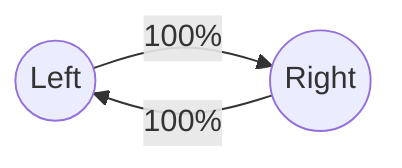
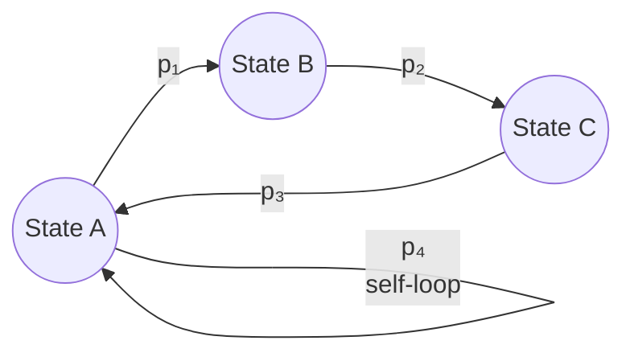

# 11.2.8 Period of a State

**Definition 11.2.8:** The **period** of state $i$ is the greatest common divisor (GCD) of the possible numbers of steps it can take to return to $i$ when starting at $i$:

$$d(i) = \gcd\{n \geq 1 : q_{ii}^{(n)} > 0\}$$

- A state is **aperiodic** if its period equals 1.
- A state is **periodic** if its period is greater than 1.
- The chain itself is aperiodic if **all** its states are aperiodic.

---

## The Periodic State

**The rigid schedule.** Imagine a map with only two rooms: Left ↔ Right, with forced alternation.

- From Left → must go to Right (100%)
- From Right → must go to Left (100%)

Possible return times to Left: $\{2, 4, 6, 8, \ldots\}$

$$\gcd\{2, 4, 6, 8, \ldots\} = 2$$

**Period = 2.** You are trapped on a strict, unbreakable rhythm. The door back only unlocks on steps 2, 4, 6, 8...

---

## The Aperiodic State

**The broken rhythm (Period = 1).** Add a third room so you can travel in a triangle.

- Loop back via back-and-forth: **2 steps**
- Loop around the whole triangle: **3 steps**

Possible return times: $\{2, 3, 4, 5, 6, \ldots\}$

$$\gcd\{2, 3, 4, 5, 6, \ldots\} = 1$$

**Period = 1.** The rigid rhythm is broken. You can return on any step — the timing is completely fluid.

> **Cheat Code:** If a state has a **self-loop** ($q_{ii} > 0$), it is **automatically aperiodic** (Period 1). Because you can "return" in exactly 1 step, and the $\gcd$ of any set of numbers containing 1 is always 1.

---

## Why the GCD is the Right Tool

The GCD detects the **underlying grid size** of the environment by understanding how loops combine.

**Scenario A — Trapped Grid (GCD > 1):**

Loops of 4 and 6 steps. Possible return times: $\{4, 6, 8, 10, 12, \ldots\}$

$\gcd(4, 6) = 2$ — every combination is a multiple of 2. You can **never** combine a 4-loop and a 6-loop to get an odd number. Permanently trapped on a grid size of 2.

**Scenario B — Broken Rhythm (GCD = 1):**

Loops of 5 and 7 steps. $\gcd(5, 7) = 1$.

Combinations: $\{5, 7, 10, 12, 14, 15, 17, \ldots\}$. After a while, every integer appears — the gaps fill completely. You can return on any step.

> **Why GCD and not average or minimum?** Because **loops stack** — you run them back-to-back. If the GCD of your loops is $d$, their combinations forever live on multiples of $d$. If the GCD is 1, combinations eventually fill every integer (this is known as the *Frobenius Coin Problem* or *Coin Problem* in number theory).

---

## Plain Definition of Period

> **The period of a state is the largest number $d$ that divides evenly into every possible number of steps it takes to return to that state.**

- **Period = $d$:** The door only materializes on multiples of $d$ (steps $d, 2d, 3d, \ldots$). Mathematically barred from returning on any "off-beat."
- **Period = 1 (Aperiodic):** The metronome is broken. You can return on any step.
