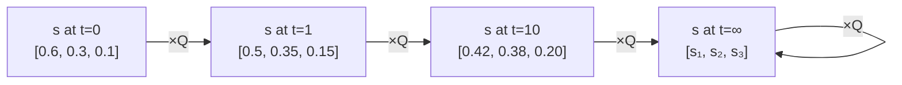
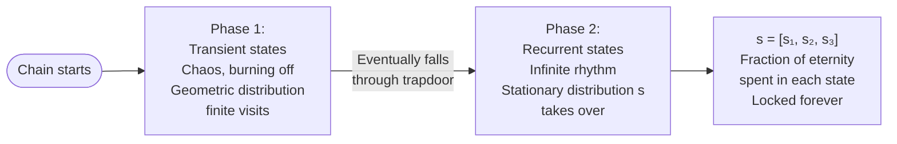
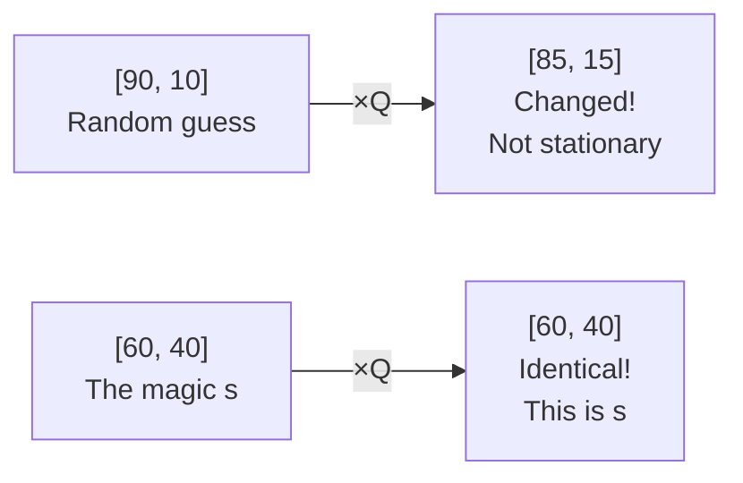
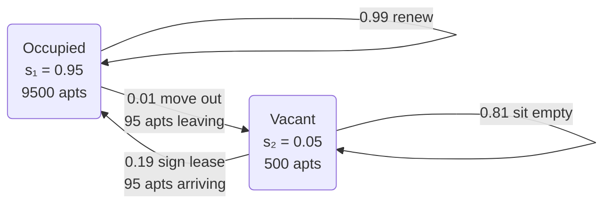

# 11.3 Stationary Distributions

When a Markov chain runs **forever**, all initial transient chaos washes away. The system reaches **mathematical equilibrium** — a state where the distribution stops changing with time.

This steady-state is the **stationary distribution** $s$ (often written as $\pi$ in textbooks) — a row vector giving the long-term fraction of time the agent spends in each state.

The equilibrium satisfies:

$$sQ = s \quad (\text{or } \pi Q = \pi)$$

**Read in English:** "Multiplying the steady-state distribution by the transition matrix returns the exact same steady-state distribution." Taking one more step in time changes **nothing**.

**Why this matters:** Instead of infinitely multiplying $Q \times Q \times Q \ldots$ to find behavior at step 10,000, you use **eigenvector decomposition** on $sQ = s$ to instantly calculate the infinite-time equilibrium of any stochastic system.

---

## The Bridge — From Topology to Long-Run Behavior

The textbook says:

> *"At first, the chain may spend time in transient states. Eventually though, the chain will spend all its time in recurrent states. But what fraction of the time will it spend in each of the recurrent states? This question is answered by the stationary distribution."*

This divides the life of a Markov chain into two phases:

### Phase 1 — The Burn-Off Period
When a simulation first starts, there is chaos. The chain spawns in transient states and bounces around. But as we proved with the Geometric distribution, transient states have a ticking clock. Eventually the chain falls through the final trapdoor into a recurrent class.

**The mathematical law:** In the true stationary distribution $s$, every single transient state has a value of **exactly 0**. The math deletes them from existence — across infinite time, the fraction of time spent there rounds down to zero.

### Phase 2 — The Infinite Rhythm
Now the chain is trapped in recurrent rooms. It bounces between them forever. But it will not visit them all equally — some rooms have many doors leading in but few leading out. The chain gets "stuck" there more often.

The stationary distribution vector $s$ is a list of percentages answering exactly this. For example, $s = [0.70, 0.20, 0.10]$ means the chain spends 70% of eternity in State 1, 20% in State 2, and 10% in State 3.

---

## 11.3.1 Definition of Stationary Distribution

**Definition:** A row vector $s = (s_1, \ldots, s_M)$ such that $s_i \geq 0$ and $\sum_i s_i = 1$ is a **stationary distribution** for a Markov chain with transition matrix $Q$ if:

$$\sum_i s_i q_{ij} = s_j \quad \text{for all } j$$

This system of linear equations can be written as one matrix equation:

$$sQ = s$$

### The Two Reality Checks
These are just the math police making sure your vector represents physical reality:
- **$s_i \geq 0$:** You cannot have a negative percentage of people in a room.
- **$\sum_i s_i = 1$:** All fractions across every state must add to exactly 1.0 (100% of the crowd).

### The Magic Equation — Plain English
$$\sum_i s_i q_{ij} = s_j$$

Breaking this down piece by piece using a museum crowd:

| Symbol | Plain meaning |
|---|---|
| $s_i$ | The number of people currently in Room $i$ |
| $q_{ij}$ | The fraction of people in Room $i$ who walk to Room $j$ |
| $s_i \times q_{ij}$ | The actual number of people walking from Room $i$ into Room $j$ right now |
| $\sum_i s_i q_{ij}$ | Add up everyone walking into Room $j$ from every room in the museum |
| $= s_j$ | That total equals exactly the crowd that was already in Room $j$ |

**What this physically means:**
Flow In = Flow Out. If Room 2 holds 30% of the crowd ($s_2 = 0.30$), then after all the chaotic shuffling through doors, exactly 30% of the crowd is still in Room 2. The room is in perfect, permanent balance.

Because this is true for "all $j$" — every single room — the entire map has stopped fluctuating. The system is completely frozen in equilibrium, even though individuals inside it are still moving.

### What sQ = s Actually Says in One Sentence
> **For any single room: add up all the people who just walked into it from everywhere else — that incoming group perfectly replaces the group that just walked out. The room's crowd size never changes.**

### Reading the Equation Out Loud
$\sum_i s_i q_{ij} = s_j$
**Read as:** "The sum over all $i$ of $s$ sub $i$ times $q$ sub $i$-$j$ equals $s$ sub $j$."
**Translation:** "Take the fraction of the crowd in each room $i$, multiply by the probability they walk to room $j$, add all those flows together — and that total equals the original fraction of the crowd that was already in room $j$."

As one matrix equation, $sQ = s$ reads: "The vector $s$ times the transition matrix $Q$ equals $s$ again." — Pressing "Play" on time returns the exact same distribution you started with.

---

## Ground Zero — What "Stationary" Actually Means

### Stationary Does NOT Mean Frozen
The biggest trap in probability is confusing "stationary" with "stopped."
- **A parked car is frozen.** Nothing moves. That is not what a Markov Chain is.
- **A water fountain is stationary.** Water is constantly shooting up, constantly falling down, individual molecules are moving at high speed — BUT the water level in each pool never goes up or down. Because water leaving a pool is instantly replaced by water entering, the overall shape of the fountain never changes.

This is **Dynamic Equilibrium** — the micro-level is chaotic, the macro-level is stationary.

### The Water Fountain Analogy
Imagine a fountain with two pools:
- **Pool 1** holds 60 gallons.
- **Pool 2** holds 40 gallons.
- Water constantly flows between them according to fixed pipe sizes.

Every second: some water drains from Pool 1 into Pool 2, and some water drains from Pool 2 into Pool 1.
If the pipe sizes are tuned so that the exact amount draining out of Pool 1 is replenished by what flows in from Pool 2 — and vice versa — then the water levels **never change**. The motion is constant, but the levels are permanently frozen.
That frozen state is the stationary distribution.

### The Three Variables Defined

| Variable | Name | What it is |
|---|---|---|
| $Q$ | The Pipes | The transition matrix. The physical plumbing of the fountain. Tells you what percentage of water flows from each pool to each other pool every second. **$Q$ never changes.** |
| $s$ | The Water Levels | The row vector. A list of the exact amount of water sitting in each pool right now. |
| $s \times Q$ | The Play Button | Take the water currently in the pools ($s$) and push it through the pipes ($Q$) for exactly one second. |

### Why We Multiply by Q Even Though s Is Stationary
*"If $s$ is not changing, why are we multiplying it by transition probabilities?"*

**Multiplying by $Q$ is the mathematical equivalent of pressing the "Play" button on time.** We have to press Play to *prove* that the system is immune to it.

Watch what happens:
- **Random water levels** $[90, 10]$: Press Play → result is $[85, 15]$. The levels changed. **Not stationary.**
- **The magic levels** $[60, 40]$: Press Play → result is $[60, 40]$. The levels did not change. **This is $s$.**

There is only one specific combination of water levels where the plumbing perfectly replaces what it drains. When you find that combination, you have found the stationary distribution.

$sQ = s$ is the mathematical way of saying: "When this specific distribution survives being pushed through the transition rules unchanged, we have reached equilibrium."

---

## The City Apartment Analogy

Imagine a city with 10,000 apartments. Every apartment is either **Occupied (State 1)** or **Vacant (State 2)**.

### What s Represents
$s$ is the **City Vacancy Report** on the Mayor's desk — the steady fraction of apartments in each state:

$$s = [0.95, \; 0.05]$$

- $s_1 = 0.95$: 95% of the city's apartments are Occupied.
- $s_2 = 0.05$: 5% of the city's apartments are Vacant.

### What Q Represents
$Q$ is the **Leasing and Eviction Rates** — the actual moving trucks. The rules of motion:

| From \ To | Occupied | Vacant |
|---|---|---|
| **Occupied** | $q_{11} = 0.99$ (tenant renews) | $q_{12} = 0.01$ (tenant moves out) |
| **Vacant** | $q_{21} = 0.19$ (new tenant signs) | $q_{22} = 0.81$ (sits empty) |

### The Equation in Action
To check that $s = [0.95, 0.05]$ is the stationary distribution, verify that flow in = flow out for each state:

**Flow into Occupied (State 1):**
$$s_1 \times q_{11} + s_2 \times q_{21} = 0.95 \times 0.99 + 0.05 \times 0.19 = 0.9405 + 0.0095 = 0.95 = s_1 \checkmark$$

**Flow into Vacant (State 2):**
$$s_1 \times q_{12} + s_2 \times q_{22} = 0.95 \times 0.01 + 0.05 \times 0.81 = 0.0095 + 0.0405 = 0.05 = s_2 \checkmark$$

### The Key Insight — Q Does Not Change, Its Transitions Cancel Out
- *"Q doesn't change"* — The leasing rate stays at 19%, the eviction rate stays at 1%. These are the fixed rules of the system.
- *"The transitions in Q happen"* — Moving trucks are physically driving around. Thousands of families are packing boxes every single month.
- *"And cancel each other out"* — Because the city is sitting at the perfect $s$ ratio (95% Occupied, 5% Vacant), the number of people triggered by the 1% move-out rule exactly matches the number triggered by the 19% move-in rule.

> The micro-level is total chaos (motion), but the macro-level net change is exactly zero. **There is motion, but the observed phenomenon is not changing.**

---

## What Each Dimension of s Means

If your stationary distribution is:

$$s = [s_1, s_2, s_3, \ldots, s_M]$$

Then each $s_j$ tells you **two physically identical things**:

**1 — The Time Average (The Journey):**
Over an infinite lifetime, $s_j$ is the exact percentage of total time the chain spends in state $j$.

**2 — The Snapshot Probability (The Freeze Frame):**
If you walk away, let the simulation run for a billion steps, then randomly pause it — $s_j$ is the exact probability that the chain is standing in state $j$ when you pause.

**Concrete example:** $s = [0.20, 0.50, 0.30]$

| State | $s_j$ | Journey meaning | Snapshot meaning |
|---|---|---|---|
| State A | 0.20 | 200,000 out of 1,000,000 steps spent here | 20% chance I am here if you pause randomly |
| State B | 0.50 | 500,000 steps spent here | 50% chance |
| State C | 0.30 | 300,000 steps spent here | 30% chance |

> **The Ergodic Theorem** is just saying these two meanings are identical. Textbooks give it a scary name but it is just this observation.

---

## 11.3.2 — Stationary Is Marginal, Not Conditional

The textbook says:
> *"When a Markov chain is at the stationary distribution, the unconditional PMF of $X_n$ equals $s$ for all $n$, but the conditional PMF of $X_n$ given $X_{n-1} = i$ is still encoded by the $i$-th row of the transition matrix $Q$."*

### Unconditional PMF = s (Zoomed Out)
**"Unconditional"** means you have zero information about the past.
- **City Apartment analogy:** A tourist walks in blindfolded and points at a random apartment. What are the odds someone lives there? With zero conditions, they rely on the macro-level statistic: $s_1 = 0.95$. The answer is 95% — because that is the long-run fraction of occupied apartments.
- **Weather analogy:** You look at a 100-year climate report. You see that 30% of days are rainy. That 30% is your unconditional, marginal probability. You are not conditioning on what yesterday's weather was.

### Conditional PMF = Q (Zoomed In)
**"Conditional"** means you have one specific piece of inside information: exactly what happened one step ago.
- **City Apartment analogy:** The landlord tells you "this specific apartment was Vacant last month." Suddenly the 95% macro-statistic is useless — you have inside information. Because of the Markov Property, you throw away $s$ and look directly at Row 2 of $Q$: $q_{21} = 0.19$. The odds of this apartment being occupied now are only 19%.
- **Weather analogy:** You look out the window and see it is raining today ($X_{n-1} = \text{Rain}$). The long-term average of 30% no longer helps you. You look at Row "Rain" in $Q$ and see there is an 80% chance of rain tomorrow.

### Why They Are Different
The textbook says *"since the conditional distribution of $X_n$ given $X_{n-1} = i$ is, in general, different from the marginal distribution of $X_n$."*

This is just pointing out a mathematical inequality: $q_{ij}$ is usually **not equal** to $s_j$.

| | Value | Meaning |
|---|---|---|
| $s_j$ (marginal) | 30% | The city averages 30% rainy days a year. |
| $q_{\text{Rain},\text{Rain}}$ (conditional) | 80% | If it rains today, 80% chance it rains tomorrow. |

Since $80\% \neq 30\%$, knowing yesterday's state dramatically changes your math. The variables are **not independent** — yesterday's state still matters for tomorrow, even though the long-run average is stable.

### Is Marginal Short-Sighted?
Actually the exact opposite:

| | What it looks at | Scope |
|---|---|---|
| **Conditional ($Q$)** | Exactly what happened one step ago — the immediate next move | Short-sighted, zoomed in |
| **Marginal ($s$)** | The infinite, long-run average of the entire system | Far-sighted, zoomed out |

---

## 11.3.3 — Sympathetic Magic Warning

The textbook says:
> *"If a Markov chain starts at the stationary distribution, then all of the $X_n$ are identically distributed (since they have the same marginal distribution $s$), but they are not necessarily independent, since the conditional distribution of $X_n$ given $X_{n-1} = i$ is, in general, different from the marginal distribution of $X_n$. Confusing the random variables $X_n$ with their distributions is an example of sympathetic magic."*

- **"Identically distributed" (The Blueprint):** The statistical forecast for Day 1, Day 50, and Day 1,000 is identically frozen at 30% Rain, 70% Sun. The marginal probability is the same every day.
- **"Not independent" (The Actual Building):** $X_n$ is the **physical weather that actually happens** on a specific day. Day 1 might be Rain, Day 2 might be Sun. The specific realizations are constantly changing and depend on each other through $Q$.
- **"Sympathetic magic":** This is an anthropology term — like believing a voodoo doll shares the physical reality of the person it represents. The textbook is warning: do not confuse the statistical probability (the distribution $s$) with the actual physical event ($X_n$).

Just because the forecast is 30% rain every day does not mean every day must have the same weather. The macro-statistics are frozen, but the micro-reality is still chaotically bouncing around.
The unconditional distribution only looks stationary from the outside because the $X_{n-1} \to X_n$ transitions have been incorporated into $s$ and are no longer visibly impacting $Q$. The micro-conditions are still happening every second — they have just reached a point where they perfectly cancel each other out at the macro scale.
