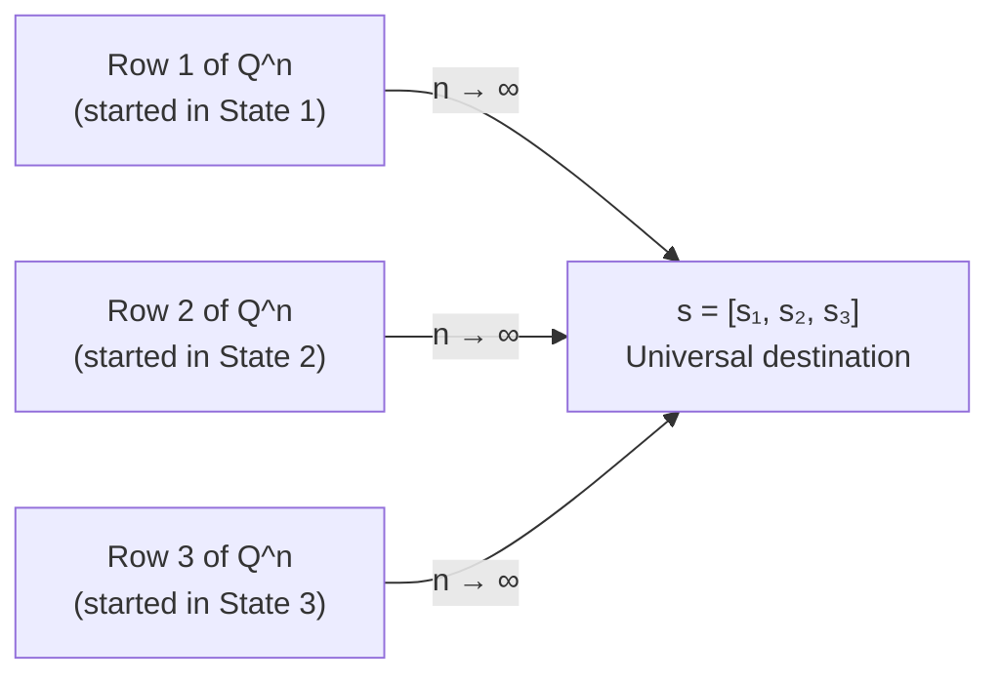

# 11.3.6 Convergence to Stationary Distribution

## The Relationship Between s and Q^n

### The n-Step Distribution vs The Stationary Distribution
Is the row vector $s$ the distribution after $n$ steps? **No — $s$ is the distribution after INFINITE steps.**

| Concept | Formula | What it gives you |
|---|---|---|
| **$n$-step distribution** | $tQ^n$ | Given your starting vector $t$, the exact probability distribution of where you are at step $n$. Changes with $n$. |
| **Stationary distribution $s$** | $sQ = s$ | The final, locked-in row that the $n$-step distribution converges to as $n \to \infty$. Never changes once reached. |

- **The journey:** If you compute $tQ^n$ for $n = 1, 2, 3, 10, 100, 1000$ — the resulting row vector keeps changing. The probabilities swing around as the system finds its balance.
- **The destination:** As $n \to \infty$, the swinging completely stops. The row vector locks into $s$.

---

## s Is a Row of Q Raised to a Very Large n

$s$ is exactly a row of $Q$ raised to a very large $n$ ($Q^\infty$). When you fast-forward time by raising $Q$ to a massive power, every single row in that matrix turns into $s$:

$$Q^\infty = \begin{pmatrix} s_1 & s_2 & s_3 \\ s_1 & s_2 & s_3 \\ s_1 & s_2 & s_3 \end{pmatrix}$$

The matrix collapses into a giant copy-paste machine. Every row is identical.

---

## Why Every Row of Q^∞ Becomes the Same s

Why doesn't each starting state get its own $s$?
- **In the short term** ($Q^2$ or $Q^{10}$), the rows are different — your starting point matters.
- **At infinity**, the system develops **total mathematical amnesia**. The chain has been shuffling around for so long that the starting point is completely erased.

It doesn't matter if you started in State 1, 2, or 3. The infinite-future probabilities are identical for everyone.

> The magic of $s$ is that it is a **universal gravitational pull** — no matter which row you start in, $Q^\infty$ drags every single one to the exact same destination.

---

## Why Rows Cannot All Be Same If Chain Is Reducible

If State 3 is an isolated island with no connection to States 1 and 2:
- **Row 1** (started in State 1): $[\ldots, \ldots, 0.00]$ — the 3rd entry is permanently 0 (no path to State 3).
- **Row 3** (started on Island): $[0.00, 0.00, 1.00]$ — permanently stuck on the island.

These rows are **physically incapable of being identical** because the lack of connecting paths prevents the transfer of probabilities.

Because the rows do not converge to the same $s$, there is **no single universal stationary distribution**. The final statistics depend on where the agent started.

> When a textbook demands **Irreducibility** before finding the stationary distribution, it is just saying: *"Check the map first — make sure every pool is physically connected to the same plumbing system."*

---

## The Two Ways to Reach s

Do we evolve the row vector step by step, or evolve $Q$ first? **Both give the same result.**

### Option 1 — Evolve the Row (The Simulation Approach)

$$t \times Q = \text{Day 1 row}$$
$$\text{Day 1 row} \times Q = \text{Day 2 row}$$
$$\text{Day 2 row} \times Q = \text{Day 3 row}$$
$$\vdots$$
$$\text{Eventually} \to s$$

Think of this as a step-by-step walk through time. You keep updating the row vector every step, iteratively refining your belief about where the system is. Every time you multiply by $Q$, you are taking one step into the future and updating your probability estimate. Eventually the vector hits $s$ and stops changing — the belief has fully settled.

**Intuition:** This is exactly like running a simulation — you watch the system evolve round by round until it stabilizes. The row vector at each step is your current best guess of which state you are in.

### Option 2 — Evolve the Matrix (The Structural Approach)

$$Q^n \quad \text{for very large } n$$

Leave your starting row completely alone. Instead of moving a single vector through time, you are analyzing the *nature* of the transition matrix $Q$ itself by raising it to a massive power. Fast-forward $Q$ to $Q^\infty$. Because $Q^\infty$ is a stack of identical $s$ rows, any starting vector multiplied by it just returns $s$.

**Intuition:** This is like looking at the long-term outcome regardless of where you started. You are not simulating a path — you are asking what $Q$ structurally *becomes* over infinite time. No matter what your starting vector $t$ is, once it hits this copy-paste matrix, the result is always $s$.

### Why They Are Identical

Matrix multiplication is **associative**: $(t \times Q) \times Q = t \times (Q \times Q)$. The parentheses can move anywhere. Option 1 is $((tQ)Q)Q\ldots$ and Option 2 is $t(QQ\ldots Q)$. Same computation, different order of operations — the simulation path and the structural path are two views of exactly the same arithmetic.

---

## The Mathematical Amnesia — Why the Starting Point Gets Erased

In the short term, where you start ($t$) matters significantly — the rows of $Q^2$ or $Q^{10}$ are all different. But in the long term ($Q^\infty$), the internal structure of the transitions is so strong that the system eventually forgets its starting point entirely and converges to the same stable proportion $s$, regardless of initial conditions.

This is not just a curiosity — it is what makes Markov processes **predictable over long horizons**. The convergence of $tQ^n \to s$ regardless of $t$ is a foundational pillar of how we understand long-run behavior in stochastic systems, including Reinforcement Learning, where an agent's policy evaluation relies on the fact that the chain will settle into the same stationary distribution no matter which state the agent happened to start in.

> The amnesia is total and mathematical: not "the starting point matters less over time" but "the starting point contributes exactly zero to the limit."
