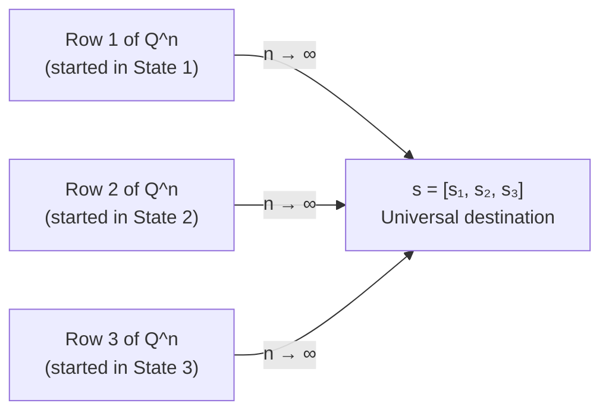

# 11.3.6 Convergence to Stationary Distribution

## The Relationship Between s and Q^n

### The n-Step Distribution vs The Stationary Distribution
Is the row vector $s$ the distribution after $n$ steps? **No — $s$ is the distribution after INFINITE steps.**

| Concept | Formula | What it gives you |
|---|---|---|
| **$n$-step distribution** | $tQ^n$ | Given your starting vector $t$, the exact probability distribution of where you are at step $n$. Changes with $n$. |
| **Stationary distribution $s$** | $sQ = s$ | The final, locked-in row that the $n$-step distribution converges to as $n \to \infty$. Never changes once reached. |

- **The journey:** If you compute $tQ^n$ for $n = 1, 2, 3, 10, 100, 1000$ — the resulting row vector keeps changing. The probabilities swing around as the system finds its balance.
- **The destination:** As $n \to \infty$, the swinging completely stops. The row vector locks into $s$.

---

## s Is a Row of Q Raised to a Very Large n

$s$ is exactly a row of $Q$ raised to a very large $n$ ($Q^\infty$). When you fast-forward time by raising $Q$ to a massive power, every single row in that matrix turns into $s$:

$$Q^\infty = \begin{pmatrix} s_1 & s_2 & s_3 \\ s_1 & s_2 & s_3 \\ s_1 & s_2 & s_3 \end{pmatrix}$$

The matrix collapses into a giant copy-paste machine. Every row is identical.

---

## Why Every Row of Q^∞ Becomes the Same s

Why doesn't each starting state get its own $s$?
- **In the short term** ($Q^2$ or $Q^{10}$), the rows are different — your starting point matters.
- **At infinity**, the system develops **total mathematical amnesia**. The chain has been shuffling around for so long that the starting point is completely erased.

It doesn't matter if you started in State 1, 2, or 3. The infinite-future probabilities are identical for everyone.

> The magic of $s$ is that it is a **universal gravitational pull** — no matter which row you start in, $Q^\infty$ drags every single one to the exact same destination.

---

## Why Rows Cannot All Be Same If Chain Is Reducible

If State 3 is an isolated island with no connection to States 1 and 2:
- **Row 1** (started in State 1): $[\ldots, \ldots, 0.00]$ — the 3rd entry is permanently 0 (no path to State 3).
- **Row 3** (started on Island): $[0.00, 0.00, 1.00]$ — permanently stuck on the island.

These rows are **physically incapable of being identical** because the lack of connecting paths prevents the transfer of probabilities. 

Because the rows do not converge to the same $s$, there is **no single universal stationary distribution**. The final statistics depend on where the agent started.

> When a textbook demands **Irreducibility** before finding the stationary distribution, it is just saying: *"Check the map first — make sure every pool is physically connected to the same plumbing system."*

---

## The Two Ways to Reach s

Do we evolve the row vector step by step, or evolve $Q$ first? **Both give the same result:**

### Option 1 — Evolve the row (real-time)
$$t \times Q = \text{Day 1 row}$$
$$\text{Day 1 row} \times Q = \text{Day 2 row}$$
$$\text{Day 2 row} \times Q = \text{Day 3 row}$$
$$\vdots$$
$$\text{Eventually} \to s$$
You keep updating the row vector every step. Eventually it hits $s$ and stops changing.

### Option 2 — Evolve the matrix (fast-forward)
$$Q^n \quad \text{for very large } n$$
Leave your starting row completely alone. Fast-forward $Q$ to $Q^\infty$. Because $Q^\infty$ is a stack of identical $s$ rows, any starting vector multiplied by it just returns $s$.

### Why they are identical
Matrix multiplication is **associative**: $(t \times Q) \times Q = t \times (Q \times Q)$. The parentheses can move anywhere. Option 1 is $((tQ)Q)Q\ldots$ and Option 2 is $t(QQ\ldots Q)$. Same computation, different order of operations.
