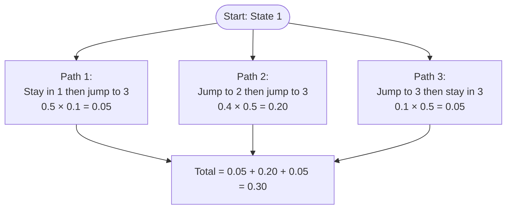
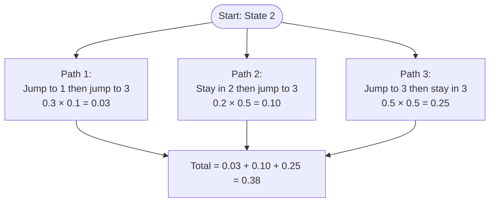
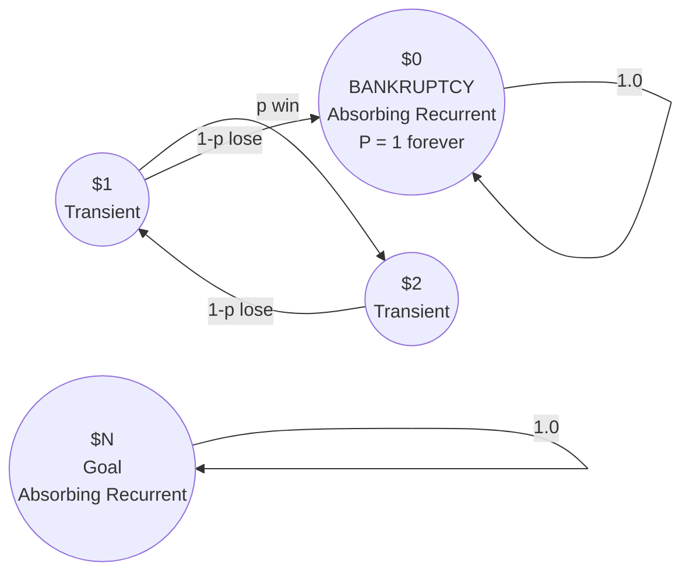
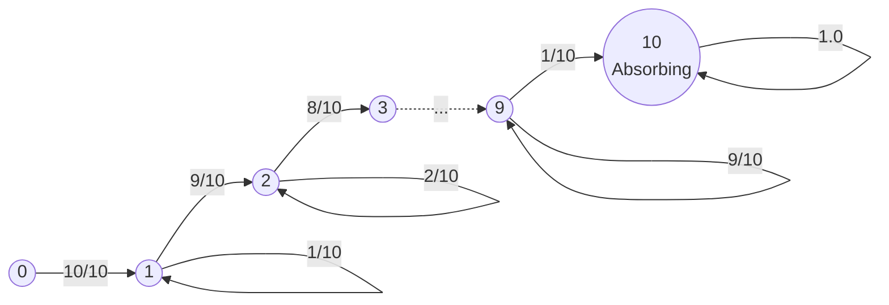
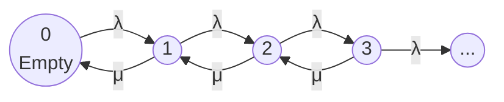
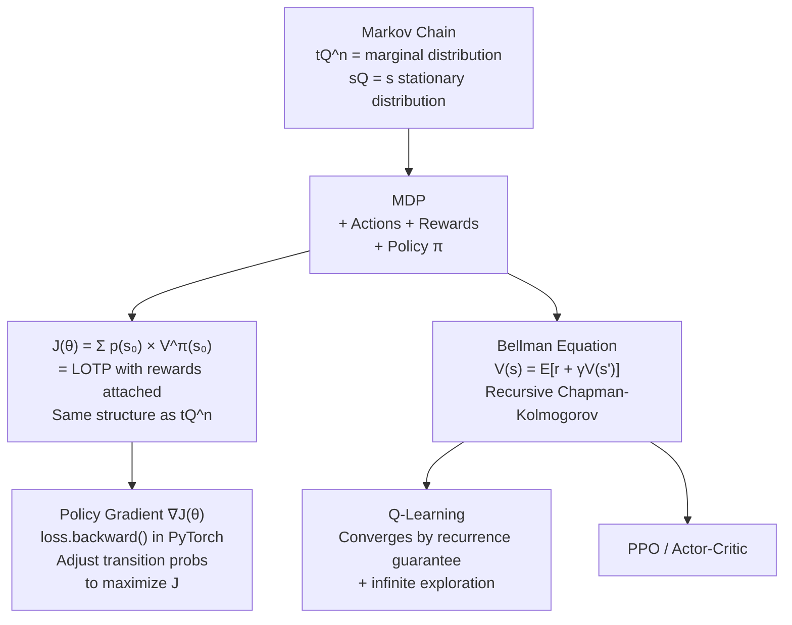

# Worked Examples & Applications

## 1. Reaching State C in 2 Steps

This example demonstrates how to compute $n$-step transition probabilities using the Chapman-Kolmogorov equations.

Given the transition matrix:

$$P = \begin{pmatrix} 0.5 & 0.4 & 0.1 \\ 0.3 & 0.2 & 0.5 \\ 0.2 & 0.3 & 0.5 \end{pmatrix}$$

### Scenario A — Starting from State 1, reach State 3 in 2 steps
To go from State 1 to State 3 in exactly 2 steps, we must pass through an intermediate state $k \in \{1, 2, 3\}$ at step 1.

We sum the probabilities of the three possible paths:
- **Path 1 (via State 1):** Stay in 1, then jump to 3 $\to 0.5 \times 0.1 = 0.05$
- **Path 2 (via State 2):** Jump to 2, then jump to 3 $\to 0.4 \times 0.5 = 0.20$
- **Path 3 (via State 3):** Jump to 3, then stay in 3 $\to 0.1 \times 0.5 = 0.05$

$$P(X_2 = 3 \mid X_0 = 1) = 0.05 + 0.20 + 0.05 = 0.30$$

> **Intuition:** The most likely path is bouncing through State 2 first, because the links $1 \to 2$ and $2 \to 3$ are relatively strong.

### Scenario B — Starting from State 2, reach State 3 in 2 steps
We sum the paths starting from State 2:
- **Path 1 (via State 1):** Jump to 1, then jump to 3 $\to 0.3 \times 0.1 = 0.03$
- **Path 2 (via State 2):** Stay in 2, then jump to 3 $\to 0.2 \times 0.5 = 0.10$
- **Path 3 (via State 3):** Jump to 3, then stay in 3 $\to 0.5 \times 0.5 = 0.25$

$$P(X_2 = 3 \mid X_0 = 2) = 0.03 + 0.10 + 0.25 = 0.38$$

Starting in State 2 gives a higher probability (38%) of reaching State 3 in two steps than starting in State 1 (30%).

---

## 2. The Gambler's Ruin

A casino betting game is a classic example of a **reducible** Markov Chain. 

### Setup & Topology
Suppose a gambler starts with $i$ dollars and bets $1$ dollar at a time, winning with probability $p$ and losing with probability $1-p$. The game ends when they reach $0$ dollars (bankruptcy) or $N$ dollars (the goal).

State space: $\{0, 1, 2, \ldots, N\}$

- **State 0 (Bankruptcy) & State N (Goal):** These are **absorbing recurrent states**. Once entered, the chain stays there forever ($q_{00} = 1.0, q_{NN} = 1.0$).
- **States 1 through N-1:** These are **transient states**. Because there is a positive probability of eventually slipping into one of the absorbing states, the chain will eventually leave these states forever.

### The Math: Why the House Always Wins
If the game has no winning limit $N$ (the gambler plays infinitely against a casino with an infinite bankroll):
- States $\{1, 2, 3, \ldots\}$ are all transient.
- The relentless grinding of infinite time guarantees the gambler must eventually fall into the only recurrent trapdoor: **State 0 (Bankruptcy)**.
- The probability of eventual ruin is **exactly 1.0** (assuming $p \le 0.5$, which is true for all casino games).

> **Why is this chain reducible?** Once you reach State 0, you cannot travel back to any money state. The full-connectivity condition is broken.

---

## 3. The Coupon Collector as a Markov Chain

A restaurant releases $C = 10$ different toys. Every meal gives 1 random toy (equal probability, with replacement). We track our progress as a Markov Chain.

### State Space
Let $X_n$ be the number of **distinct** toy types collected after $n$ attempts.
State space: $\{0, 1, 2, \ldots, C\}$

### The Amnesia Test
If you are in State 4 (you own 4 unique toys), the probability of collecting a new one on the next meal is exactly $\frac{6}{10}$. It does not matter whether you bought 4 meals to get those toys, or 500 meals with terrible luck. The history is completely irrelevant — only the current state matters. Thus, this is a Markov Chain.

### Transition Mechanics
- **Probability of moving forward:** $P(k \to k+1) = \frac{C-k}{C}$
- **Probability of staying at same progress:** $P(k \to k) = \frac{k}{C}$

- **States 0–9:** Transient — there is always a positive probability of gaining a new toy and moving forward.
- **State 10 ($C$):** Absorbing Recurrent — once you have all 10, any new purchase yields a duplicate. $P(10 \to 10) = 1.0$.

---

## 4. Queueing Theory

Queueing Theory is a premier real-world application of **Continuous-Time, Discrete-State Markov Chains (CTMC)**.

### Core Variables

| Symbol | Name | Example |
|---|---|---|
| $\lambda$ | Arrival Rate | 500 network packets/second entering the system |
| $\mu$ | Service Rate | Your server can process 600 packets/second |
| $\rho = \lambda / \mu$ | Traffic Intensity / Utilization | $500/600 \approx 0.83$ |

### The Stability Condition
- $\rho < 1$: The system is **stable** — the server keeps up.
- $\rho \geq 1$: The queue length grows **to infinity** — the buffer overflows (e.g., OOM errors).

### The M/M/1 Queue (Kendall's Notation A/S/c)

| Letter | Meaning |
|---|---|
| **M (Arrivals)** | Markovian (Memoryless) — requests arrive as a Poisson process |
| **M (Service)** | Markovian — service times are exponentially distributed |
| **1 (Servers)** | One node processing the queue |

The state of an M/M/1 queue (number of items in the buffer) represents the transition probabilities of a CTMC jumping between states $0, 1, 2, 3, \ldots$:

### Little's Law — The Crown Jewel
$$L = \lambda W$$

- $L$: Average number of items **in the system** (queue + server).
- $\lambda$: Average **arrival rate**.
- $W$: Average **time** an item spends in the system.

This law holds for **any** queueing system, regardless of arrival distribution, service discipline (FIFO, LIFO), or network architecture.

---

## 5. Connection to Reinforcement Learning

Markov chains form the bedrock of Reinforcement Learning (RL) and Markov Decision Processes (MDPs).

### The Markov Chain $\to$ MDP Bridge

| Markov Chain | MDP Addition | Result |
|---|---|---|
| **States $S$** | + Actions $A$ | The agent chooses which transition matrix to apply. |
| **Transition Matrix $Q$** | + Rewards $R$ | The agent is incentivized to prefer certain states. |
| **Marginal Distribution $tQ^n$** | + Policy $\pi$ | The agent learns a policy $\pi(a \mid s)$ that dictates behavior. |

### The Policy Gradient Objective
The policy gradient objective function $J(\theta)$ aims to maximize the expected sum of future rewards starting from spawn states:

$$J(\theta) = \sum_{s_0} p(s_0) \cdot V^{\pi_\theta}(s_0)$$

This uses the same AND/OR structure as the Law of Total Probability ($tQ^n$):

| Symbol | Meaning | Markov Chain Equivalent |
|---|---|---|
| $p(s_0)$ | Spawn probability | $t_i = P(X_0 = i)$ |
| $V^{\pi_\theta}(s_0)$ | Value Function — expected future rewards | $\sum_j q_{ij}^{(n)}$ weighted by rewards |
| $\sum_{s_0}$ | Sum over all starting states | $\sum_{i=1}^{M}$ |

### The Bellman Equation
The Bellman Equation decomposes value functions recursively by conditioning on the current state:

$$V(s) = \mathbb{E}[R_{t+1} + \gamma V(s') \mid S_t = s] = \sum_a \pi(a \mid s) \sum_{s'} P(s' \mid s, a) \left[ R(s, a, s') + \gamma V(s') \right]$$

This is a recursive form of the Chapman-Kolmogorov summation, sweeping through state transitions and weighting them by likelihood.

### Why RL Algorithms Converge
- **The Geometric distribution proof** guarantees that transient states are eventually escaped.
- **Proposition 11.2.4** guarantees that all states in a finite, irreducible chain are visited infinitely often.
- This ensures that as long as the agent continues to explore (e.g., via $\epsilon$-greedy actions), it will visit every state-action pair infinitely many times, guaranteeing that algorithms like Q-learning converge to the true optimal value functions.
