# Chapter 11 — Markov Chains
> *Introduction to Probability* — Blitzstein & Hwang

---

## Table of Contents

- [11.1 Markov Property and Transition Matrix](#111-markov-property-and-transition-matrix)
  - [What is a Markov Chain?](#what-is-a-markov-chain)
  - [The Markov Property — Formal Definition](#the-markov-property--formal-definition)
  - [The Transition Matrix Q](#the-transition-matrix-q)
  - [How to Read Q in Plain English](#how-to-read-q-in-plain-english)
  - [The n-Step Transition Matrix Q^n](#the-n-step-transition-matrix-qn)
- [11.1.6 Marginal Distribution of X_n](#1116-marginal-distribution-of-xn)
  - [The Initial Vector t](#the-initial-vector-t)
  - [LOTP — The Law of Total Probability](#lotp--the-law-of-total-probability)
  - [The Battle Royale Intuition](#the-battle-royale-intuition)
  - [Proposition 11.1.6 — Full Proof Decomposed](#proposition-1116--full-proof-decomposed)
  - [Reading the Proof Out Loud in English](#reading-the-proof-out-loud-in-english)
- [The Chapman-Kolmogorov Summation](#the-chapman-kolmogorov-summation)
  - [Why We Multiply (The AND Rule)](#why-we-multiply-the-and-rule)
  - [Why We Sum (The OR Rule)](#why-we-sum-the-or-rule)
  - [The Linear Algebra Connection](#the-linear-algebra-connection)
  - [Worked Example — Reaching State C in 2 Steps](#worked-example--reaching-state-c-in-2-steps)
- [11.2 Classification of States](#112-classification-of-states)
  - [Recurrent States](#recurrent-states)
  - [Transient States](#transient-states)
  - [The Geometric Distribution Proof](#the-geometric-distribution-proof)
  - [Proposition 11.2.4 — Irreducible Chains](#proposition-1124--irreducible-chains)
  - [The Converse is False — Two Islands](#the-converse-is-false--two-islands)
  - [Topology Cheat Sheet](#topology-cheat-sheet)
- [11.2.8 Period of a State](#1128-period-of-a-state)
  - [The Periodic State](#the-periodic-state)
  - [The Aperiodic State](#the-aperiodic-state)
  - [Why the GCD is the Right Tool](#why-the-gcd-is-the-right-tool)
  - [Plain Definition of Period](#plain-definition-of-period)
- [Stationary Distribution](#stationary-distribution)
- [Applications](#applications)
  - [The Gambler's Ruin](#the-gamblers-ruin)
  - [The Coupon Collector as a Markov Chain](#the-coupon-collector-as-a-markov-chain)
  - [Queueing Theory](#queueing-theory)
  - [Connection to Reinforcement Learning](#connection-to-reinforcement-learning)

---

# 11.1 Markov Property and Transition Matrix

## What is a Markov Chain?

A **Markov Chain** is a sequence of random variables $X_0, X_1, X_2, \ldots$ where the conditions for something to be a Markov chain are:

1. It must be a **sequence of conditionally independent random variables**
2. Each variable is conditioned **only on the present** — not on the full history

> **Core Rule:** The future is conditionally independent of the past, given the present.

Think of it as a system with **absolute amnesia**. No matter how you arrived at a state, only where you are *right now* determines where you go next.

---

## The Markov Property — Formal Definition

$$P(X_{n+1} \mid X_n, X_{n-1}, X_{n-2}, \ldots, X_0) = P(X_{n+1} \mid X_n)$$

**Read in English:** "The probability of the next state, given the entire history, equals the probability of the next state given only the current state."

**Physical meaning:** If you are in State 4 of the Coupon Collector game (you have 4 unique toys), your odds of getting a new toy are exactly $\frac{6}{10}$ — regardless of whether you bought 4 meals to get there, or 500 meals and were horribly unlucky. The history is completely irrelevant.

> If a system requires you to look at its **history** to predict its next move, it is **not** a Markov Chain.

---

## The Transition Matrix Q

The **transition matrix** $Q$ (or $P$) is an $M \times M$ matrix where:

- **Rows** = the state you are currently in
- **Columns** = the state you will move to
- **Entry $q_{ij}$** = the probability of jumping from state $i$ to state $j$ in one step

**Critical rule:** Every single row must sum to **exactly 1.0** — because the agent must go somewhere (even if it stays).

**Example — 3-state system:**

$$Q = \begin{pmatrix} 0.5 & 0.4 & 0.1 \\ 0.3 & 0.2 & 0.5 \\ 0.2 & 0.3 & 0.5 \end{pmatrix}$$

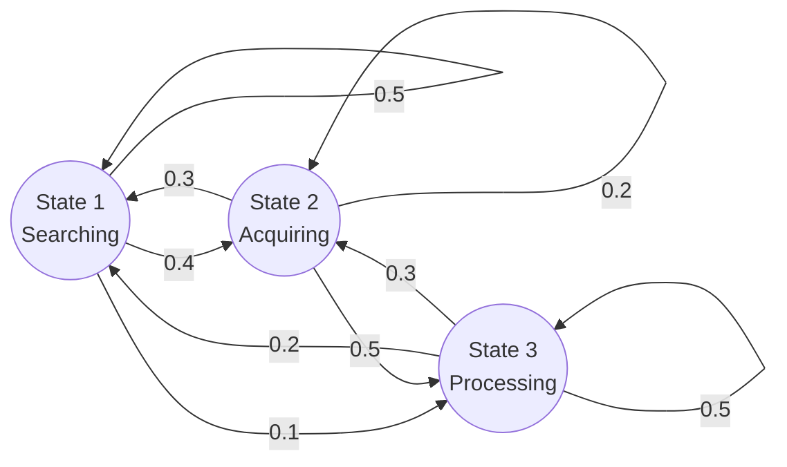

---

## How to Read Q in Plain English

Using the language of Chapter 7, the transition matrix $Q$ **encodes the conditional distribution of $X_1$ given the initial state of the chain**.

- The **$i$-th row** of $Q$ is the conditional PMF of $X_1$ given $X_0 = i$, displayed as a row vector
- The **$i$-th row** of $Q^n$ is the conditional PMF of $X_n$ given $X_0 = i$

**Example:** If the agent starts in State 3 ($X_0 = 3$), only the **3rd row** matters: $[0.2, 0.3, 0.5]$. This tells us there is a 20% chance of jumping to State 1, 30% to State 2, and 50% of staying in State 3. Rows 1 and 2 belong to **alternate timelines** where the agent spawned elsewhere — they are irrelevant.

> The vertical bar $\mid$ in $P(X_n = j \mid X_0 = i)$ is universally read as **"given that"** or **"conditioned on."** It acts as a mathematical filter.

---

## The n-Step Transition Matrix Q^n

You do not need to simulate $n$ steps manually. You **raise the matrix to the power $n$**:

$$Q^1 = \text{PMFs for exactly 1 step into the future}$$
$$Q^2 = \text{PMFs for exactly 2 steps into the future}$$
$$Q^n = \text{PMFs for exactly } n \text{ steps into the future}$$

If you compute $Q^{10}$ and look at Row 1, that row gives the exact probability distribution of finding the agent in each state, **assuming it started in State 1 exactly ten clock cycles ago**.

> You calculate the whole matrix to build the engine, but you only ever extract the **specific row you are conditioned on** to run the prediction.

---

# 11.1.6 Marginal Distribution of X_n

## The Initial Vector t

Up until now every equation had a $\mid$ bar — we always *knew* the starting state. But in real systems, you rarely have perfect information about where things began.

The **initial vector** $t = (t_1, t_2, \ldots, t_M)$ is the **spawn distribution**, where:

$$t_i = P(X_0 = i)$$

This is a $1 \times M$ row vector. Instead of saying "the agent starts in State 1," you say "the agent starts with a 50% chance of being in State 1 and a 50% chance of being in State 2":

$$t = [0.5,\ 0.5,\ 0.0]$$

---

## LOTP — The Law of Total Probability

To find the **marginal** (absolute, unconditioned) probability of being in state $j$ at time $n$:

$$P(X_n = j) = \sum_{i=1}^{M} P(X_0 = i) \cdot P(X_n = j \mid X_0 = i) = \sum_{i=1}^{M} t_i \cdot q_{ij}^{(n)}$$

**Read out loud in English:**
> "The probability that $X$ sub $n$ equals $j$... equals the sum from $i$ equals one to $M$... of the probability that $X$ sub zero equals $i$... times the probability that $X$ sub $n$ equals $j$, **given that** $X$ sub zero equals $i$."

This summation is the **weighted average** over all possible starting timelines.

---

## The Battle Royale Intuition

Imagine 100 players dropping into a map with 3 spawn zones. We want the absolute probability of a random player reaching the **Final Circle (State 3)**.

**The two pieces:**

| Symbol | Name | Meaning |
|---|---|---|
| $P(X_n = j \mid X_0 = i)$ | Transition Probability | If you spawn at Zone $i$, what are your odds of reaching Final Circle $j$? |
| $P(X_0 = i) = t_i$ | Spawn Probability | What fraction of the lobby actually dropped at Zone $i$? |

**Concrete numbers:**

| Zone | Spawn % | Survival Rate | Contribution |
|---|---|---|---|
| Zone 1 | 60% | 10% | $0.60 \times 0.10 = 0.06$ |
| Zone 2 | 40% | 50% | $0.40 \times 0.50 = 0.20$ |
| Zone 3 | 0% | 90% | $0.00 \times 0.90 = 0.00$ |
| **Total** | | | **0.26 (26%)** |

> **Core intuition:** You take the probability of moving from $i$ to $j$, then **multiply** by the probability of starting there in the first place. You cannot just look at survival rates in a vacuum — Zone 3 has a 90% rate but nobody spawned there, so it contributes nothing.

---

## Proposition 11.1.6 — Full Proof Decomposed

**Proposition:** Define $t = (t_1, t_2, \ldots, t_M)$ by $t_i = P(X_0 = i)$, viewed as a row vector. Then the marginal distribution of $X_n$ is given by the vector $tQ^n$. That is, the $j$-th component of $tQ^n$ is $P(X_n = j)$.

**Proof:**

$$P(X_n = j) = \sum_{i=1}^{M} P(X_0 = i) \cdot P(X_n = j \mid X_0 = i) = \sum_{i=1}^{M} t_i \cdot q_{ij}^{(n)}$$

which is the $j$-th component of $tQ^n$ by definition of matrix multiplication. $\blacksquare$

**Symbol-by-symbol breakdown:**

| Symbol | Professor Speak | Plain English |
|---|---|---|
| $P(X_n = j)$ | "The probability that $X$ sub $n$ equals $j$" | The absolute probability that the agent ends up in State $j$ exactly $n$ steps from now |
| $\sum_{i=1}^{M}$ | "The sum, from $i$ equals one to $M$, of..." | Run a loop through every possible starting state and add the results together |
| $P(X_0 = i)$ or $t_i$ | "The probability that $X$ sub zero equals $i$" | The chance the agent originally spawned in State $i$ |
| $P(X_n = j \mid X_0 = i)$ | "The probability that $X_n$ equals $j$, **given that** $X_0$ equals $i$" | Assuming the agent started in State $i$, what are its odds of reaching State $j$? |
| $q_{ij}^{(n)}$ | "q sub $i$-$j$, superscript $n$" | Go to our $n$-step matrix $Q^n$, find the number in row $i$, column $j$ |
| $tQ^n$ | "The vector $t$ times the matrix $Q$ to the $n$-th power" | Take the starting reality vector and crash it through our fast-forwarded probability matrix via a dot product |

---

## Reading the Proof Out Loud in English

> "To find the total probability of ending up in state $j$ at time step $n$ ($P(X_n = j)$) — we sum up ($\Sigma$) the parallel timelines for every possible starting state $i$ — by multiplying the probability that we actually spawned in state $i$ ($P(X_0 = i)$) — by the conditional probability of reaching state $j$ given that we started in $i$ ($P(X_n = j \mid X_0 = i)$). This is mathematically identical to taking the $i$-th element of our starting vector ($t_i$) and multiplying it by the $i,j$ entry of our $n$-step transition matrix ($q_{ij}^{(n)}$) — which, by definition, is exactly how you calculate the $j$-th component of a vector-matrix dot product ($tQ^n$)."

---

# The Chapman-Kolmogorov Summation

## Why We Multiply (The AND Rule)

You are at starting state $i$. You want to reach destination state $j$ in **exactly two steps**. After step 1, you must land in some intermediate state $k$.

To complete one specific route through $k$, **two things must happen in sequence**:

1. Jump from $i \to k$ — Probability: $q_{ik}$
2. **AND** then jump from $k \to j$ — Probability: $q_{kj}$

In probability, **AND** means **multiply**:

$$\text{Path probability through } k = q_{ik} \times q_{kj}$$

---

## Why We Sum (The OR Rule)

$k$ is just a placeholder — it could be **any** state in the entire state space. In a 3-state system, you have three parallel paths to reach $j$ in 2 steps:

- Path via State 1: $i \to 1 \to j$
- **OR** Path via State 2: $i \to 2 \to j$
- **OR** Path via State 3: $i \to 3 \to j$

In probability, mutually exclusive alternatives (**OR**) are **added**:

$$q_{ij}^{(2)} = (q_{i1} \times q_{1j}) + (q_{i2} \times q_{2j}) + (q_{i3} \times q_{3j}) = \sum_k q_{ik} \cdot q_{kj}$$

> **The core insight:** We are summing the probabilities of every possible **parallel universe** that successfully gets us from start state to end state.

---

## The Linear Algebra Connection

That summation $\sum_k q_{ik} \cdot q_{kj}$ is **literally the formula for a dot product**:

- Take the **$i$-th row** of matrix $Q$ (outgoing probabilities from $i$)
- Dot product with the **$j$-th column** of matrix $Q$ (incoming probabilities to $j$)

This is exactly why $Q \times Q = Q^2$ instantly gives all 2-step probabilities for the **entire system** at once. Matrix multiplication runs this summation for every possible $(i, j)$ combination simultaneously.

---

## Worked Example — Reaching State C in 2 Steps

**Transition Matrix:**

$$P = \begin{pmatrix} 0.5 & 0.4 & 0.1 \\ 0.3 & 0.2 & 0.5 \\ 0.2 & 0.3 & 0.5 \end{pmatrix}$$

**Scenario A — Starting from State 1, reach State 3 in 2 steps:**

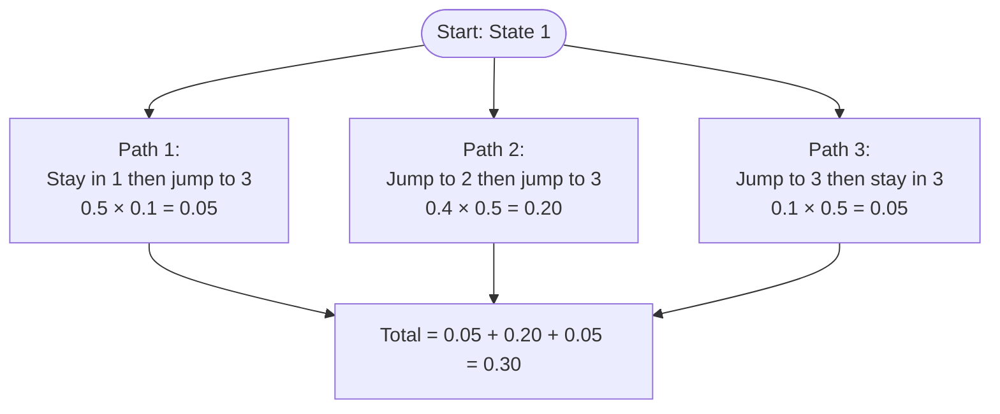

$$P(X_2 = 3 \mid X_0 = 1) = 0.05 + 0.20 + 0.05 = 0.30$$

> The most likely path is bouncing through State 2 first, because $P_{12}$ and $P_{23}$ are relatively strong connections.

**Scenario B — Starting from State 2, reach State 3 in 2 steps:**

$$P(X_2 = 3 \mid X_0 = 2) = 0.03 + 0.10 + 0.25 = 0.38$$

Starting in State 2 gives a higher probability (38%) of reaching State 3 in two steps than starting in State 1 (30%).

---

# 11.2 Classification of States

## Recurrent States

**Definition:** State $i$ is **recurrent** if, starting from $i$, the probability is **1** that the chain will eventually return to $i$.

**Physical meaning:** A recurrent state is a location with **no permanent escape**. No matter which doors you take, every path through the map eventually loops back to this room. Given infinite time, you will return to a recurrent state **infinitely many times**.

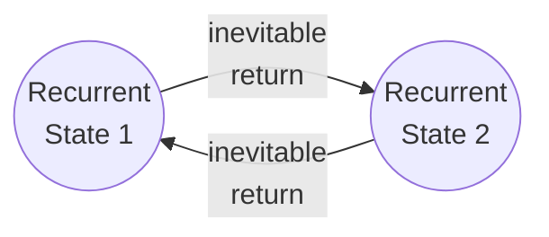

---

## Transient States

**Definition:** State $i$ is **transient** if there is a **positive probability of never returning** to $i$ after leaving it.

**Physical meaning:** A transient state has an **escape hatch**. There is at least one timeline where you walk out a door that locks behind you — you can never get back.

**The stronger statement:** As long as there is a *positive* probability of leaving $i$ forever, the chain **eventually will** leave $i$ forever.

**Why?** Because you are playing the game infinitely many times. If there is a 1% chance of escaping per visit:

| Steps | Probability of NOT having escaped |
|---|---|
| 10 | $0.99^{10} \approx 90\%$ |
| 100 | $0.99^{100} \approx 36\%$ |
| 1,000 | $0.99^{1000} \approx 0.004\%$ |
| $\infty$ | $0.99^\infty = 0$ |

> The **relentless grinding of infinite time** guarantees that the 1% escape hatch is eventually found. You cannot dodge a positive probability forever.

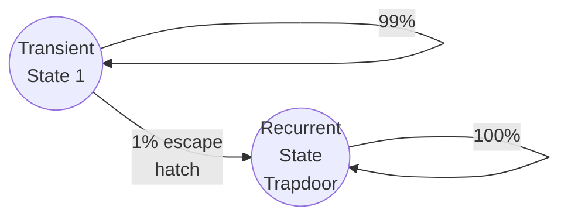

---

## The Geometric Distribution Proof

The textbook proves the finite-visit guarantee using the **story of the Geometric distribution**:

**The setup:**
- Each time the chain is at transient state $i$, run a **Bernoulli trial**:
  - **"Failure"** (Tails): The chain eventually returns to $i$ — you missed the trapdoor
  - **"Success"** (Heads): The chain leaves $i$ **forever** — you fell through the trapdoor

**The Markov property** ensures these trials are **independent** — the room has no memory of how many times you've looped through it. Your odds of finding the trapdoor are the same on attempt 1 and attempt 1,000,000.

**The count of returns** = the number of Failures before the first Success = a **Geometric random variable**.

Since a Geometric random variable **always takes a finite value**, this guarantees:

> After some **finite** number of visits, the chain will leave transient state $i$ **forever**. The counter freezes. You never return.

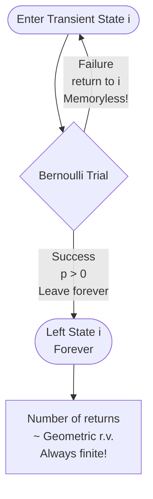

---

## Proposition 11.2.4 — Irreducible Chains

**Proposition:** In an **irreducible** Markov chain with a **finite state space**, all states are recurrent.

**Two conditions:**
1. **Finite State Space** — the map has a fixed number of rooms
2. **Irreducible** — the map is fully connected; you can eventually navigate from any room to any other room

**Proof (slow breakdown):**

**Trap 1 — The "Nowhere to Go" Rule:**

If all states were transient, the chain would eventually leave *every* state forever and have nowhere to go — but the map is finite, so it cannot delete itself from existence. Therefore, **at least one state must be recurrent**. Call it State 1.

**Trap 2 — The "Infection" via Irreducibility:**

Pick any other state $i$. Because the map is **irreducible**, there is a path from State 1 to State $i$. The $n$-step probability $q_{1i}^{(n)} > 0$ for some $n$.

**Trap 3 — The Infinite Lottery Tickets:**

State 1 is recurrent, so the agent visits it **infinitely many times**. Each visit is a "lottery ticket" with a positive probability of winning (navigating to State $i$ in $n$ more steps). With infinite tickets, you are **mathematically guaranteed** to eventually reach State $i$.

**Trap 4 — The Rubber Band Effect:**

From State $i$, the chain must eventually return to State 1 (because State 1 is recurrent and the map is irreducible). Then it reaches State $i$ again. The cycle repeats infinitely. Visiting State $i$ infinitely often means **State $i$ is recurrent**.

Since $i$ was arbitrary, **all states are recurrent**. $\blacksquare$

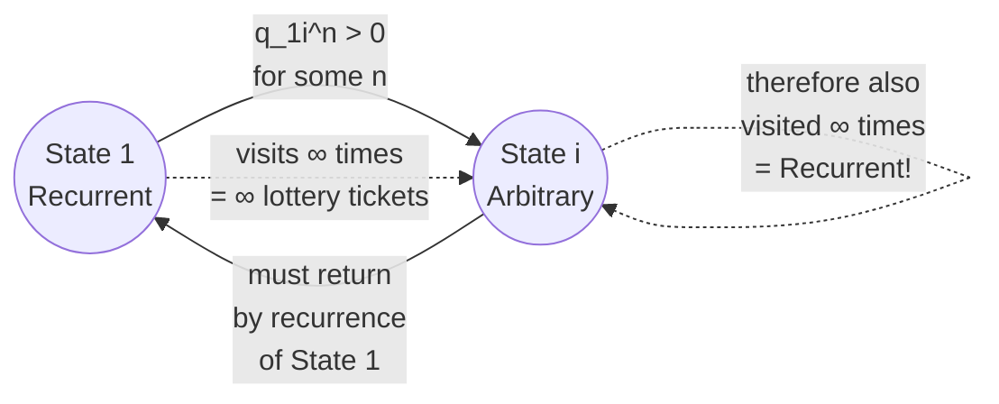

---

## The Converse is False — Two Islands

**The Converse (FALSE):** IF all states are Recurrent $\to$ THEN the map is Irreducible.

**Why it's false:** You can have a map divided into **two completely disconnected islands**:

- **Island A:** States 1 and 2 loop forever between themselves
- **Island B:** States 3 and 4 loop forever between themselves

Every state is **recurrent** (once you are on an island you never leave — infinite visits). But the map is **reducible** because you cannot travel from Island A to Island B.

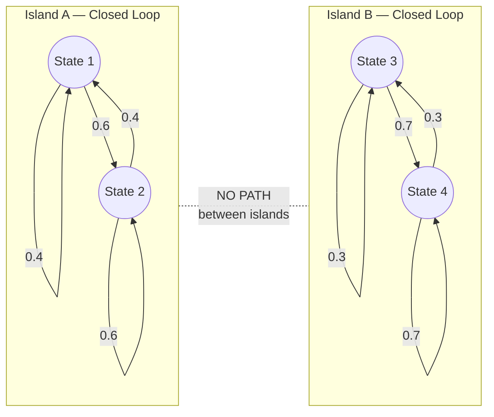

> **Recurrent** = a property of an **individual state** (once visited, I can get visited again)
>
> **Irreducible** = a property of the **entire map** (every state can be reached from every other state)

---

## Topology Cheat Sheet

| Property | What it says | Scope |
|---|---|---|
| **Recurrent** | Once visited, will be visited again (and again, infinitely) | Property of a **single state** |
| **Transient** | May be visited finitely many times, then left forever | Property of a **single state** |
| **Irreducible** | Every state can be reached from every other state | Property of the **whole chain** |
| **Reducible** | Some states cannot be reached from others | Property of the **whole chain** |
| **Absorbing** | $P(i \to i) = 1.0$ — a special case of recurrent | Property of a **single state** |

**Key relationships:**

- Irreducible + Finite State Space → **all states are recurrent** ✓
- All states recurrent → Irreducible? **NO** (Two-island counterexample) ✗
- Transient state + infinite time → **chain leaves it forever** ✓

---

# 11.2.8 Period of a State

**Definition 11.2.8:** The **period** of state $i$ is the greatest common divisor (GCD) of the possible numbers of steps it can take to return to $i$ when starting at $i$:

$$d(i) = \gcd\{n \geq 1 : q_{ii}^{(n)} > 0\}$$

- A state is **aperiodic** if its period equals 1
- A state is **periodic** if its period is greater than 1
- The chain itself is aperiodic if **all** its states are aperiodic

---

## The Periodic State

**The rigid schedule.** Imagine a map with only two rooms: Left ↔ Right, with forced alternation.

- From Left → must go to Right (100%)
- From Right → must go to Left (100%)

Possible return times to Left: $\{2, 4, 6, 8, \ldots\}$

$$\gcd\{2, 4, 6, 8, \ldots\} = 2$$

**Period = 2.** You are trapped on a strict, unbreakable rhythm. The door back only unlocks on steps 2, 4, 6, 8...

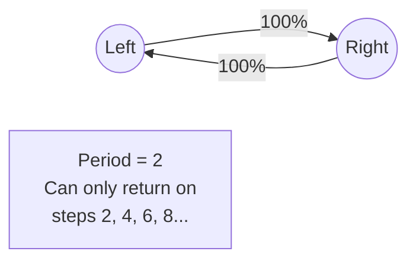

---

## The Aperiodic State

**The broken rhythm (Period = 1).** Add a third room so you can travel in a triangle.

- Loop back via back-and-forth: **2 steps**
- Loop around the whole triangle: **3 steps**

Possible return times: $\{2, 3, 4, 5, 6, \ldots\}$

$$\gcd\{2, 3, 4, 5, 6, \ldots\} = 1$$

**Period = 1.** The rigid rhythm is broken. You can return on any step — the timing is completely fluid.

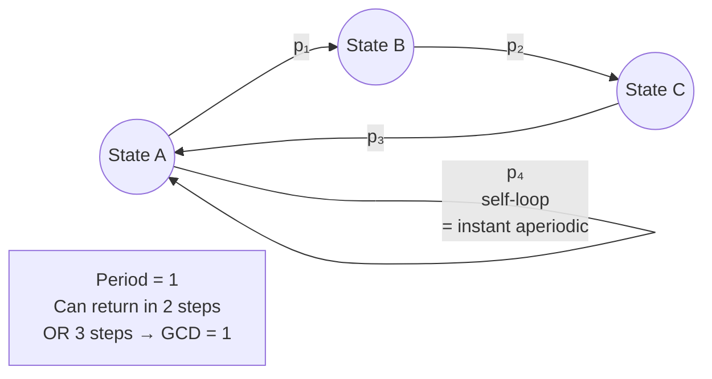

> **Cheat Code:** If a state has a **self-loop** ($P(i \to i) > 0$), it is **automatically aperiodic** (Period 1). Because you can "return" in exactly 1 step, and $\gcd$ of any list containing 1 is always 1.

---

## Why the GCD is the Right Tool

The GCD detects the **underlying grid size** of the environment by understanding how loops combine.

**Scenario A — Trapped Grid (GCD > 1):**

Loops of 4 and 6 steps. Possible return times: $\{4, 6, 8, 10, 12, \ldots\}$

$\gcd(4, 6) = 2$ — every combination is a multiple of 2. You can **never** combine a 4-loop and a 6-loop to get an odd number. Permanently trapped on a grid size of 2.

**Scenario B — Broken Rhythm (GCD = 1):**

Loops of 5 and 7 steps. $\gcd(5, 7) = 1$.

Combinations: $\{5, 7, 10, 12, 14, 15, 17, \ldots\}$. After a while, every integer appears — the gaps fill completely. You can return on any step.

> **Why GCD and not average or minimum?** Because **loops stack** — you run them back-to-back. If the GCD of your loops is $d$, their combinations forever live on multiples of $d$. If GCD is 1, combinations eventually fill every integer (this is the Frobenius Coin theorem in number theory).

---

## Plain Definition of Period

> **The period of a state is the largest number $d$ that divides evenly into every possible number of steps it takes to return to that state.**

- **Period = $d$:** The door only materializes on multiples of $d$ (steps $d, 2d, 3d, \ldots$). Mathematically barred from returning on any "off-beat."
- **Period = 1 (Aperiodic):** The metronome is broken. You can return on any step.

---

# Stationary Distribution

When a Markov chain runs **forever**, all initial transient chaos washes away. The system reaches **mathematical equilibrium** — a state where the distribution stops changing with time.

This steady-state is the **stationary distribution** $\pi$ — a row vector giving the long-term fraction of time the agent spends in each state.

The equilibrium satisfies:

$$\pi P = \pi$$

**Read in English:** "Multiplying the steady-state distribution by the transition matrix returns the exact same steady-state distribution." Taking one more step in time changes **nothing**.

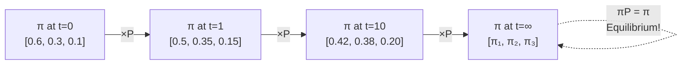

**Why this matters:** Instead of infinitely multiplying $P \times P \times P \ldots$ to find behavior at step 10,000, you use **eigenvector decomposition** on $\pi P = \pi$ to instantly calculate the infinite-time equilibrium of any stochastic system.

---

# Applications

## The Gambler's Ruin

A casino betting game is **NOT irreducible** — it is **reducible**.

**State space:** $\{0, 1, 2, \ldots, N\}$ where $N$ is the target (or the casino's infinite bankroll).

- **State 0 (Bankruptcy):** $P(0 \to 0) = 1.0$ — you cannot bet with no money. This is an **Absorbing Recurrent State**.
- **States 1 through N-1:** Because Bankruptcy is an inescapable black hole, every state where you have money has a path leading to State 0. This makes them all **Transient States**.

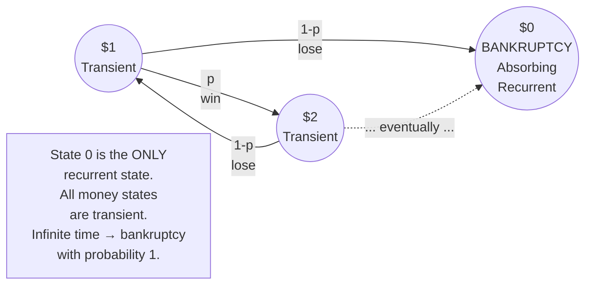

**The mathematical proof of why the house always wins:**

Because all money states are transient, the relentless grinding of infinite time guarantees the agent must eventually fall into the **only recurrent trapdoor** — State 0 (Bankruptcy). If you play an infinite game against an opponent with an infinite bankroll, the probability of reaching State 0 is **exactly 1.0**.

> The map is **reducible** because once you reach State 0, you cannot travel back to any other state — the full-connectivity condition is permanently broken.

---

## The Coupon Collector as a Markov Chain

**Setup:** A fast-food restaurant releases $C = 10$ different toys. Every meal gives 1 random toy (equal probability, with replacement). Track your progress as a Markov Chain.

**State Space:** $X_n$ = number of **distinct** toy types after $n$ attempts. State space: $\{0, 1, \ldots, C\}$.

**Why it's a Markov Chain (The Amnesia Test):**

If you are in State 4 (you own 4 unique toys), your odds of getting a new toy are $\frac{6}{10}$. It does not matter whether you bought 4 meals to get those 4 toys, or 500 meals with terrible luck. The history is irrelevant — only the current count matters. ✓

**Transition Mechanics:**

$$P(\text{move } k \to k+1) = \frac{C-k}{C} \quad \text{(get a new toy)}$$
$$P(\text{stay at } k) = \frac{k}{C} \quad \text{(get a duplicate)}$$

It gets harder the further you go. At State 9, the chance of completing the set is a brutal $\frac{1}{10}$.

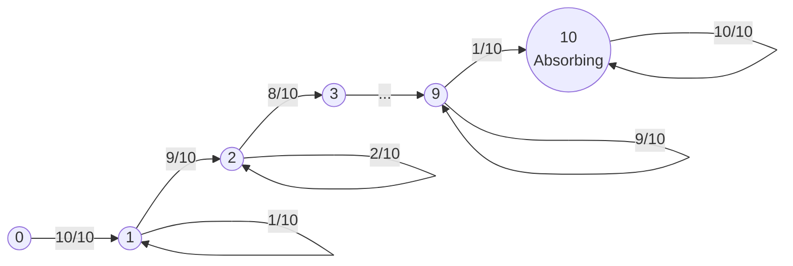

**Topology:**
- **States 0–9:** Transient — there is always a positive probability of gaining a new toy and moving forward forever
- **State 10 ($C$):** Absorbing Recurrent — the game is over; every new meal is a guaranteed duplicate; $P(10 \to 10) = 1.0$

---

## Queueing Theory

Queueing Theory is the most famous real-world application of **Continuous-Time, Discrete-State Markov Chains (CTMC)**.

**Core Variables:**

| Symbol | Name | Example |
|---|---|---|
| $\lambda$ | Arrival Rate | 500 network packets/second entering the system |
| $\mu$ | Service Rate | Your server can process 600 packets/second |
| $\rho = \lambda / \mu$ | Traffic Intensity / Utilization | $500/600 \approx 0.83$ |

**The stability condition:**
- $\rho < 1$: The system is **stable** — the server keeps up
- $\rho \geq 1$: The queue length grows **to infinity** — the system crashes (OOM errors)

**The M/M/1 Queue (Kendall's Notation A/S/c):**

| Letter | Meaning |
|---|---|
| M (Arrivals) | Markovian (Memoryless) — requests arrive as a Poisson process |
| M (Service) | Markovian — service times are exponentially distributed |
| 1 (Servers) | One node processing the queue |

Tracking the state of an M/M/1 queue (number of items in the buffer) is **literally computing the transition probabilities of a CTMC** jumping between states $0, 1, 2, 3, \ldots$

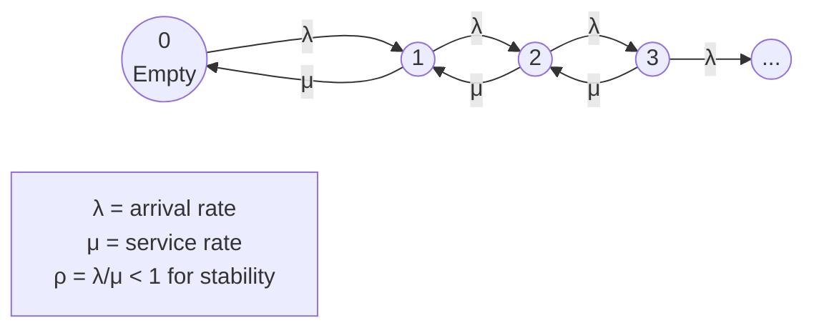

**Little's Law — The Crown Jewel:**

$$L = \lambda W$$

| Symbol | Meaning |
|---|---|
| $L$ | Average number of items **in the system** |
| $\lambda$ | Average **arrival rate** |
| $W$ | Average **time** an item spends in the system |

Little's Law holds for **any** queueing system, regardless of arrival distribution, service discipline (FIFO, LIFO), or network architecture. If you know $\lambda$ and $W$, you instantly know how much buffer memory $L$ you need to prevent packet drops.

---

## Connection to Reinforcement Learning

Every concept in this chapter maps directly to the RL architecture.

**The Markov Chain → MDP Bridge:**

| Markov Chain | MDP Addition | Result |
|---|---|---|
| States $S$ | + Actions $A$ | Agent can **choose** which transition matrix to apply |
| Transition Matrix $Q$ | + Rewards $R$ | Agent has incentives to prefer certain states |
| Marginal Distribution $tQ^n$ | + Policy $\pi$ | Agent learns which actions maximize expected return |

**The Policy Gradient Objective:**

Your intuition — "take the probability of starting in that state, then multiply by the summation of rewards we will get in the episode" — is exactly the RL objective function $J(\theta)$:

$$J(\theta) = \sum_{s_0} p(s_0) \cdot V^{\pi_\theta}(s_0)$$

| Symbol | Meaning | Markov Chain Equivalent |
|---|---|---|
| $p(s_0)$ | Spawn probability | $t_i = P(X_0 = i)$ |
| $V^{\pi_\theta}(s_0)$ | Value Function — sum of future rewards from $s_0$ | $\sum_j q_{ij}^{(n)}$ weighted by rewards |
| $\sum_{s_0}$ | Sum over all starting states | $\sum_{i=1}^{M}$ |

**The connection to Q^n:**

The Chapman-Kolmogorov summation (summing over all parallel paths) is the exact mathematical engine running under the hood of:
- **Q-Learning:** Sweeping through state transitions, weighting by likelihood
- **Monte Carlo Methods:** Averaging over entire episode trajectories
- **The Bellman Equation:** Recursively computing value functions by conditioning on the current state

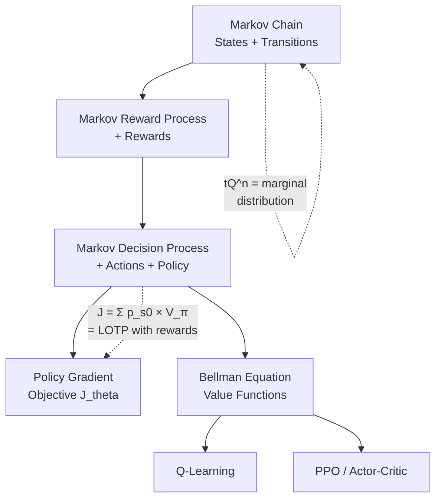

**The stationary distribution and convergence:**

Understanding that transient states are eventually escaped and recurrent states are visited infinitely is the theoretical guarantee that **RL algorithms converge**. As long as the agent operates in a fully communicating recurrent environment, infinite time guarantees it will explore every state and update every value function.

> **The relentless grinding of infinite time** — the same principle that guarantees a transient state is eventually escaped forever — is the exact reason why Q-Learning and Monte Carlo methods eventually converge to optimal policies.
