# Chapter 11 — Markov Chains
> *Introduction to Probability* — Blitzstein & Hwang

---

## Table of Contents

- [11.1 Markov Property and Transition Matrix](#111-markov-property-and-transition-matrix)
  - [What is a Markov Chain?](#what-is-a-markov-chain)
  - [The Markov Property — Formal Definition](#the-markov-property--formal-definition)
  - [The Transition Matrix Q](#the-transition-matrix-q)
  - [How to Read Q in Plain English](#how-to-read-q-in-plain-english)
  - [The n-Step Transition Matrix Q^n](#the-n-step-transition-matrix-qn)
- [11.1.6 Marginal Distribution of X_n](#1116-marginal-distribution-of-xn)
  - [The Initial Vector t](#the-initial-vector-t)
  - [LOTP — The Law of Total Probability](#lotp--the-law-of-total-probability)
  - [The Battle Royale Intuition](#the-battle-royale-intuition)
  - [Proposition 11.1.6 — Full Proof Decomposed](#proposition-1116--full-proof-decomposed)
  - [Reading the Proof Out Loud in English](#reading-the-proof-out-loud-in-english)
- [The Chapman-Kolmogorov Summation](#the-chapman-kolmogorov-summation)
  - [Why We Multiply (The AND Rule)](#why-we-multiply-the-and-rule)
  - [Why We Sum (The OR Rule)](#why-we-sum-the-or-rule)
  - [The Linear Algebra Connection](#the-linear-algebra-connection)
  - [Worked Example — Reaching State C in 2 Steps](#worked-example--reaching-state-c-in-2-steps)
- [11.2 Classification of States](#112-classification-of-states)
  - [Recurrent States](#recurrent-states)
  - [Transient States](#transient-states)
  - [The Geometric Distribution Proof](#the-geometric-distribution-proof)
  - [Proposition 11.2.4 — Irreducible Chains](#proposition-1124--irreducible-chains)
  - [The Converse is False — Two Islands](#the-converse-is-false--two-islands)
  - [Topology Cheat Sheet](#topology-cheat-sheet)
- [11.2.8 Period of a State](#1128-period-of-a-state)
  - [The Periodic State](#the-periodic-state)
  - [The Aperiodic State](#the-aperiodic-state)
  - [Why the GCD is the Right Tool](#why-the-gcd-is-the-right-tool)
  - [Plain Definition of Period](#plain-definition-of-period)
- [Stationary Distribution](#stationary-distribution)
- [Applications](#applications)
  - [The Gambler's Ruin](#the-gamblers-ruin)
  - [The Coupon Collector as a Markov Chain](#the-coupon-collector-as-a-markov-chain)
  - [Queueing Theory](#queueing-theory)
  - [Connection to Reinforcement Learning](#connection-to-reinforcement-learning)
- [The Bridge — From Topology to Long-Run Behavior](#the-bridge--from-topology-to-long-run-behavior)
  - [Phase 1 — The Burn-Off Period](#phase-1--the-burn-off-period)
  - [Phase 2 — The Infinite Rhythm](#phase-2--the-infinite-rhythm)
- [11.3.1 Definition of Stationary Distribution](#1131-definition-of-stationary-distribution)
  - [The Two Reality Checks](#the-two-reality-checks)
  - [The Magic Equation — Plain English](#the-magic-equation--plain-english)
  - [What sQ = s Actually Says in One Sentence](#what-sq--s-actually-says-in-one-sentence)
  - [Reading the Equation Out Loud](#reading-the-equation-out-loud)
- [Ground Zero — What "Stationary" Actually Means](#ground-zero--what-stationary-actually-means)
  - [Stationary Does NOT Mean Frozen](#stationary-does-not-mean-frozen)
  - [The Water Fountain Analogy](#the-water-fountain-analogy)
  - [The Three Variables Defined](#the-three-variables-defined)
  - [Why We Multiply by Q Even Though s Is Stationary](#why-we-multiply-by-q-even-though-s-is-stationary)
- [The City Apartment Analogy](#the-city-apartment-analogy)
  - [What s Represents](#what-s-represents)
  - [What Q Represents](#what-q-represents)
  - [The Equation in Action](#the-equation-in-action)
  - [The Key Insight — Q Does Not Change, Its Transitions Cancel Out](#the-key-insight--q-does-not-change-its-transitions-cancel-out)
- [What Each Dimension of s Means](#what-each-dimension-of-s-means)
- [The Relationship Between s and Q^n](#the-relationship-between-s-and-qn)
  - [The n-Step Distribution vs The Stationary Distribution](#the-n-step-distribution-vs-the-stationary-distribution)
  - [s Is a Row of Q Raised to a Very Large n](#s-is-a-row-of-q-raised-to-a-very-large-n)
  - [Why Every Row of Q^∞ Becomes the Same s](#why-every-row-of-q-becomes-the-same-s)
  - [Why Rows Cannot All Be Same If Chain Is Reducible](#why-rows-cannot-all-be-same-if-chain-is-reducible)
  - [The Two Ways to Reach s](#the-two-ways-to-reach-s)
- [11.3.2 — Stationary Is Marginal, Not Conditional](#1132--stationary-is-marginal-not-conditional)
  - [Unconditional PMF = s (Zoomed Out)](#unconditional-pmf--s-zoomed-out)
  - [Conditional PMF = Q (Zoomed In)](#conditional-pmf--q-zoomed-in)
  - [The "Since" — Why They Are Different](#the-since--why-they-are-different)
  - [Is Marginal Short-Sighted?](#is-marginal-short-sighted)
- [11.3.3 — Sympathetic Magic Warning](#1133--sympathetic-magic-warning)
- [Example 11.3.4 — Solving for s by Hand](#example-1134--solving-for-s-by-hand)
  - [Setup and the Blank Placeholder](#setup-and-the-blank-placeholder)
  - [The Algebra — Step by Step](#the-algebra--step-by-step)
  - [The Universal 2-State Formula](#the-universal-2-state-formula)
  - [Why as₁ = bs₂ Is the Only Equation You Need](#why-as1--bs2-is-the-only-equation-you-need)
  - [The Proportionality Shortcut](#the-proportionality-shortcut)
  - [The Left Eigenvector Jargon](#the-left-eigenvector-jargon)
- [What s Tells You Physically](#what-s-tells-you-physically)
- [Applications](#applications)
  - [The Gambler's Ruin Topology](#the-gamblers-ruin-topology)
  - [The Coupon Collector](#the-coupon-collector)
  - [Connection to Reinforcement Learning](#connection-to-reinforcement-learning)

---

---

# 11.1 Markov Property and Transition Matrix

## What is a Markov Chain?

A **Markov Chain** is a sequence of random variables $X_0, X_1, X_2, \ldots$ where the conditions for something to be a Markov chain are:

1. It must be a **sequence of conditionally independent random variables**
2. Each variable is conditioned **only on the present** — not on the full history

> **Core Rule:** The future is conditionally independent of the past, given the present.

Think of it as a system with **absolute amnesia**. No matter how you arrived at a state, only where you are *right now* determines where you go next.

---

## The Markov Property — Formal Definition

$$P(X_{n+1} \mid X_n, X_{n-1}, X_{n-2}, \ldots, X_0) = P(X_{n+1} \mid X_n)$$

**Read in English:** "The probability of the next state, given the entire history, equals the probability of the next state given only the current state."

**Physical meaning:** If you are in State 4 of the Coupon Collector game (you have 4 unique toys), your odds of getting a new toy are exactly $\frac{6}{10}$ — regardless of whether you bought 4 meals to get there, or 500 meals and were horribly unlucky. The history is completely irrelevant.

> If a system requires you to look at its **history** to predict its next move, it is **not** a Markov Chain.

---

## The Transition Matrix Q

The **transition matrix** $Q$ (or $P$) is an $M \times M$ matrix where:

- **Rows** = the state you are currently in
- **Columns** = the state you will move to
- **Entry $q_{ij}$** = the probability of jumping from state $i$ to state $j$ in one step

**Critical rule:** Every single row must sum to **exactly 1.0** — because the agent must go somewhere (even if it stays).

**Example — 3-state system:**

$$Q = \begin{pmatrix} 0.5 & 0.4 & 0.1 \\ 0.3 & 0.2 & 0.5 \\ 0.2 & 0.3 & 0.5 \end{pmatrix}$$

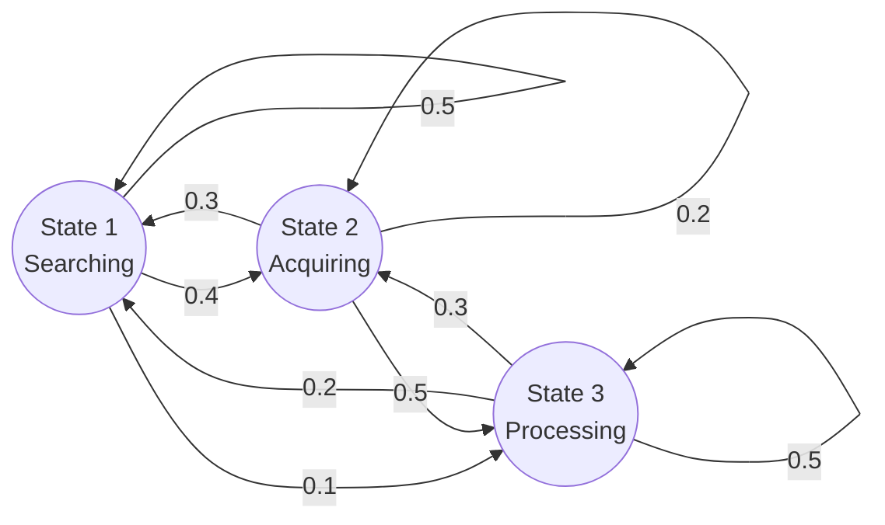

---

## How to Read Q in Plain English

Using the language of Chapter 7, the transition matrix $Q$ **encodes the conditional distribution of $X_1$ given the initial state of the chain**.

- The **$i$-th row** of $Q$ is the conditional PMF of $X_1$ given $X_0 = i$, displayed as a row vector
- The **$i$-th row** of $Q^n$ is the conditional PMF of $X_n$ given $X_0 = i$

**Example:** If the agent starts in State 3 ($X_0 = 3$), only the **3rd row** matters: $[0.2, 0.3, 0.5]$. This tells us there is a 20% chance of jumping to State 1, 30% to State 2, and 50% of staying in State 3. Rows 1 and 2 belong to **alternate timelines** where the agent spawned elsewhere — they are irrelevant.

> The vertical bar $\mid$ in $P(X_n = j \mid X_0 = i)$ is universally read as **"given that"** or **"conditioned on."** It acts as a mathematical filter.

---

## The n-Step Transition Matrix Q^n

You do not need to simulate $n$ steps manually. You **raise the matrix to the power $n$**:

$$Q^1 = \text{PMFs for exactly 1 step into the future}$$
$$Q^2 = \text{PMFs for exactly 2 steps into the future}$$
$$Q^n = \text{PMFs for exactly } n \text{ steps into the future}$$

If you compute $Q^{10}$ and look at Row 1, that row gives the exact probability distribution of finding the agent in each state, **assuming it started in State 1 exactly ten clock cycles ago**.

> You calculate the whole matrix to build the engine, but you only ever extract the **specific row you are conditioned on** to run the prediction.

---

# 11.1.6 Marginal Distribution of X_n

## The Initial Vector t

Up until now every equation had a $\mid$ bar — we always *knew* the starting state. But in real systems, you rarely have perfect information about where things began.

The **initial vector** $t = (t_1, t_2, \ldots, t_M)$ is the **spawn distribution**, where:

$$t_i = P(X_0 = i)$$

This is a $1 \times M$ row vector. Instead of saying "the agent starts in State 1," you say "the agent starts with a 50% chance of being in State 1 and a 50% chance of being in State 2":

$$t = [0.5,\ 0.5,\ 0.0]$$

---

## LOTP — The Law of Total Probability

To find the **marginal** (absolute, unconditioned) probability of being in state $j$ at time $n$:

$$P(X_n = j) = \sum_{i=1}^{M} P(X_0 = i) \cdot P(X_n = j \mid X_0 = i) = \sum_{i=1}^{M} t_i \cdot q_{ij}^{(n)}$$

**Read out loud in English:**
> "The probability that $X$ sub $n$ equals $j$... equals the sum from $i$ equals one to $M$... of the probability that $X$ sub zero equals $i$... times the probability that $X$ sub $n$ equals $j$, **given that** $X$ sub zero equals $i$."

This summation is the **weighted average** over all possible starting timelines.

---

## The Battle Royale Intuition

Imagine 100 players dropping into a map with 3 spawn zones. We want the absolute probability of a random player reaching the **Final Circle (State 3)**.

**The two pieces:**

| Symbol | Name | Meaning |
|---|---|---|
| $P(X_n = j \mid X_0 = i)$ | Transition Probability | If you spawn at Zone $i$, what are your odds of reaching Final Circle $j$? |
| $P(X_0 = i) = t_i$ | Spawn Probability | What fraction of the lobby actually dropped at Zone $i$? |

**Concrete numbers:**

| Zone | Spawn % | Survival Rate | Contribution |
|---|---|---|---|
| Zone 1 | 60% | 10% | $0.60 \times 0.10 = 0.06$ |
| Zone 2 | 40% | 50% | $0.40 \times 0.50 = 0.20$ |
| Zone 3 | 0% | 90% | $0.00 \times 0.90 = 0.00$ |
| **Total** | | | **0.26 (26%)** |

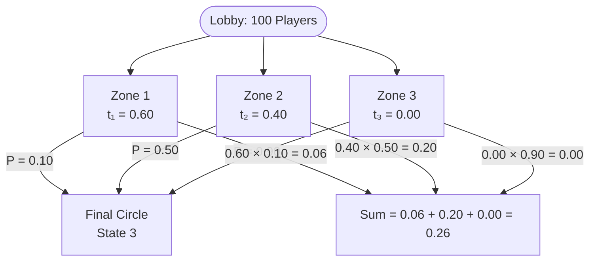

> **Core intuition:** You take the probability of moving from $i$ to $j$, then **multiply** by the probability of starting there in the first place. You cannot just look at survival rates in a vacuum — Zone 3 has a 90% rate but nobody spawned there, so it contributes nothing.

---

## Proposition 11.1.6 — Full Proof Decomposed

**Proposition:** Define $t = (t_1, t_2, \ldots, t_M)$ by $t_i = P(X_0 = i)$, viewed as a row vector. Then the marginal distribution of $X_n$ is given by the vector $tQ^n$. That is, the $j$-th component of $tQ^n$ is $P(X_n = j)$.

**Proof:**

$$P(X_n = j) = \sum_{i=1}^{M} P(X_0 = i) \cdot P(X_n = j \mid X_0 = i) = \sum_{i=1}^{M} t_i \cdot q_{ij}^{(n)}$$

which is the $j$-th component of $tQ^n$ by definition of matrix multiplication. $\blacksquare$

**Symbol-by-symbol breakdown:**

| Symbol | Professor Speak | Plain English |
|---|---|---|
| $P(X_n = j)$ | "The probability that $X$ sub $n$ equals $j$" | The absolute probability that the agent ends up in State $j$ exactly $n$ steps from now |
| $\sum_{i=1}^{M}$ | "The sum, from $i$ equals one to $M$, of..." | Run a loop through every possible starting state and add the results together |
| $P(X_0 = i)$ or $t_i$ | "The probability that $X$ sub zero equals $i$" | The chance the agent originally spawned in State $i$ |
| $P(X_n = j \mid X_0 = i)$ | "The probability that $X_n$ equals $j$, **given that** $X_0$ equals $i$" | Assuming the agent started in State $i$, what are its odds of reaching State $j$? |
| $q_{ij}^{(n)}$ | "q sub $i$-$j$, superscript $n$" | Go to our $n$-step matrix $Q^n$, find the number in row $i$, column $j$ |
| $tQ^n$ | "The vector $t$ times the matrix $Q$ to the $n$-th power" | Take the starting reality vector and crash it through our fast-forwarded probability matrix via a dot product |

---

## Reading the Proof Out Loud in English

> "To find the total probability of ending up in state $j$ at time step $n$ ($P(X_n = j)$) — we sum up ($\Sigma$) the parallel timelines for every possible starting state $i$ — by multiplying the probability that we actually spawned in state $i$ ($P(X_0 = i)$) — by the conditional probability of reaching state $j$ given that we started in $i$ ($P(X_n = j \mid X_0 = i)$). This is mathematically identical to taking the $i$-th element of our starting vector ($t_i$) and multiplying it by the $i,j$ entry of our $n$-step transition matrix ($q_{ij}^{(n)}$) — which, by definition, is exactly how you calculate the $j$-th component of a vector-matrix dot product ($tQ^n$)."

---

# The Chapman-Kolmogorov Summation

## Why We Multiply (The AND Rule)

You are at starting state $i$. You want to reach destination state $j$ in **exactly two steps**. After step 1, you must land in some intermediate state $k$.

To complete one specific route through $k$, **two things must happen in sequence**:

1. Jump from $i \to k$ — Probability: $q_{ik}$
2. **AND** then jump from $k \to j$ — Probability: $q_{kj}$

In probability, **AND** means **multiply**:

$$\text{Path probability through } k = q_{ik} \times q_{kj}$$

---

## Why We Sum (The OR Rule)

$k$ is just a placeholder — it could be **any** state in the entire state space. In a 3-state system, you have three parallel paths to reach $j$ in 2 steps:

- Path via State 1: $i \to 1 \to j$
- **OR** Path via State 2: $i \to 2 \to j$
- **OR** Path via State 3: $i \to 3 \to j$

In probability, mutually exclusive alternatives (**OR**) are **added**:

$$q_{ij}^{(2)} = (q_{i1} \times q_{1j}) + (q_{i2} \times q_{2j}) + (q_{i3} \times q_{3j}) = \sum_k q_{ik} \cdot q_{kj}$$

> **The core insight:** We are summing the probabilities of every possible **parallel universe** that successfully gets us from start state to end state.

---

## The Linear Algebra Connection

That summation $\sum_k q_{ik} \cdot q_{kj}$ is **literally the formula for a dot product**:

- Take the **$i$-th row** of matrix $Q$ (outgoing probabilities from $i$)
- Dot product with the **$j$-th column** of matrix $Q$ (incoming probabilities to $j$)

This is exactly why $Q \times Q = Q^2$ instantly gives all 2-step probabilities for the **entire system** at once. Matrix multiplication runs this summation for every possible $(i, j)$ combination simultaneously.

---

## Worked Example — Reaching State C in 2 Steps

**Transition Matrix:**

$$P = \begin{pmatrix} 0.5 & 0.4 & 0.1 \\ 0.3 & 0.2 & 0.5 \\ 0.2 & 0.3 & 0.5 \end{pmatrix}$$

**Scenario A — Starting from State 1, reach State 3 in 2 steps:**


$$P(X_2 = 3 \mid X_0 = 1) = 0.05 + 0.20 + 0.05 = 0.30$$

> The most likely path is bouncing through State 2 first, because $P_{12}$ and $P_{23}$ are relatively strong connections.

**Scenario B — Starting from State 2, reach State 3 in 2 steps:**

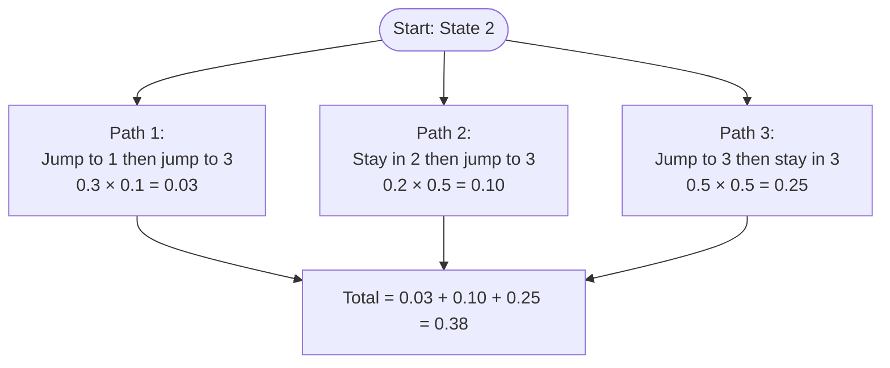

$$P(X_2 = 3 \mid X_0 = 2) = 0.03 + 0.10 + 0.25 = 0.38$$

Starting in State 2 gives a higher probability (38%) of reaching State 3 in two steps than starting in State 1 (30%).

---

# 11.2 Classification of States

## Recurrent States

**Definition:** State $i$ is **recurrent** if, starting from $i$, the probability is **1** that the chain will eventually return to $i$.

**Physical meaning:** A recurrent state is a location with **no permanent escape**. No matter which doors you take, every path through the map eventually loops back to this room. Given infinite time, you will return to a recurrent state **infinitely many times**.

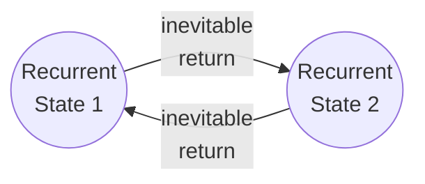

---

## Transient States

**Definition:** State $i$ is **transient** if there is a **positive probability of never returning** to $i$ after leaving it.

**Physical meaning:** A transient state has an **escape hatch**. There is at least one timeline where you walk out a door that locks behind you — you can never get back.

**The stronger statement:** As long as there is a *positive* probability of leaving $i$ forever, the chain **eventually will** leave $i$ forever.

**Why?** Because you are playing the game infinitely many times. If there is a 1% chance of escaping per visit:

| Steps | Probability of NOT having escaped |
|---|---|
| 10 | $0.99^{10} \approx 90\%$ |
| 100 | $0.99^{100} \approx 36\%$ |
| 1,000 | $0.99^{1000} \approx 0.004\%$ |
| $\infty$ | $0.99^\infty = 0$ |

> The **relentless grinding of infinite time** guarantees that the 1% escape hatch is eventually found. You cannot dodge a positive probability forever.

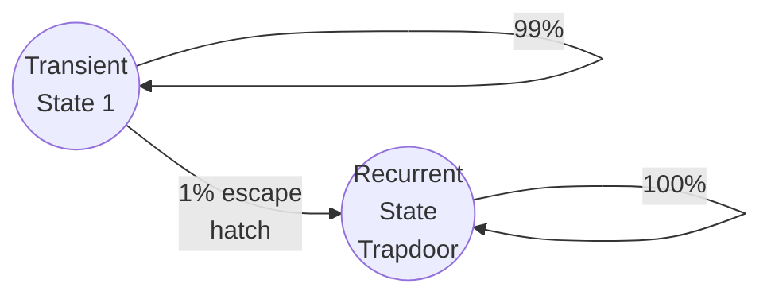

---

## The Geometric Distribution Proof

The textbook proves the finite-visit guarantee using the **story of the Geometric distribution**:

**The setup:**
- Each time the chain is at transient state $i$, run a **Bernoulli trial**:
  - **"Failure"** (Tails): The chain eventually returns to $i$ — you missed the trapdoor
  - **"Success"** (Heads): The chain leaves $i$ **forever** — you fell through the trapdoor

**The Markov property** ensures these trials are **independent** — the room has no memory of how many times you've looped through it. Your odds of finding the trapdoor are the same on attempt 1 and attempt 1,000,000.

**The count of returns** = the number of Failures before the first Success = a **Geometric random variable**.

Since a Geometric random variable **always takes a finite value**, this guarantees:

> After some **finite** number of visits, the chain will leave transient state $i$ **forever**. The counter freezes. You never return.


---

## Proposition 11.2.4 — Irreducible Chains

**Proposition:** In an **irreducible** Markov chain with a **finite state space**, all states are recurrent.

**Two conditions:**
1. **Finite State Space** — the map has a fixed number of rooms
2. **Irreducible** — the map is fully connected; you can eventually navigate from any room to any other room

**Proof (slow breakdown):**

**Trap 1 — The "Nowhere to Go" Rule:**

If all states were transient, the chain would eventually leave *every* state forever and have nowhere to go — but the map is finite, so it cannot delete itself from existence. Therefore, **at least one state must be recurrent**. Call it State 1.

**Trap 2 — The "Infection" via Irreducibility:**

Pick any other state $i$. Because the map is **irreducible**, there is a path from State 1 to State $i$. The $n$-step probability $q_{1i}^{(n)} > 0$ for some $n$.

**Trap 3 — The Infinite Lottery Tickets:**

State 1 is recurrent, so the agent visits it **infinitely many times**. Each visit is a "lottery ticket" with a positive probability of winning (navigating to State $i$ in $n$ more steps). With infinite tickets, you are **mathematically guaranteed** to eventually reach State $i$.

**Trap 4 — The Rubber Band Effect:**

From State $i$, the chain must eventually return to State 1 (because State 1 is recurrent and the map is irreducible). Then it reaches State $i$ again. The cycle repeats infinitely. Visiting State $i$ infinitely often means **State $i$ is recurrent**.

Since $i$ was arbitrary, **all states are recurrent**. $\blacksquare$

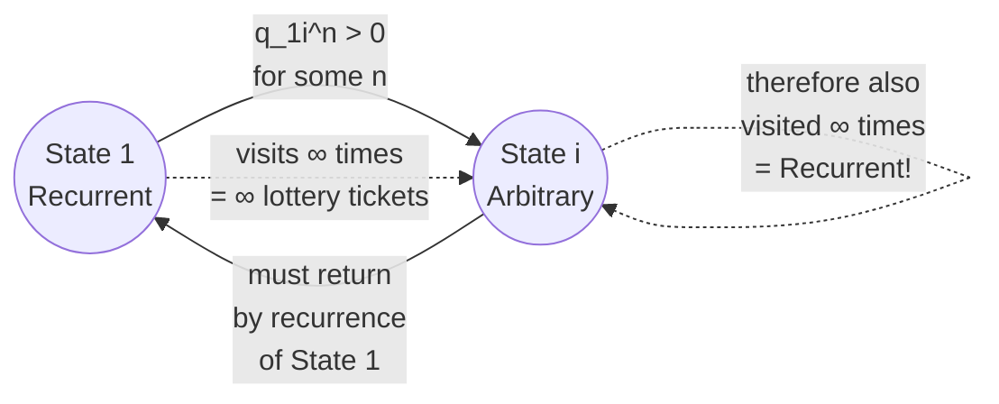

---

## The Converse is False — Two Islands

**The Converse (FALSE):** IF all states are Recurrent $\to$ THEN the map is Irreducible.

**Why it's false:** You can have a map divided into **two completely disconnected islands**:

- **Island A:** States 1 and 2 loop forever between themselves
- **Island B:** States 3 and 4 loop forever between themselves

Every state is **recurrent** (once you are on an island you never leave — infinite visits). But the map is **reducible** because you cannot travel from Island A to Island B.

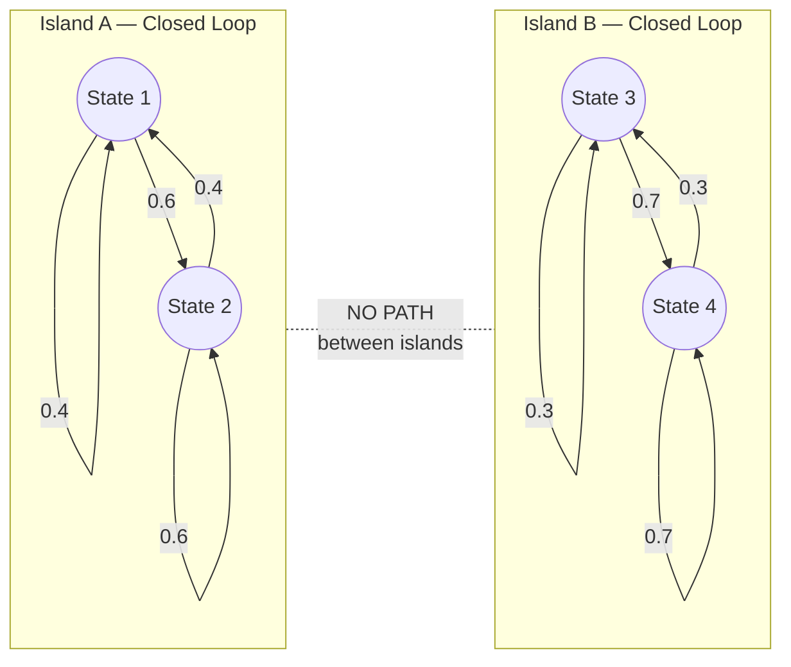

> **Recurrent** = a property of an **individual state** (once visited, I can get visited again)
>
> **Irreducible** = a property of the **entire map** (every state can be reached from every other state)

---

## Topology Cheat Sheet

| Property | What it says | Scope |
|---|---|---|
| **Recurrent** | Once visited, will be visited again (and again, infinitely) | Property of a **single state** |
| **Transient** | May be visited finitely many times, then left forever | Property of a **single state** |
| **Irreducible** | Every state can be reached from every other state | Property of the **whole chain** |
| **Reducible** | Some states cannot be reached from others | Property of the **whole chain** |
| **Absorbing** | $P(i \to i) = 1.0$ — a special case of recurrent | Property of a **single state** |

**Key relationships:**

- Irreducible + Finite State Space → **all states are recurrent** ✓
- All states recurrent → Irreducible? **NO** (Two-island counterexample) ✗
- Transient state + infinite time → **chain leaves it forever** ✓

---

# 11.2.8 Period of a State

**Definition 11.2.8:** The **period** of state $i$ is the greatest common divisor (GCD) of the possible numbers of steps it can take to return to $i$ when starting at $i$:

$$d(i) = \gcd\{n \geq 1 : q_{ii}^{(n)} > 0\}$$

- A state is **aperiodic** if its period equals 1
- A state is **periodic** if its period is greater than 1
- The chain itself is aperiodic if **all** its states are aperiodic

---

## The Periodic State

**The rigid schedule.** Imagine a map with only two rooms: Left ↔ Right, with forced alternation.

- From Left → must go to Right (100%)
- From Right → must go to Left (100%)

Possible return times to Left: $\{2, 4, 6, 8, \ldots\}$

$$\gcd\{2, 4, 6, 8, \ldots\} = 2$$

**Period = 2.** You are trapped on a strict, unbreakable rhythm. The door back only unlocks on steps 2, 4, 6, 8...

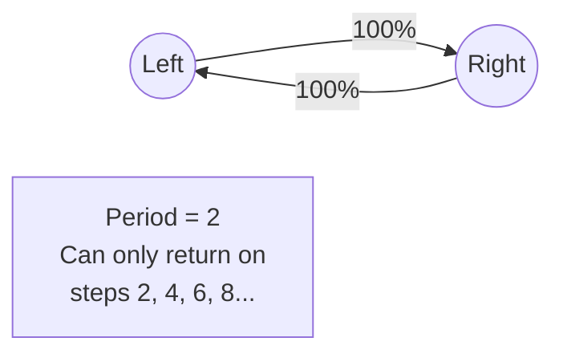

---

## The Aperiodic State

**The broken rhythm (Period = 1).** Add a third room so you can travel in a triangle.

- Loop back via back-and-forth: **2 steps**
- Loop around the whole triangle: **3 steps**

Possible return times: $\{2, 3, 4, 5, 6, \ldots\}$

$$\gcd\{2, 3, 4, 5, 6, \ldots\} = 1$$

**Period = 1.** The rigid rhythm is broken. You can return on any step — the timing is completely fluid.

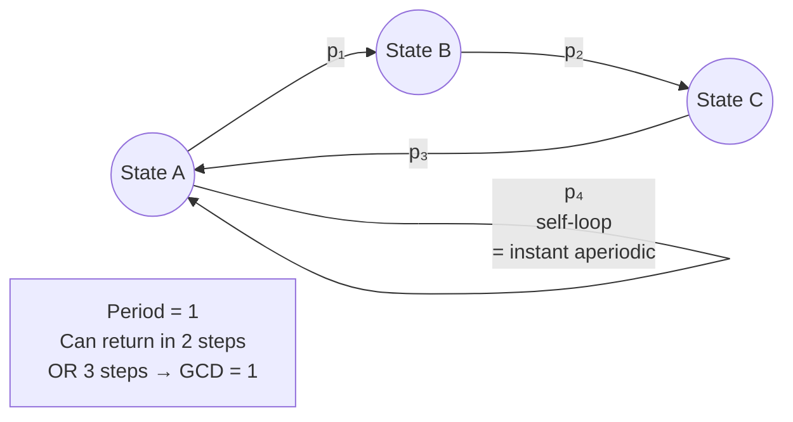

> **Cheat Code:** If a state has a **self-loop** ($P(i \to i) > 0$), it is **automatically aperiodic** (Period 1). Because you can "return" in exactly 1 step, and $\gcd$ of any list containing 1 is always 1.

---

## Why the GCD is the Right Tool

The GCD detects the **underlying grid size** of the environment by understanding how loops combine.

**Scenario A — Trapped Grid (GCD > 1):**

Loops of 4 and 6 steps. Possible return times: $\{4, 6, 8, 10, 12, \ldots\}$

$\gcd(4, 6) = 2$ — every combination is a multiple of 2. You can **never** combine a 4-loop and a 6-loop to get an odd number. Permanently trapped on a grid size of 2.

**Scenario B — Broken Rhythm (GCD = 1):**

Loops of 5 and 7 steps. $\gcd(5, 7) = 1$.

Combinations: $\{5, 7, 10, 12, 14, 15, 17, \ldots\}$. After a while, every integer appears — the gaps fill completely. You can return on any step.

> **Why GCD and not average or minimum?** Because **loops stack** — you run them back-to-back. If the GCD of your loops is $d$, their combinations forever live on multiples of $d$. If GCD is 1, combinations eventually fill every integer (this is the Frobenius Coin theorem in number theory).

---

## Plain Definition of Period

> **The period of a state is the largest number $d$ that divides evenly into every possible number of steps it takes to return to that state.**

- **Period = $d$:** The door only materializes on multiples of $d$ (steps $d, 2d, 3d, \ldots$). Mathematically barred from returning on any "off-beat."
- **Period = 1 (Aperiodic):** The metronome is broken. You can return on any step.

---

# Stationary Distribution

When a Markov chain runs **forever**, all initial transient chaos washes away. The system reaches **mathematical equilibrium** — a state where the distribution stops changing with time.

This steady-state is the **stationary distribution** $\pi$ — a row vector giving the long-term fraction of time the agent spends in each state.

The equilibrium satisfies:

$$\pi P = \pi$$

**Read in English:** "Multiplying the steady-state distribution by the transition matrix returns the exact same steady-state distribution." Taking one more step in time changes **nothing**.

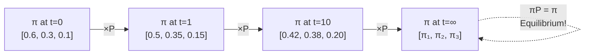

**Why this matters:** Instead of infinitely multiplying $P \times P \times P \ldots$ to find behavior at step 10,000, you use **eigenvector decomposition** on $\pi P = \pi$ to instantly calculate the infinite-time equilibrium of any stochastic system.

---

# Applications

## The Gambler's Ruin

A casino betting game is **NOT irreducible** — it is **reducible**.

**State space:** $\{0, 1, 2, \ldots, N\}$ where $N$ is the target (or the casino's infinite bankroll).

- **State 0 (Bankruptcy):** $P(0 \to 0) = 1.0$ — you cannot bet with no money. This is an **Absorbing Recurrent State**.
- **States 1 through N-1:** Because Bankruptcy is an inescapable black hole, every state where you have money has a path leading to State 0. This makes them all **Transient States**.

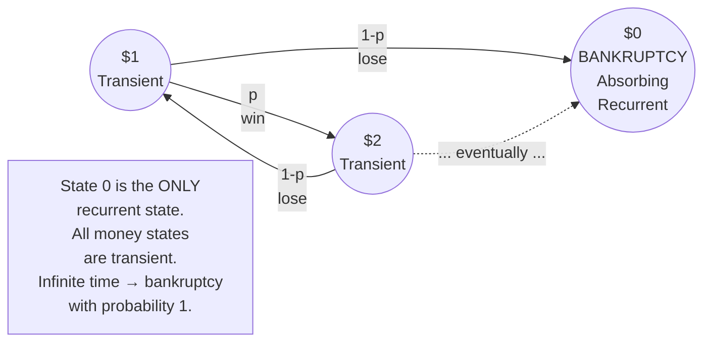

**The mathematical proof of why the house always wins:**

Because all money states are transient, the relentless grinding of infinite time guarantees the agent must eventually fall into the **only recurrent trapdoor** — State 0 (Bankruptcy). If you play an infinite game against an opponent with an infinite bankroll, the probability of reaching State 0 is **exactly 1.0**.

> The map is **reducible** because once you reach State 0, you cannot travel back to any other state — the full-connectivity condition is permanently broken.

---

## The Coupon Collector as a Markov Chain

**Setup:** A fast-food restaurant releases $C = 10$ different toys. Every meal gives 1 random toy (equal probability, with replacement). Track your progress as a Markov Chain.

**State Space:** $X_n$ = number of **distinct** toy types after $n$ attempts. State space: $\{0, 1, \ldots, C\}$.

**Why it's a Markov Chain (The Amnesia Test):**

If you are in State 4 (you own 4 unique toys), your odds of getting a new toy are $\frac{6}{10}$. It does not matter whether you bought 4 meals to get those 4 toys, or 500 meals with terrible luck. The history is irrelevant — only the current count matters. ✓

**Transition Mechanics:**

$$P(\text{move } k \to k+1) = \frac{C-k}{C} \quad \text{(get a new toy)}$$
$$P(\text{stay at } k) = \frac{k}{C} \quad \text{(get a duplicate)}$$

It gets harder the further you go. At State 9, the chance of completing the set is a brutal $\frac{1}{10}$.

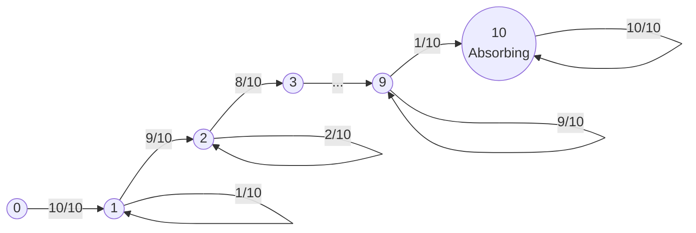

**Topology:**
- **States 0–9:** Transient — there is always a positive probability of gaining a new toy and moving forward forever
- **State 10 ($C$):** Absorbing Recurrent — the game is over; every new meal is a guaranteed duplicate; $P(10 \to 10) = 1.0$

---

## Queueing Theory

Queueing Theory is the most famous real-world application of **Continuous-Time, Discrete-State Markov Chains (CTMC)**.

**Core Variables:**

| Symbol | Name | Example |
|---|---|---|
| $\lambda$ | Arrival Rate | 500 network packets/second entering the system |
| $\mu$ | Service Rate | Your server can process 600 packets/second |
| $\rho = \lambda / \mu$ | Traffic Intensity / Utilization | $500/600 \approx 0.83$ |

**The stability condition:**
- $\rho < 1$: The system is **stable** — the server keeps up
- $\rho \geq 1$: The queue length grows **to infinity** — the system crashes (OOM errors)

**The M/M/1 Queue (Kendall's Notation A/S/c):**

| Letter | Meaning |
|---|---|
| M (Arrivals) | Markovian (Memoryless) — requests arrive as a Poisson process |
| M (Service) | Markovian — service times are exponentially distributed |
| 1 (Servers) | One node processing the queue |

Tracking the state of an M/M/1 queue (number of items in the buffer) is **literally computing the transition probabilities of a CTMC** jumping between states $0, 1, 2, 3, \ldots$

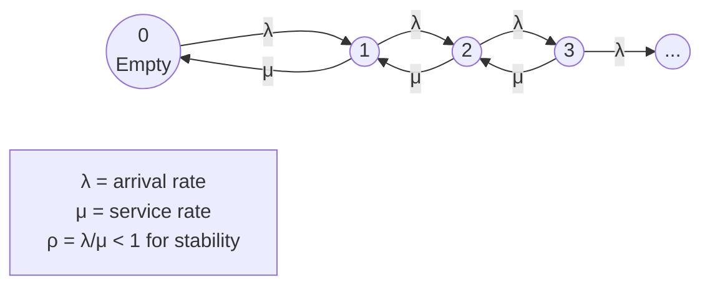

**Little's Law — The Crown Jewel:**

$$L = \lambda W$$

| Symbol | Meaning |
|---|---|
| $L$ | Average number of items **in the system** |
| $\lambda$ | Average **arrival rate** |
| $W$ | Average **time** an item spends in the system |

Little's Law holds for **any** queueing system, regardless of arrival distribution, service discipline (FIFO, LIFO), or network architecture. If you know $\lambda$ and $W$, you instantly know how much buffer memory $L$ you need to prevent packet drops.

---

## Connection to Reinforcement Learning

Every concept in this chapter maps directly to the RL architecture.

**The Markov Chain → MDP Bridge:**

| Markov Chain | MDP Addition | Result |
|---|---|---|
| States $S$ | + Actions $A$ | Agent can **choose** which transition matrix to apply |
| Transition Matrix $Q$ | + Rewards $R$ | Agent has incentives to prefer certain states |
| Marginal Distribution $tQ^n$ | + Policy $\pi$ | Agent learns which actions maximize expected return |

**The Policy Gradient Objective:**

Your intuition — "take the probability of starting in that state, then multiply by the summation of rewards we will get in the episode" — is exactly the RL objective function $J(\theta)$:

$$J(\theta) = \sum_{s_0} p(s_0) \cdot V^{\pi_\theta}(s_0)$$

| Symbol | Meaning | Markov Chain Equivalent |
|---|---|---|
| $p(s_0)$ | Spawn probability | $t_i = P(X_0 = i)$ |
| $V^{\pi_\theta}(s_0)$ | Value Function — sum of future rewards from $s_0$ | $\sum_j q_{ij}^{(n)}$ weighted by rewards |
| $\sum_{s_0}$ | Sum over all starting states | $\sum_{i=1}^{M}$ |

**The connection to Q^n:**

The Chapman-Kolmogorov summation (summing over all parallel paths) is the exact mathematical engine running under the hood of:
- **Q-Learning:** Sweeping through state transitions, weighting by likelihood
- **Monte Carlo Methods:** Averaging over entire episode trajectories
- **The Bellman Equation:** Recursively computing value functions by conditioning on the current state

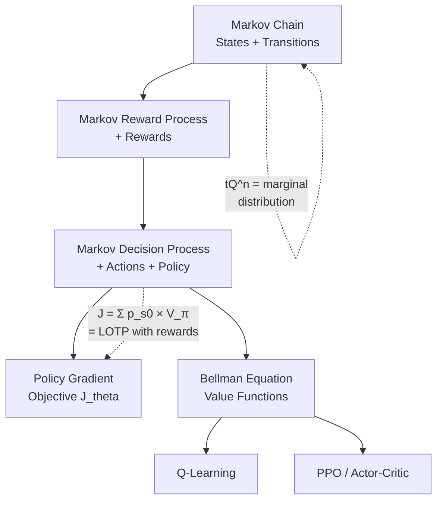

**The stationary distribution and convergence:**

Understanding that transient states are eventually escaped and recurrent states are visited infinitely is the theoretical guarantee that **RL algorithms converge**. As long as the agent operates in a fully communicating recurrent environment, infinite time guarantees it will explore every state and update every value function
> **The relentless grinding of infinite time** — the same principle that guarantees a transient state is eventually escaped forever — is the exact reason why Q-Learning and Monte Carlo methods eventually converge to optimal policie

# Chapter 11 — Markov Chains: Stationary Distribution
> *Introduction to Probability* — Blitzstein & Hwang | Section 11.3

---


# The Bridge — From Topology to Long-Run Behavior

The textbook says:

> *"At first, the chain may spend time in transient states. Eventually though, the chain will spend all its time in recurrent states. But what fraction of the time will it spend in each of the recurrent states? This question is answered by the stationary distribution."*

This paragraph divides the life of a Markov chain into two phases.

---

## Phase 1 — The Burn-Off Period

*"At first, the chain may spend time in transient states."*

When a simulation first starts, there is chaos. The chain spawns in transient states and bounces around. But as we proved with the Geometric distribution, transient states have a ticking clock. Eventually the chain falls through the final trapdoor into a recurrent class.

**The mathematical law:** In the true stationary distribution $s$, every single transient state has a value of **exactly 0**. The math deletes them from existence — across infinite time, the fraction of time spent there rounds down to zero.

---

## Phase 2 — The Infinite Rhythm

*"What fraction of the time will it spend in each of the recurrent states?"*

Now the chain is trapped in recurrent rooms. It bounces between them forever. But it will not visit them all equally — some rooms have many doors leading in but few leading out. The chain gets "stuck" there more often.

The stationary distribution vector $s$ is a list of percentages answering exactly this:

$$s = [0.70, 0.20, 0.10]$$

means the chain spends 70% of eternity in State 1, 20% in State 2, and 10% in State 3.

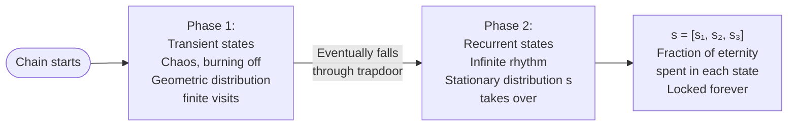

---

# 11.3.1 Definition of Stationary Distribution

**Definition:** A row vector $s = (s_1, \ldots, s_M)$ such that $s_i \geq 0$ and $\sum_i s_i = 1$ is a **stationary distribution** for a Markov chain with transition matrix $Q$ if:

$$\sum_i s_i q_{ij} = s_j \quad \text{for all } j$$

This system of linear equations can be written as one matrix equation:

$$sQ = s$$

---

## The Two Reality Checks

*"$s_i \geq 0$ and $\sum_i s_i = 1$"*

These are just the math police making sure your vector represents physical reality:

- **$s_i \geq 0$:** You cannot have a negative percentage of people in a room
- **$\sum_i s_i = 1$:** All fractions across every state must add to exactly 1.0 (100% of the crowd)

---

## The Magic Equation — Plain English

$$\sum_i s_i q_{ij} = s_j$$

Breaking this down piece by piece using a museum crowd:

| Symbol | Plain meaning |
|---|---|
| $s_i$ | The number of people currently in Room $i$ |
| $q_{ij}$ | The fraction of people in Room $i$ who walk to Room $j$ |
| $s_i \times q_{ij}$ | The actual number of people walking from Room $i$ into Room $j$ right now |
| $\sum_i s_i q_{ij}$ | Add up everyone walking into Room $j$ from every room in the museum |
| $= s_j$ | That total equals exactly the crowd that was already in Room $j$ |

**What this physically means:**

Flow In = Flow Out. If Room 2 holds 30% of the crowd ($s_2 = 0.30$), then after all the chaotic shuffling through doors, exactly 30% of the crowd is still in Room 2. The room is in perfect, permanent balance.

Because this is true for "all $j$" — every single room — the entire map has stopped fluctuating. The system is completely frozen in equilibrium, even though individuals inside it are still moving.

---

## What sQ = s Actually Says in One Sentence

> **For any single room: add up all the people who just walked into it from everywhere else — that incoming group perfectly replaces the group that just walked out. The room's crowd size never changes.**

The amount of people walking in exactly matches the amount of people walking out. The total in the room never changes. The room is in permanent balance.

---

## Reading the Equation Out Loud

$\sum_i s_i q_{ij} = s_j$

**Read as:** "The sum over all $i$ of $s$ sub $i$ times $q$ sub $i$-$j$ equals $s$ sub $j$."

**Translation:** "Take the fraction of the crowd in each room $i$, multiply by the probability they walk to room $j$, add all those flows together — and that total equals the original fraction of the crowd that was already in room $j$."

As one matrix equation, $sQ = s$ reads: "The vector $s$ times the transition matrix $Q$ equals $s$ again." — Pressing "Play" on time returns the exact same distribution you started with.

---

# Ground Zero — What "Stationary" Actually Means

## Stationary Does NOT Mean Frozen

The biggest trap in probability is confusing "stationary" with "stopped."

**A parked car is frozen.** Nothing moves. That is not what a Markov Chain is.

**A water fountain is stationary.** Water is constantly shooting up, constantly falling down, individual molecules are moving at high speed — BUT the water level in each pool never goes up or down. Because water leaving a pool is instantly replaced by water entering, the overall shape of the fountain never changes.

This is **Dynamic Equilibrium** — the micro-level is chaotic, the macro-level is stationary.

---

## The Water Fountain Analogy

Imagine a fountain with two pools:

- **Pool 1** holds 60 gallons
- **Pool 2** holds 40 gallons
- Water constantly flows between them according to fixed pipe sizes

Every second: some water drains from Pool 1 into Pool 2, and some water drains from Pool 2 into Pool 1.

If the pipe sizes are tuned so that the exact amount draining out of Pool 1 is replenished by what flows in from Pool 2 — and vice versa — then the water levels **never change**. The motion is constant, but the levels are permanently frozen.

That frozen state is the stationary distribution.

---

## The Three Variables Defined

| Variable | Name | What it is |
|---|---|---|
| $Q$ | The Pipes | The transition matrix. The physical plumbing of the fountain. Tells you what percentage of water flows from each pool to each other pool every second. **$Q$ never changes.** |
| $s$ | The Water Levels | The row vector. A list of the exact amount of water sitting in each pool right now. |
| $s \times Q$ | The Play Button | Take the water currently in the pools ($s$) and push it through the pipes ($Q$) for exactly one second. |

---

## Why We Multiply by Q Even Though s Is Stationary

You asked a perfect question: *"If $s$ is not changing, why are we multiplying it by transition probabilities?"*

**Multiplying by $Q$ is the mathematical equivalent of pressing the "Play" button on time.** We have to press Play to *prove* that the system is immune to it.

Watch what happens:

- **Random water levels** $[90, 10]$: Press Play → result is $[85, 15]$. The levels changed. **Not stationary.**
- **The magic levels** $[60, 40]$: Press Play → result is $[60, 40]$. The levels did not change. **This is $s$.**

There is only one specific combination of water levels where the plumbing perfectly replaces what it drains. When you find that combination, you have found the stationary distribution.

$sQ = s$ is the mathematical way of saying: "When this specific distribution survives being pushed through the transition rules unchanged, we have reached equilibrium."

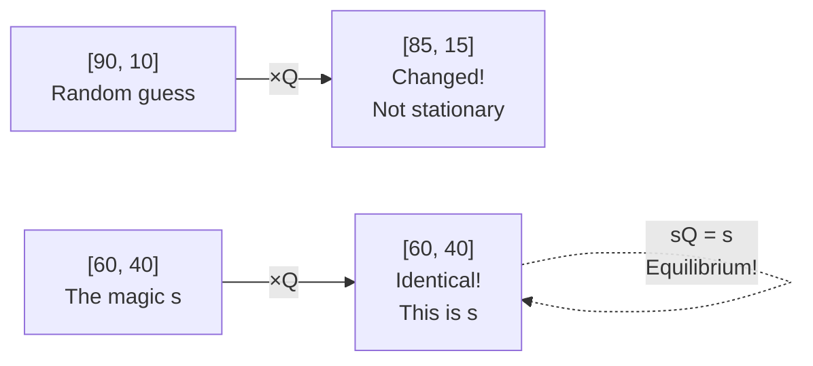

---

# The City Apartment Analogy

Imagine a city with 10,000 apartments. Every apartment is either **Occupied (State 1)** or **Vacant (State 2)**.

## What s Represents

$s$ is the **City Vacancy Report** on the Mayor's desk — the steady fraction of apartments in each state:

$$s = [0.95, \; 0.05]$$

- $s_1 = 0.95$: 95% of the city's apartments are Occupied
- $s_2 = 0.05$: 5% of the city's apartments are Vacant

---

## What Q Represents

$Q$ is the **Leasing and Eviction Rates** — the actual moving trucks. The rules of motion:

| From \ To | Occupied | Vacant |
|---|---|---|
| **Occupied** | $q_{11} = 0.99$ (tenant renews) | $q_{12} = 0.01$ (tenant moves out) |
| **Vacant** | $q_{21} = 0.19$ (new tenant signs) | $q_{22} = 0.81$ (sits empty) |

---

## The Equation in Action

To check that $s = [0.95, 0.05]$ is the stationary distribution, verify that flow in = flow out for each state:

**Flow into Occupied (State 1):**

$$s_1 \times q_{11} + s_2 \times q_{21} = 0.95 \times 0.99 + 0.05 \times 0.19 = 0.9405 + 0.0095 = 0.95 = s_1 \checkmark$$

**Flow into Vacant (State 2):**

$$s_1 \times q_{12} + s_2 \times q_{22} = 0.95 \times 0.01 + 0.05 \times 0.81 = 0.0095 + 0.0405 = 0.05 = s_2 \checkmark$$

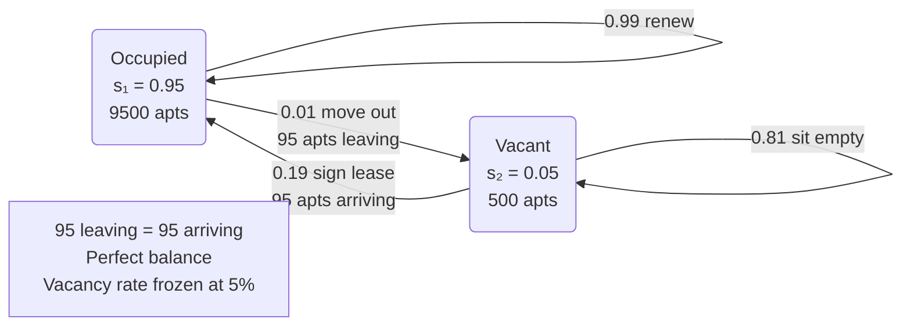

---

## The Key Insight — Q Does Not Change, Its Transitions Cancel Out

*"Q doesn't change"* — The leasing rate stays at 19%, the eviction rate stays at 1%. These are the fixed rules of the system.

*"The transitions in Q happen"* — Moving trucks are physically driving around. Thousands of families are packing boxes every single month.

*"And cancel each other out"* — Because the city is sitting at the perfect $s$ ratio (95% Occupied, 5% Vacant), the number of people triggered by the 1% move-out rule exactly matches the number triggered by the 19% move-in rule.

> The micro-level is total chaos (motion), but the macro-level net change is exactly zero. **There is motion, but the observed phenomenon is not changing.**

---

# What Each Dimension of s Means

If your stationary distribution is:

$$s = [s_1, s_2, s_3, \ldots, s_M]$$

Then each $s_j$ tells you **two physically identical things**:

**1 — The Time Average (The Journey):**
Over an infinite lifetime, $s_j$ is the exact percentage of total time the chain spends in state $j$.

**2 — The Snapshot Probability (The Freeze Frame):**
If you walk away, let the simulation run for a billion steps, then randomly pause it — $s_j$ is the exact probability that the chain is standing in state $j$ when you pause.

**Concrete example:** $s = [0.20, 0.50, 0.30]$

| State | $s_j$ | Journey meaning | Snapshot meaning |
|---|---|---|---|
| State A | 0.20 | 200,000 out of 1,000,000 steps spent here | 20% chance I am here if you pause randomly |
| State B | 0.50 | 500,000 steps spent here | 50% chance |
| State C | 0.30 | 300,000 steps spent here | 30% chance |

> **The Ergodic Theorem** (the math term) is just saying these two meanings are identical. Textbooks give it a scary name but it is just this observation.

---

# The Relationship Between s and Q^n

## The n-Step Distribution vs The Stationary Distribution

You asked: *"Is the row vector $s$ the distribution after $n$ steps?"*

**No — $s$ is the distribution after INFINITE steps.**

| Concept | Formula | What it gives you |
|---|---|---|
| $n$-step distribution | $tQ^n$ | Given your starting vector $t$, the exact probability distribution of where you are at step $n$. Changes with $n$. |
| Stationary distribution $s$ | $sQ = s$ | The final, locked-in row that the $n$-step distribution converges to as $n \to \infty$. Never changes once reached. |

**The journey:** If you compute $tQ^n$ for $n = 1, 2, 3, 10, 100, 1000$ — the resulting row vector keeps changing. The probabilities swing around as the system finds its balance.

**The destination:** As $n \to \infty$, the swinging completely stops. The row vector locks into $s$.

---

## s Is a Row of Q Raised to a Very Large n

**You nailed this.** $s$ is exactly a row of $Q$ raised to a very large $n$ ($Q^\infty$). When you fast-forward time by raising $Q$ to a massive power, every single row in that matrix turns into $s$:

$$Q^\infty = \begin{pmatrix} s_1 & s_2 & s_3 \\ s_1 & s_2 & s_3 \\ s_1 & s_2 & s_3 \end{pmatrix}$$

The matrix collapses into a giant copy-paste machine. Every row is identical.

---

## Why Every Row of Q^∞ Becomes the Same s

You asked: *"Why doesn't each starting state get its own $s$?"*

**In the short term** ($Q^2$ or $Q^{10}$), rows are different — your starting point matters.

**At infinity**, the system develops **total mathematical amnesia**. The chain has been shuffling around for so long that the starting point is completely erased.

Doesn't matter if you started in State 1, 2, or 3. The infinite-future probabilities are identical for everyone.

> **Why this matters:** If every starting state had its own different stationary distribution, the macro-level statistics would still depend on where the first agent started. The magic of $s$ is that it is a **universal gravitational pull** — no matter which row you start in, $Q^\infty$ drags every single one to the exact same destination.

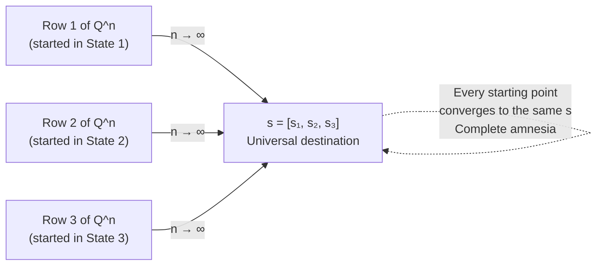

---

## Why Rows Cannot All Be Same If Chain Is Reducible

You deduced this perfectly: *"If there was no path I can't simply put a 3 in that slot."*

If State 3 is an isolated island with no connection to States 1 and 2:

- Row 1 (started in State 1): $[\ldots, \ldots, 0.00]$ — the 3rd entry is permanently 0, no path to State 3
- Row 3 (started on Island): $[0.00, 0.00, 1.00]$ — permanently stuck on island

These rows are **physically incapable of being identical**. Those zeros are permanently locked in by the lack of highways. You cannot put any probability in a slot if there is no path to carry it there.

Because the rows do not converge to the same $s$, there is **no single universal stationary distribution**. The final statistics depend on whether you were born on the mainland or the island.

> When a textbook demands **Irreducibility** before finding the stationary distribution, it is just saying: *"Check the map first — make sure every pool is physically connected to the same plumbing system."*

---

## The Two Ways to Reach s

You asked: *"Do we evolve the row vector step by step, or evolve Q first?"*

**Both give the same result — here's why:**

**Option 1 — Evolve the row (real-time):**

$$t \times Q = \text{Day 1 row}$$
$$\text{Day 1 row} \times Q = \text{Day 2 row}$$
$$\text{Day 2 row} \times Q = \text{Day 3 row}$$
$$\vdots$$
$$\text{Eventually} \to s$$

You keep updating the row vector every step. Eventually it hits $s$ and stops changing.

**Option 2 — Evolve the matrix (fast-forward):**

$$Q^n \quad \text{for very large } n$$

Leave your starting row completely alone. Fast-forward $Q$ to $Q^\infty$. Because $Q^\infty$ is a stack of identical $s$ rows, any starting vector multiplied by it just returns $s$.

**Why they are identical:** Matrix multiplication is **associative**. $(t \times Q) \times Q = t \times (Q \times Q)$. The parentheses can move anywhere. Option 1 is $((tQ)Q)Q\ldots$ and Option 2 is $t(QQ\ldots Q)$. Same computation, different order of operations.

> You can either walk the path one day at a time, or build a time machine ($Q^n$) and teleport to the end. Same destination.

---

# 11.3.2 — Stationary Is Marginal, Not Conditional

The textbook says:

> *"When a Markov chain is at the stationary distribution, the unconditional PMF of $X_n$ equals $s$ for all $n$, but the conditional PMF of $X_n$ given $X_{n-1} = i$ is still encoded by the $i$-th row of the transition matrix $Q$."*

---

## Unconditional PMF = s (Zoomed Out)

**"Unconditional"** means you have zero information about the past.

**City Apartment analogy:** A tourist walks in blindfolded and points at a random apartment. What are the odds someone lives there? With zero conditions, they rely on the macro-level statistic: $s_1 = 0.95$. The answer is 95% — because that is the long-run fraction of occupied apartments.

**Weather analogy:** You look at a 100-year climate report. You see that 30% of days are rainy. That 30% is your unconditional, marginal probability. You are not conditioning on what yesterday's weather was.

---

## Conditional PMF = Q (Zoomed In)

**"Conditional"** means you have one specific piece of inside information: exactly what happened one step ago.

**City Apartment analogy:** The landlord tells you "this specific apartment was Vacant last month." Suddenly the 95% macro-statistic is useless — you have inside information. Because of the Markov Property, you throw away $s$ and look directly at Row 2 of $Q$: $q_{21} = 0.19$. The odds of this apartment being occupied now are only 19%.

**Weather analogy:** You look out the window and see it is raining today ($X_{n-1} = \text{Rain}$). The long-term average of 30% no longer helps you. You look at Row "Rain" in $Q$ and see there is an 80% chance of rain tomorrow.

---

## The "Since" — Why They Are Different

The textbook says *"since the conditional distribution of $X_n$ given $X_{n-1} = i$ is, in general, different from the marginal distribution of $X_n$."*

This "since" is just pointing out a mathematical inequality: $q_{ij}$ is usually **not equal** to $s_j$.

| | Value | Meaning |
|---|---|---|
| $s_j$ (marginal) | 30% | The city averages 30% rainy days a year |
| $q_{\text{Rain},\text{Rain}}$ (conditional) | 80% | If it rains today, 80% chance it rains tomorrow |

Since $80\% \neq 30\%$, knowing yesterday's state dramatically changes your math. The variables are **not independent** — yesterday's state still matters for tomorrow, even though the long-run average is stable.

---

## Is Marginal Short-Sighted?

You asked: *"Is marginal short-sighted?"*

**Actually the exact opposite:**

| | What it looks at | Scope |
|---|---|---|
| **Conditional ($Q$)** | Exactly what happened one step ago — the immediate next move | Short-sighted, zoomed in |
| **Marginal ($s$)** | The infinite, long-run average of the entire system | Far-sighted, zoomed out |

**Conditional** is looking out your window to predict tomorrow's weather.

**Marginal** is looking at a 100-year climate report.

---

# 11.3.3 — Sympathetic Magic Warning

The textbook says:

> *"If a Markov chain starts at the stationary distribution, then all of the $X_n$ are identically distributed (since they have the same marginal distribution $s$), but they are not necessarily independent, since the conditional distribution of $X_n$ given $X_{n-1} = i$ is, in general, different from the marginal distribution of $X_n$. Confusing the random variables $X_n$ with their distributions is an example of sympathetic magic."*

**"Identically distributed" (The Blueprint):**

The statistical forecast for Day 1, Day 50, and Day 1,000 is identically frozen at 30% Rain, 70% Sun. The marginal probability is the same every day.

**"Not independent" (The Actual Building):**

$X_n$ is the **physical weather that actually happens** on a specific day. Day 1 might be Rain, Day 2 might be Sun. The specific realizations are constantly changing and depend on each other through $Q$.

**"Sympathetic magic":**

"Sympathetic magic" is an anthropology term — like believing a voodoo doll shares the physical reality of the person it represents. The textbook is warning: do not confuse the statistical probability (the distribution $s$) with the actual physical event ($X_n$).

Just because the forecast is 30% rain every day does not mean every day must be the same weather. The macro-statistics are frozen, but the micro-reality is still chaotically bouncing around.

> *"The $X_n$ themselves are not all equal"* — the values the random variables actually take on different days are different. Only their probability distributions are identical.

Also: you observed that the unconditional distribution only looks stationary from the outside because the $X_{n-1} \to X_n$ transitions have been incorporated into $s$ and are no longer visibly impacting $Q$. The micro-conditions are still happening every second — they have just reached a point where they perfectly cancel each other out at the macro scale.

---

# Example 11.3.4 — Solving for s by Hand

$$Q = \begin{pmatrix} 1/3 & 2/3 \\ 1/2 & 1/2 \end{pmatrix}$$

---

## Setup and the Blank Placeholder

The textbook is showing the **algebra cheat code** — deliberately avoiding computing $Q^\infty$ entirely.

Instead, treat $s$ as an unknown row: since there are only two states and probabilities sum to 1, if the probability of State 1 is $s$, then State 2 must be $1 - s$:

$$s = (s, \; 1-s) \quad \text{(our blank unknown)}$$

This blank row represents $X_n$ right now — the distribution at whatever step we are currently on. Because the system is stationary, the distribution for $X_n$ must be identical to $X_{n+1}$. So we force the equation:

$$\text{(row for } X_n\text{)} \times Q = \text{(row for } X_{n+1}\text{)} = \text{same row}$$

$$\begin{pmatrix} s & 1-s \end{pmatrix} \begin{pmatrix} 1/3 & 2/3 \\ 1/2 & 1/2 \end{pmatrix} = \begin{pmatrix} s & 1-s \end{pmatrix}$$

---

## The Algebra — Step by Step

**Multiplying out the left side for State 1 (first column):**

$$s \cdot \frac{1}{3} + (1-s) \cdot \frac{1}{2} = s$$

$$\frac{s}{3} + \frac{1-s}{2} = s$$

Multiply everything by 6:

$$2s + 3(1-s) = 6s$$

$$2s + 3 - 3s = 6s$$

$$3 = 7s$$

$$s = \frac{3}{7}$$

Therefore $1 - s = \frac{4}{7}$.

**The unique stationary distribution:**

$$\boxed{s = \left(\frac{3}{7}, \; \frac{4}{7}\right)}$$

---

## The Universal 2-State Formula

More generally, suppose $q_{12} = a$ and $q_{21} = b$ where $0 < a < 1$ and $0 < b < 1$:

$$Q = \begin{pmatrix} 1-a & a \\ b & 1-b \end{pmatrix}$$

The transition matrix for any 2-state system always has this shape — the diagonal entries are "stay" probabilities ($1-a$ and $1-b$), and the off-diagonal entries are "leave" probabilities ($a$ and $b$).

---

## Why as₁ = bs₂ Is the Only Equation You Need

When you multiply out $sQ = s$ for this general 2-state system, **both** equations simplify to the same single rule:

$$as_1 = bs_2$$

**How this arrives — full algebra:**

For State 1 (first column): $s_1(1-a) + s_2 b = s_1$

Expand: $s_1 - as_1 + bs_2 = s_1$

Cancel $s_1$ from both sides: $-as_1 + bs_2 = 0$

Rearrange: $\boxed{as_1 = bs_2}$

For State 2 (second column): $s_1 a + s_2(1-b) = s_2$

Expand: $as_1 + s_2 - bs_2 = s_2$

Cancel $s_2$: $as_1 - bs_2 = 0$

Rearrange: $\boxed{as_1 = bs_2}$ ← same equation again

**The beautiful physical meaning:**

$a s_1$ = the amount of the crowd flowing **out of State 1** per step

$b s_2$ = the amount of the crowd flowing **out of State 2** per step

$as_1 = bs_2$ simply says: **the flow leaving State 1 perfectly equals the flow leaving State 2**. The pipes are perfectly balanced. This is Dynamic Equilibrium expressed in one equation.

---

## The Proportionality Shortcut

Since $as_1 = bs_2$, the proportions simply flip:

$$s_1 \propto b \quad \text{and} \quad s_2 \propto a$$

**The logic:** If $b$ (the chance of leaving State 2) is large, State 2 empties out quickly — so most of the crowd piles up in State 1. The time you spend in a state is proportional to how hard it is to leave the *other* state.

To convert proportions into actual probabilities summing to 1, divide by the total:

$$\boxed{s = \left(\frac{b}{a+b}, \; \frac{a}{a+b}\right)}$$

**Verification with our specific numbers** ($a = 2/3$, $b = 1/2$):

$s$ should be proportional to $(b, a) = (1/2, 2/3)$. Multiply by 6: proportional to $(3, 4)$.

Our answer was $(3/7, 4/7)$ — which is indeed proportional to $(3, 4)$. ✓

---

## The Left Eigenvector Jargon

The textbook ends by translating everything into linear algebra terminology.

The equation $sQ = s$ can be rewritten as $sQ = 1 \cdot s$. This is the definition of an **eigenvector equation**:

$$\text{Vector} \times \text{Matrix} = \text{Scalar} \times \text{Vector}$$

- Since $s$ is on the **left** side of $Q$ → $s$ is a **left eigenvector**
- Since $s$ comes out multiplied by **1** (unchanged) → the **eigenvalue is 1**

> If you ever talk to a pure math professor, just say: "$s$ is the left eigenvector of $Q$ with eigenvalue 1." That is the formal name for everything we just computed.

The "right eigenvector" version is $Q^T s^T = s^T$ (transpose of everything). Same math, different convention.

---

# What s Tells You Physically

Once you solve for $s$, here is what you can read off directly:

> **$s_j$ = the fraction of eternity the chain spends in state $j$ = the probability of finding the chain in state $j$ if you pause it at a random time after it has run long enough**

These are two descriptions of the same number.

**Why not equal time in all states?**

You observed: *"The amount of time spent in each is expected to be the same."*

Precise correction: The proportion locks in and stops changing — but it is usually **not equal** across all states. States with many doors leading into them but few leading out attract more "crowd." A state that is easy to enter but hard to leave will have a high $s_j$. Equal time across all states would only happen if the transition matrix were perfectly symmetric.

---

# Applications

## The Gambler's Ruin Topology

A casino betting game is **NOT irreducible** — it is **Reducible**.

**State 0 (Bankruptcy):** $P(0 \to 0) = 1.0$ — you cannot bet with no money. Once entered, you can never travel back to State 1. → **Absorbing Recurrent State**. The map is permanently broken.

**States 1 through N-1 (All money states):** Because State 0 is an inescapable black hole, every money state has a pathway leading there. There is a positive probability of leaving forever. → **All Transient States**.

Because all money states are transient, the chain must eventually fall into the only recurrent trap. With no winning goal and an opponent with infinite bankroll: $P(\text{eventual bankruptcy}) = 1.0$.

> **Why is the map reducible?** Once at State 0, you cannot travel back to any money state. The "every state reachable from every other state" condition is permanently broken. → Reducible.

```mermaid
graph LR
    S0(("$0\nBANKRUPTCY\nAbsorbing Recurrent\nP = 1 forever")) 
    S1(("$1\nTransient"))
    S2(("$2\nTransient"))
    SN(("$N\nGoal\nAbsorbing Recurrent"))
    S1 -- "p win" --> S2
    S2 -- "1-p lose" --> S1
    S1 -- "1-p lose" --> S0
    S0 -- "1.0" --> S0
    SN -- "1.0" --> SN
    Note["All money states = Transient\nMust eventually fall into\nthe only recurrent trap: $0"]
```

---

## The Coupon Collector

$C = 10$ different toys. State $X_n$ = number of distinct toys after $n$ meals. State space $\{0, 1, \ldots, C\}$.

**Markov property check:** In State 4 (own 4 toys), odds of getting a new toy = $6/10$. Doesn't matter if you bought 4 meals or 500 meals to get here. History deleted. ✓

**Transition probabilities:**

$$P(\text{stay at } k) = \frac{k}{C} \quad \text{(duplicate)}$$
$$P(k \to k+1) = \frac{C-k}{C} \quad \text{(new toy)}$$

```mermaid
graph LR
    S0((0)) -- "10/10" --> S1((1))
    S1 -- "9/10" --> S2((2))
    S2 -- "8/10" --> S3((3))
    S3 -. "..." .-> S9((9))
    S9 -- "1/10" --> S10(("10\nAbsorbing"))
    S1 -- "1/10" --> S1
    S2 -- "2/10" --> S2
    S9 -- "9/10" --> S9
    S10 -- "1.0" --> S10
```

**Topology:**
- **States 0–9:** Transient — always a positive probability of moving forward
- **State 10:** Absorbing Recurrent — $P(10 \to 10) = 1.0$

---

## Connection to Reinforcement Learning

The stationary distribution maps directly to the RL objective function.

**Your insight:** *"In RL if you look at the Policy Gradient we always start with the probability of starting in that state then multiply by the summation of rewards we will get in the episode."*

This is exactly the RL objective $J(\theta)$:

$$J(\theta) = \sum_{s_0} p(s_0) \cdot V^{\pi_\theta}(s_0)$$

| RL symbol | Plain meaning | Markov chain equivalent |
|---|---|---|
| $p(s_0)$ | Probability the episode starts in state $s_0$ | $t_i = P(X_0 = i)$ — the spawn vector |
| $V^{\pi_\theta}(s_0)$ | Expected total reward from $s_0$ under policy $\pi$ | The "summation of rewards we will get" |
| $\sum_{s_0}$ | Sum over all possible starting states | $\sum_{i=1}^{M}$ in LOTP |

The multiplication (spawn probability × value) is the same AND rule from Chapman-Kolmogorov. The summation is the same OR rule. The formula is structurally identical to $tQ^n$.

**The stationary distribution under a policy** is the distribution of states the agent visits when following that policy forever. It is the $s$ vector for the MDP transition matrix induced by the policy.

**Why RL algorithms converge:** The Geometric distribution proof guarantees transient states are eventually escaped. Proposition 11.2.4 guarantees all states in an irreducible chain are visited infinitely often. Given sufficient exploration (every state-action pair visited infinitely), Q-values converge to optimal. The theoretical guarantee is the same relentless grinding of infinite time.

```mermaid
graph TD
    MC["Markov Chain\ntQ^n = marginal distribution\nsQ = s stationary distribution"] --> MDP["MDP\n+ Actions + Rewards\n+ Policy π"]
    MDP --> J["J(θ) = Σ p(s₀) × V^π(s₀)\n= LOTP with rewards attached\nSame structure as tQ^n"]
    MDP --> BE["Bellman Equation\nV(s) = E[r + γV(s')]\nRecursive Chapman-Kolmogorov"]
    J --> PG["Policy Gradient ∇J(θ)\nloss.backward() in PyTorch\nAdjust transition probs\nto maximize J"]
    BE --> QL["Q-Learning\nConverges by recurrence guarantee\n+ infinite exploration"]
```
