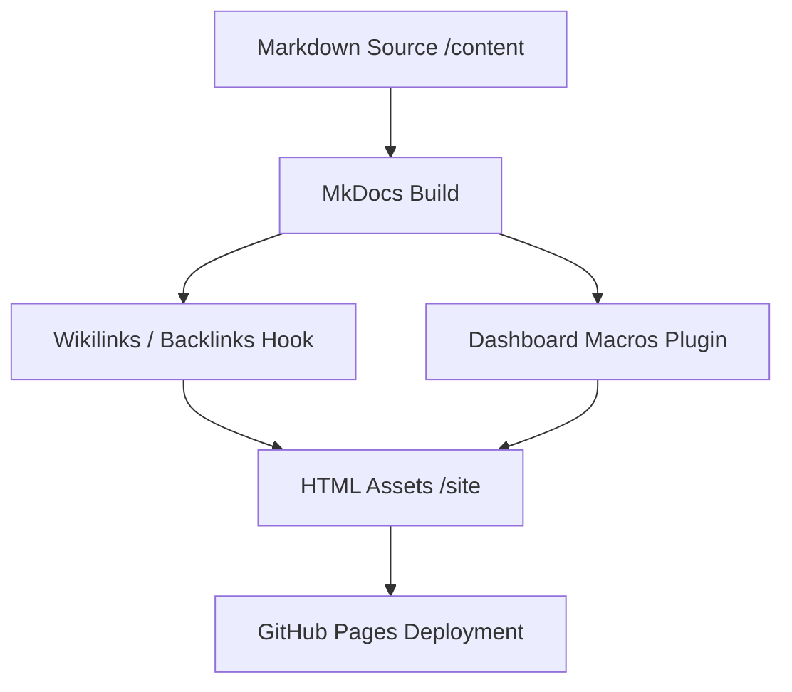

# Architecture & Design Philosophy

This document outlines the design philosophy and technical architecture of the Knowledge Base.

## Design Philosophy

The knowledge base is built on three core pillars:
1. **Single-Source Publishing:** The only source of truth is the raw markdown content under `content/`. All configurations and outputs are derivative.
2. **Dense Cross-Linking:** Concepts are heavily linked via `[[wikilink]]` syntax to create a semantic web of knowledge rather than isolated notes.
3. **Low-Maintenance Automation:** Custom features like link resolution, backlinks rendering, and dashboard stats are built statically at compile-time. There is zero client-side processing required for links or search.

## Repository Structure

```
knowledge/
├── content/                  # Source of truth for learning material
│   ├── index.md              # Dashboard homepage (dynamically populated)
│   ├── [domain]/             # Domain top-level folders
│   │   ├── README.md         # Domain landing page
│   │   ├── _domain.yml       # Domain metadata
│   │   └── [subject]/        # Subject-specific folders
│   │       ├── README.md     # Subject landing page
│   │       ├── _subject.yml  # Subject metadata
│   │       └── [chapter]/    # Ordered chapters
│   │           ├── README.md # Chapter landing page
│   │           └── note.md   # Concept note
│   └── _concepts/            # Cross-domain concepts
├── project/                  # Repository meta-documentation
│   ├── ARCHITECTURE.md       # This file
│   ├── CONTRIBUTING.md       # Content style guide
│   └── GOVERNANCE.md         # Operational rules
├── overrides/                # Theme HTML template overrides (Jinja templates)
│   └── main.html             # Layout customization for badges/backlinks
├── stylesheets/              # Design customization (CSS)
│   └── extra.css             # Theme stylesheet
├── javascripts/              # Client-side JS config
│   └── mathjax.js            # LaTeX Math rendering configurations
├── tools/                    # Core publishing scripts & plugins
│   ├── mkdocs_hooks/
│   │   └── wikilinks_backlinks.py  # Link indexing & backlinks injection
│   └── macros/
│       └── main.py           # Dashboard stats & query macros
└── mkdocs.yml                # Main configuration file
```

## Core Pipeline



1. **Indexing & Resolution Hook:** `tools/mkdocs_hooks/wikilinks_backlinks.py` indexes all markdown files on build start. It translates `[[concept-slug]]` links into clean relative links and collects incoming links (backlinks) to inject into the rendering context of each page.
2. **Jinja Dashboard Macros:** `tools/macros/main.py` provides macros like `total_stats()` and `domain_summary()` that evaluate at build time to construct a dynamic, high-performance portal landing page.
3. **CI/CD Pipeline:** A GitHub Actions workflow automatically builds and pushes the static assets to the `gh-pages` branch on every commit to `main`.
